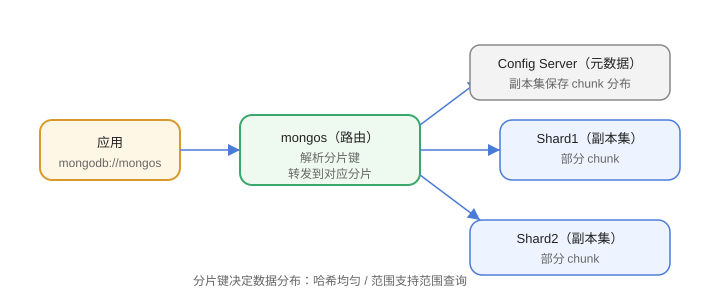

# 分片集群

当单机数据量与写入超过能力时，MongoDB 通过**分片（Sharding）**把数据按分片键分布到多个分片节点，实现水平扩展。



## 分片组件

| 组件 | 作用 |
| --- | --- |
| mongos | 路由：客户端入口，转发请求 |
| Config Server | 保存集群元数据（也是副本集） |
| Shard | 存储数据的分片（每个也是副本集） |

## 启用分片流程

### 1. 启动组件

依次启动 Config Server 副本集、各 Shard 副本集、mongos 路由。

### 2. 添加分片

```javascript [mongosh(mongos)]
sh.addShard("shard1/mongo-shard1-a:27017,mongo-shard1-b:27017")
sh.addShard("shard2/mongo-shard2-a:27017,mongo-shard2-b:27017")
```

### 3. 启用数据库与集合分片

```javascript [mongosh(mongos)]
sh.enableSharding("mydb")

sh.shardCollection("mydb.users", { userId: "hashed" })
```

## 分片键选择

| 方案 | 说明 |
| --- | --- |
| 哈希分片键（hashed） | 数据分布均匀，适合高写入 |
| 范围分片键（ranged） | 支持范围查询，但可能热点 |

选择原则：

1. **高基数**：取值足够多，避免单点。
2. **读写均匀**：避免所有请求打到一个分片。
3. **业务常用查询字段**：尽量让查询路由到少数分片。

## 数据分布：Chunk

```text
集合按分片键拆成多个 Chunk
  → Chunk 按规则分布到各 Shard
  → 某个 Shard 数据过多时自动迁移/拆分
```

```javascript [mongosh]
sh.status()   // 查看分片与 chunk 分布
```

## 何时需要分片

1. 数据量达到 TB 级。
2. 写入吞吐超过单机能力。
3. 索引/内存无法容纳工作集。

分片带来复杂度，**不要过早分片**：先用索引、副本集、存储与查询优化。

## 易错点

::: danger 常见错误
1. 分片键选错（低基数/写热点）：数据倾斜，性能反而更差。
2. 分片后无法修改分片键：上线前必须设计好。
3. 忘记在 mongos 上执行操作：直连分片会绕过路由。
4. Config Server 不是副本集：元数据单点，故障即集群不可用。
5. 不分片也启用分片集合：小集合分片增加路由开销。
6. 备份方案没有适配分片：分片集群备份要用专用工具/流程。
:::

## 验证方式

1. `sh.status()` 查看分片与 chunk 分布。
2. 批量插入数据后观察各 Shard 数据量是否均匀。
3. 用 `db.users.getShardDistribution()` 查看分布详情。

## 参考资料

- 分片：https://www.mongodb.com/docs/manual/sharding/
- 分片键选择：https://www.mongodb.com/docs/manual/core/sharding-shard-key/
- 分片集群部署：https://www.mongodb.com/docs/manual/tutorial/deploy-shard-cluster/
