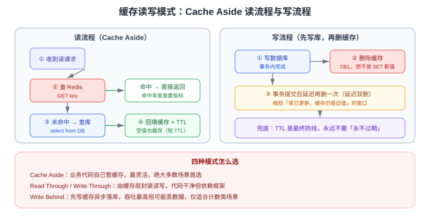

# 缓存设计

缓存设计决定的是「**数据放在哪、什么时候写、什么时候失效**」。表结构错了好改，缓存模型选错往往要推倒重来——所以这一页应该在任何缓存功能开工之前读完。

::: tip 一句话理解
缓存的本质是「用空间换时间 + 接受短暂不一致」。设计时要显式回答三个问题：**读缓存的顺序**、**写操作的顺序**、**失效的时机**。
:::

## 四种缓存读写模式



| 模式 | 读流程 | 写流程 | 一致性 | 复杂度 | 适用 |
| --- | --- | --- | --- | --- | --- |
| **Cache Aside**（旁路缓存） | 先查缓存，未命中查库并回填 | 先写库，再删缓存 | 最终一致，可控 | 低 | **绝大多数业务首选** |
| **Read Through** | 缓存层封装回源逻辑 | — | 同 Cache Aside | 中 | 有统一缓存框架时 |
| **Write Through** | — | 写缓存由缓存层同步写库 | 较强 | 中 | 写少读多、可容忍写延迟 |
| **Write Behind**（写回） | — | 先写缓存，异步批量落库 | 弱，可能丢数据 | 高 | 计数器、日志等可容忍丢失 |

### Cache Aside 标准流程

```java [CacheService.java]
public User getById(long id) {
    String key = "user:" + id;
    String cached = redis.get(key);
    if (cached != null) {
        return JSON.parseObject(cached, User.class);
    }
    User user = userMapper.selectById(id);        // 回源数据库
    if (user == null) {
        redis.setex(key, 60, "");                 // 空值短 TTL，防穿透
        return null;
    }
    redis.setex(key, 3600, JSON.toJSONString(user));
    return user;
}

public void update(User user) {
    userMapper.updateById(user);                  // 1. 先写数据库
    redis.delete("user:" + user.getId());         // 2. 再删缓存
}
```

::: danger 注意
1. **不要「先删缓存再写库」**：删完缓存到写库成功之间，其他请求会把旧值回填，缓存长期脏。
2. **不要「写完库去更新缓存」**：并发写时两次更新可能乱序，缓存留下旧值；删除则天然幂等。
3. **不要给缓存设「永不过期」兜底所有场景**：一旦出现脏数据就永远脏，必须保留 TTL 作为最终防线。
4. **不要在事务未提交时就删缓存**：读请求会在事务提交前回填旧值；应在事务提交后删除（可用 `TransactionSynchronization` 或把删缓存放到事务外）。
:::

## 缓存一致性

缓存与数据库是**两个数据源**，无法用单机事务保证强一致，工程上的目标是「**最终一致 + 不一致窗口尽量短**」。

### 方案对比

| 方案 | 原理 | 不一致窗口 | 复杂度 | 适用 |
| --- | --- | --- | --- | --- |
| 先写库后删缓存 | Cache Aside | 毫秒~秒级 | 低 | 通用方案 |
| 延迟双删 | 删缓存 → 写库 → 延迟几百毫秒再删一次 | 更短 | 低 | 读并发高、脏读敏感的写场景 |
| 删除重试 | 删缓存失败进消息队列重试 | 秒级 | 中 | 缓存删除偶发失败 |
| 订阅 binlog | 用 Canal/CDC 监听数据库变更，异步删缓存 | 秒级 | 高 | 多处写库、统一收口 |
| 分布式锁串行化 | 写时加锁，读时也加锁 | 接近强一致 | 高 | 强一致要求极高的少量数据 |

```java [延迟双删示例]
public void updateWithDoubleDelete(User user) {
    redis.delete("user:" + user.getId());
    userMapper.updateById(user);
    // 事务提交后再删一次，覆盖期间被回填的旧值
    afterCommit(() -> {
        sleepQuietly(500);                        // 具体延迟按主从延迟实测
        redis.delete("user:" + user.getId());
    });
}
```

::: warning
延迟双删的延迟时间无法精确推导（受主从延迟影响），因此它只是**降低概率**而非消除问题。业务上更可靠的做法是：**读路径容忍短暂旧值** + **关键数据不走缓存直读库**。
:::

## 缓存 key 与 value 设计

### key 规范

| 要点 | 建议 | 反例 |
| --- | --- | --- |
| 命名格式 | `业务:对象:标识`，如 `order:detail:1001` | `o1001`、中文 key |
| 长度 | 尽量短（10~40 字符） | 超长 key 浪费内存且影响 `--bigkeys` 判断 |
| 语义 | 带版本号便于整体失效，如 `user:v2:1001` | 直接复用旧 key 造成脏读 |
| 禁止 | `KEYS` 模糊匹配、无 TTL 的永久 key | 全库 `KEYS *` |

### value 与数据结构选择

| 场景 | 推荐结构 | 理由 |
| --- | --- | --- |
| 对象整体读写 | String（JSON） | 简单、一次取回 |
| 对象字段频繁单独更新 | Hash | 支持 `HINCRBY`、`HSET` 单字段 |
| 列表分页 | List / ZSet | ZSet 支持按分数排序分页 |
| 去重计数 | Set / HyperLogLog | HLL 内存极低（约 12KB 估上亿） |
| 排行榜 | ZSet | 天然按分数排序 |
| 布尔标记 / 位图统计 | Bitmap | 签到、活跃统计极省内存 |
| 大对象 | 压缩 + 拆分 | 单 value 建议 **< 10KB**，避免大 key |

```shell
# 对象用 Hash 存，支持单字段更新与计数
HSET user:1001 name "Tom" age 18
HINCRBY user:1001 age 1
HGETALL user:1001

# 序列化对比：JSON 可读性最好，二进制（protobuf/msgpack）更省内存
SET user:1001:json '{"name":"Tom","age":19}'
MEMORY USAGE user:1001
```

::: tip
Redis 8.10 引入**紧凑哈希（compact hash）**与 `HIMPORT` 批量导入命令：当大量 Hash 具有相同字段结构时，字段名只存一份，可显著降低内存占用。结构统一的业务对象（如商品属性缓存）值得优先评估。
:::

## TTL 与过期策略

| 数据类型 | 建议 TTL | 说明 |
| --- | --- | --- |
| 会话 / Token | 30 分钟~2 小时 | 配合滑动续期 |
| 用户信息 | 10~30 分钟 | 变更不频繁，可稍长 |
| 商品详情 | 5~30 分钟 + 主动删除 | 价格等敏感字段走短 TTL |
| 列表 / 榜单 | 1~5 分钟 | 便于快速反映数据变化 |
| 空值占位 | 30~120 秒 | 防穿透，TTL 必须短 |
| 分布式锁 | 按业务耗时 × 2~3 | 必须设置，防死锁 |

```java
// TTL 加随机抖动，避免同一时刻批量过期（防雪崩）
int base = 1800;
int ttl = base + ThreadLocalRandom.current().nextInt(0, 300);
redis.setex(key, ttl, value);
```

## 容量规划

估算内存时不要只算数据本身：

```text
单 key 内存 ≈ key 长度 + value 长度 + 对象开销（约 50~100 字节）+ 过期字典开销
总内存 ≈ 单 key 内存 × key 数量 × 副本冗余系数（1.2~1.5）
```

| 经验值 | 建议 |
| --- | --- |
| 数据量上限 | 不超过实例物理内存的 **50%~70%**（留给 fork、复制缓冲区、碎片） |
| 内存碎片率 | `INFO memory` 中 `mem_fragmentation_ratio` 保持在 **1.0~1.5** |
| 是否分片 | 单实例预计超 32GB 或 QPS 超 8 万时，优先规划 [Cluster](../Cluster/index.md) |
| 预估工具 | 用 `redis-cli --memkeys`、`MEMORY USAGE` 实测样本 key 后按比例外推 |

::: danger 注意
1. 只按「平均 value 大小 × 数量」估算会严重低估：Hash 的每个字段、ZSet 的每个成员都有独立开销。
2. 忘记给 key 设 TTL 是内存增长的**第一大原因**；上线前用 `redis-cli --scan --pattern '*' | head` 抽查，或用巡检脚本统计无 TTL 的 key 比例。
3. 缓存里不要放「不能重建」的数据：缓存应始终可清空重建，否则它不是缓存而是主存储。
:::

## 多级缓存

| 层级 | 介质 | 命中耗时 | 容量 | 一致性 |
| --- | --- | --- | --- | --- |
| L1 | JVM 内（Caffeine） | 纳秒级 | 小（百 MB） | 多实例间不同步 |
| L2 | Redis | 亚毫秒级 | 大 | 统一 |
| L3 | 数据库 | 毫秒~百毫秒 | 全量 | 权威数据源 |

多级缓存的难点在 **L1 失效**：可选用「Redis 发布订阅广播失效事件」「短 TTL（1~5 秒）+ 长 TTL 的 L2」等折中方案。

```java [Caffeine + Redis 两级缓存]
Cache<String, String> local = Caffeine.newBuilder()
    .maximumSize(10_000)
    .expireAfterWrite(Duration.ofSeconds(5))
    .build();

public String get(String key) {
    String v = local.getIfPresent(key);
    if (v != null) {
        return v;
    }
    v = redis.get(key);
    if (v != null) {
        local.put(key, v);
    }
    return v;
}
```

## 实战：商品详情缓存

```java [ProductCacheService.java]
private static final Duration PRODUCT_TTL = Duration.ofMinutes(10);

public Product detail(long id) {
    String key = "product:detail:" + id;
    String json = redis.get(key);
    if (json != null) {
        return json.isEmpty() ? null : JSON.parseObject(json, Product.class);
    }
    Product p = productMapper.selectById(id);
    if (p == null) {
        redis.setex(key, 60, "");                       // 空值防穿透
        return null;
    }
    // 价格类敏感字段单独用短 TTL，或写入时主动删除
    redis.setex(key, (int) PRODUCT_TTL.plusSeconds(randomJitter()).getSeconds(), JSON.toJSONString(p));
    return p;
}

public void update(Product p) {
    productMapper.updateById(p);
    redis.delete("product:detail:" + p.getId());
    // 榜单、搜索索引等派生数据通过事件异步更新
    eventPublisher.publishEvent(new ProductChangedEvent(p.getId()));
}
```

### 验证方式

```shell
# 1. 首次访问（缓存未命中）
redis-cli -p 6379 DEL product:detail:1001
curl -s http://localhost:8080/api/product/1001 | head -c 100

# 2. 确认已写入缓存且 TTL 合理
redis-cli -p 6379 TTL product:detail:1001
redis-cli -p 6379 MEMORY USAGE product:detail:1001

# 3. 更新后缓存应被删除
curl -s -X PUT http://localhost:8080/api/product/1001 -d '{"name":"new"}'
redis-cli -p 6379 EXISTS product:detail:1001   # 期望 0

# 4. 观察命中率（keyspace_hits / (hits + misses)）
redis-cli -p 6379 INFO stats | grep -E "keyspace_hits|keyspace_misses"
```

命中率长期低于 80% 时，应排查：TTL 是否过短、key 是否频繁重建、写入是否频繁删除缓存（写多读少的数据不适合缓存）。

## 参考资料

- 官方文档 · 客户端缓存：https://redis.io/docs/latest/develop/clients/client-side-caching/
- 官方文档 · 作为缓存的用法与淘汰策略：https://redis.io/docs/latest/develop/reference/eviction/
- [过期与淘汰策略](../../ExpireEvict/index.md)、[缓存防护](../CacheProtection/index.md)
