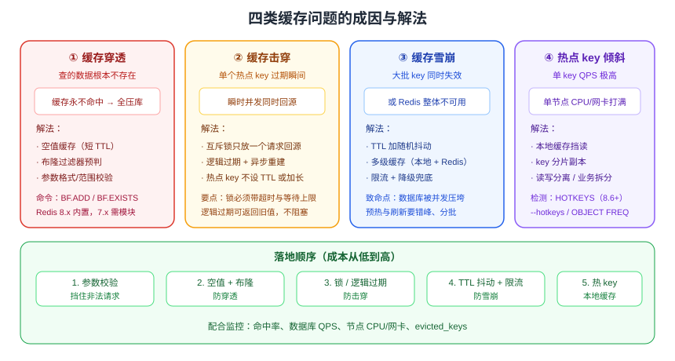

# 缓存防护

缓存本身会引入新的故障模式：**穿透**（查不存在的数据）、**击穿**（热点 key 失效）、**雪崩**（大批 key 同时失效）、**热点 key 倾斜**（单 key 打爆单节点）。这一页把四类问题的成因、检测手段与落地方案一次讲清。

::: tip 一句话理解
穿透是「**查不到**」，击穿是「**一个热点过期**」，雪崩是「**一片同时过期**」，热点 key 是「**一个 key 太热**」——四者的解法完全不同，先分清楚再动手。
:::

## 四类问题对比



| 问题 | 触发条件 | 表现 | 主要解法 |
| --- | --- | --- | --- |
| 缓存穿透 | 查询不存在的数据（含恶意 ID 遍历） | 缓存永不命中，请求全压库 | 空值缓存、布隆过滤器、参数校验 |
| 缓存击穿 | 单个热点 key 过期瞬间 | 瞬时并发打到库，库连接被打满 | 互斥锁重建、逻辑过期、热点永不过期 |
| 缓存雪崩 | 大批 key 同时过期或 Redis 宕机 | 数据库整体被压垮 | TTL 抖动、多级缓存、限流降级、高可用部署 |
| 热点 key 倾斜 | 单 key QPS 极高 | 集群中某节点 CPU/网卡打满 | 本地缓存、key 分片、读写分离 |

## 缓存穿透

### 成因

请求的数据在缓存与数据库中都不存在。此时缓存永远无法命中，每次请求都会穿透到数据库；恶意攻击者用随机 ID 遍历可以轻易打垮数据库。

### 方案一：缓存空值

```java
public User getById(long id) {
    String key = "user:" + id;
    String json = redis.get(key);
    if (json != null) {
        return json.isEmpty() ? null : JSON.parseObject(json, User.class);
    }
    User u = userMapper.selectById(id);
    if (u == null) {
        redis.setex(key, 60, "");     // 空值占位，TTL 必须短（30~120 秒）
        return null;
    }
    redis.setex(key, 1800, JSON.toJSONString(u));
    return u;
}
```

::: danger 注意
1. 空值 TTL 设得太长，会导致数据后来被创建了却仍读到 `null`。
2. 空值缓存会被大量随机 ID 撑爆内存——它只适合「**重复查询概率高**」的场景。
3. 空值占位必须与真实值区分（空字符串 vs JSON），否则会把 `""` 当成用户对象解析报错。
:::

### 方案二：布隆过滤器

布隆过滤器（Bloom Filter）用极小内存判断「**元素一定不存在 / 可能存在**」，可拦掉绝大多数非法 key。

```shell
# Redis 8.x 内置概率数据结构（Bloom），可直接使用
BF.RESERVE user:bloom 0.01 1000000        # 误判率 0.01，容量 100 万
BF.ADD user:bloom 1001
BF.EXISTS user:bloom 1001                 # (integer) 1
BF.EXISTS user:bloom 999999               # (integer) 0 → 一定不存在，直接返回空
```

```java [使用布隆过滤器拦截非法请求]
public User getWithBloom(long id) {
    if (!redis.execute("BF.EXISTS", "user:bloom", String.valueOf(id)).equals(1L)) {
        return null;                          // 一定不存在，直接返回
    }
    return getById(id);                       // 可能存在，走缓存 + 回源
}
```

| 对比项 | 布隆过滤器 | 空值缓存 |
| --- | --- | --- |
| 内存 | 极小（亿级约百 MB） | 随非法 key 数量膨胀 |
| 准确性 | 有误判（「可能存在」也可能是假阳性） | 精确 |
| 删除元素 | **不支持**（需 Counting Bloom 或重建） | 天然支持 |
| 初始化 | 需要把全量合法 ID 预热进去 | 无需预热 |

::: info 版本提示
Redis 8.0 起，Bloom 等概率数据结构随 Redis 一起提供（无需单独编译模块），可直接使用 `BF.*` 命令；Redis 7.x 及更早版本需要通过 Redis Stack 或加载 RedisBloom 模块。
:::

### 方案三：参数校验

入参必须先做**格式与范围校验**（ID 必须为正整数、必须落在合法区间），把明显非法的请求挡在缓存之前。这是成本最低、最容易被忽略的一层。

## 缓存击穿

### 成因

某个**热点 key 刚好过期**，此时恰好有大量并发请求，全部同时回源数据库重建缓存。

### 方案一：互斥锁重建（推荐）

只允许一个请求回源，其余请求短暂等待后读缓存。

```java
public Product detail(long id) {
    String key = "product:detail:" + id;
    String json = redis.get(key);
    if (json != null) {
        return json.isEmpty() ? null : JSON.parseObject(json, Product.class);
    }
    String lockKey = "lock:" + key;
    // SET NX EX：只有抢到锁的请求才去回源
    boolean locked = "OK".equals(redis.set(lockKey, "1", SetParams.setParams().nx().ex(5)));
    if (!locked) {
        sleepQuietly(50);                     // 短暂等待后重试读缓存
        return detail(id);
    }
    try {
        Product p = productMapper.selectById(id);
        redis.setex(key, 1800, p == null ? "" : JSON.toJSONString(p));
        return p;
    } finally {
        redis.delete(lockKey);                // 生产环境用 Lua 校验持有者，见分布式锁页
    }
}
```

### 方案二：逻辑过期

缓存永不物理过期，value 中存一个 `expireAt`；发现逻辑过期时，**异步**重建并让本次请求先返回旧值。

```java
public static class CachedValue {
    public long expireAt;                     // 逻辑过期时间戳
    public Product data;
}

public Product detailWithLogicalExpire(long id) {
    String key = "product:logic:" + id;
    CachedValue cached = read(key);
    if (cached == null) {
        return loadAndCache(key, id);
    }
    if (cached.expireAt > System.currentTimeMillis()) {
        return cached.data;
    }
    // 逻辑已过期：只有抢到锁的请求触发异步重建，其余继续用旧值
    if (tryLock("lock:" + key)) {
        executor.submit(() -> loadAndCache(key, id));
    }
    return cached.data;
}
```

| 方案 | 一致性 | 用户体验 | 实现复杂度 | 适用 |
| --- | --- | --- | --- | --- |
| 互斥锁重建 | 强（等待期间阻塞） | 首请求稍慢 | 低 | 一般热点数据 |
| 逻辑过期 | 弱（返回旧值） | 无阻塞 | 中 | 秒杀、大促等极端热点 |

::: danger 注意
1. 互斥锁必须设置**超时时间**，否则回源线程崩溃会导致所有请求被永久阻塞。
2. 等待重试要有**次数上限**，避免形成「等待 → 重试 → 再等待」的长尾。
3. 锁的释放要校验持有者（Lua 比较 value），否则可能删掉别人的锁。详见[分布式锁与 Lua](../DistributedLock/index.md)。
:::

## 缓存雪崩

### 成因

两类：**大量 key 在同一时刻过期**；或是**Redis 实例/集群整体不可用**。

### 方案一：TTL 抖动

```java
// 基础 TTL 30 分钟，随机浮动 0~5 分钟，避免整点集体失效
int ttl = 1800 + ThreadLocalRandom.current().nextInt(0, 300);
redis.setex(key, ttl, value);
```

对**批量预热**的数据尤其重要：一次性写入的一批 key 若 TTL 相同，过期时间也会完全相同。

### 方案二：多级缓存

本地缓存（Caffeine）承担一部分读流量，Redis 抖动时仍有本地副本可用；注意本地缓存 TTL 应**短于** Redis（1~5 秒），并考虑用发布订阅广播失效。

### 方案三：限流与降级

```java
// 令牌桶限流，保护数据库（示例用 Resilience4j 风格的语义）
if (!rateLimiter.tryAcquire()) {
    throw new TooManyRequestsException("系统繁忙，请稍后重试");
}
// 降级：查不到缓存时直接返回兜底数据，不打库
if (!redisHealthy()) {
    return fallbackData();          // 静态兜底 / 默认值 / 稍后重试
}
```

### 方案四：高可用部署

Redis 侧用[哨兵](../Sentinel/index.md)或 [Cluster](../Cluster/index.md) 消除单点；客户端配置**连接池 + 超时 + 重试**，避免 Redis 抖动演变为应用线程池耗尽。

::: danger 注意
1. 缓存雪崩的**真正致命点不是 Redis 挂了，而是数据库被并发压垮**——限流与降级必须提前准备好，不能等出事再上。
2. 预热脚本必须让它自己在后台跑，不要在主流程里同步预热全量数据。
3. 「全量刷新」类定时任务要么在低峰执行，要么改成灰度分批刷新，否则等价于人为制造雪崩。
:::

## 热点 key 倾斜

单个 key 的 QPS 远超其他 key 时（如某明星微博、某个爆款商品），会出现：

- 在 Cluster 下，该 key 所在节点 CPU/网卡先到瓶颈，其他节点空闲。
- 单节点连接数被打满，影响该节点上的**其他正常 key**。

### 检测手段

| 手段 | 说明 |
| --- | --- |
| `HOTKEYS`（Redis 8.6+） | 内置热 key 检测与上报命令，按 CPU 时间/网络流量统计 |
| `redis-cli --hotkeys` | 基于 LFU 计数扫描热 key（需 `maxmemory-policy` 为 `*-lfu`） |
| `OBJECT FREQ key` | 查看单个 key 的 LFU 访问频率 |
| 代理层统计 | 自建代理（如 twemproxy/自研）统计 key 访问频次 |
| 客户端埋点 | 在缓存 SDK 层做本地计数与上报 |

```shell
# Redis 8.6 及以上：内置热 key 检测
HOTKEYS START                  # 开始采集
HOTKEYS GET                    # 获取当前热点 key 列表
HOTKEYS STOP                   # 停止采集（有性能开销，采集完及时停止）
```

### 处理手段

```java
// 1. 本地缓存 + 短 TTL，挡掉绝大部分读
String v = localCache.get(key);
if (v == null) {
    v = redis.get(key);
    localCache.put(key, v);
}

// 2. key 分片：把热 key 复制为 N 份，读时随机选一份（写时需全部更新）
int shard = ThreadLocalRandom.current().nextInt(0, 8);
String shardedKey = "hot:product:1001:" + shard;
```

| 手段 | 原理 | 代价 |
| --- | --- | --- |
| 本地缓存 | 读请求不出进程 | 一致性变弱，需失效机制 |
| key 分片 | 读压力分散到多个节点 | 写放大 N 倍，需保证各分片一致 |
| 读写分离 | 热 key 读走从库 | 从库延迟；需客户端支持 |
| 业务拆分 | 把热数据拆成更细粒度的 key | 需要改造业务模型 |

::: tip
热点 key **不可能**靠「扩容 Redis」解决——问题不在总量而在分布。最有效的手段永远是**本地缓存**，其次是**读多写少时用从库分担**。
:::

## 缓存与业务一致性的三种取舍

「缓存一致性」不是「一致 or 不一致」的二选一，而是**按业务对「脏读多久能忍」分三档**。选哪档决定了要付出多少复杂度，而不是决定了「做得对不对」。

| 档位 | 语义 | 典型手段 | 允许的脏读窗口 | 适用业务 |
| --- | --- | --- | --- | --- |
| 强一致 | 读到的一定是最新值 | 不缓存；或缓存只存版本号、读时校验 | 0（退化为不缓存） | 账户余额、支付状态、库存扣减结果 |
| 最终一致 | 短暂可能读到旧值，但会自行收敛 | 先写库再删缓存 + TTL（+ 延迟双删） | 毫秒~秒级（≤ TTL） | 商品详情、用户资料、榜单 |
| 以缓存为准 | 缓存是权威状态，库是异步落地结果 | Redis 预扣 + 异步队列 + 定时对账 | 不适用（本就不要求同步） | 秒杀、抢券、限量兑换 |

### 档位一：强一致

**不要缓存**，或者把缓存降级成「校验位」而不是数据源。折中做法是「缓存里存数据和版本号，读时与数据库最新版本比对」，但这条路每次读都要碰数据库，缓存只剩「减少传输量」的作用。判据只有一句：**这个字段读错了会不会造成资损、或需要人工介入修数**——会，就别让它走缓存。

### 档位二：最终一致（默认选择）

绝大多数读多写少的业务属于这一档，落地只有三件事：

1. **先写库，再删缓存**（不要写缓存）
2. **给缓存设 TTL**，把最坏情况的脏读时间封顶
3. **写多读少的字段不做缓存**——缓存被高频删除就失去了意义

```java [最终一致的标准写法：先写库、事务提交后再删缓存]
@Transactional
public void updateProduct(Product product) {
    db.update(product);                                  // 1. 先写库（事务内）
    afterCommit(() -> redis.del(key(product.id())));     // 2. 提交后才删缓存
}

private void afterCommit(Runnable task) {
    if (TransactionSynchronizationManager.isSynchronizationActive()) {
        TransactionSynchronizationManager.registerSynchronization(
            new TransactionSynchronization() {
                @Override public void afterCommit() { task.run(); }
            });
    } else {
        task.run();
    }
}
```

::: danger 这里最容易写错的一点
**删缓存必须放在事务提交之后**。若写在事务方法内部，会出现「缓存已删、写库随后回滚」——这本身不算致命（下次读会回填旧值，且是旧值正确的那种）。真正致命的是另一种顺序：事务内先删缓存，随后**并发读请求**在事务提交前穿透到数据库读到**旧值**并回填 L2，事务提交后缓存里就一直是那个旧值，直到 TTL 到期。这正是「延迟双删」要解决的问题，而更省事、更可靠的做法就是上面这段 `afterCommit` 回调。
:::

### 档位三：以缓存为准

秒杀这类场景**反过来做**：先在 Redis 里扣减，再异步落库。此时 Redis 不再是缓存，而是**权威状态**，因此必须额外承担三件事：

- **持久化**：AOF 从 `everysec` 起配，不能接受丢失时用 `always`；
- **对账**：定时比对 Redis 与数据库的库存差并修正，差额即异常（见 [缓存设计 · 容量规划](../CacheDesign/index.md) 的对账口径）；
- **不允许缓存丢失**：缓存丢了就等于丢失订单或造成超卖，因此这条路的 Redis 必须做高可用（哨兵/集群），不能当「可丢弃的缓存」部署。

### 怎么选：三个问题定位

1. **读错了会不会造成资损或需要人工介入？** 会 → 档位一。
2. **这个数据是读多写少吗？** 是 → 档位二。
3. **峰值流量是否已超过数据库写入能力？** 是 → 档位三，并把对账机制一并设计出来。

## 综合落地顺序

1. 参数校验 → 拦掉明显非法请求（成本最低）。
2. 空值缓存 + 布隆过滤器 → 防穿透。
3. 互斥锁 / 逻辑过期 → 防击穿。
4. TTL 抖动 + 多级缓存 + 限流降级 → 防雪崩。
5. 热 key 检测 + 本地缓存 → 治倾斜。
6. 监控告警：`keyspace_hits/misses`、`INFO commandstats`、节点 CPU/网卡、数据库 QPS。

## 验证方式

```shell
# 1. 穿透验证：查询不存在的 ID 多次，数据库 QPS 应保持平稳
for i in $(seq 1 100); do curl -s -o /dev/null "http://localhost:8080/api/user/999999999"; done
redis-cli -p 6379 GET user:999999999      # 应为空值占位，TTL 剩余 < 60
redis-cli -p 6379 TTL user:999999999

# 2. 击穿验证：删除热点 key 后并发压测，数据库连接数不应飙升
redis-cli -p 6379 DEL product:detail:1001
ab -n 2000 -c 200 "http://localhost:8080/api/product/1001"

# 3. 雪崩验证：抽查一批 key 的 TTL 是否分散
redis-cli -p 6379 --scan --pattern 'product:detail:*' | head -20 | while read k; do redis-cli TTL "$k"; done

# 4. 热 key 验证（Redis 8.6+）
redis-cli -p 6379 HOTKEYS START
redis-cli -p 6379 HOTKEYS GET
redis-cli -p 6379 HOTKEYS STOP
```

预期：重复查询不存在的数据时数据库 QPS 无明显上升；删除热点 key 后应用与数据库连接数平稳；TTL 分布分散；热 key 能被检测出来。

## 参考资料

- 官方文档 · 客户端缓存：https://redis.io/docs/latest/develop/clients/client-side-caching/
- 官方文档 · Bloom 过滤器命令：https://redis.io/docs/latest/commands/?group=probabilistic
- 官方文档 · 8.6 版本说明（热 key 检测）：https://redis.io/docs/latest/operate/oss_and_stack/stack-with-enterprise/release-notes/redisce/redisos-8.6-release-notes/
- [缓存设计](../CacheDesign/index.md)、[性能调优](../Performance/index.md)
