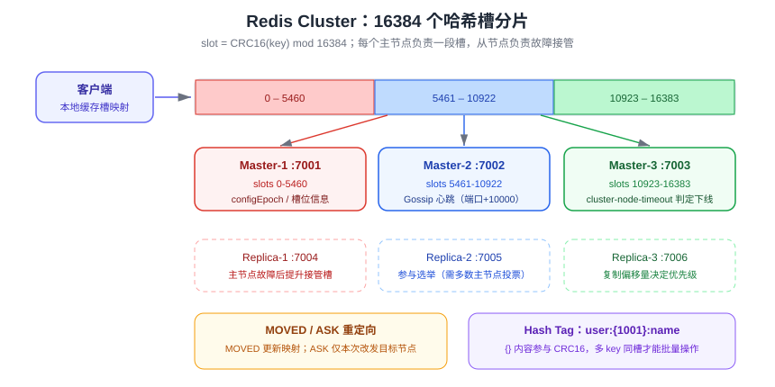

# Cluster 分片集群

Redis Cluster 是官方提供的**分布式分片方案**：把 16384 个哈希槽（hash slot）分散到多个主节点上，每个主节点再挂若干从节点。它同时解决**容量扩展**（数据分片）与**高可用**（分片级故障转移），是单机内存与并发到顶后的必然选择。

::: tip 一句话理解
哨兵是「一主多从 + 自动切换」，Cluster 是「多主多从 + 自动分片」；Cluster 的代价是**多 key 操作受限**与**客户端必须支持重定向**。
:::

## 分片模型：哈希槽



- 集群共有 **16384**（2^14）个槽，key 通过 `CRC16(key) mod 16384` 决定归属槽。
- 每个主节点负责一部分槽；节点数量变化时，迁移的基本单位就是**槽**。
- 客户端先按算法算出槽，再查本地槽映射表，直接连到负责该槽的节点，省去一次重定向（smart client）。

### 为什么是 16384

16384 个槽在心跳包中用 bitmap 表示只需 2KB（16384 / 8），节点数量在千级以内时带宽可控；槽过多会让心跳过大，过少则不便细粒度迁移。

### Hash Tag：让多 key 落在同一槽

```shell
# 两个 key 的 {} 内内容相同，会被强制分到同一个槽
MSET user:{1001}:name "Tom" user:{1001}:age 18

# 验证槽号是否一致
CLUSTER KEYSLOT user:{1001}:name
CLUSTER KEYSLOT user:{1001}:age
```

```text
(integer) 12345
(integer) 12345
```

::: danger 注意
1. 只有 `{}` 中的内容参与 CRC16 计算；`user:1001:name` 与 `user:1002:name` 会落到不同槽，**不能直接 `MGET`**。
2. Hash tag 用滥会把大量 key 挤到同一个槽，导致**数据倾斜**——只给真正需要原子操作的一组 key 使用。
:::

## 集群架构

| 角色 | 说明 |
| --- | --- |
| 主节点（Master） | 持有槽与数据，处理读写 |
| 从节点（Replica） | 复制对应主节点，主节点故障时被提升 |
| 集群总线（Cluster bus） | 节点间通过 `端口 + 10000` 通信，Gossip 协议交换状态 |
| 槽分配 | 所有 16384 个槽必须被覆盖，否则集群不可用（默认 `cluster-require-full-coverage yes`） |

最小可用拓扑：**3 主 3 从**（共 6 个节点），保证任一主节点故障后仍能形成多数派完成故障转移。

### 节点握手与状态传播

1. 节点启动后通过 `CLUSTER MEET` 加入集群。
2. 各节点周期性发送 `PING`/`PONG`，携带自身与已知节点的槽信息、`configEpoch`。
3. `configEpoch` 大的节点信息优先，用于解决槽归属冲突。
4. 主节点故障判定由多数主节点达成一致（类似哨兵的 odown），随后由其从节点发起选举并提升。

## 搭建集群

### 配置文件

```properties [redis-7001.conf]
port 7001
cluster-enabled yes
cluster-config-file nodes-7001.conf
cluster-node-timeout 15000
appendonly yes
dir /var/lib/redis/7001
```

| 参数 | 作用 | 建议 |
| --- | --- | --- |
| `cluster-enabled yes` | 开启集群模式 | 必填 |
| `cluster-config-file` | 节点自动维护的集群状态文件 | 不要手工编辑 |
| `cluster-node-timeout` | 节点失联判定时间（毫秒） | 15000，过小易误判 |
| `cluster-require-full-coverage` | 有槽未覆盖时是否整体不可用 | 数据完整性要求高时保持 `yes` |
| `cluster-migration-barrier` | 主节点至少保留的从节点数 | 1（允许从节点自动迁移补位） |
| `cluster-replica-validity-factor` | 从节点数据过旧时禁止参选 | 10 |

### 一键创建 3 主 3 从

```shell
# 1. 启动 6 个实例（略），端口 7001~7006
# 2. 创建集群，--cluster-replicas 1 表示每个主节点配 1 个从节点
redis-cli --cluster create \
  10.0.0.1:7001 10.0.0.1:7002 10.0.0.1:7003 \
  10.0.0.2:7004 10.0.0.2:7005 10.0.0.2:7006 \
  --cluster-replicas 1

# 3. 查看集群状态
redis-cli -c -p 7001 CLUSTER INFO
redis-cli -c -p 7001 CLUSTER NODES

# 4. 集群健康检查
redis-cli --cluster check 10.0.0.1:7001
```

`CLUSTER INFO` 关键字段：

```text
cluster_state:ok                 # 集群可服务
cluster_slots_assigned:16384     # 已分配槽数，必须是 16384
cluster_known_nodes:6
cluster_size:3                   # 主节点数
```

::: danger 注意
1. 集群模式**只有 db 0**，`SELECT 1` 会报错，不要沿用单机的多库设计。
2. 集群节点必须能**双向**访问「业务端口 + 业务端口+10000」，只开业务端口会导致节点被误判下线。
3. 不要用 `bind 127.0.0.1` 的集群上线生产——节点间通信会失败。
:::

## 请求路由与重定向

| 错误 | 含义 | 客户端处理 |
| --- | --- | --- |
| `MOVED 12345 10.0.0.2:7002` | 该槽已**永久**归属另一个节点 | 更新本地槽映射，重试目标节点 |
| `ASK 12345 10.0.0.3:7003` | 该槽正在**迁移**中，本次请求去目标节点 | 临时重试，**不更新**本地映射 |
| `CROSSSLOT Keys in request don't hash to the same slot` | 多 key 不在同一槽 | 用 hash tag 或拆成单 key 命令 |
| `CLUSTERDOWN The cluster is down` | 有槽未覆盖或多数主节点失联 | 检查节点与槽状态 |

```shell
# 使用 -c 让 redis-cli 自动跟随重定向
redis-cli -c -p 7001 SET k1 v1
redis-cli -c -p 7001 GET k1

# 查看 key 所在槽与归属节点
redis-cli -c -p 7001 CLUSTER KEYSLOT k1
redis-cli -c -p 7001 CLUSTER SLOTS
```

::: tip
生产环境优先使用支持 Cluster 的客户端（Lettuce、Jedis Cluster、redis-py `RedisCluster`、go-redis `ClusterClient`），它们会在本地缓存槽映射，只有映射过期时才出现一次重定向。**切勿**用普通单机客户端连 Cluster。
:::

## 扩缩容

### 增加主节点

```shell
# 1. 启动新实例 7007，加入集群（作为空主节点）
redis-cli --cluster add-node 10.0.0.3:7007 10.0.0.1:7001

# 2. 从现有节点迁移部分槽到新节点（交互式，会提示输入数量与来源）
redis-cli --cluster reshard 10.0.0.1:7001 \
  --cluster-from <source-node-id> \
  --cluster-to <new-node-id> \
  --cluster-slots 1000 \
  --cluster-yes

# 3. 检查
redis-cli --cluster check 10.0.0.1:7001
```

### 增加从节点

```shell
redis-cli --cluster add-node 10.0.0.4:7008 10.0.0.1:7001 \
  --cluster-slave --cluster-master-id <master-node-id>
```

### 缩容与删除节点

```shell
# 先把待删节点的槽迁走
redis-cli --cluster reshard 10.0.0.1:7001 --cluster-from <del-node-id> --cluster-to <target-node-id> --cluster-slots 1000 --cluster-yes
# 槽迁完后再删除节点
redis-cli --cluster del-node 10.0.0.1:7001 <del-node-id>
```

::: warning 迁移期间的性能
槽迁移会同步 key（`MIGRATE`），大 key 会导致明显阻塞。迁移前先用 `redis-cli --bigkeys` 或 `CLUSTER COUNTKEYSINSLOT` 评估，尽量在低峰进行。

Redis 8.4 起引入**原子槽迁移（atomic slot migration）**，使扩缩容过程中的数据搬运更平滑、对业务影响更小；旧版本集群升级前请按[版本演进与升级迁移](../VersionMigration/index.md)评估。
:::

## 使用限制

| 限制 | 说明 | 规避方式 |
| --- | --- | --- |
| 多 key 命令 | `MGET`、`MSET`、`SUNION` 等要求同槽 | hash tag 分组，或改批量单 key |
| 事务与 Lua | 只能操作同一节点上的 key | 用 hash tag 保证同槽 |
| 数据库编号 | 仅 db 0 | 用 key 前缀区分业务 |
| `KEYS` / `SCAN` | `KEYS` 只扫本节点，结果不完整 | 逐节点扫描或改用其他检索方案 |
| 发布订阅 | 传统 Pub/Sub 广播到所有节点；分片 Pub/Sub 需 `SSUBSCRIBE` | 视版本使用分片订阅 |
| 阻塞命令 | `BLPOP` 等在同槽内可用，跨槽不可用 | 拆分使用 |

## 故障转移与脑裂

1. 主节点失联超过 `cluster-node-timeout` 后，其他主节点标记其为 `fail`（需多数主节点同意）。
2. 其从节点按 `configEpoch`、复制偏移量等条件发起选举，获得多数主节点投票后提升为主节点，接管原槽。
3. 原主节点恢复后作为**新主节点的从节点**重新加入，并触发全量同步。

::: danger 注意
1. **脑裂**：网络分区时，少数派一侧的主节点仍可能接受写入，恢复后这部分写入会丢失。用 `min-replicas-to-write` + `min-replicas-max-lag` 限制写入条件。
2. 从节点数据过旧（`cluster-replica-validity-factor` × `cluster-node-timeout` 之外未同步）时不会参选，可能长时间无主——该槽不可用。
3. 集群规模建议**主节点数 ≤ 1000**（官方上限 16384 个节点但实际远超则心跳开销不可接受），通常 3~30 个主节点为宜。
:::

## 常用命令清单

| 命令 | 作用 |
| --- | --- |
| `CLUSTER INFO` | 集群整体状态 |
| `CLUSTER NODES` | 所有节点与槽分配 |
| `CLUSTER SLOTS` | 槽 → 节点映射（客户端用） |
| `CLUSTER SHARDS` | 以分片为单位返回拓扑（新客户端推荐） |
| `CLUSTER KEYSLOT <key>` | 计算 key 的槽号 |
| `CLUSTER COUNTKEYSINSLOT <slot>` | 槽内 key 数量 |
| `CLUSTER GETKEYSINSLOT <slot> <count>` | 列出槽内 key |
| `CLUSTER FAILOVER [FORCE\|TAKEOVER]` | 手动切换主从 |
| `CLUSTER MEET <ip> <port>` | 节点加入集群 |
| `CLUSTER RESET [HARD\|SOFT]` | 重置节点集群状态 |
| `redis-cli --cluster check/add-node/reshard/del-node` | 运维工具集 |

## 验证方式

```shell
# 1. 集群健康
redis-cli --cluster check 10.0.0.1:7001

# 2. 写入并跨节点读取（自动重定向）
redis-cli -c -p 7001 SET user:{1001}:name "Tom"
redis-cli -c -p 7002 GET user:{1001}:name

# 3. 槽分布应均衡（每主节点约 5461 个槽）
redis-cli -c -p 7001 CLUSTER NODES | grep master

# 4. 跨槽操作应报错（验证限制确实存在）
redis-cli -c -p 7001 MGET user:1001:name user:1002:name
# (error) CROSSSLOT Keys in request don't hash to the same slot

# 5. 故障演练：kill 一个主节点，观察其从节点被提升
redis-cli -c -p 7001 CLUSTER NODES | grep -E "master|slave"
```

预期：`cluster_state:ok`、16384 个槽全部覆盖、槽分布均衡、跨槽命令按预期报错、故障演练后从节点变为 `master`。

## 参考资料

- 官方文档 · Cluster 教程：https://redis.io/docs/latest/operate/oss_and_stack/management/scaling/
- Cluster 规范（协议细节）：https://redis.io/docs/latest/operate/oss_and_stack/reference/cluster-spec/
- `CLUSTER` 命令参考：https://redis.io/docs/latest/commands/?group=cluster
