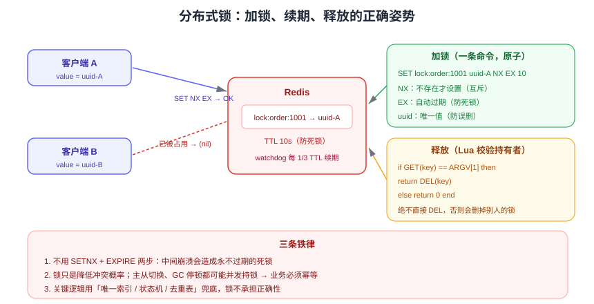

# 分布式锁与 Lua

在多实例部署下，JVM 自带的 `synchronized` / `ReentrantLock` 只能锁住单个进程，跨进程互斥必须依赖外部组件。Redis 凭借 `SET NX EX` 的原子性成为最常用的分布式锁实现，而 Lua 脚本则保证「判断 + 操作」的原子执行。

::: tip 一句话理解
分布式锁 = **互斥（NX）+ 防死锁（EX）+ 防误删（唯一 value + Lua）+ 防提前释放（续期）**。少任何一项都会在生产出事。
:::

## 从零实现一把正确的锁



### 加锁：SET NX EX

```shell
# 正确：一条命令完成「不存在才设置」+「设置过期」，天然原子
SET lock:order:1001 3f8ac1d2-... NX EX 10
# OK  → 加锁成功
# (nil) → 已被他人持有

# 错误写法：两条命令之间存在窗口，可能拿到锁却永远没有过期时间
SETNX lock:order:1001 1
EXPIRE lock:order:1001 10
```

::: danger 注意
1. `SETNX` + `EXPIRE` 分两步不是原子操作——若进程在两步之间崩溃，锁将**永不过期**，业务彻底卡死。
2. value 必须是**全局唯一值**（UUID + 线程标识），否则无法判断锁是不是自己持有的。
3. 过期时间必须**大于**业务最长执行时间，并预留余量。
:::

### 释放：Lua 校验持有者

```lua [unlock.lua]
-- KEYS[1] = 锁的 key，ARGV[1] = 加锁时的唯一值
if redis.call('GET', KEYS[1]) == ARGV[1] then
    return redis.call('DEL', KEYS[1])
else
    return 0        -- 不是自己的锁，绝不删除
end
```

```shell
# 通过 EVALSHA 执行（先 SCRIPT LOAD 获得 sha1）
redis-cli SCRIPT LOAD "$(cat unlock.lua)"
# "e0e1f9fabfc9d4800c877a703b823ac0578ff8db"
redis-cli EVALSHA e0e1f9fabfc9d4800c877a703b823ac0578ff8db 1 lock:order:1001 3f8ac1d2-...
```

::: danger 注意
1. 直接 `DEL lock` 释放是**最典型的 bug**：A 的业务超时后锁自动过期，B 拿到锁，A 执行完把 B 的锁删了。
2. Lua 脚本中不要写耗时逻辑（大循环、`KEYS` 扫描），Redis 执行脚本期间会阻塞其他命令。
3. 脚本应尽量小；Redis 8.10 新增 `SCRIPT_RUNNER` 命令标志用于识别「执行脚本/函数的命令」，便于 ACL 与审计收口。
:::

## 用 Redisson 实现可重入、自动续期

生产环境不建议手写（重入、续期、订阅唤醒都要自己实现），Java 生态推荐 **Redisson**。

```java [RedissonLockService.java]
@Configuration
public class RedissonConfig {
    @Bean
    public RedissonClient redissonClient() {
        Config config = new Config();
        config.useSingleServer()
              .setAddress("redis://10.0.0.1:6379")
              .setPassword("strong-pass")
              .setConnectionMinimumIdleSize(4)
              .setConnectionPoolSize(16);
        return Redisson.create(config);
    }
}
```

```java [加锁用法]
@Service
public class OrderService {

    @Autowired
    private RedissonClient redisson;

    public void createOrder(long orderId) {
        RLock lock = redisson.getLock("lock:order:" + orderId);
        // 1. tryLock(等待时间, 持有时间, 单位)：等待 3 秒抢不到就放弃，避免线程堆积
        boolean locked = false;
        try {
            locked = lock.tryLock(3, 30, TimeUnit.SECONDS);
            if (!locked) {
                throw new BizException("系统繁忙，请稍后重试");
            }
            doCreateOrder(orderId);
        } catch (InterruptedException e) {
            Thread.currentThread().interrupt();
            throw new BizException("获取锁被中断");
        } finally {
            // 2. 只释放自己持有的锁，且避免释放未加锁的锁
            if (locked && lock.isHeldByCurrentThread()) {
                lock.unlock();
            }
        }
    }
}
```

| 能力 | 手写实现 | Redisson |
| --- | --- | --- |
| 互斥 + 超时 | 需要 | 内置 |
| 唯一 value + Lua 释放 | 需要自己写脚本 | 内置 |
| 可重入（同一线程多次加锁） | 需自己维护计数器 | 内置（Hash 记录计数） |
| 自动续期（看门狗） | 需自己起定时任务 | 内置 watchdog |
| 等待唤醒 | 需自己轮询 | 内置发布订阅（`subscribe`） |

::: warning 看门狗（watchdog）机制
不指定 `leaseTime` 时，Redisson 默认锁有效期 **30 秒**，并每 **10 秒**（1/3 有效期）自动续期到 30 秒，直到显式 `unlock()` 或客户端宕机。**指定了 leaseTime 就不会续期**——所以「怕业务超时」时应靠合理预估业务耗时，而不是依赖看门狗兜底所有场景。
:::

## Redlock 与它的争议

Redlock 是 Redis 作者提出的**多节点锁算法**：向 N（通常 5）个独立 Redis 实例依次加锁，若在**多数节点**上加锁成功且总耗时小于锁有效期，则认为加锁成功。

```text
加锁成功的判定：
1. 成功节点数 > N / 2（例如 5 个节点中至少 3 个成功）
2. 总耗时 < 锁有效期 × 0.7（留出时钟漂移余量）
```

| 观点 | 论据 |
| --- | --- |
| 支持使用 | 多节点降低单点故障风险，适合对互斥要求较高的场景 |
| 反对使用 | 依赖各节点时钟；GC 停顿或网络延迟下仍可能出现两个客户端同时持锁；正确性论证来自「有时钟假设」的分布式模型 |

**实践建议**：

- 优先使用**单实例 Redis 锁 + 业务幂等**。业务幂等（数据库唯一索引、状态机校验）才是最终防线，锁只用来降低并发冲突概率。
- 需要更高保证时，考虑 ZooKeeper / etcd 这类基于共识算法的协调组件，而不是把 Redlock 当成万能方案。

::: danger 注意
1. 分布式锁**不能保证**「同一时刻绝对只有一个执行者」——主从切换、GC 停顿都可能导致。关键逻辑必须幂等。
2. 锁的粒度要与业务匹配：按订单 ID 加锁优于全局锁；全局锁会成为吞吐瓶颈。
3. 锁的 key 不要与业务 key 混用同名前缀，避免误删业务数据。
:::

## Lua 脚本基础

Lua 在 Redis 中用于**保证多条命令的原子执行**（脚本执行期间不会穿插其他命令）。

```shell
# 方式一：直接执行（每次都要传脚本内容）
EVAL "return redis.call('GET', KEYS[1])" 1 mykey

# 方式二：先加载再执行（推荐，节省带宽）
SCRIPT LOAD "return redis.call('GET', KEYS[1])"
EVALSHA <sha1> 1 mykey

# 查看已缓存脚本
SCRIPT EXISTS <sha1>
SCRIPT FLUSH            # 清空脚本缓存（重启/主从切换后可能需要重新加载，客户端要能自动重试 EVAL）
```

### 注意区分 `redis.call` 与 `redis.pcall`

| 函数 | 行为 |
| --- | --- |
| `redis.call` | 命令报错时**中断脚本**并把错误返回客户端 |
| `redis.pcall` | 捕获错误并作为 Lua table 返回，脚本可继续执行 |

### 实例：按阈值安全扣减库存

```lua [deduct_stock.lua]
-- KEYS[1]: 库存 key，ARGV[1]: 扣减数量，ARGV[2]: 失败时返回标识
local stock = tonumber(redis.call('GET', KEYS[1]) or '-1')
if stock < 0 then
    return -2                       -- key 不存在
end
local num = tonumber(ARGV[1])
if stock < num then
    return -1                       -- 库存不足
end
return redis.call('DECRBY', KEYS[1], num)
```

```shell
redis-cli SET stock:sku:1001 100
redis-cli --eval deduct_stock.lua stock:sku:1001 , 5
# (integer) 95
redis-cli --eval deduct_stock.lua stock:sku:1001 , 1000
# (integer) -1
```

::: danger 注意
1. Lua 脚本中**所有 key 必须通过 `KEYS` 传入**（不要拼接变量），否则在 [Cluster](../Cluster/index.md) 下无法正确计算槽位。
2. 脚本要**短小**：超过 `lua-time-limit`（默认 5 秒）后 Redis 会开始响应其他命令并返回 `BUSY`，此时脚本仍在执行，需谨慎处理。
3. 脚本中禁止使用随机函数生成非确定性结果（会影响复制一致性），需要非确定性逻辑请用 Redis 提供的参数或 `redis.replicate_commands()` 语义（现代版本脚本默认按效果复制）。
:::

## 幂等设计：锁之外的第二道防线

无论锁多可靠，都必须假设「同一请求可能执行两次」：

| 手段 | 实现 | 适用 |
| --- | --- | --- |
| 唯一索引 | 数据库唯一约束兜底 | 创建类操作 |
| 状态机校验 | 只有 `待支付 → 已支付` 合法，重复回调直接返回成功 | 支付回调、订单状态流转 |
| 去重表 / 幂等表 | 以业务唯一键写入去重记录 | 消息消费 |
| Token 机制 | 客户端先取 token，提交时校验并删除 | 表单防重复提交 |

## 验证方式

```shell
# 1. 互斥性验证：两个客户端同时加锁，只有一个成功
redis-cli SET lock:test "client-A" NX EX 30     # OK
redis-cli SET lock:test "client-B" NX EX 30     # (nil)

# 2. 误删防护验证：用错误的 value 释放应失败
redis-cli EVALSHA <sha1> 1 lock:test "client-B"  # (integer) 0，锁仍在

# 3. 过期后自动释放
redis-cli TTL lock:test                          # 递减至 0 后 key 消失
redis-cli EXISTS lock:test                       # 0

# 4. 脚本缓存与执行
redis-cli SCRIPT EXISTS <sha1>                   # 1) (integer) 1
```

应用侧验证：并发压测下单账户余额/库存不出现超卖，日志中无「重复扣减」记录。

## 参考资料

- 官方文档 · 事务与 Lua：https://redis.io/docs/latest/develop/programmability/eval-intro/
- `SET` 命令（NX/EX 选项）：https://redis.io/docs/latest/commands/set/
- Redisson 官方文档：https://redisson.org/docs/
- [缓存防护](../CacheProtection/index.md)、[主从复制](../Replication/index.md)
