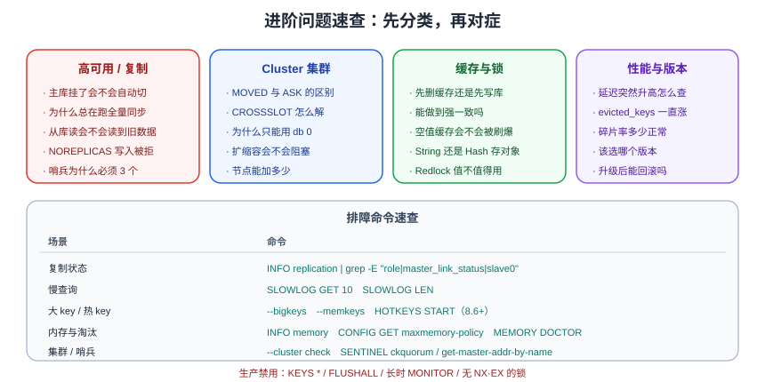

# Redis 进阶常见问题

这一页汇总进阶阶段的**高频疑问与排障口径**，基础命令类问题请先看[基础专题的常见问题](../../FAQ/index.md)。



## 高可用与复制

### 主库挂了，从库会自动变成主库吗

不会。**裸主从没有自动切换能力**，必须部署[哨兵](../Sentinel/index.md)或使用 [Cluster](../Cluster/index.md)。哨兵通过「多哨兵判定 odown → 选举 leader → 提升从库」完成切换，并把新主库地址提供给客户端。

### 哨兵为什么要部署 3 个以上

故障转移需要**多数派投票**：2 个哨兵无法形成多数（1:1 僵持），4 个哨兵在脑裂时也可能各得 2 票。官方建议**奇数个且 ≥3**，并部署在不同物理机/可用区。

### 从库为什么总是全量同步

按优先级排查：

1. `repl-backlog-size` 太小（默认仅 1MB）→ 调大到 64~256MB。
2. `repl-timeout` 太小，RDB 传输还没完成就超时 → 调大。
3. 主库被重启过，`replid` 变化 → 所有从库只能全量同步。
4. 从库自身被重启，本地缓存的主库信息失效。

```shell
redis-cli INFO stats | grep -E "sync_full|sync_partial_ok|sync_partial_err"
```

`sync_full` 持续增长而 `sync_partial_ok` 不涨，说明增量同步基本没生效。

### 复制延迟对业务有影响吗

有。从库是**异步复制**，读从库可能读到旧数据。做法：写后立刻读的业务走主库；用 `WAIT` 提高确认概率；对一致性敏感的数据不使用从库读。

### `min-replicas-to-write` 会导致写入失败吗

会。健康从库不足 `min-replicas-to-write` 时主库直接返回 `NOREPLICAS` 拒绝写入。这是**用可用性换一致性**的开关：生产建议开启（防止脑裂丢数据），但应用必须有重试与告警。

## Cluster 相关

### `MOVED` 和 `ASK` 有什么区别

| 错误 | 触发场景 | 客户端动作 |
| --- | --- | --- |
| `MOVED` | 槽已永久归属别的节点 | 更新本地槽映射表后重试 |
| `ASK` | 槽正在迁移中 | 本次请求改发目标节点，**不更新**映射 |

### 多 key 命令报 CROSSSLOT 怎么办

用 hash tag 把需要一起操作的 key 强制分到同一槽：`user:{1001}:name`、`user:{1001}:age`。注意不要滥用，否则会造成数据倾斜。

### 集群为什么只能用 db 0

Cluster 的槽是跨节点的全局概念，无法再叠加数据库编号维度。业务隔离请用 key 前缀（`order:`、`user:`）或独立集群。

### 集群扩缩容会阻塞业务吗

会。槽迁移时 key 需要 `MIGRATE` 同步搬运，**大 key 会导致明显延迟**。做法：低峰操作、迁移前清理大 key、分批迁移；Redis 8.4 起支持原子槽迁移，可减少对业务的影响。

### 节点数可以随便加吗

不建议。节点越多，Gossip 心跳与故障判定开销越大；实践上主节点控制在 **3~30 个**较常见，主节点数不超过 1000。

## 缓存设计

### 先删缓存还是先写库

标准答案是 **先写库、后删缓存**（Cache Aside）。先删缓存会让并发读把旧值回填；写完库「更新缓存」会在并发写时留下旧值。

### 缓存和数据库强一致能做到吗

不能（在不牺牲可用性的前提下）。工程目标是**最终一致 + 不一致窗口尽量短**：延迟双删、删除重试、订阅 binlog。强一致要求极高的少量数据，直接读库或用分布式锁串行化。

### 缓存该不该设过期时间

必须设。TTL 是**脏数据的最终防线**：出现无法主动删除的脏数据时，TTL 能自动恢复。唯一的例外是可以通过完整机制保证一致性的数据（如本地缓存配合发布订阅失效），也建议保留长 TTL。

### 空值缓存会不会被刷爆

会。空值占位必须**短 TTL（30~120 秒）**，并配合参数校验 + 布隆过滤器。如果攻击者用随机 ID 泛洪，空值缓存只是缓冲，真正有效的是布隆过滤器与限流。

### 用 String 还是 Hash 存对象

| 场景 | 选择 |
| --- | --- |
| 整体读写、字段少 | String + JSON（简单） |
| 单字段频繁更新、需要计数 | Hash（避免整体反序列化） |
| 大量同结构对象 | Hash + Redis 8.10 紧凑哈希（省内存） |

### 缓存命中率多高算正常

纯缓存场景经验值 **> 90%**（甚至 95%+）。低于 80% 说明 TTL 太短、key 设计不合理或写入频繁删缓存，需要逐个排查。

## 锁与 Lua

### `SETNX` + `EXPIRE` 为什么不行

两条命令之间不是原子的：如果进程在 `SETNX` 成功后崩溃，锁就没有过期时间，永久阻塞。正确写法是 `SET key value NX EX 10`。

### 释放锁能直接 DEL 吗

不能。业务超时后锁已过期、别人拿到锁，此时的 `DEL` 会删掉别人的锁。必须用 Lua 比较 value 再删；用 Redisson 时用 `isHeldByCurrentThread()` 兜底。

### Redlock 值得用吗

争议较大。核心问题：它依赖各节点时钟，且无法阻止 GC 停顿期间的并发执行。建议：**单实例锁 + 业务幂等**为主；确需更强保证时选 ZooKeeper/etcd。

### 分布式锁能保证不超卖吗

不能单靠锁。锁只降低并发冲突概率，主从切换、GC 停顿都可能让两个执行者同时持锁。**最终防线是数据库唯一索引、状态机校验等幂等设计**。

### Lua 脚本写多长合适

越短越好。脚本执行期间 Redis 不处理其他命令，超过 `lua-time-limit`（默认 5 秒）会返回 `BUSY`。同时**所有 key 必须通过 `KEYS` 传入**，否则 Cluster 下无法定位槽。

## 性能与内存

### 延迟突然升高怎么查

按顺序排查：

1. `SLOWLOG GET 10` → 是否有慢命令/大 key 操作。
2. `redis-cli --latency` → 区分 Redis 内部慢还是客户端侧慢。
3. `LATENCY LATEST` → 是否有 `fork`、`aof-fsync`、`eviction-cycle` 等事件。
4. `INFO memory` → 是否触发淘汰、碎片率是否异常。
5. 系统层 → 是否发生 swap、THP 是否开启、磁盘是否成为瓶颈。

### `evicted_keys` 一直增长怎么办

说明内存不足正在淘汰数据：扩容（纵向或分片）、治理无 TTL 的 key 与大 key、必要时把冷数据迁到其他存储。持续淘汰会让命中率下降，业务表现为「忽快忽慢」。

### 内存碎片率多少正常

`mem_fragmentation_ratio` 在 **1.0~1.5** 正常；> 1.5 说明碎片过多，可开启 `activedefrag yes` 或择机重建实例；< 1 说明发生了 swap，非常危险，必须立刻处理。

### `KEYS` 为什么不能用

`KEYS` 是 O(N) 全库扫描，会阻塞所有其他命令。生产用 `SCAN` 游标遍历；`CLUSTER` 下还需逐节点扫描。

### 删除大 key 有什么讲究

`DEL` 会同步释放内存并阻塞主线程，大 key 应使用 `UNLINK`（异步删除）；集合类可配合 `HSCAN`/`SSCAN` 分批 `HDEL`/`SREM`。

### Pipeline 有什么风险

一次发送过多命令会让服务端**输出缓冲区暴涨**，触发 `client-output-buffer-limit` 导致连接被断。建议每批 100~1000 条。

### 连接池该配多大

按「单实例 QPS × 单次命令平均耗时」估算，一般 `max-active` 从 8~32 起调，配合 `max-wait` 避免无限等待。池越大上下文切换成本越高，不要盲目调大。

## 版本与许可

### 该选哪个版本

- **新项目**：直接用最新 GA（当前 Redis 8.10）。
- **要求长期稳定**：选 Extended 版本（8.2 支持到 2030-09-01）。
- **存量 7.x**：至少升到 7.4；对照 [版本演进与升级迁移](../VersionMigration/index.md) 的 EOL 表排期。

### 8.x 的许可证有什么影响

Redis 8 采用 **RSALv2 / SSPLv1 / AGPLv3** 三选一（7.x 及以前为 BSD）。自用通常没问题，但**对外提供 Redis 托管服务**的场景需要仔细评估 SSPL/RSALv2 的条款，或选择兼容分支（如 Valkey）并做充分验证。

### 升级后能回滚吗

不能靠数据文件回滚：**高版本写出的 RDB 低版本读不了**。回滚只能依赖升级前的备份 + 停机恢复。所以升级前必须备份，并先在预发验证。

### 7.x 需要单独装 RedisBloom 吗

需要（用 Redis Stack 或加载模块）。**Redis 8.0 起 Bloom、Search、JSON、TimeSeries 等能力随 Redis 一起提供**，可直接使用 `BF.*`、`FT.*`、`JSON.*` 命令，部署方式更简单。

## 常用排障命令速查

```shell
# 状态总览
redis-cli INFO                     # 全量信息
redis-cli INFO replication         # 复制
redis-cli INFO memory              # 内存
redis-cli INFO stats               # 命中率、淘汰、fork 耗时
redis-cli --stat                   # 实时状态

# 定位问题
redis-cli SLOWLOG GET 10           # 慢查询
redis-cli --bigkeys                # 大 key 扫描
redis-cli --memkeys                # 按内存排序扫描
redis-cli --latency                # 延迟基线
redis-cli LATENCY LATEST           # 延迟事件
redis-cli HOTKEYS START            # 热 key 采集（Redis 8.6+）
redis-cli MEMORY DOCTOR            # 内存诊断

# 集群
redis-cli --cluster check <ip:port>
redis-cli -c CLUSTER NODES
redis-cli -c CLUSTER INFO

# 哨兵
redis-cli -p 26379 SENTINEL get-master-addr-by-name mymaster
redis-cli -p 26379 SENTINEL ckquorum mymaster
```

::: danger 生产环境禁用清单
1. `KEYS *`、`FLUSHALL`、`FLUSHDB`（需要时用 `ASYNC` 版本）。
2. `MONITOR` 长时间开启（性能开销大，仅用于短时诊断）。
3. 无 `NX`/`EX` 的锁命令。
4. `CONFIG SET` 改完不落盘（重启失效，确认后写入配置文件）。
5. 直接用单机客户端连 Cluster。
:::

## 相关链接

- [Redis 进阶导览](../index.md)
- [Redis 基础常见问题](../../FAQ/index.md)
- [性能调优](../Performance/index.md)、[缓存防护](../CacheProtection/index.md)
- 官方文档：https://redis.io/docs/latest/
- 官方版本管理：https://redis.io/docs/latest/operate/oss_and_stack/install/version-mgmt
