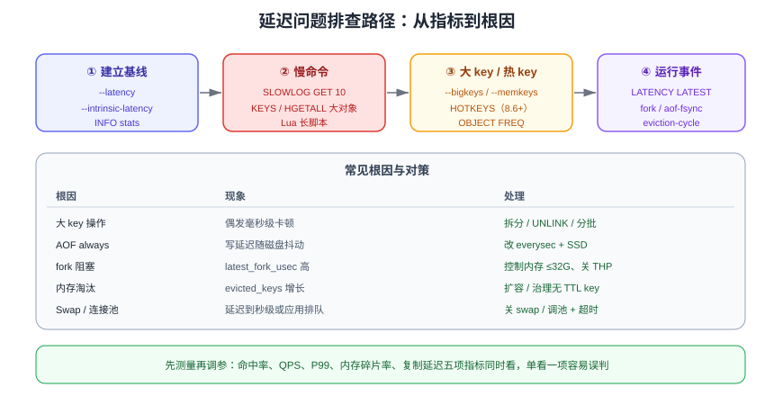

# 性能调优

Redis 的「快」是有条件的：慢查询、大 key、热 key、fork 阻塞、内存碎片、系统参数不当都会让它从微秒级退化到毫秒甚至秒级。这一页给出一套**从指标到根因**的排查路径。

::: tip 一句话理解
调优的顺序永远是：**先测量（延迟/QPS/命中率）→ 再定位（慢查询/大 key/热 key）→ 最后才动手改配置**。凭感觉调参只会把问题藏起来。
:::

## 关键指标



| 指标 | 命令 / 位置 | 健康范围 |
| --- | --- | --- |
| 平均/P99 延迟 | `redis-cli --latency`、`LATENCY` 相关命令 | P99 < 1ms（同机房） |
| 每秒命令数 | `INFO stats` 的 `instantaneous_ops_per_sec` | 结合规格评估 |
| 命中率 | `keyspace_hits / (hits + misses)` | > 90%（纯缓存场景） |
| 内存使用 | `INFO memory` 的 `used_memory_human` | ≤ 物理内存 70% |
| 内存碎片率 | `mem_fragmentation_ratio` | 1.0 ~ 1.5 |
| 慢查询数量 | `SLOWLOG LEN` | 持续为 0 最佳 |
| 阻塞客户端 | `INFO clients` 的 `blocked_clients` | 与业务阻塞命令数量相符 |
| 连接数 | `INFO clients` 的 `connected_clients` | 远小于 `maxclients` |
| fork 耗时 | `INFO stats` 的 `latest_fork_usec` | < 100ms（大内存实例可放宽） |

```shell
redis-cli -p 6379 INFO memory | grep -E "used_memory_human|mem_fragmentation_ratio|maxmemory_human"
redis-cli -p 6379 INFO stats  | grep -E "instantaneous_ops_per_sec|keyspace_hits|keyspace_misses|latest_fork_usec|expired_keys|evicted_keys"
redis-cli -p 6379 INFO clients | grep -E "connected_clients|blocked_clients"
```

::: warning
`evicted_keys` 持续增长说明**内存已不足、正在淘汰数据**——此时缓存命中率会下降，业务会感到「时快时慢」，必须立刻扩容或治理内存。
:::

## 慢查询（Slowlog）

Redis 的慢日志只统计**命令执行时间**（不含网络与排队），阈值默认 10000 微秒（10ms）。

```shell
# 动态设置为 10ms，并保留最近 256 条
CONFIG SET slowlog-log-slower-than 10000
CONFIG SET slowlog-max-len 256

# 查看慢查询（新版返回中额外包含参数总数，便于统计大命令）
SLOWLOG GET 10
SLOWLOG LEN
SLOWLOG RESET
```

```text
1) 1) (integer) 23                 # 日志 id
   2) (integer) 1757750000         # 时间戳
   3) (integer) 12500              # 执行耗时（微秒）
   4) 1) "HGETALL"                 # 命令与参数
      2) "user:1001"
   5) "10.0.0.5:52341"             # 客户端地址
   6) "app-cache"                  # 客户端名称
```

### 常见慢命令与替代方案

| 慢命令 | 原因 | 替代方案 |
| --- | --- | --- |
| `KEYS *` | 全库扫描，O(N) | `SCAN` 游标遍历；生产禁用 `KEYS` |
| `HGETALL` 大 Hash | 一次返回全部字段 | `HMGET` 取指定字段，或拆分 Hash |
| `SMEMBERS` 大 Set | 返回全部成员 | `SSCAN` / `SRANDMEMBER` 分页 |
| `ZRANGE key 0 -1` | 返回全部元素 | 分页 + `LIMIT` |
| `DEL` 大 key | 同步释放内存阻塞主线程 | `UNLINK`（异步删除） |
| `FLUSHALL` / `FLUSHDB` | 清库阻塞 | `FLUSHALL ASYNC` |
| `SORT` | 复杂度高 | 用 ZSet 预排序 |
| Lua 长脚本 | 阻塞所有命令 | 拆分脚本、控制 `lua-time-limit` |

```shell
# 游标扫描替代 KEYS（每次 100 个，循环直到游标为 0）
SCAN 0 MATCH user:* COUNT 100
# 异步删除大 key
UNLINK big:hash:1001
```

::: danger 注意
1. `slowlog-log-slower-than` 设得过小（如 0）会记录所有命令，日志暴涨并影响性能。
2. 慢查询**只记录执行时间**，客户端观察到的「慢」也可能是网络、连接池排队或阻塞命令导致，需要结合 `--latency` 判断。
3. `MONITOR` 会打印所有命令，生产环境严禁长时间开启。
:::

## 大 key 治理

**大 key** 指 value 过大或元素过多的 key（经验值：String > 10KB、集合类元素 > 5000）。

### 检测

```shell
# 抽样扫描并汇总各类 key 的最大值
redis-cli -p 6379 --bigkeys

# 按内存占用排序（较新版本支持）
redis-cli -p 6379 --memkeys

# 精确查单个 key
redis-cli -p 6379 MEMORY USAGE user:1001
redis-cli -p 6379 STRLEN big:string
redis-cli -p 6379 HLEN big:hash
redis-cli -p 6379 ZCARD big:zset

# 8.6+ 可开启按数据类型的 key 内存直方图统计，从整体分布上定位大 key
CONFIG SET key-memory-histograms yes
```

### 治理

| 手段 | 做法 |
| --- | --- |
| 拆分 | `user:1001:base`、`user:1001:ext` 按字段分组；大 List 按时间分片 |
| 删除 | 用 `UNLINK` 或 `HSCAN` + `HDEL` 分批清理 |
| 压缩 | 大文本先 gzip 再存，或改用二进制序列化 |
| 结构调整 | 大 Set 改 Bitmap（可枚举 ID 场景）；大 ZSet 保留 TOP N |
| 阻断新增 | 在缓存 SDK 层加上「写入前校验 value 大小」，超限直接告警 |

```shell
# 分批删除大 Hash，避免一次性阻塞
HSCAN big:hash 0 COUNT 100      # 循环获取字段
HDEL big:hash field1 field2 ... # 分批删除
```

## 热 key 治理

热 key 的检测与处理详见[缓存防护](../CacheProtection/index.md#热点-key-倾斜)，这里补充命令层面：

```shell
# Redis 8.6+：内置热 key 检测
HOTKEYS START
HOTKEYS GET
HOTKEYS STOP

# LFU 频次（需 maxmemory-policy 为 *-lfu）
CONFIG SET maxmemory-policy allkeys-lfu
OBJECT FREQ hot:key:1001

# 命令级统计，找出「哪种命令最耗时」
INFO commandstats
```

## 延迟排查

### 1. 区分「Redis 内部慢」与「网络/客户端慢」

```shell
# 观察一段时间内的延迟分布（不含网络往返）
redis-cli -p 6379 --latency

# 历史延迟采样，便于发现周期性问题
redis-cli -p 6379 --latency-history -i 5

# 测量机器本身的固有延迟（反映 CPU/虚拟化开销）
redis-cli -p 6379 --intrinsic-latency 100

# 记录运行中出现的延迟事件（超过阈值的事件会被记录）
CONFIG SET latency-monitor-threshold 100
LATENCY LATEST
LATENCY HISTORY fork
LATENCY RESET
```

| 事件类型 | 含义 |
| --- | --- |
| `command` | 慢命令 |
| `fork` | 生成 RDB / AOF 重写时的 fork 耗时 |
| `expire-cycle` | 过期键清理周期过长 |
| `eviction-cycle` | 内存淘汰周期过长 |
| `aof-write` / `aof-fsync` | AOF 落盘耗时 |

### 2. 常见延迟根因

| 根因 | 现象 | 处理 |
| --- | --- | --- |
| 大 key 操作 | 偶发毫秒级卡顿，`SLOWLOG` 里有大 value 命令 | 治理大 key，改用 `UNLINK`/分批 |
| AOF `always` | 每次写都等磁盘，延迟受磁盘影响 | 改为 `everysec`（见[持久化](../../Persistence/index.md)） |
| fork 阻塞 | 内存越大越明显，`latest_fork_usec` 高 | 控制单实例内存 ≤ 32GB，关闭 THP |
| 内存淘汰 | 高写入时周期性延迟峰值 | 扩大内存或优化 TTL，避免频繁淘汰 |
| Swap | 延迟突然到秒级 | 关闭 swap；`redis-server` 设置 `vm.swappiness=0` |
| 网络拥塞 | 大批量读（`HGETALL` 大对象） | 减小 value、启用 Pipeline |
| 客户端连接池不足 | 应用侧排队，`redis-cli --latency` 正常 | 调大连接池、缩短单次命令耗时 |
| 持久化磁盘慢 | `aof-fsync` 延迟高 | 使用独立 SSD / NVMe |

### 3. 系统层参数

```shell
# 关闭透明大页（THP），避免 fork 与内存分配抖动
echo never > /sys/kernel/mm/transparent_hugepage/enabled

# 允许内存过量分配（fork 时避免失败）
sysctl -w vm.overcommit_memory=1
sysctl -w vm.swappiness=0

# 提高网络连接队列上限
sysctl -w net.core.somaxconn=1024
```

```properties [redis.conf 追加]
# Linux 下禁止 Redis 主动把内存换出到 swap
# 由部署脚本写入 /etc/sysctl.conf：
# vm.overcommit_memory = 1
# vm.swappiness = 0

# 所有连接都开启 TCP 保活，及时发现死连接
tcp-keepalive 300

# 空闲连接超时（0 表示不超时，建议显式设置）
timeout 300
```

## 批量与连接优化

### Pipeline

Pipeline 把多条命令一次性发送，消除 RTT 开销。

```java [Jedis Pipeline 示例]
try (Jedis jedis = pool.getResource()) {
    Pipeline p = jedis.pipelined();
    for (int i = 0; i < 1000; i++) {
        p.set("bench:" + i, String.valueOf(i));
    }
    p.sync();                 // 一次性发送并读取全部响应
}
```

| 方式 | RTT 次数 | 适用 |
| --- | --- | --- |
| 逐条命令 | N 次 | 命令间有依赖 |
| Pipeline | 1 次 | 批量写入/读取，无依赖 |
| `MGET`/`MSET` | 1 次 | 同类型批量操作（Cluster 下需同槽） |
| Lua 脚本 | 1 次 | 需要「判断 + 执行」原子性 |

::: danger 注意
1. Pipeline 一次不要塞太多命令（建议 100~1000 条），否则服务端输出缓冲区暴涨，可能触发 `client-output-buffer-limit` 断开连接。
2. Pipeline 中的命令**不保证其他客户端看不到中间状态**，需要原子性请用 Lua 或事务。
3. 连接池大小要按「单实例 QPS × 单次耗时」估算，池过大反而增加上下文切换；一般 `max-active` 取 8~32 起调。
:::

### 连接池参考配置

```properties [application.yml（Spring Boot + Lettuce）]
spring:
  data:
    redis:
      lettuce:
        pool:
          max-active: 16          # 最大连接数
          max-idle: 8
          min-idle: 2             # 保持最小空闲，避免冷启动抖动
          max-wait: 2000ms        # 取连接超时，避免无限等待
        shutdown-timeout: 200ms
      timeout: 2000ms             # 命令超时（含网络）
```

## 内存优化

| 手段 | 说明 |
| --- | --- |
| 控制 key 长度 | key 越短越省内存；百万元素时效果显著 |
| 使用紧凑编码 | List/Hash/ZSet 在上限内使用 `listpack`/`intset` 等紧凑编码，超过阈值转为 `hashtable`/`skiplist`，内存成倍增长 |
| 控制元素数量 | 批量化小 Hash 优于单个大 Hash（阈值内可享紧凑编码） |
| 对象共享 | 小整数（0~9999）复用共享对象 |
| 紧凑哈希 | Redis 8.10 引入，同结构 Hash 只存一份字段名，大幅降低内存 |
| 压缩 value | 大 JSON 压缩后存储（注意 CPU 与内存的权衡） |
| 及时清理 | 所有缓存 key 设置 TTL；无 TTL 的 key 定期巡检 |

```shell
# 查看编码方式，判断是否已超出紧凑编码阈值
OBJECT ENCODING user:1001        # listpack / hashtable / intset / skiplist
CONFIG GET hash-max-listpack-entries
CONFIG GET set-max-intset-entries
CONFIG GET zset-max-listpack-entries

# 内存占用概览
MEMORY STATS
MEMORY DOCTOR
```

::: tip
`MEMORY DOCTOR` 会给出内存诊断建议（如「内存碎片过高，建议重启」），是快速体检的好工具。碎片率长期 > 1.5 时可考虑开启 `activedefrag yes` 或重建实例。
:::

## 验证方式

```shell
# 1. 基准压测（-q 安静模式，-n 总请求数，-c 并发，-P Pipeline 深度）
redis-benchmark -h 127.0.0.1 -p 6379 -q -n 100000 -c 50 -P 8 -t set,get

# 2. 延迟基线
redis-cli -p 6379 --latency

# 3. 慢查询与延迟事件
redis-cli -p 6379 SLOWLOG LEN
redis-cli -p 6379 LATENCY LATEST

# 4. 内存与淘汰
redis-cli -p 6379 INFO memory | grep -E "used_memory_human|mem_fragmentation_ratio|evicted_keys"
```

预期：`redis-benchmark` 输出的每秒操作数满足性能目标；`--latency` 的 max 值稳定在毫秒以内；`SLOWLOG LEN` 为 0；`mem_fragmentation_ratio` 在 1.0~1.5；`evicted_keys` 不持续增长。

## 参考资料

- 官方文档 · 延迟监控：https://redis.io/docs/latest/operate/oss_and_stack/management/optimization/latency-monitor/
- 官方文档 · 内存优化：https://redis.io/docs/latest/operate/oss_and_stack/management/optimization/memory-optimization/
- 官方文档 · 诊断工具：https://redis.io/docs/latest/operate/oss_and_stack/management/debugging/
- `redis-benchmark` 使用说明：https://redis.io/docs/latest/operate/oss_and_stack/management/optimization/benchmarks/
