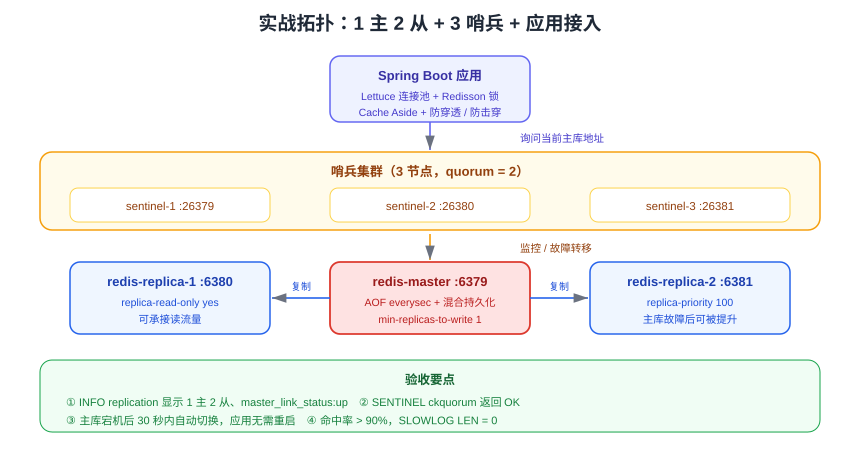

# 实战：高可用缓存集群

这一页把前面的知识点串起来：用 Docker 搭建「1 主 2 从 + 3 哨兵」高可用集群，接入 Spring Boot 应用，实现带防护的缓存读逻辑，做一次压测与故障演练。照着做一遍，能跑通整条链路。



## 目标与验收标准

| 项 | 目标 |
| --- | --- |
| 高可用 | 主库宕机后 30 秒内自动切换，应用无需重启 |
| 数据安全 | AOF `everysec` + 混合持久化；至少 1 个从库确认写入 |
| 缓存能力 | Cache Aside + 空值防穿透 + 互斥锁防击穿 + TTL 抖动防雪崩 |
| 可观测 | 能从 `INFO`、慢查询、`HOTKEYS` 定位问题 |
| 可验证 | 一次故障演练 + 一份压测报告 |

::: info 环境与版本
- Docker 24+ 与 Docker Compose v2
- Redis 镜像：`redis:8.10`（如需长期支持骨架可换 `redis:8.2`，差异见[版本演进](../VersionMigration/index.md)）
- 应用：JDK 21、Spring Boot 3.x、Lettuce、Redisson
:::

## 第一步：编排主从与哨兵

```yaml [deploy/docker-compose.yml]
services:
  redis-master:
    image: redis:8.10
    container_name: redis-master
    ports: ["6379:6379"]
    volumes:
      - ./master/redis.conf:/usr/local/etc/redis/redis.conf
      - redis-master-data:/data
    command: ["redis-server", "/usr/local/etc/redis/redis.conf"]
    networks: [redis-net]

  redis-replica-1:
    image: redis:8.10
    container_name: redis-replica-1
    ports: ["6380:6379"]
    volumes:
      - ./replica-1/redis.conf:/usr/local/etc/redis/redis.conf
      - redis-replica-1-data:/data
    command: ["redis-server", "/usr/local/etc/redis/redis.conf"]
    depends_on: [redis-master]
    networks: [redis-net]

  redis-replica-2:
    image: redis:8.10
    container_name: redis-replica-2
    ports: ["6381:6379"]
    volumes:
      - ./replica-2/redis.conf:/usr/local/etc/redis/redis.conf
      - redis-replica-2-data:/data
    command: ["redis-server", "/usr/local/etc/redis/redis.conf"]
    depends_on: [redis-master]
    networks: [redis-net]

  sentinel-1:
    image: redis:8.10
    container_name: sentinel-1
    ports: ["26379:26379"]
    volumes: ["./sentinel/sentinel.conf:/usr/local/etc/redis/sentinel.conf"]
    command: ["redis-sentinel", "/usr/local/etc/redis/sentinel.conf"]
    depends_on: [redis-master, redis-replica-1, redis-replica-2]
    networks: [redis-net]

  sentinel-2:
    image: redis:8.10
    container_name: sentinel-2
    ports: ["26380:26379"]
    volumes: ["./sentinel/sentinel.conf:/usr/local/etc/redis/sentinel.conf"]
    command: ["redis-sentinel", "/usr/local/etc/redis/sentinel.conf"]
    depends_on: [sentinel-1]
    networks: [redis-net]

  sentinel-3:
    image: redis:8.10
    container_name: sentinel-3
    ports: ["26381:26379"]
    volumes: ["./sentinel/sentinel.conf:/usr/local/etc/redis/sentinel.conf"]
    command: ["redis-sentinel", "/usr/local/etc/redis/sentinel.conf"]
    depends_on: [sentinel-1]
    networks: [redis-net]

volumes:
  redis-master-data:
  redis-replica-1-data:
  redis-replica-2-data:

networks:
  redis-net:
    driver: bridge
```

```properties [deploy/master/redis.conf]
port 6379
bind 0.0.0.0
protected-mode no
requirepass strong-pass
masterauth strong-pass

# 持久化：AOF everysec + 混合持久化
appendonly yes
appendfsync everysec
aof-use-rdb-preamble yes
dir /data

# 内存与淘汰
maxmemory 512mb
maxmemory-policy allkeys-lru

# 复制与写入保护
repl-backlog-size 64mb
repl-timeout 60
min-replicas-to-write 1
min-replicas-max-lag 10

# 慢查询与延迟监控
slowlog-log-slower-than 10000
slowlog-max-len 256
latency-monitor-threshold 100
```

```properties [deploy/replica-1/redis.conf]
port 6379
bind 0.0.0.0
protected-mode no
requirepass strong-pass
masterauth strong-pass
replicaof redis-master 6379
replica-read-only yes
replica-priority 100
appendonly yes
appendfsync everysec
aof-use-rdb-preamble yes
dir /data
maxmemory 512mb
maxmemory-policy allkeys-lru
repl-backlog-size 64mb
```

```properties [deploy/sentinel/sentinel.conf]
port 26379
bind 0.0.0.0
protected-mode no
dir /tmp

sentinel monitor mymaster redis-master 6379 2
sentinel auth-pass mymaster strong-pass
sentinel down-after-milliseconds mymaster 10000
sentinel parallel-syncs mymaster 1
sentinel failover-timeout mymaster 60000
sentinel resolve-hostnames yes
sentinel announce-hostnames yes
```

::: danger 注意
1. 哨兵配置里的主库地址在容器网络中用**服务名** `redis-master`，必须加 `sentinel resolve-hostnames yes`，否则哨兵无法解析。
2. 哨兵会**重写配置文件**，所以要用 volume 挂载到可写目录；如果挂载成只读，故障转移会直接失败。
3. 三个哨兵共用同一个配置文件时，容器内的 `/tmp` 目录必须可写（上面的 `dir /tmp`）。
4. 生产环境用真实 IP + `announce-ip`/`announce-port`，不要依赖容器服务名。
:::

启动并验证：

```shell
cd deploy
docker compose up -d
docker compose ps

# 主库视角
docker exec -it redis-master redis-cli -a strong-pass INFO replication | grep -E "role|connected_slaves|slave[0-9]"

# 哨兵视角
docker exec -it sentinel-1 redis-cli -p 26379 SENTINEL get-master-addr-by-name mymaster
docker exec -it sentinel-1 redis-cli -p 26379 SENTINEL ckquorum mymaster
```

期望：`role:master`、`connected_slaves:2`、`slave0`/`slave1` 均为 `state=online`；`ckquorum` 返回 `OK`。

## 第二步：应用接入

```yaml [src/main/resources/application.yml]
spring:
  data:
    redis:
      password: strong-pass
      timeout: 2000ms
      sentinel:
        master: mymaster
        nodes:
          - 127.0.0.1:26379
          - 127.0.0.1:26380
          - 127.0.0.1:26381
      lettuce:
        pool:
          max-active: 16
          max-idle: 8
          min-idle: 2
          max-wait: 2000ms
```

```java [RedisConfig.java]
@Configuration
public class RedisConfig {

    @Bean
    public RedissonClient redissonClient(RedisProperties props) {
        Config config = new Config();
        config.useSentinelServers()
              .setMasterName(props.getSentinel().getMaster())
              .addSentinelAddress(props.getSentinel().getNodes().toArray(new String[0]))
              .setPassword(props.getPassword())
              .setCheckSentinelsList(false);
        return Redisson.create(config);
    }
}
```

::: tip Redisson 也要配哨兵
只给 Spring Data Redis 配哨兵是不够的：Redisson 用于分布式锁，**同样必须走哨兵**，否则切换后锁会写到旧主库上，出现互斥失效。
:::

## 第三步：带防护的缓存读实现

```java [ProductCacheService.java]
@Service
public class ProductCacheService {

    private static final String PREFIX = "product:detail:";
    private static final int TTL_BASE = 1800;

    private final StringRedisTemplate redis;
    private final RedissonClient redisson;
    private final ProductMapper mapper;

    public ProductCacheService(StringRedisTemplate redis, RedissonClient redisson, ProductMapper mapper) {
        this.redis = redis;
        this.redisson = redisson;
        this.mapper = mapper;
    }

    public Product detail(long id) {
        String key = PREFIX + id;

        // 1. 先查缓存（空字符串代表「不存在」）
        String cached = redis.opsForValue().get(key);
        if (cached != null) {
            return cached.isEmpty() ? null : JSON.parseObject(cached, Product.class);
        }

        // 2. 未命中：用分布式锁保证只有一个请求回源（防击穿）
        RLock lock = redisson.getLock("lock:" + key);
        boolean locked = false;
        try {
            locked = lock.tryLock(2, 10, TimeUnit.SECONDS);
            if (!locked) {
                Thread.sleep(50);                     // 稍后重试，避免全部压到数据库
                return detail(id);
            }
            // 双重检查：可能已被其他线程回填
            cached = redis.opsForValue().get(key);
            if (cached != null) {
                return cached.isEmpty() ? null : JSON.parseObject(cached, Product.class);
            }
            Product product = mapper.selectById(id);
            if (product == null) {
                redis.opsForValue().set(key, "", 60, TimeUnit.SECONDS);   // 3. 空值防穿透
                return null;
            }
            int ttl = TTL_BASE + ThreadLocalRandom.current().nextInt(0, 300);  // 4. TTL 抖动防雪崩
            redis.opsForValue().set(key, JSON.toJSONString(product), ttl, TimeUnit.SECONDS);
            return product;
        } catch (InterruptedException e) {
            Thread.currentThread().interrupt();
            throw new BizException("获取缓存锁被中断");
        } finally {
            if (locked && lock.isHeldByCurrentThread()) {
                lock.unlock();
            }
        }
    }

    public void update(Product product) {
        mapper.updateById(product);                   // 先写库
        redis.delete(PREFIX + product.getId());       // 再删缓存
        // 事务提交后延迟再删一次，缩短不一致窗口
        afterCommit(() -> redis.delete(PREFIX + product.getId()));
    }

    private void afterCommit(Runnable action) {
        if (TransactionSynchronizationManager.isSynchronizationActive()) {
            TransactionSynchronizationManager.registerSynchronization(new TransactionSynchronization() {
                @Override public void afterCommit() { action.run(); }
            });
        } else {
            action.run();
        }
    }
}
```

### 接口

```java [ProductController.java]
@RestController
@RequestMapping("/api/product")
public class ProductController {

    private final ProductCacheService service;

    public ProductController(ProductCacheService service) {
        this.service = service;
    }

    @GetMapping("/{id}")
    public ResponseEntity<Product> detail(@PathVariable long id) {
        if (id <= 0) {                                 // 参数校验挡住明显非法请求
            return ResponseEntity.badRequest().build();
        }
        Product p = service.detail(id);
        return p == null ? ResponseEntity.notFound().build() : ResponseEntity.ok(p);
    }
}
```

## 第四步：数据准备与冒烟验证

```shell
# 造一批测试数据（示例：直接用 SQL 插入商品表）
# 略，按项目实际情况准备

# 冒烟：首次请求回源并写缓存
curl -s http://localhost:8080/api/product/1 | head -c 200
docker exec -it redis-master redis-cli -a strong-pass TTL product:detail:1
docker exec -it redis-master redis-cli -a strong-pass MEMORY USAGE product:detail:1

# 第二次请求应命中缓存（观察命中率变化）
curl -s http://localhost:8080/api/product/1 > /dev/null
docker exec -it redis-master redis-cli -a strong-pass INFO stats | grep -E "keyspace_hits|keyspace_misses"

# 防穿透：随机不存在 ID 连续请求，数据库 QPS 应平稳
for i in $(seq 1 100); do curl -s -o /dev/null http://localhost:8080/api/product/99999999; done
docker exec -it redis-master redis-cli -a strong-pass GET product:detail:99999999   # 空值占位
```

## 第五步：压测

```shell
# Redis 原生压测：Pipeline 深度 8，50 并发
docker exec -it redis-master redis-benchmark -a strong-pass -q -n 200000 -c 50 -P 8 -t set,get

# 观察延迟与慢查询
docker exec -it redis-master redis-cli -a strong-pass --latency
docker exec -it redis-master redis-cli -a strong-pass SLOWLOG LEN
docker exec -it redis-master redis-cli -a strong-pass LATENCY LATEST
```

| 观察项 | 期望 | 不达标时的排查方向 |
| --- | --- | --- |
| `redis-benchmark` 每秒操作数 | 满足业务容量目标 | 增大 Pipeline、查慢命令 |
| `--latency` | 平均 < 1ms，无尖刺 | [性能调优](../Performance/index.md) |
| `SLOWLOG LEN` | 0 | 定位慢命令并替换 |
| 应用侧 P99 | 稳定，无长尾 | 连接池大小、锁等待、大 key |
| 缓存命中率 | > 90% | TTL 过短、写入频繁删缓存 |

## 第六步：故障演练

```shell
# 1. 记录当前主库
docker exec -it sentinel-1 redis-cli -p 26379 SENTINEL get-master-addr-by-name mymaster

# 2. 模拟主库故障（暂停主库容器 20 秒）
docker pause redis-master
sleep 25

# 3. 哨兵应已切换（地址变为某台从库）
docker exec -it sentinel-1 redis-cli -p 26379 SENTINEL get-master-addr-by-name mymaster
docker exec -it sentinel-1 redis-cli -p 26379 SENTINEL master mymaster | grep -E "ip|port|flags|num-slaves"

# 4. 应用侧读写应仍然正常（自动跟随新主库）
curl -s http://localhost:8080/api/product/1 | head -c 120

# 5. 恢复原主库，它会作为从库重新加入并全量同步
docker unpause redis-master
docker exec -it redis-replica-1 redis-cli -a strong-pass INFO replication | grep -E "role|master_link_status"

# 6. 查看切换日志
docker logs sentinel-1 | grep -E "switch-master|odown|sdown"
```

::: danger 注意
1. 演练期间会出现**秒级不可写**窗口，应用必须有重试与降级，不能直接把异常抛给用户。
2. 恢复原主库后，它会**清空本地数据并全量同步**新主库，请确认磁盘与带宽余量。
3. 演练完检查 `min-replicas-to-write` 是否曾导致写入被拒（看应用日志中的 `NOREPLICAS` 错误）。
4. 生产演练务必在低峰期并提前通知；建议先在预发环境跑通流程。
:::

## 第七步：监控接入

```yaml [prometheus 抓取配置（使用 redis_exporter）]
scrape_configs:
  - job_name: redis
    static_configs:
      - targets:
          - redis-exporter:9121
```

关键告警规则（阈值按业务调整）：

| 告警 | 条件 | 含义 |
| --- | --- | --- |
| Redis 实例不可用 | `redis_up == 0` | 实例挂掉或抓取失败 |
| 内存接近上限 | `redis_memory_used_bytes / redis_memory_max_bytes > 0.85` | 即将开始淘汰 |
| 淘汰持续发生 | `rate(redis_evicted_keys_total[5m]) > 0` | 内存不足，缓存命中率下降 |
| 命中率过低 | `redis_keyspace_hits / (hits + misses) < 0.8` | TTL 或容量设计有问题 |
| 复制中断 | `redis_connected_slaves < 2` | 从库掉线，需检查网络与 `master_link_status` |
| 主库变更 | `redis_instance_info{role="master"}` 变化 | 发生了故障转移，需复盘 |
| 慢查询增长 | `increase(redis_slowlog_length[10m]) > 0` | 出现慢命令 |
| 阻塞客户端异常 | `redis_blocked_clients` 持续偏高 | 阻塞命令使用不当 |

配合[监控告警专题](../../../../../Ops/Monitoring/index.md)建设完整告警链路。

## 验收清单

- [ ] `docker compose ps` 中 6 个容器全部 `healthy`/`running`
- [ ] `INFO replication` 显示 1 主 2 从，`master_link_status:up`
- [ ] `SENTINEL ckquorum mymaster` 返回 `OK`，`num-other-sentinels` 为 2
- [ ] 缓存读写正常，命中率 > 90%，`product:detail:*` 的 TTL 分散
- [ ] 不存在的 ID 返回 404 且缓存写入空值占位，数据库 QPS 平稳
- [ ] 主库宕机后 30 秒内完成切换，应用无重启、无数据错乱
- [ ] `redis-benchmark` 与延迟基线数据记录在案
- [ ] 监控面板可看到内存、命中率、复制状态、慢查询四类指标

## 参考资料

- [主从复制](../Replication/index.md)、[哨兵高可用](../Sentinel/index.md)、[Cluster 分片集群](../Cluster/index.md)
- [缓存设计](../CacheDesign/index.md)、[缓存防护](../CacheProtection/index.md)、[分布式锁与 Lua](../DistributedLock/index.md)
- [性能调优](../Performance/index.md)、[版本演进与升级迁移](../VersionMigration/index.md)
- 官方文档：https://redis.io/docs/latest/
