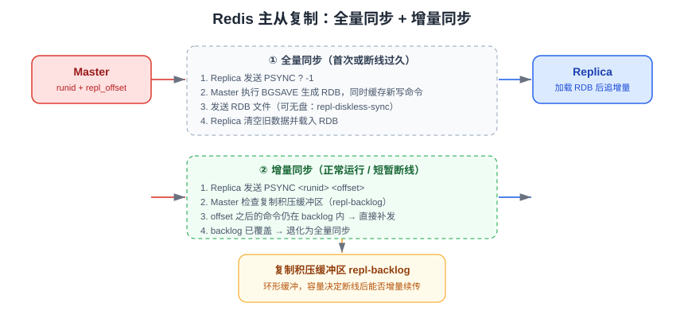

# 主从复制

主从复制（Replication）让一个 Redis 实例（**从库 / Replica**）实时复制另一个实例（**主库 / Master**）的数据。它是读写分离、数据热备、哨兵与 Cluster 高可用的**地基**：没有复制，就谈不上自动故障转移。

::: tip 一句话理解
复制解决的是「数据在多个实例上保持一致」，而持久化解决的是「数据在磁盘上不丢」——两者互补，**不能用复制代替持久化**（主库误删，从库也会跟着删）。
:::

## 复制能解决什么问题

| 场景 | 作用 | 说明 |
| --- | --- | --- |
| 数据冗余 | 多份副本 | 主库故障时从库仍有全量数据 |
| 读写分离 | 提升读吞吐 | 写走主库，读走从库；注意从库数据是**最终一致** |
| 故障恢复 | 快速切换 | 配合[哨兵](../Sentinel/index.md)自动提升从库为主库 |
| 离线计算 | 分担压力 | 在从库上跑 `BGSAVE`、`--bigkeys` 等重操作 |
| 滚动升级 | 平滑切换 | 先升从库，切换后再升原主库 |

## 复制原理



复制分两个阶段：**全量同步**（首次建立复制关系，或断线时间过长）与**增量同步**（正常运行中的命令传播，或短暂断线后的续传）。

### 全量同步（Full Synchronization）

1. 从库执行 `REPLICAOF <master-ip> <master-port>`，向主库发送 `PSYNC ? -1`。
2. 主库执行 `BGSAVE` 生成 RDB 快照，同时把期间的写命令写入**复制客户端缓冲区**。
3. 主库把 RDB 文件发给从库（磁盘方式：写盘再发；无盘方式：`repl-diskless-sync yes`，直接通过 socket 发送）。
4. 从库清空旧数据，载入 RDB。
5. 主库把缓冲区中积攒的写命令补发给从库，进入增量同步阶段。

### 增量同步（Partial Resynchronization）

主库维护两个关键标识：

| 标识 | 含义 |
| --- | --- |
| `replid`（runid） | 主库实例的复制 ID，重启或角色变化会改变 |
| `repl_offset` | 复制偏移量，主库每发送 N 字节命令，偏移量增加 N |

主库把所有写命令写入一个**环形缓冲区** `repl-backlog`。从库断线重连时发送 `PSYNC <replid> <offset>`：

- 若 `offset` 之后的命令仍在 backlog 中 → **增量补发**，代价极小。
- 若已被覆盖（backlog 太小或断线太久）→ 退化为**全量同步**，代价昂贵（RDB + 网络 + fork）。

::: danger 注意
1. `repl-backlog-size` 默认 **1MB**，生产环境远远不够，建议按「峰值写入带宽 × 允许的最大断线时长」估算，常见配置为 **64MB~256MB**。
2. 主库重启后 `replid` 变化，所有从库会触发**全量同步**；批量重启主库会造成复制风暴。
3. 全量同步依赖 `BGSAVE`，主库内存很大时 fork 会阻塞（毫秒到秒级），应在低峰期操作并关注 `latest_fork_usec`。
4. 从库默认 `replica-read-only yes`，向从库写入会直接报错，不要强行改成可写（会造成数据分叉）。
:::

## 快速搭建

### 命令行方式（临时生效）

```shell
# 在从库上执行，立即成为 10.0.0.1:6379 的从库
redis-cli -h 10.0.0.2 -p 6379 REPLICAOF 10.0.0.1 6379

# 取消复制关系，同时保留已有数据
redis-cli -h 10.0.0.2 -p 6379 REPLICAOF NO ONE
```

::: info 命令命名
Redis 5.0 起 `SLAVEOF` 改名为 `REPLICAOF`，旧命令仍兼容但不建议使用；配置文件同步改为 `replicaof`。
:::

### 配置文件方式（重启后仍生效）

```properties [redis.conf（从库）]
# 指定主库地址与端口
replicaof 10.0.0.1 6379

# 主库密码（主库配置了 requirepass 时必须设置）
masterauth 'your-strong-password'

# 从库只读（默认 yes，保持开启）
replica-read-only yes

# 主库宕机或复制中断时，从库继续用旧数据提供服务
replica-serve-stale-data yes

# 从库主动断开前允许的最大复制延迟（秒），0 表示关闭
replica-validity-factor 10

# 复制积压缓冲区大小
repl-backlog-size 128mb

# 复制超时时间（要大于 RDB 传输时间）
repl-timeout 60

# 无盘复制，主库直接通过网络发送 RDB，适合磁盘慢的网络好的环境
repl-diskless-sync yes

# 主库仅在有 N 个健康从库时才接受写（配合 min-replicas-max-lag）
min-replicas-to-write 1
min-replicas-max-lag 10
```

### Docker Compose 最小示例

```yaml [docker-compose.yml]
services:
  master:
    image: redis:8.10
    ports: ["6379:6379"]
    command: ["redis-server", "--requirepass", "strong-pass", "--appendonly", "yes"]
  replica:
    image: redis:8.10
    ports: ["6380:6379"]
    depends_on: [master]
    command:
      - redis-server
      - --replicaof
      - master
      - "6379"
      - --masterauth
      - strong-pass
      - --requirepass
      - strong-pass
      - --replica-read-only
      - "yes"
```

启动后验证：

```shell
docker compose up -d
redis-cli -h 127.0.0.1 -p 6379 -a 'strong-pass' INFO replication
```

期望输出（主库视角）：

```text
role:master
connected_slaves:1
slave0:ip=172.18.0.3,port=6379,state=online,offset=1262,lag=0
master_repl_offset:1262
```

## 复制拓扑

| 拓扑 | 结构 | 优点 | 缺点 |
| --- | --- | --- | --- |
| 一主一从 | M → R | 简单，成本最低 | 无自动故障转移 |
| 一主多从 | M → R1/R2/R3 | 读扩展好，副本多 | 主库复制压力大，全量同步易风暴 |
| 级联复制 | M → R1 → R1-1 | 降低主库压力 | 层级越深，末端延迟越大 |
| 主从 + 哨兵 | M/R + Sentinel ×3 | 自动故障转移 | 需要额外部署哨兵节点 |

::: tip
一主多从场景下，从库数量建议控制在 **2~3 个**；读压力更大时应改用 [Cluster](../Cluster/index.md) 分片，而不是无限加从库。
:::

## 数据一致性与 WAIT

复制是**异步**的：主库写入成功即返回，不等待从库确认，因此存在复制延迟（秒级以内通常可接受）。

Redis 提供 `WAIT` 命令做同步等待：

```shell
# 等待至少 1 个从库确认接收，最多等 1000 毫秒；返回已确认的从库数量
SET order:1001 paid
WAIT 1 1000
# (integer) 1
```

| 命令/配置 | 作用 | 代价 |
| --- | --- | --- |
| `WAIT <num> <timeout>` | 阻塞等待 N 个从库确认写命令 | 吞吐下降，超时不保证 |
| `min-replicas-to-write` | 健康从库不足时主库拒绝写入 | 主库可能短期不可写 |
| `min-replicas-max-lag` | 判定从库「健康」的最大延迟秒数 | 配置过严会频繁拒绝写 |

::: warning
`WAIT` 只保证从库**收到**命令，不保证已**执行完成**；它提高的是「不丢数据」的概率，不是强一致。需要强一致请用 [Cluster](../Cluster/index.md) 的同步复制方案或改用关系型数据库。
:::

## 复制延迟与故障排查

### 观察指标

```shell
redis-cli INFO replication
```

主库关注的字段：

| 字段 | 含义 |
| --- | --- |
| `connected_slaves` | 已连接从库数，突然减少说明断连 |
| `master_repl_offset` | 主库复制偏移量 |
| `slaveN:offset` | 各从库已同步的偏移量，与主库差值即**延迟字节数** |
| `slaveN:lag` | 从库上次心跳距现在的秒数，正常为 0 或 1 |
| `repl_backlog_active` | 积压缓冲区是否启用 |
| `master_replid` | 主库 replid，变化说明主库重启或切主 |

从库关注：`role:slave`、`master_link_status:up`（`down` 表示复制中断）、`master_last_io_seconds_ago`。

```shell
# 只关心复制相关指标
redis-cli INFO replication | grep -E "role|master_link_status|master_repl_offset|slave0|lag"
```

### 常见问题与处理

| 现象 | 原因 | 处理 |
| --- | --- | --- |
| 频繁全量同步 | backlog 太小 / `repl-timeout` 过小 / 主库重启 | 调大 `repl-backlog-size`、`repl-timeout`，避免重启主库 |
| `master_link_status:down` | 网络抖动、主库密码错误、超时 | 检查网络与 `masterauth`，`INFO replication` 看 `master_last_io_seconds_ago` |
| 从库数据明显落后 | 主库写入过高 / 从库机器慢 / 大 key 阻塞 | 拆分大 key、升级从库配置、减少从库数量 |
| 全量同步时主库卡顿 | fork 耗时、RDB 落盘 IO 争抢 | 开启 `repl-diskless-sync`、错峰、关闭 THP |
| 主库写入被拒 | 触发 `min-replicas-to-write` | 恢复从库，或临时调低该阈值（谨慎） |

::: danger 注意
1. 从库执行 `FLUSHALL`、`KEYS` 等命令不会影响主库，但**在主库执行会同步到所有从库**，生产务必禁用高危命令。
2. 从库重启会触发一次全量同步（因为本地 `replid` 对应的主库数据可能已变化），不要频繁重启从库。
3. 主库内存使用建议控制在 **50%~70%**，为 `BGSAVE` 的 fork 与复制缓冲区留余量。
:::

## 常用命令清单

| 命令 | 作用 |
| --- | --- |
| `REPLICAOF host port` | 建立复制关系 |
| `REPLICAOF NO ONE` | 取消复制，提升为主库 |
| `INFO replication` | 查看复制状态 |
| `INFO stats` | 查看 `sync_full`、`sync_partial_ok`、`sync_partial_err` 计数 |
| `WAIT numreplicas timeout` | 同步等待从库确认 |
| `ROLE` | 返回当前角色与主/从信息 |
| `DEBUG SLEEP 30`（仅测试） | 模拟阻塞，用于故障演练 |

## 验证方式

```shell
# 1. 主库写入
redis-cli -h 127.0.0.1 -p 6379 -a 'strong-pass' SET repl:test "hello"

# 2. 从库立即读取（应返回 hello）
redis-cli -h 127.0.0.1 -p 6380 -a 'strong-pass' GET repl:test

# 3. 确认从库只读（应报错 READONLY）
redis-cli -h 127.0.0.1 -p 6380 -a 'strong-pass' SET repl:test "oops"

# 4. 查看复制偏移量是否一致
redis-cli -p 6379 -a 'strong-pass' INFO replication | grep master_repl_offset
redis-cli -p 6380 -a 'strong-pass' INFO replication | grep -E "slave_repl_offset|master_link_status"
```

预期结果：从库能读到 `hello`；写入被 `READONLY` 拒绝；`master_link_status:up`，主从 offset 差值为 0 或很小。

## 参考资料

- 官方文档 · 复制：https://redis.io/docs/latest/operate/oss_and_stack/management/replication/
- `REPLICAOF` 命令：https://redis.io/docs/latest/commands/replicaof/
- `WAIT` 命令：https://redis.io/docs/latest/commands/wait/
