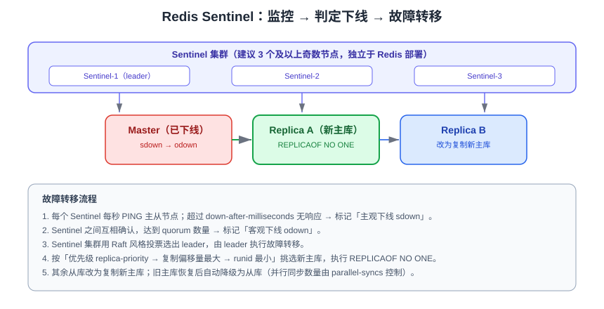

# 哨兵高可用

Sentinel（哨兵）是 Redis 官方提供的**高可用方案**：它不存数据，只负责监控主从实例、在主库不可用时自动完成故障转移，并把新的主库地址通知给客户端。解决了[主从复制](../Replication/index.md)「主库挂了要人工切」的问题。

::: tip 一句话理解
复制解决数据副本，哨兵解决**自动切换**；哨兵是「监控 + 选举 + 通知」的守护进程，本身也要做成集群（3 个起步）。
:::

## 哨兵的职责

| 职责 | 说明 |
| --- | --- |
| 监控（Monitoring） | 持续 PING 主库、从库和其他哨兵，判断实例是否存活 |
| 通知（Notification） | 通过发布订阅或脚本把故障事件告知运维系统 |
| 自动故障转移（Automatic failover） | 主库客观下线后，选出新主库并改写复制关系 |
| 配置提供（Configuration provider） | 客户端连接哨兵询问「当前主库是谁」，获取最新地址 |

## 故障判定与切换流程



### 两种「下线」

| 概念 | 全称 | 判定者 | 含义 |
| --- | --- | --- | --- |
| **sdown** | Subjective Down | 单个哨兵 | 该哨兵在 `down-after-milliseconds` 内没收到有效响应 |
| **odown** | Objective Down | 哨兵集群 | 达到 `quorum` 个哨兵都认为 sdown，才真正判定主库不可用 |

### 选主规则

leader 哨兵按以下顺序挑选新主库：

1. 过滤掉已下线、断连、长时间未响应 `INFO` 的从库。
2. 取 `replica-priority` **最小**的（配置为 `0` 的从库永不参选）。
3. 优先级相同取**复制偏移量最大**的（数据最新）。
4. 仍相同取 **runid 最小**的（保证结果唯一）。

### 关键参数

| 参数 | 作用 | 建议值 |
| --- | --- | --- |
| `sentinel monitor <name> <ip> <port> <quorum>` | 监控的主库与法定人数 | quorum 取「哨兵数 / 2 + 1」，3 节点取 2 |
| `down-after-milliseconds` | 多久无响应判定 sdown | 5000~30000 ms，太小易误切 |
| `parallel-syncs` | 故障转移后同时向新主库同步的从库数 | 1（避免新主库压力过大） |
| `failover-timeout` | 故障转移各阶段的超时上限 | 180000 ms（默认 3 分钟） |
| `sentinel announce-ip` / `announce-port` | 容器/NAT 环境对外宣告地址 | 容器部署必须显式配置 |
| `notification-script` / `client-reconfig-script` | 事件回调脚本 | 用于对接告警与 VIP 切换 |

::: danger 注意
1. 哨兵**必须部署奇数个且 ≥3**（2 个无法形成多数派），并分布在不同机器/可用区。
2. `quorum` 只用于**判定 odown**；真正执行故障转移需要多数哨兵**投票选出 leader**，所以 3 节点配 2、5 节点配 3。
3. 容器化部署不配置 `announce-ip`/`announce-port`，哨兵会宣告容器内网地址，客户端连不上——这是容器环境最常见的坑。
4. 哨兵不解决**脑裂期间的数据丢失**：旧主库在切换瞬间收到的写会丢失，用 `min-replicas-to-write` + `min-replicas-max-lag` 限制写入窗口。
:::

## 部署实操

### 1. 准备拓扑

| 角色 | 地址 | 端口 |
| --- | --- | --- |
| master | 10.0.0.1 | 6379 |
| replica-1 | 10.0.0.2 | 6379 |
| replica-2 | 10.0.0.3 | 6379 |
| sentinel-1/2/3 | 10.0.0.1/2/3 | 26379 |

### 2. 主从配置

主库与从库的 `redis.conf` 参考[主从复制](../Replication/index.md)，从库加一句：

```properties [redis.conf（从库）]
replicaof 10.0.0.1 6379
replica-priority 100        # 值越小越优先被选为新主库
```

### 3. 哨兵配置

```properties [sentinel.conf]
port 26379
daemonize yes
logfile "/var/log/redis/sentinel.log"
dir "/var/lib/redis"

# 监控名为 mymaster 的主库，2 个哨兵认为下线才判定 odown
sentinel monitor mymaster 10.0.0.1 6379 2
sentinel auth-pass mymaster 'your-strong-password'
sentinel down-after-milliseconds mymaster 10000
sentinel parallel-syncs mymaster 1
sentinel failover-timeout mymaster 180000

# 容器 / NAT 环境必须宣告对外可达的地址
sentinel announce-ip 10.0.0.1
sentinel announce-port 26379
```

::: warning
哨兵配置文件会被**运行时重写**（记录发现的从库、新主库等状态）。不要把哨兵配置写进 `redis.conf`，也不要用 `CONFIG REWRITE` 覆盖；重启前确认配置文件可写。
:::

### 4. 启动与验证

```shell
# 启动三个哨兵（配置文件相同，各自维护自己的状态）
redis-sentinel /etc/redis/sentinel.conf

# 查看被监控的主库
redis-cli -p 26379 SENTINEL masters

# 查看从库列表
redis-cli -p 26379 SENTINEL replicas mymaster

# 查看其他哨兵
redis-cli -p 26379 SENTINEL sentinels mymaster

# 询问当前主库地址
redis-cli -p 26379 SENTINEL get-master-addr-by-name mymaster
```

`get-master-addr-by-name` 期望输出：

```text
1) "10.0.0.1"
2) "6379"
```

### 5. Docker Compose 一主二从三哨兵

```yaml [docker-compose.yml]
services:
  master:
    image: redis:8.10
    command: ["redis-server", "--requirepass", "strong-pass", "--appendonly", "yes"]
  replica1:
    image: redis:8.10
    depends_on: [master]
    command: ["sh", "-c", "redis-server --requirepass strong-pass --replicaof master 6379 --masterauth strong-pass"]
  replica2:
    image: redis:8.10
    depends_on: [master]
    command: ["sh", "-c", "redis-server --requirepass strong-pass --replicaof master 6379 --masterauth strong-pass"]
  sentinel1:
    image: redis:8.10
    depends_on: [master, replica1, replica2]
    command: >
      sh -c "echo 'sentinel monitor mymaster master 6379 2' > /etc/sentinel.conf &&
             echo 'sentinel auth-pass mymaster strong-pass' >> /etc/sentinel.conf &&
             echo 'sentinel down-after-milliseconds mymaster 10000' >> /etc/sentinel.conf &&
             redis-sentinel /etc/sentinel.conf"
  sentinel2:
    image: redis:8.10
    depends_on: [sentinel1]
    command: >
      sh -c "echo 'sentinel monitor mymaster master 6379 2' > /etc/sentinel.conf &&
             echo 'sentinel auth-pass mymaster strong-pass' >> /etc/sentinel.conf &&
             redis-sentinel /etc/sentinel.conf"
  sentinel3:
    image: redis:8.10
    depends_on: [sentinel1]
    command: >
      sh -c "echo 'sentinel monitor mymaster master 6379 2' > /etc/sentinel.conf &&
             echo 'sentinel auth-pass mymaster strong-pass' >> /etc/sentinel.conf &&
             redis-sentinel /etc/sentinel.conf"
```

::: info
上面的 compose 用 `sentinel resolve-hostnames` 之外的默认行为，容器网络中哨兵通过服务名 `master` 解析主库；生产环境请改成真实 IP 并配置 `announce-ip`。
:::

## 客户端接入

应用**不直接连 Redis 主库**，而是连哨兵集群，由客户端库完成主库发现与故障重连。

```java [application.yml（Spring Boot + Lettuce）]
spring:
  data:
    redis:
      sentinel:
        master: mymaster
        nodes:
          - 10.0.0.1:26379
          - 10.0.0.2:26379
          - 10.0.0.3:26379
      password: strong-pass
      lettuce:
        pool:
          max-active: 16
          max-idle: 8
          min-idle: 2
```

```java [原生 Jedis 示例]
Set<String> sentinels = Set.of("10.0.0.1:26379", "10.0.0.2:26379", "10.0.0.3:26379");
try (JedisSentinelPool pool = new JedisSentinelPool("mymaster", sentinels, "strong-pass")) {
    try (Jedis jedis = pool.getResource()) {
        jedis.set("ha:test", "ok");
        System.out.println(jedis.get("ha:test"));
    }
}
```

| 客户端 | 哨兵支持 | 说明 |
| --- | --- | --- |
| Lettuce（Java 默认） | 支持，含拓扑刷新 | 建议开启 `topology-refresh`（自适应刷新） |
| Jedis | 支持 `JedisSentinelPool` | 每次操作从池取连接，自动跟随新主库 |
| redis-py | `Sentinel()` 对象 | `Sentinel(...).master_for('mymaster')` |
| Go-redis | `NewFailoverClient` | 内置哨兵故障转移 |

::: tip
哨兵只解决「主库地址变化」的发现，**不代理请求**。客户端必须支持哨兵协议，否则切换后仍会连到旧主库。
:::

## 故障演练

```shell
# 1. 观察当前主库
redis-cli -p 26379 SENTINEL get-master-addr-by-name mymaster

# 2. 手动触发一次故障转移（等价主库宕机）
redis-cli -p 26379 SENTINEL failover mymaster

# 3. 等待 5~10 秒后再次查询，地址应已变化
redis-cli -p 26379 SENTINEL get-master-addr-by-name mymaster

# 4. 查看事件日志
redis-cli -p 26379 SENTINEL ckquorum mymaster     # 检查法定人数是否足够
tail -f /var/log/redis/sentinel.log               # 关注 +switch-master 事件
```

日志中应出现：

```text
+switch-master mymaster 10.0.0.1 6379 10.0.0.2 6379
```

::: danger 注意
1. 演练前确认业务有重试机制：切换期间会有**秒级不可写**窗口，客户端会收到 `READONLY` 或连接错误。
2. 不要只测「kill 主库」，也要测「网络分区」（`iptables` 丢包），后者更容易暴露脑裂问题。
3. 切换后旧主库会以从库身份重新加入并做**全量同步**，确认主库内存与磁盘余量。
:::

## 哨兵 vs Cluster

| 维度 | Sentinel 方案 | [Cluster 方案](../Cluster/index.md) |
| --- | --- | --- |
| 数据规模 | 单主库内存上限（通常 ≤ 单机内存 50%~70%） | 分片，可水平扩展 |
| 高可用粒度 | 整体切换 | 按分片切换 |
| 客户端改造 | 支持哨兵协议的客户端即可 | 需要支持 Cluster 的客户端 |
| 多 key 操作 | 无限制 | 必须同槽（用 hash tag） |
| 适用场景 | 中小规模、读多写少 | 大数据量、高并发 |

## 常用命令清单

| 命令 | 作用 |
| --- | --- |
| `SENTINEL masters` | 列出所有被监控的主库 |
| `SENTINEL master <name>` | 查看某个主库的详细信息 |
| `SENTINEL replicas <name>` | 查看从库列表 |
| `SENTINEL sentinels <name>` | 查看其他哨兵 |
| `SENTINEL get-master-addr-by-name <name>` | 获取当前主库地址 |
| `SENTINEL failover <name>` | 手动触发故障转移 |
| `SENTINEL ckquorum <name>` | 检查法定人数是否可达 |
| `SENTINEL set <name> <option> <value>` | 运行时修改哨兵参数 |
| `SENTINEL reset <pattern>` | 重置哨兵状态（清理发现的从库信息） |

## 验证方式

```shell
# 三哨兵法定人数检查，应返回 OK
redis-cli -p 26379 SENTINEL ckquorum mymaster

# 查看主库信息与哨兵数量
redis-cli -p 26379 SENTINEL master mymaster | grep -E "name|ip|port|flags|num-slaves|num-other-sentinels|quorum"

# 业务侧功能验证：写入后立即读取
redis-cli -p 6379 -a 'strong-pass' SET ha:verify "$(date +%s)"
redis-cli -p 6379 -a 'strong-pass' GET ha:verify
```

预期：`ckquorum` 返回 `OK`；`num-other-sentinels` 为 `2`；`num-slaves` 为 `2`；读写正常。

## 参考资料

- 官方文档 · Sentinel：https://redis.io/docs/latest/operate/oss_and_stack/management/sentinel/
- Sentinel 命令参考：https://redis.io/docs/latest/commands/?group=sentinel
