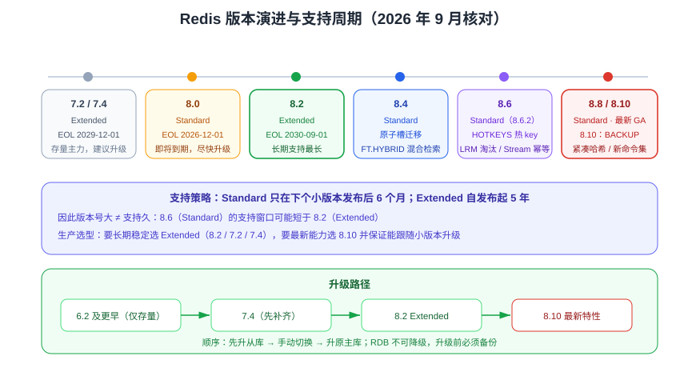

# 版本演进与升级迁移

Redis 的版本节奏很快：**每个季度一个小版本**。搞清楚「哪个版本还在支持期、升级要跨哪些坑」，比记住新命令列表重要得多。



::: tip 一句话理解
选型只看两条线：**新项目用最新 GA（当前 Redis 8.10）**；**存量项目看 EOL**——Extended 版本（7.2 / 7.4 / 8.2）有 5 年支持，Standard 版本（8.0 / 8.4 / 8.6 / 8.8 / 8.10）只在下个小版本发布后 6 个月。
:::

## 版本号与支持策略

```text
MAJOR.MINOR.PATCH
  8   . 6   . 2
  │     │     └─ 补丁：缺陷与安全修复
  │     └─────── 次版本：新特性（8.0 → 8.2 → 8.4 → 8.6 → 8.8 → 8.10）
  └───────────── 主版本：可能含破坏性变更（7 → 8）
```

| 支持类型 | 判定规则 | 支持周期 |
| --- | --- | --- |
| **Standard**（标准） | 主版本系列的第一个版本，以及中间的次版本（如 8.0、8.4、8.6、8.8、8.10） | 下一个小版本发布后再提供 **6 个月**的安全与严重缺陷修复 |
| **Extended**（扩展） | 主版本系列中的第二个次版本，以及该系列的最后一个次版本（如 8.2、7.2、7.4） | 自发布日起 **5 年** |

::: info 关键推论
想看一个版本能不能长期用，**不要只看版本号大小**：8.6（Standard）的支持期可能短于 8.2（Extended）。生产选型优先挑 Extended 版本，或用自动化手段保证能跟随小版本升级。
:::

## 官方版本状态（2026 年 9 月核对）

| 版本 | 支持类型 | 状态 | EOL | 建议 |
| --- | --- | --- | --- | --- |
| Redis 8.10 | Standard | GA | 待公布 | **新项目首选**，功能最全 |
| Redis 8.8 | Standard | GA | 待公布 | 新增 Array 数据结构、`INCREX` 限流命令 |
| Redis 8.6 | Standard | GA（最新补丁 8.6.2） | 待公布 | 热 key 检测、LRM 淘汰策略、Stream 幂等 |
| Redis 8.4 | Standard | GA | 待公布 | 原子槽迁移、`FT.HYBRID` 混合检索 |
| Redis 8.2 | Extended | GA | **2030-09-01** | 长期支持窗口最长，稳妥之选 |
| Redis 8.0 | Standard | GA | **2026-12-01** | 即将到期，规划升级到 8.2+ |
| Redis 7.4 | Extended | GA | **2029-12-01** | 存量集群常用，可平滑升级到 8.x |
| Redis 7.2 | Extended | GA | **2029-12-01** | 仅存量项目使用（缺少 7.4 的若干改进） |
| Redis 6.2 | Extended | GA | **2027-04-01** | 仅存量项目使用，建议排期升级 |
| Redis 6.x 及更早 | — | 已停止维护 | 已过期 | **仅存量项目使用**，安全风险高，尽快升级 |

::: danger 注意
1. 上表中的 EOL 以官方公开页面为准，升级排期前请重新核对：https://redis.io/docs/latest/operate/oss_and_stack/install/version-mgmt
2. **8.0 的 EOL 为 2026-12-01**，还在跑 8.0 的集群应在年内升级到 8.2（Extended）或 8.10。
3. Redis 8 的许可是 **RSALv2 / SSPLv1 / AGPLv3** 三选一；从 7.x（BSD）升级到 8.x 前，务必确认许可模式对业务无影响（尤其是提供托管服务的场景）。
:::

## 8.x 各版本重点能力

### Redis 8.0（2025 年 5 月 GA）

- 性能大幅提升（I/O 多线程与内核优化），官方给出的吞吐提升显著。
- 引入**向量集合（vector set）**等新数据结构，并**内置**搜索、JSON、时序、Bloom 等能力（不再必须用 Redis Stack）。
- 许可变更为 RSALv2 / SSPLv1 / AGPLv3。

### Redis 8.2（Extended）

- 面向长期支持的稳定版本，生产环境用 8.2 LTS 心态选择它最省心。
- 持续的性能与稳定性修复。

### Redis 8.4

- **原子槽迁移（atomic slot migration）**：集群扩缩容时数据搬迁更平滑，减少对业务的影响。
- 搜索增强：`FT.HYBRID` 混合检索（向量 + 关键词）。
- 新增原生 compare-and-set 语义、多 key TTL 操作（`MSETEX`）等原语。

### Redis 8.6（2026 年 2 月 GA）

- **热 key 检测**：新增 `HOTKEYS` 命令，可直接定位热点 key。
- **新淘汰策略**：`volatile-lrm`、`allkeys-lrm`（least recently modified，按最近修改时间淘汰）。
- **Stream 幂等**：`XADD` 支持 `IDMP`、`IDMPAUTO` 参数，提供至多一次投递语义。
- 哈希与有序集合内存占用大幅降低；TLS 支持基于证书的自动客户端认证；时序支持 `NaN`。

### Redis 8.8（2026 年 Q2 GA）

- 新增 **Array** 数据结构。
- 新增 `INCREX` 限流命令（更适合实现精确速率限制）。
- `FT.AGGREGATE` 支持组内排序 reducer；HyperLogLog 与 `MGET`/`MSET`/`HGETALL` 性能优化。

### Redis 8.10（2026 年 Q3 GA，当前最新）

- **紧凑哈希（compact hash）**：相同结构的 Hash 只存一份字段名，配合新命令 `HIMPORT` 支持高吞吐批量导入。
- **`BACKUP` 命令**：基于多部分 AOF（MP-AOF）的节点级备份与恢复。
- 新命令：`LMOVEM`/`BLMOVEM`（批量移动列表元素）、`SUNIONCARD`/`SDIFFCARD`（不物化结果的集合基数）、`FT.ALIASLIST`、时序 `TS.NRANGE`/`TS.NREVRANGE`/`TS.READ`/`TS.QUERYLABELS`。
- `XREAD`/`XREADGROUP` 新增 `MAXCOUNT`、`MAXSIZE` 限制累计回复大小。
- 新增 `SCRIPT_RUNNER` 命令标志（用于识别执行脚本/函数的命令）；`SLOWLOG GET` 返回总参数个数；搜索的超时策略新增 `RETURN_STRICT`。

::: warning 升级到 8.10 的已知限制
官方 8.6 版本的说明中指出：当同时使用 `appendonly yes` 与 `aof-use-rdb-preamble no`（非默认组合）时，应避免对 Stream 使用 `XADD` 的 `IDMP`/`IDMPAUTO` 选项。升级前请核对该版本最新补丁说明。
:::

## 从 7.x 升级到 8.x

### 升级前的兼容性检查

| 检查项 | 说明 |
| --- | --- |
| 许可 | Redis 8 为 RSALv2 / SSPLv1 / AGPLv3，确认业务与合规允许 |
| 客户端版本 | Lettuce / Jedis / redis-py / go-redis 需支持 8.x；新旧混用时先升客户端 |
| RDB 兼容性 | 低版本**无法**读取高版本生成的 RDB；升级不可回退，务必先备份 |
| 模块依赖 | 原来单独加载的 RedisBloom / RediSearch 等在 8.x 已内置，注意模块版本与加载方式变更 |
| 命令与配置 | 检查已废弃配置项与新默认值；核对 `redis.conf` 与托管平台的参数白名单 |
| 监控与告警 | Prometheus exporter、慢查询采集脚本是否兼容新指标 |
| 混合持久化 | 使用 MP-AOF 后目录结构与文件数量变化，备份脚本需同步调整 |

### 升级路径建议

```text
7.2 / 7.4  ──► 8.2（Extended，长期支持）──► 8.10（最新特性）
                │
                └─► 或直接 8.10（接受 6 个月支持窗口 + 跟随小版本升级）
6.2 及更早 ──► 先升到 7.4，再升 8.x（避免跨度过大）
```

::: danger 注意
1. **不要跨主版本直接裸升**：6.x → 8.x 建议经 7.4 过渡，便于分批验证配置与命令兼容性。
2. **RDB 不可降级**：新版本写出的 RDB 旧版本读不了，回滚只能靠升级前的备份 + 停机。
3. 升级顺序应为「**先升从库 → 手动切换主库 → 再升原主库**」，全程保留双版本共存窗口。
:::

### 滚动升级操作（主从 + 哨兵）

```shell
# 1. 备份（同时在主库做一次 RDB 与 AOF 备份）
redis-cli -p 6379 BGSAVE
redis-cli -p 6379 CONFIG GET dir

# 2. 升级一个从库并重启，观察复制状态
#    （在从库机器上替换二进制或镜像版本后重启）
redis-cli -p 6380 INFO replication | grep -E "master_link_status|slave_repl_offset"

# 3. 依次升级所有从库，确认全部 online 且 offset 跟得上
redis-cli -p 6379 INFO replication

# 4. 手动触发切换，让升级后的从库成为主库
redis-cli -p 26379 SENTINEL failover mymaster

# 5. 升级原主库（此时它是从库），完成后观察一致性
redis-cli -p 26379 SENTINEL get-master-addr-by-name mymaster
```

### Cluster 滚动升级

逐个节点升级：**先升所有从节点 → 再升主节点**。升级主节点前先用 `CLUSTER FAILOVER` 把主库角色切到已升级的从节点，避免该分片在升级期间不可写。

```shell
# 在待升级主节点的从节点上执行，触发安全切换
redis-cli -c -p 7004 CLUSTER FAILOVER

# 确认该节点已成为 slave 后再停止并升级
redis-cli -c -p 7001 CLUSTER NODES | grep 7004
```

## 版本状态在文档中的标注约定

本仓库统一采用三种状态标注（与 Spring、Vue 的版本目录策略一致）：

| 标注 | 含义 | 文档处理方式 |
| --- | --- | --- |
| 主线 | 当前推荐版本（Redis 8.10 / 8.2） | 正文以它为准，新特性直接写 |
| 维护中 | 仍在支持期（7.2 / 7.4 / 8.0） | 正文说明差异，保留内容 |
| 仅存量项目使用 | 已停更或即将到期（6.2 及更早、8.0 待升级） | 保留原文，在页面顶部用 `:::info` 标注状态，不覆盖旧内容 |

::: tip
Redis 目前**不需要**按「大版本目录」拆分文档（如 `Redis7/`、`Redis8/`）：7.x 与 8.x 的命令与配置高度兼容，差异集中在本页说明即可。若未来出现破坏性变更较大的主版本，再按 `AGENTS.md` 第 3 节的大版本规则建目录。
:::

## 验证方式

```shell
# 1. 确认当前版本与补丁号
redis-cli -p 6379 INFO server | grep -E "redis_version|redis_git_sha1|redis_mode"

# 2. 确认持久化与复制状态正常
redis-cli -p 6379 INFO persistence | grep -E "rdb_last_bgsave_status|aof_last_write_status|aof_rewrite_in_progress"
redis-cli -p 6379 INFO replication | grep -E "role|master_link_status"

# 3. 集群健康（如使用 Cluster）
redis-cli --cluster check 10.0.0.1:7001

# 4. 新特性可用性抽查（示例：8.6 的 LRM 淘汰策略、8.10 的 BACKUP）
redis-cli -p 6379 CONFIG GET maxmemory-policy
redis-cli -p 6379 BGSAVE
```

预期：`redis_version` 为目标版本；`rdb_last_bgsave_status:ok`、`aof_last_write_status:ok`；主从 `master_link_status:up`；集群 `cluster_state:ok`。

## 参考资料

- 官方文档 · 版本管理：https://redis.io/docs/latest/operate/oss_and_stack/install/version-mgmt
- Redis 8.10 版本说明：https://redis.io/docs/latest/operate/oss_and_stack/stack-with-enterprise/release-notes/redisce/redisos-8.10-release-notes
- Redis 8.6 版本说明：https://redis.io/docs/latest/operate/oss_and_stack/stack-with-enterprise/release-notes/redisce/redisos-8.6-release-notes
- 官方 What's new：https://redis.io/docs/latest/develop/whats-new
