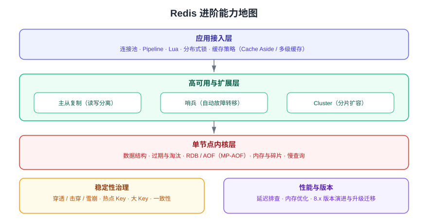

# Redis 进阶

Redis 进阶专题在[基础专题](../index.md)（安装、命令、五大数据结构、过期淘汰、持久化）之上，解决三件更工程化的事：**数据不丢**（复制与持久化配合）、**服务不停**（哨兵与 Cluster 的高可用）、**扛得住**（缓存设计、防护、性能调优）。适合已经会用 Redis 命令、需要把它放进生产环境的开发/运维同学。

## 基础专题与进阶专题的分工

| 维度 | 基础专题 | 进阶专题（本专题） |
| --- | --- | --- |
| 关注点 | 单个 Redis 进程怎么用 | 一组 Redis 实例怎么稳定跑 |
| 典型问题 | 这个命令怎么用、key 怎么过期 | 主库挂了怎么办、缓存怎么保证一致性、延迟为什么抖 |
| 关键能力 | 数据结构、命令、TTL、RDB/AOF | 复制、哨兵、Cluster、缓存设计、锁、性能、版本升级 |
| 验证方式 | `redis-cli` 敲命令看结果 | 故障演练、压测、监控指标 |

::: warning 阅读顺序建议
先按顺序读完基础专题（至少掌握[过期与淘汰](../ExpireEvict/index.md)与[持久化](../Persistence/index.md)），再进入本专题；其中[缓存设计](CacheDesign/index.md)和[缓存防护](CacheProtection/index.md)是面试与生产最高频的两页。
:::

## Redis 进阶能力地图

从下往上分四层：**单节点内核层**（数据结构、过期淘汰、持久化）→ **高可用与扩展层**（复制、哨兵、Cluster）→ **应用接入层**（连接池、Pipeline、Lua、锁、缓存策略）；两侧由**稳定性治理**与**性能与版本**贯穿。

## 章节导航

| 章节 | 内容 | 什么时候看 |
| --- | --- | --- |
| [主从复制](Replication/index.md) | 全量/增量同步原理、复制拓扑、延迟与故障处理 | 需要读写分离或数据热备 |
| [哨兵高可用](Sentinel/index.md) | 主观/客观下线、选举、故障转移、客户端接入 | 需要主库故障自动切换 |
| [Cluster 分片集群](Cluster/index.md) | 哈希槽、重定向、扩缩容、使用限制 | 单机容量或并发扛不住 |
| [缓存设计](CacheDesign/index.md) | 读写策略、一致性、key/TTL 设计、容量规划 | 设计任何缓存功能之前 |
| [缓存防护](CacheProtection/index.md) | 穿透/击穿/雪崩、热点 key、布隆过滤器 | 缓存上线前必须过一遍 |
| [分布式锁与 Lua](DistributedLock/index.md) | `SET NX EX`、Lua 释放、Redlock、Redisson | 需要跨进程互斥 |
| [性能调优](Performance/index.md) | 慢查询、大 key、热 key、延迟排查、内存优化 | 出现延迟抖动或内存告警 |
| [版本演进与升级迁移](VersionMigration/index.md) | 8.x 版本状态、升级路径、兼容性检查 | 规划升级或选型时 |
| [实战：高可用缓存集群](Practice/index.md) | 主从 + 哨兵搭建、应用接入、压测、故障演练 | 想一次跑通完整链路 |
| [常见问题与最佳实践](FAQ/index.md) | 进阶阶段高频问题速查 | 排障时 |

## 版本现状（2026 年 9 月核对）

Redis 采用 `MAJOR.MINOR.PATCH` 版本结构，官方文档将每个版本分为 **Standard**（标准支持）与 **Extended**（扩展支持）两类：

| 版本 | 支持类型 | 状态 | EOL |
| --- | --- | --- | --- |
| Redis 8.10 | Standard | GA（2026 年 Q3） | 待官方公布 |
| Redis 8.8 | Standard | GA（2026 年 Q2） | 待官方公布 |
| Redis 8.6 | Standard | GA（2026 年 2 月，最新补丁 8.6.2） | 待官方公布 |
| Redis 8.4 | Standard | GA | 待官方公布 |
| Redis 8.2 | Extended | GA | 2030-09-01 |
| Redis 8.0 | Standard | GA | 2026-12-01 |
| Redis 7.4 | Extended | GA | 2029-12-01 |
| Redis 7.2 | Extended | GA | 2029-12-01 |
| Redis 6.2 | Extended | GA | 2027-04-01 |

::: info 版本口径
Standard 版本在**下一个小版本发布后再提供 6 个月**的安全与严重缺陷修复；Extended 版本自发布日起提供 **5 年**支持。新项目建议直接用 **Redis 8.10**；存量 7.x 集群建议至少升到 7.4（Extended）。详见[版本演进与升级迁移](VersionMigration/index.md)。
:::

Redis 8 的开源许可为三选一：**RSALv2 / SSPLv1 / AGPLv3**，商用前请按自身业务确认许可要求。

## 学习路径

1. 先跑通[实战：高可用缓存集群](Practice/index.md)，对「主从 + 哨兵 + 应用接入」有整体体感。
2. 回头补原理：[主从复制](Replication/index.md) → [哨兵](Sentinel/index.md) → [Cluster](Cluster/index.md)。
3. 再补业务设计：[缓存设计](CacheDesign/index.md) → [缓存防护](CacheProtection/index.md) → [分布式锁与 Lua](DistributedLock/index.md)。
4. 最后做治理：[性能调优](Performance/index.md) → [版本演进与升级迁移](VersionMigration/index.md) → [常见问题](FAQ/index.md)。

## 相关链接

- [Redis 基础专题](../index.md)：命令、数据结构、过期淘汰、持久化
- [MongoDB 文档数据库](../../MongoDB/index.md)：与 Redis 的定位差异
- [Elasticsearch 专题](../../Elasticsearch/index.md)：检索场景的另一种选型
- [消息队列专题](../../../../Backend/MessageQueue/index.md)：Redis Stream 与 Kafka/RabbitMQ 的边界
- [数据库客户端](../../../../Tools/DatabaseClients/index.md)：RedisInsight 可视化排查
- Redis 官方文档：https://redis.io/docs/latest/
- Redis 版本与支持周期：https://redis.io/docs/latest/operate/oss_and_stack/install/version-mgmt
