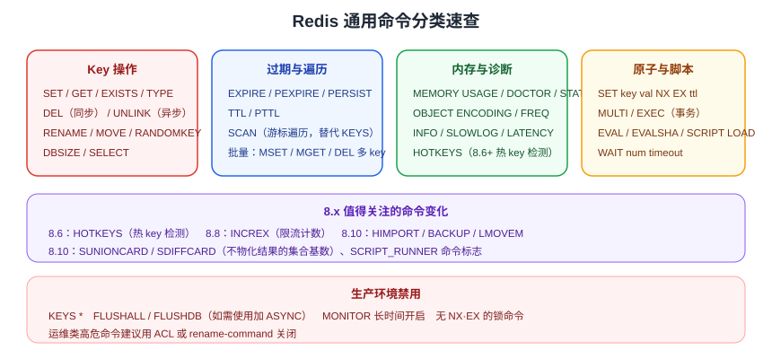

# Redis 通用命令

无论哪种数据结构，key 本身的操作命令是通用的。这一页把「日常最常用 + 排障必备」的通用命令集中列出，并标注 8.x 版本新增的能力。



::: tip 一句话理解
通用命令分四类：**Key 操作**（增删改查）、**过期与遍历**（TTL / SCAN）、**内存与诊断**（MEMORY / INFO / SLOWLOG / HOTKEYS）、**原子与脚本**（SET NX EX / 事务 / Lua）。
:::

## Key 基本操作

```shell
SET name zhangsan
GET name

EXISTS name          # 1
TYPE name            # string
DEL name             # 删除，返回删除数量
UNLINK name          # 异步删除，大 key 推荐
```

## 过期时间

```shell
SET code 123456 EX 60        # 60 秒后过期
EXPIRE name 60               # 给已有 key 设置过期
PEXPIRE name 60000           # 毫秒
TTL name                     # 剩余秒数，-1 永不过期，-2 不存在
PTTL name                    # 剩余毫秒
PERSIST name                 # 取消过期
```

::: tip
缓存场景给每个 key 设置 TTL 是基本要求，避免内存无限增长。
:::

## 查找 Key

```shell
KEYS user:*       # 全量匹配，生产禁止
SCAN 0 MATCH user:* COUNT 100
```

::: danger 注意
`KEYS` 会阻塞 Redis 遍历所有 key，**生产环境禁止使用**；必须用 `SCAN` 游标式遍历。
:::

## 其他常用命令

| 命令 | 作用 |
| --- | --- |
| `SELECT index` | 切换数据库（0~15），默认 0 |
| `DBSIZE` | 当前库 key 数量 |
| `RANDOMKEY` | 随机返回一个 key |
| `RENAME key newkey` | 重命名 |
| `MOVE key db` | 移动到其他库 |
| `FLUSHDB` | 清空当前库（危险） |
| `FLUSHALL` | 清空所有库（危险） |

```shell
DBSIZE
SELECT 1
SET name zhangsan
SELECT 0
```

## 批量与原子性说明

`MSET` / `MGET` 用于字符串批量操作；`DEL` 支持多个 key：

```shell
DEL name code token
```

::: danger 注意
1. `FLUSHDB` / `FLUSHALL` 不可恢复，生产环境执行前必须确认并备份。
2. 多个命令组合不是原子的；需要原子性时使用事务、Lua 或带语义的单命令。
:::

## 内存与编码查看命令

排查内存问题时，仅看 `DBSIZE` 远远不够，这几个命令是主力：

| 命令 | 作用 | 说明 |
| --- | --- | --- |
| `MEMORY USAGE key` | 查看单个 key 占用的字节数 | 定位大 key 的基础 |
| `MEMORY STATS` | 内存占用明细 | 了解各结构的内存分布 |
| `MEMORY DOCTOR` | 内存诊断建议 | 快速体检，会给出碎片/淘汰等提示 |
| `OBJECT ENCODING key` | 查看底层编码（`listpack`/`hashtable`/`intset`/`skiplist`） | 判断是否已超出紧凑编码阈值 |
| `OBJECT FREQ key` | LFU 访问频率 | 需 `maxmemory-policy` 为 `*-lfu` |
| `SLOWLOG GET 10` | 最近 10 条慢查询 | 只记录命令执行时间，不含网络 |
| `LATENCY LATEST` | 延迟事件（fork/aof-fsync 等） | 需先设置 `latency-monitor-threshold` |

```shell
MEMORY USAGE user:1001
OBJECT ENCODING user:1001
MEMORY DOCTOR
SLOWLOG GET 5
```

## 客户端与统计命令

```shell
INFO                       # 全量信息
INFO memory                # 只看内存相关字段
CLIENT LIST                # 当前连接列表
CLIENT NO-EVICT ON         # 当前连接的数据不参与淘汰（客户端缓存场景）
CLIENT KILL ID 1234        # 踢掉某条连接
CONFIG GET maxmemory-policy
CONFIG SET slowlog-log-slower-than 10000
DBSIZE                     # 当前库 key 数量
```

`INFO` 中排障最常看的字段：`used_memory_human`、`mem_fragmentation_ratio`、`evicted_keys`、`keyspace_hits`/`keyspace_misses`、`connected_clients`、`latest_fork_usec`。

## Redis 8.x 新增命令

| 版本 | 命令 | 作用 |
| --- | --- | --- |
| 8.6 | `HOTKEYS START / GET / STOP` | 内置热 key 检测与上报 |
| 8.6 | `XADD ... IDMP / IDMPAUTO` | Stream 写入幂等（至多一次语义） |
| 8.8 | `INCREX` | 用于精确速率限制的计数原语 |
| 8.10 | `BACKUP` | 基于多部分 AOF 的节点级备份 |
| 8.10 | `HIMPORT` | 紧凑哈希的高吞吐批量导入 |
| 8.10 | `LMOVEM` / `BLMOVEM` | 一次移动多个列表元素 |
| 8.10 | `SUNIONCARD` / `SDIFFCARD` | 不物化结果直接取集合基数 |
| 8.10 | `FT.ALIASLIST`、`TS.NRANGE` / `TS.NREVRANGE` / `TS.READ` / `TS.QUERYLABELS` | 检索与时序命令增强 |

::: info 版本核对
以上命令按 Redis 8.6 / 8.8 / 8.10 官方版本说明整理；具体参数与返回值以官方命令文档为准，详见[版本演进与升级迁移](../Advanced/VersionMigration/index.md)。
:::

## 验证方式

```shell
redis-cli
SET demo hello
EXISTS demo          # 1
EXPIRE demo 30
TTL demo             # 剩余秒数
OBJECT ENCODING demo # embstr / raw
MEMORY USAGE demo    # 字节数
DEL demo
```

逐条执行并核对返回值即可。

## 相关专题

- [过期与淘汰策略](../ExpireEvict/index.md)：TTL 与 `maxmemory-policy`
- [性能调优](../Advanced/Performance/index.md)：慢查询、大 key、热 key 的完整排查路径
- [分布式锁与 Lua](../Advanced/DistributedLock/index.md)：`SET NX EX`、`EVAL`/`EVALSHA` 的工程用法
- [版本演进与升级迁移](../Advanced/VersionMigration/index.md)：各版本新增命令与升级注意点
- 官方命令参考：https://redis.io/docs/latest/commands/
