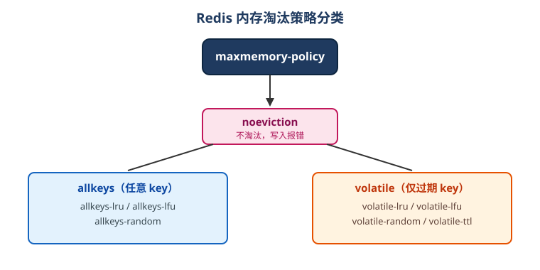

# 过期与淘汰策略

## 过期时间

给 key 设置过期时间后，到期自动删除：

```shell
SET code 123456 EX 60
EXPIRE name 30
PEXPIRE name 30000
TTL name
PERSIST name          # 取消过期
```

### 过期删除策略

Redis 采用**惰性删除 + 定期删除**组合：

- 惰性删除：访问 key 时才检查是否过期，过期则删除，节省 CPU。
- 定期删除：后台周期抽样检查并删除过期 key，避免过期 key 长期占用内存。

::: danger 注意
过期删除是**异步且抽样**的，大量 key 同时过期时，删除可能来不及，需配合淘汰策略兜底。
:::

## 内存淘汰策略

当内存达到 `maxmemory` 上限时，按 `maxmemory-policy` 决定如何处理：

```txt [redis.conf]
maxmemory 512mb
maxmemory-policy allkeys-lru
```

| 策略 | 说明 | 适用 |
| --- | --- | --- |
| `noeviction` | 不淘汰，写命令报错（默认） | 不允许丢数据的场景 |
| `allkeys-lru` | 从所有 key 中淘汰最近最少使用 | 通用缓存，推荐 |
| `allkeys-lfu` | 从所有 key 中淘汰最不常使用 | 访问频率差异大的缓存 |
| `allkeys-random` | 随机淘汰 | 冷热不明显的场景 |
| `volatile-lru` | 只在设置了过期的 key 中淘汰 LRU | 有 TTL 的缓存 |
| `volatile-lfu` | 只在设置了过期的 key 中淘汰 LFU | 有 TTL 的缓存 |
| `volatile-random` | 只在设置了过期的 key 中随机淘汰 | 有 TTL 的缓存 |
| `volatile-ttl` | 淘汰剩余 TTL 最短的 key | 优先淘汰即将过期的 |



::: tip
纯缓存场景推荐 `allkeys-lru`；既当缓存又存业务数据时用 `noeviction` 并在业务层控制。
:::

## 查看与设置

```shell
CONFIG GET maxmemory
CONFIG GET maxmemory-policy

# 运行时修改（重启失效）
CONFIG SET maxmemory-policy allkeys-lru
```

持久化到配置文件用：

```txt [redis.conf]
maxmemory-policy allkeys-lru
```

## 缓存常见问题

### 缓存穿透

查询的数据既不在缓存也不在数据库（恶意请求不存在的 key）。

解决：

1. 缓存空值并设置短 TTL。
2. 布隆过滤器先拦截不存在的 key。
3. 参数校验，拒绝非法请求。

### 缓存击穿

某个热点 key 过期瞬间，大量请求同时打到数据库。

解决：

1. 热点 key 不设置过期或设置较长 TTL。
2. 互斥锁：只有一个请求重建缓存。
3. 逻辑过期：后台异步刷新。

### 缓存雪崩

大量 key 在同一时间过期，请求全部打到数据库。

解决：

1. 过期时间加随机值，错开过期时刻。
2. 多级缓存（本地 + Redis）。
3. 限流降级，保护数据库。

::: danger 注意
1. 过期时间不要写死同一个值，生产环境必须加随机抖动。
2. `CONFIG SET` 只改运行时，重启失效，确认无误后写入 redis.conf。
:::

## 验证方式

```shell
redis-cli
CONFIG GET maxmemory-policy
SET k1 v EX 5
TTL k1
# 等待 5 秒
EXISTS k1            # 0
```

还可以用 `redis-cli --stat` 观察内存变化。
