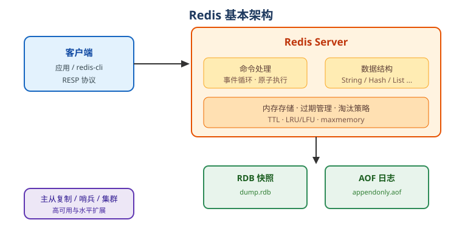

# Redis 概述

Redis（Remote Dictionary Server）是一个开源的高性能**内存键值数据库**，常被用作缓存、消息队列和轻量存储，是 Web 应用中最常用的 NoSQL 组件之一。

## Redis 是什么

- 数据存储在**内存**中，读写速度极快（单实例可达十万级 QPS）。
- 以 **key-value** 为基本模型，value 支持多种数据结构。
- 支持持久化、过期时间、发布订阅、事务、Lua 脚本等能力。
- 默认端口：`6379`。

## 核心特性

1. 数据结构丰富：String、Hash、List、Set、ZSet、Stream、Bitmap、HyperLogLog、Geo。
2. 高性能：基于内存 + 事件驱动模型，8.0 起引入多线程进一步提升吞吐。
3. 原子操作：`INCR`、`SETNX` 等命令天然原子，适合计数器和分布式锁。
4. 持久化：RDB 快照与 AOF 日志，可配置混合持久化。
5. 高可用：主从复制、哨兵（Sentinel）、集群（Cluster）。
6. TTL：每个 key 可设置过期时间，适合缓存场景。

## 版本现状（2026 年）

| 版本 | 说明 |
| --- | --- |
| Redis 7.2 / 7.4 | 存量项目常见，注意官方维护周期 |
| Redis 8.0 | 2025 年 5 月 GA，首个 8.x 大版本 |
| Redis 8.6 | 2026 年 2 月 GA |
| Redis 8.8 | 2026 年 5 月 GA，**当前最新稳定版** |

::: tip
新项目推荐直接使用 **Redis 8.x**；7.x 存量项目升级前先做兼容性测试。
:::

Redis 8 的许可为三选一：RSALv2、SSPLv1 或 AGPLv3，使用前请确认是否符合自身业务的许可要求。

## 与 Memcached 对比

| 特性 | Redis | Memcached |
| --- | --- | --- |
| 数据结构 | 丰富（字符串/哈希/列表等） | 仅字符串 |
| 持久化 | RDB / AOF | 不支持 |
| 高可用 | 主从/哨兵/集群 | 不支持（需外部方案） |
| 应用场景 | 缓存 + 消息 + 存储 | 纯缓存 |

## 应用场景

- **缓存**：热点数据、页面缓存、会话缓存。
- **排行榜**：ZSet 天然支持排序。
- **计数器**：点赞数、访问量、限流计数。
- **分布式锁**：`SETNX` + 过期时间。
- **消息队列**：List 或 Stream。
- **布隆过滤器**：防止缓存穿透。

## Redis 基本架构

客户端通过 Redis 协议（RESP）连接服务端；服务端在内存中维护数据结构，并按配置把数据持久化到磁盘，同时支持主从复制。

## 学习路径

1. 安装与配置
2. 通用命令与五种常用数据结构
3. 过期与淘汰策略
4. 持久化 RDB / AOF
5. 发布订阅、事务与 Lua
6. 主从、哨兵、集群与实战

## 相关链接

- Redis 官方文档：https://redis.io/docs/
- Redis 命令参考：https://redis.io/docs/latest/commands/
- Docker 镜像：https://hub.docker.com/_/redis
