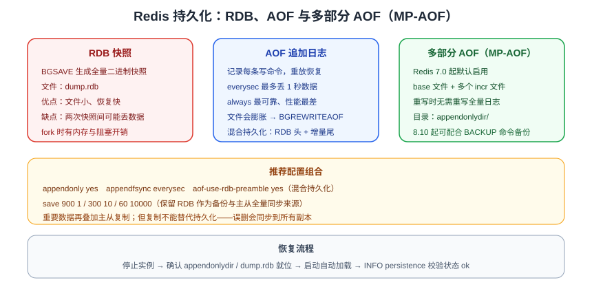

# Redis 持久化 RDB / AOF

Redis 数据默认在内存中，重启会丢失；持久化用于把数据保存到磁盘，重启后恢复。



::: info 适用范围
本页侧重「单实例持久化配置与恢复」。生产环境还需要叠加复制与高可用，见[主从复制](../Advanced/Replication/index.md)与[哨兵高可用](../Advanced/Sentinel/index.md)。
:::

## RDB 快照

RDB 把某个时间点的全量数据压缩保存到 `dump.rdb`。

### 触发方式

```shell
# 手动触发（阻塞）
SAVE

# 手动触发（后台异步，推荐）
BGSAVE
```

配置文件自动触发：

```txt [redis.conf]
save 900 1        # 900 秒内至少 1 次修改
save 300 10       # 300 秒内至少 10 次修改
save 60 10000     # 60 秒内至少 10000 次修改
```

### 优点与缺点

| 优点 | 缺点 |
| --- | --- |
| 文件紧凑，适合备份与迁移 | 快照间隔内数据可能丢失 |
| 恢复速度快 | 全量快照对大数据量有性能开销 |
| 对 Redis 性能影响小（BGSAVE） | 不适合高可靠性场景 |

## AOF 追加日志

AOF 记录每次写命令，恢复时重放日志。

```txt [redis.conf]
appendonly yes
appendfsync everysec
```

### appendfsync 策略

| 策略 | 说明 | 可靠性 |
| --- | --- | --- |
| `always` | 每条命令都刷盘 | 最可靠，性能最差 |
| `everysec` | 每秒刷盘一次 | 折中，最多丢 1 秒数据，**推荐** |
| `no` | 交给操作系统刷盘 | 性能最好，可能丢较多数据 |

### AOF 重写

AOF 文件会持续膨胀，需要重写压缩：

```shell
BGREWRITEAOF
```

```txt [redis.conf]
auto-aof-rewrite-percentage 100
auto-aof-rewrite-min-size 64mb
```

## 混合持久化（推荐）

Redis 4.0+ 支持混合持久化：AOF 文件头部是 RDB 快照，尾部是增量命令，兼顾恢复速度和数据完整性。

```txt [redis.conf]
aof-use-rdb-preamble yes
```

## RDB vs AOF 对比

| 维度 | RDB | AOF |
| --- | --- | --- |
| 数据完整性 | 可能丢最后一次快照后的数据 | everysec 最多丢 1 秒 |
| 文件大小 | 小 | 大（重写后可控） |
| 恢复速度 | 快 | 慢 |
| 对性能影响 | BGSAVE 影响小 | everysec 影响小 |
| 适用 | 备份、主从初始化 | 高可靠性场景 |

::: tip
生产环境推荐 **AOF（everysec）+ 混合持久化 + 定期 RDB 备份** 组合；重要数据再叠加主从复制。
:::

## 多部分 AOF（MP-AOF）

Redis 7.0 起 AOF 改为**多部分（multi-part）**实现：不再只有一个 `appendonly.aof`，而是在 `appendonlydir/` 目录下由 **1 个 base 文件 + 多个 incr 文件**组成。

```text
appendonlydir/
├─ appendonly.aof.1.base.rdb      # 基础文件（混合持久化下为 RDB 格式）
├─ appendonly.aof.1.incr.aof      # 增量文件
├─ appendonly.aof.1.incr.aof.1    # 重写期间新产生的增量
└─ appendonly.aof.manifest        # 清单文件：记录各文件顺序与类型
```

| 特性 | 说明 |
| --- | --- |
| 重写成本更低 | 重写只需生成新的 base 文件，不必重写全部历史命令 |
| 文件管理更清晰 | 增量文件按需轮转，避免单文件持续膨胀 |
| 恢复更健壮 | 单个增量文件损坏时影响范围更小，较新版本支持自动修复 |

```properties [redis.conf]
appendonly yes
appendfsync everysec
aof-use-rdb-preamble yes          # base 文件使用 RDB 格式，恢复更快
auto-aof-rewrite-percentage 100
auto-aof-rewrite-min-size 64mb
```

::: danger 注意
1. **备份脚本必须同步修改**：7.0 之前只备份 `appendonly.aof` 的脚本会漏备，应整体备份 `appendonlydir/` 目录。
2. 手工删除或清理 `incr` 文件会让 manifest 校验失败，实例可能拒绝启动；清理请通过 `BGREWRITEAOF` 重写完成。
3. 从 7.0 升级时目录结构会变化，容器挂载路径与目录权限需要重新确认。
:::

### 用 BACKUP 命令做节点级备份（Redis 8.10+）

Redis 8.10 引入 `BACKUP` 命令，基于多部分 AOF 提供**节点级备份与恢复**能力，无需手工处理多文件结构：

```shell
# 触发节点级备份（参数与输出以官方命令文档为准）
redis-cli -p 6379 BACKUP
```

::: warning
`BACKUP` 是 Redis 8.10 的新增能力，旧版本不可用。低版本请继续使用 `BGSAVE` + 复制 `dump.rdb`，或整体备份 `appendonlydir/` 目录。
:::

## 恢复流程

1. 停止 Redis。
2. 确保 `appendonly.aof` / `dump.rdb` 在配置的 `dir` 目录下。
3. 启动 Redis，启动时自动加载恢复。
4. 用 `redis-cli info persistence` 确认加载状态。

::: danger 注意
1. AOF 文件损坏时 Redis 可能拒绝启动，可先备份再用 `redis-check-aof` 修复。
2. 不要同时依赖「主从」代替持久化：从库重启同样需要源数据。
3. 定期演练「备份 → 恢复到新实例」，确认备份可用。
:::

## 验证方式

```shell
redis-cli
CONFIG GET appendonly
CONFIG GET appendfsync
INFO persistence
```

`INFO persistence` 中 `rdb_last_bgsave_status:ok`、`aof_last_write_status:ok` 表示正常。

## 相关专题

- [主从复制](../Advanced/Replication/index.md)：持久化保证单机不丢，复制保证多副本可用
- [哨兵高可用](../Advanced/Sentinel/index.md)：持久化 + 复制的自动故障转移
- [性能调优](../Advanced/Performance/index.md)：AOF 刷盘策略与 fork 对延迟的影响
- [版本演进与升级迁移](../Advanced/VersionMigration/index.md)：MP-AOF 与版本升级注意事项
