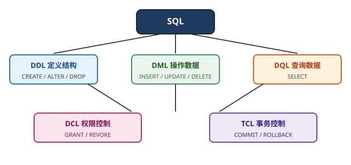

# MySQL 核心概念

## 数据库与表

MySQL 中数据的组织层级：

- **数据库（database）**：一个命名空间，包含多张表，如 `shop`。
- **表（table）**：结构化存储单元，由行和列组成。
- **行（row）/ 记录**：表中的一条数据。
- **列（column）/ 字段**：数据的一个属性。
- **主键（PRIMARY KEY）**：唯一标识一行数据的列或列组合。
- **外键（FOREIGN KEY）**：表与表之间的引用约束（InnoDB 支持）。

## SQL 分类



| 分类 | 全称 | 作用 | 关键字 |
| --- | --- | --- | --- |
| DDL | Data Definition Language | 定义库表结构 | CREATE、ALTER、DROP、TRUNCATE |
| DML | Data Manipulation Language | 操作数据 | INSERT、UPDATE、DELETE |
| DQL | Data Query Language | 查询数据 | SELECT |
| DCL | Data Control Language | 权限控制 | GRANT、REVOKE |
| TCL | Transaction Control Language | 事务控制 | COMMIT、ROLLBACK、SAVEPOINT |

## 存储引擎

| 引擎 | 事务 | 外键 | 锁粒度 | 适用场景 |
| --- | --- | --- | --- | --- |
| InnoDB | ✔ | ✔ | 行锁 | 默认引擎，绝大多数业务 |
| MyISAM | ✘ | ✘ | 表锁 | 历史遗留、只读统计表 |
| Memory | ✘ | ✘ | 表锁 | 临时数据、缓存表 |

::: tip
MySQL 8 默认且推荐使用 InnoDB；新表不要再用 MyISAM。
:::

查看当前引擎与建表语句：

```sql
SHOW ENGINES;
SHOW CREATE TABLE user\G
```

## 字符集与排序规则

- **utf8mb4**：完整的 Unicode 字符集，支持中文、emoji，**推荐**。
- **utf8mb4_0900_ai_ci**：MySQL 8.0+ 默认排序规则（`ai` 口音不敏感、`ci` 大小写不敏感）。
- **utf8（utf8mb3）**：旧字符集，已弃用，不能完整存储所有 Unicode 字符。

查看当前配置：

```sql
SHOW VARIABLES LIKE 'character_set_server';
SHOW VARIABLES LIKE 'collation_server';
```

## 常用数据类型

### 数值类型

| 类型 | 说明 |
| --- | --- |
| `TINYINT` | 小整数，-128 ~ 127 |
| `INT` | 常规整数，约 ±21 亿 |
| `BIGINT` | 大整数，主键常用 |
| `DECIMAL(M,D)` | 精确小数，**金额必须用** |
| `FLOAT / DOUBLE` | 近似小数，有精度损失 |

### 字符串类型

| 类型 | 说明 |
| --- | --- |
| `CHAR(n)` | 定长字符串，0~255 字符 |
| `VARCHAR(n)` | 变长字符串，常用 |
| `TEXT` | 长文本 |
| `ENUM` | 枚举值 |

### 日期时间类型

| 类型 | 说明 |
| --- | --- |
| `DATE` | 年月日 |
| `DATETIME` | 年月日时分秒，**推荐** |
| `TIMESTAMP` | 带时区，范围到 2038 年 |
| `YEAR` | 年份 |

::: danger 注意
1. 金额用 `DECIMAL`，不要用 `FLOAT/DOUBLE`，否则会出现精度丢失。
2. 业务时间字段推荐 `DATETIME`，`TIMESTAMP` 存在 2038 年问题。
3. 创建时间、更新时间可以用 `DEFAULT CURRENT_TIMESTAMP` 与 `ON UPDATE CURRENT_TIMESTAMP`。
:::

## 常用系统库

| 库名 | 作用 |
| --- | --- |
| `mysql` | 用户、权限等系统表 |
| `information_schema` | 数据库元数据 |
| `performance_schema` | 性能监控数据 |
| `sys` | 面向 DBA 的视图和存储过程 |

## 参考资料

- MySQL 数据类型文档：https://dev.mysql.com/doc/refman/8.4/en/data-types.html
- 字符集文档：https://dev.mysql.com/doc/refman/8.4/en/charset.html
