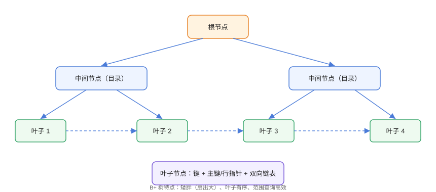

# B+ 树原理

B+ 树是 InnoDB 索引的底层数据结构：**矮胖多叉、叶子有序、范围高效**。理解它的页结构、扇出与查找过程，才能明白为什么「索引能加速」以及「为什么有些查询用不上索引」。

## B+ 树结构



关键特征：

1. **非叶子节点只存键**（目录项），不存数据 → 单页可容纳更多键 → 树更矮；
2. **叶子节点存键 + 主键/行指针**，且按序排列；
3. **叶子节点用双向链表连接** → 范围查询只需顺序遍历；
4. 高度通常 2~4 层 → 百万级数据 3~4 次 IO 即可定位。

## 数据页与扇出

InnoDB 默认页大小 16KB：

```sql
-- 查看页大小
SHOW VARIABLES LIKE 'innodb_page_size';
-- 输出：16384
```

扇出计算示例：

```text
一个 16KB 页：
  非叶子节点：约 16KB / 8B(键+指针) ≈ 1000+ 个指针
  3 层 B+ 树可容纳：1000 × 1000 × 叶子记录数
  → 轻松支持千万级数据，且查询 IO 次数稳定
```

::: tip 为什么不用二叉搜索树 / 红黑树
二叉树高度随数据量线性增长（百万级需 20+ 层），每层一次磁盘 IO；B+ 树靠**高扇出**把高度压到 3~4 层，IO 次数接近常数。
:::

## 聚簇索引与二级索引

InnoDB 数据按主键聚簇存储：

| 索引类型 | 叶子节点内容 | 特点 |
| --- | --- | --- |
| 聚簇索引（主键） | 完整行数据 | 主键有序，表即索引 |
| 二级索引（普通索引） | 索引键 + 主键值 | 查询需回表取行 |

```sql
-- BTree/01-cluster.sql
CREATE TABLE users (
    id   BIGINT PRIMARY KEY,        -- 聚簇索引
    name VARCHAR(50),
    age  INT,
    KEY idx_name (name)             -- 二级索引
);

-- 走二级索引：先找 name → 拿主键 → 回表
EXPLAIN SELECT * FROM users WHERE name = 'alice';
-- type: ref, key: idx_name
```

### 回表的代价

```sql
-- 回表：每条匹配行都要按主键再查一次聚簇索引（随机 IO）
SELECT * FROM users WHERE name = 'alice';

-- 覆盖索引：查询列都在二级索引里，无需回表
SELECT id, name FROM users WHERE name = 'alice';
-- Extra: Using index
```

::: danger 主键选择影响性能
聚簇索引决定了数据物理顺序：
- **自增/有序主键**：追加写入，页分裂少；
- **UUID 无序主键**：随机插入，页分裂与碎片多，写入慢。
推荐 BIGINT 自增或有序雪花 ID。
:::

## 查找过程

```text
SELECT * FROM users WHERE id = 5000;

1. 根节点：比较键值，确定走哪个子节点（1 次 IO）
2. 中间节点：继续下钻（1 次 IO）
3. 叶子节点：二分查找定位记录（1 次 IO）
→ 共约 3 次磁盘 IO
```

缓冲池命中后 IO 更少（`innodb_buffer_pool_size` 内的页直接读内存）。

## 自适应哈希索引（AHI）

InnoDB 会监控高频等值查询，自动在 B+ 树之上构建内存哈希索引：

```sql
SHOW STATUS LIKE 'innodb_adaptive_hash_hash_searches';
```

AHI 是**自动**的：等值查询频繁且模式稳定时生效，无需手动创建，也无法强制。

## 易错点与最佳实践

::: danger 常见坑
1. **主键过长**：二级索引叶子存主键值，主键越长每个索引越大。
2. **UUID 主键**：随机写入导致页分裂与碎片（可改用有序 UUID v7 或雪花 ID）。
3. **误以为索引不占空间**：每个索引都是一棵 B+ 树，存储与写入成本并存。
4. **把大字段（TEXT/BLOB）塞进索引**：页扇出下降、索引膨胀。
5. **忽略缓冲池**：索引再好，热点页也要进 buffer pool 才快。
:::

::: tip 最佳实践
- 主键用 `BIGINT UNSIGNED AUTO_INCREMENT` 或有序分布式 ID；
- 二级索引「短小精悍」：只放查询与排序需要的列；
- 大字段的等值查询考虑前缀索引或哈希索引（`UNHEX(SHA2(...))`）。
:::

## 验证方式

```sql
EXPLAIN SELECT * FROM users WHERE id = 1;       -- type: const，聚簇索引
EXPLAIN SELECT id, name FROM users WHERE name = 'alice';  -- Using index
SHOW INDEX FROM users;                          -- 查看索引基数与列序
```

预期：主键等值查询 type 为 `const`；覆盖查询 Extra 为 `Using index`。

## 参考资料

- [MySQL 官方：InnoDB 索引](https://dev.mysql.com/doc/refman/8.4/en/innodb-index-types.html)
- [MySQL 官方：页大小](https://dev.mysql.com/doc/refman/8.4/en/innodb-parameters.html)
- [MySQL 官方：自适应哈希索引](https://dev.mysql.com/doc/refman/8.4/en/innodb-adaptive-hash.html)
