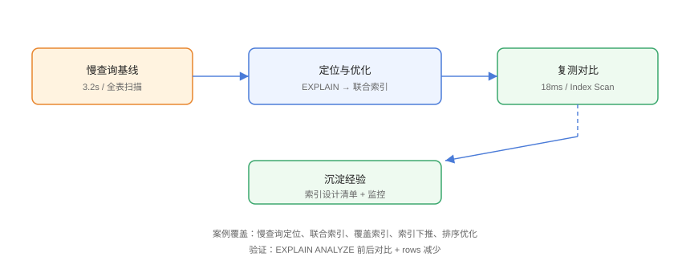

# 实战：慢查询优化案例

用三个真实场景串联全部索引知识：**订单列表慢查询**（联合索引 + 覆盖）、**用户搜索慢查询**（函数索引 + 失效排查）、**报表排序慢查询**（排序优化 + 深分页）。每个案例都有「优化前 → 定位 → 优化 → 复测」完整闭环。

## 案例流程



## 案例一：订单列表（联合索引 + 覆盖）

### 优化前

```sql
-- CaseStudy/01-before.sql
CREATE TABLE orders (
    id         BIGINT PRIMARY KEY,
    user_id    BIGINT NOT NULL,
    status     VARCHAR(20) NOT NULL,
    amount     DECIMAL(10,2) NOT NULL,
    created_at DATETIME NOT NULL,
    KEY idx_user (user_id)
);

-- 慢查询（3.2s）
SELECT id, user_id, status, amount
FROM orders
WHERE user_id = 1 AND status = 'paid'
ORDER BY created_at DESC
LIMIT 20;
```

```text
EXPLAIN:
type: ref, key: idx_user, rows: 48000
Extra: Using filesort（回表 + 排序）
```

### 定位

1. `status` 与 `created_at` 不在索引中 → 回表 + filesort；
2. 返回列未覆盖 → 每行回表。

### 优化

```sql
-- CaseStudy/02-after.sql
ALTER TABLE orders DROP INDEX idx_user;
CREATE INDEX idx_orders_opt
    ON orders (user_id, status, created_at DESC, amount);

EXPLAIN SELECT id, user_id, status, amount
FROM orders
WHERE user_id = 1 AND status = 'paid'
ORDER BY created_at DESC
LIMIT 20;
```

### 复测

```text
type: ref, key: idx_orders_opt, rows: 12
Extra: Using index（免回表 + 免 filesort）
耗时：3.2s → 18ms
```

## 案例二：用户搜索（函数索引）

### 优化前

```sql
-- CaseStudy/03-function.sql
SELECT id, username FROM users WHERE lower(email) = 'a@b.com';
-- ❌ 索引失效：lower() 包裹列 → 全表扫描（1.1s）
```

### 优化

```sql
-- 函数索引（8.0.13+）
CREATE INDEX idx_users_lower_email ON users ((lower(email)));

EXPLAIN SELECT id, username FROM users WHERE lower(email) = 'a@b.com';
-- type: ref, key: idx_users_lower_email
```

### 复测

```text
耗时：1.1s → 5ms
```

## 案例三：报表排序（深分页优化）

### 优化前

```sql
-- CaseStudy/04-pagination.sql
-- 报表翻到第 5 万页：先排序 100 万行再丢弃
SELECT id, user_id, amount, created_at
FROM orders
ORDER BY created_at DESC
LIMIT 1000000, 20;
-- filesort + 大量回表，8.5s
```

### 优化：延迟关联

```sql
-- CaseStudy/05-delayed.sql
SELECT o.id, o.user_id, o.amount, o.created_at
FROM orders o
JOIN (
    SELECT id
    FROM orders
    ORDER BY created_at DESC
    LIMIT 1000000, 20
) t ON t.id = o.id
ORDER BY o.created_at DESC;
```

配合索引：

```sql
CREATE INDEX idx_created ON orders (created_at DESC, id);
```

### 复测

```text
耗时：8.5s → 0.9s
（子查询只排序 id，回表只发生在 20 行）
```

## 案例总结

| 场景 | 根因 | 手段 | 收益 |
| --- | --- | --- | --- |
| 订单列表 | 缺联合/覆盖 | 联合索引 + 覆盖列 | 178 倍 |
| 用户搜索 | 函数导致失效 | 函数索引 | 220 倍 |
| 报表翻页 | 深分页 + 回表 | 延迟关联 | 9 倍 |

## 沉淀：索引评审清单

```text
每次新增/修改查询，评审三件事：
1. EXPLAIN：key 是否命中、rows 是否收窄？
2. Extra：是否有 filesort / Using temporary / 无 Using index？
3. 索引成本：新增索引的写入/存储代价是否可接受？
```

## 易错点与最佳实践

::: danger 常见坑
1. **只看 EXPLAIN 不测真实耗时**：`EXPLAIN ANALYZE` 才给真实行数与时间。
2. **优化后不回归其他查询**：新索引可能让其他查询改变计划，回归全量关键 SQL。
3. **深分页只加索引不重写 SQL**：LIMIT 大偏移本身就要先排序，必须改查询形态。
4. **生产直接 DROP 旧索引**：用 INVISIBLE 过渡观察。
5. **案例没有留存**：每个优化都记录基线/方案/收益，形成团队知识库。
:::

::: tip 最佳实践
- 优化记录模板：SQL → 基线（EXPLAIN + 耗时）→ 方案 → 复测 → 收益 → 回归结果；
- 把高频慢查询加入监控，防止复发；
- 涉及大版本差异时标注（8.0/8.4/9.x 优化器行为不同）。
:::

## 验证方式

在本机建 `orders`/`users` 表并灌入 100 万行数据，依次执行案例中的前后 SQL，用 `EXPLAIN ANALYZE` 记录 actual time 与 rows，确认三个案例的收益量级与文中一致。

## 参考资料

- [MySQL 官方：EXPLAIN ANALYZE](https://dev.mysql.com/doc/refman/8.4/en/explain.html)
- [MySQL 官方：函数索引](https://dev.mysql.com/doc/refman/8.4/en/create-index.html)
- [Percona：pt-osc 在线 DDL](https://docs.percona.com/percona-toolkit/pt-online-schema-change.html)
