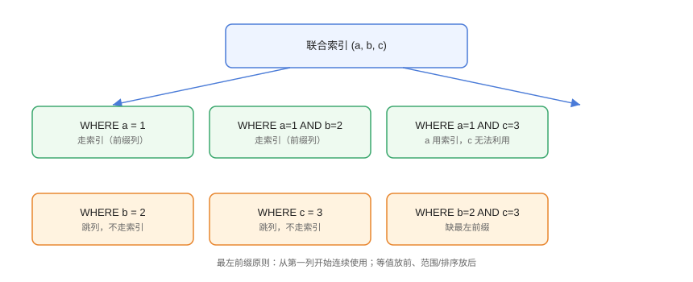

# 联合索引与最左前缀

联合索引（复合索引）是 MySQL 优化中最常被用错的能力：索引 `(a, b, c)` 的排序规则决定了哪些查询能利用它。理解**最左前缀原则**与列顺序设计，能让一条索引服务多条查询。

## 联合索引的排序规则



联合索引 `(a, b, c)` 的键按 `a → b → c` 排序：

```text
(1, 'x', 10) → (1, 'x', 20) → (1, 'y', 5) → (2, 'x', 1) → ...
```

因此只有**从第一列开始连续**的条件组合才能使用索引范围/定位。

## 哪些查询能用

```sql
-- CompositeIndex/01-usable.sql
CREATE TABLE orders (
    id         BIGINT PRIMARY KEY,
    user_id    BIGINT NOT NULL,
    status     VARCHAR(20) NOT NULL,
    created_at DATETIME NOT NULL,
    KEY idx_user_status_time (user_id, status, created_at)
);

-- ✅ 最左前缀：只用第一列
SELECT * FROM orders WHERE user_id = 1;

-- ✅ 最左前缀：前两列
SELECT * FROM orders WHERE user_id = 1 AND status = 'paid';

-- ✅ 三列等值
SELECT * FROM orders
WHERE user_id = 1 AND status = 'paid' AND created_at > '2026-08-01';

-- ✅ 排序优化：ORDER BY 与索引顺序一致
SELECT * FROM orders
WHERE user_id = 1
ORDER BY status, created_at;
```

## 哪些查询用不上

```sql
-- CompositeIndex/02-unusable.sql
-- ❌ 跳过第一列
SELECT * FROM orders WHERE status = 'paid';

-- ❌ 只用了第二列
SELECT * FROM orders WHERE status = 'paid' AND created_at > '2026-08-01';

-- ⚠️ 范围列之后失效：created_at 范围后无法再用后续列
SELECT * FROM orders
WHERE user_id = 1 AND created_at > '2026-08-01' AND status = 'paid';
```

::: danger 范围列的位置
联合索引中，**范围条件之后的列无法用于索引**（但 MySQL 8.0 的索引条件下推可减少回表）。设计时：等值条件列放前，范围/排序列放后。
:::

## 列顺序设计

### 等值优先

```sql
-- 查询形态 1：WHERE user_id = ? AND status = ?
-- 查询形态 2：WHERE user_id = ? ORDER BY created_at

-- 推荐：等值列在前，范围/排序在后
KEY idx_opt (user_id, status, created_at)
```

### 选择性高的列优先

```sql
-- 选择性 = DISTINCT 值 / 总行数
SELECT
    COUNT(DISTINCT user_id) / COUNT(*) AS user_sel,
    COUNT(DISTINCT status)  / COUNT(*) AS status_sel
FROM orders;

-- 选择性高的列放前面，能让索引尽快收窄范围
```

::: tip 选择性不是唯一标准
等值查询中，把「选择性高」的列放前面通常更优；但还要结合查询频率、排序需求综合设计。先按查询形态排序，再微调。
:::

## 索引跳跃扫描（Skip Scan）

MySQL 8.0.13+ 支持 Skip Scan：当跳过联合索引首列且该列区分度低时，优化器可把一次查询拆成多次「首列值 + 剩余条件」扫描：

```sql
-- 索引 (a, b)，查询只带 b
-- a 只有少量取值时，Skip Scan 可能生效
SELECT * FROM t WHERE b = 5;
```

```sql
EXPLAIN SELECT * FROM orders WHERE status = 'paid';
-- 可能显示：type: index, Extra: Using index for skip scan
```

::: warning Skip Scan 的适用条件
首列（a）的 DISTINCT 值必须很少（优化器会估算成本），且需要覆盖索引/回表成本可控。**不要把业务寄托在 Skip Scan 上**，正确设计联合索引才是根本。
:::

## 冗余索引识别

```sql
-- 冗余示例：idx(a) 被 idx(a,b) 完全覆盖（最左前缀）
KEY idx_a (a),
KEY idx_ab (a, b)    -- idx_a 冗余

-- 用 sys 库查找未使用索引
SELECT * FROM sys.schema_unused_indexes;
```

## 易错点与最佳实践

::: danger 常见坑
1. **把范围列放前面**：后面的列全部失效。
2. **单独建与联合索引同前缀的索引**：冗余，浪费写入成本。
3. **ORDER BY 与索引方向不一致**：`ASC/DESC` 混排（8.0 支持降序索引前）会 filesort。
4. **`!=`/`NOT IN` 在联合索引中间列**：打断连续性。
5. **依赖 Skip Scan**：它只是优化器兜底，不该成为设计依据。
:::

::: tip 最佳实践
- 一条联合索引服务多查询：等值列前、范围后、排序贴合；
- 用 `SHOW INDEX` 与 `schema_unused_indexes` 定期清理冗余；
- 改索引后必须 `EXPLAIN` 回归全部相关查询。
:::

## 验证方式

```sql
EXPLAIN SELECT * FROM orders WHERE user_id = 1 AND status = 'paid';
-- type: ref, key: idx_user_status_time

EXPLAIN SELECT * FROM orders WHERE status = 'paid';
-- 对比：key 可能为 NULL（或 Skip Scan）
```

预期：最左前缀查询走索引；跳列查询不走（或 Skip Scan）。调整列顺序后重新 EXPLAIN 对比 `rows` 与 `Extra`。

## 参考资料

- [MySQL 官方：多列索引](https://dev.mysql.com/doc/refman/8.4/en/multiple-column-indexes.html)
- [MySQL 官方：Skip Scan](https://dev.mysql.com/doc/refman/8.4/en/range-optimization.html#range-access-skip-scan)
- [MySQL sys.schema_unused_indexes](https://dev.mysql.com/doc/refman/8.4/en/sys-schema-unused-indexes.html)
