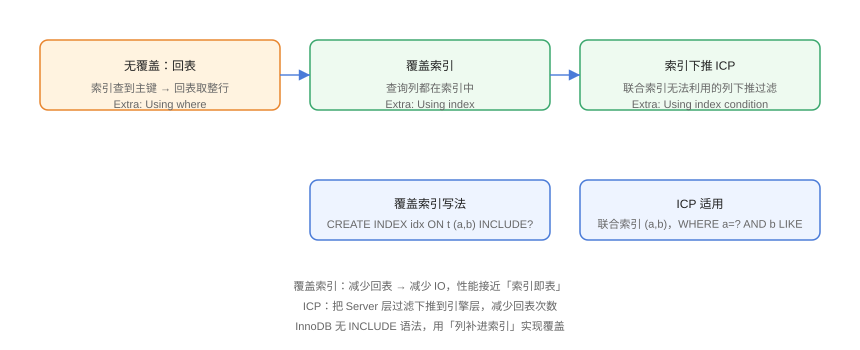

# 覆盖索引与索引下推

覆盖索引（Covering Index）让查询**只读索引、不读数据行**；索引下推（Index Condition Pushdown，ICP）让过滤在引擎层完成、减少回表。两者是「减少回表」的两大利器，配合使用收益显著。

## 回表的代价



```sql
-- CoveringIndex/01-lookup.sql
CREATE TABLE orders (
    id         BIGINT PRIMARY KEY,
    user_id    BIGINT NOT NULL,
    amount     DECIMAL(10,2) NOT NULL,
    status     VARCHAR(20) NOT NULL,
    created_at DATETIME NOT NULL,
    KEY idx_user (user_id)
);

-- ❌ 回表：查 user_id 找到主键后，逐行回聚簇索引取整行
SELECT * FROM orders WHERE user_id = 1;
-- type: ref, Extra: (无 Using index)

-- ✅ 覆盖索引：查询列(id, user_id)都在二级索引中
SELECT id, user_id FROM orders WHERE user_id = 1;
-- type: ref, Extra: Using index
```

## 覆盖索引实战

```sql
-- CoveringIndex/02-covering.sql
-- 场景：高频「按用户查订单号 + 状态 + 金额」列表
-- 把查询列补进索引 → 免回表
ALTER TABLE orders DROP INDEX idx_user;
ALTER TABLE orders ADD INDEX idx_user_cover (user_id, status, amount);

SELECT id, user_id, status, amount
FROM orders
WHERE user_id = 1 AND status = 'paid';
-- Extra: Using index（不回表）
```

::: tip 覆盖索引的设计
- 把**高频查询的 SELECT 列**（小而固定）补进索引尾部；
- 大字段（TEXT/BLOB）不能直接覆盖，改用前缀或拆表；
- 索引体积增大是代价，只对热点查询做覆盖。
:::

## 索引下推（ICP）

联合索引中无法利用的后续列条件，MySQL 8.0 默认开启 ICP：把过滤下推到引擎层，在**索引扫描时**直接过滤，减少回表次数。

```sql
-- CoveringIndex/03-icp.sql
CREATE TABLE employees (
    id      BIGINT PRIMARY KEY,
    dept_id BIGINT NOT NULL,
    age     INT NOT NULL,
    KEY idx_dept_age (dept_id, age)
);

-- dept_id 走索引定位；age 范围条件无法用索引定位，
-- 但 ICP 会在索引层先过滤 age，只对命中的行回表
EXPLAIN SELECT * FROM employees
WHERE dept_id = 1 AND age > 30;
-- Extra: Using index condition
```

### ICP 与不开启的对比

```sql
-- 关闭 ICP（验证用，生产保持开启）
SET optimizer_switch = 'index_condition_pushdown=off';

-- 开启（默认）
SET optimizer_switch = 'index_condition_pushdown=on';
```

| 状态 | 执行流程 | Extra |
| --- | --- | --- |
| ICP 关闭 | 索引定位 dept_id → 全部回表 → Server 层过滤 age | `Using where` |
| ICP 开启 | 索引定位 dept_id → 索引层过滤 age → 少量回表 | `Using index condition` |

::: danger ICP ≠ 索引使用
`Using index condition` 说明 ICP 生效，但查询**仍然可能回表**；它只是减少了回表次数。要彻底免回表，仍需覆盖索引（`Using index`）。
:::

## 判断回表是否严重

```sql
-- 通过状态变量观察
SHOW STATUS LIKE 'Handler_read%';
-- Handler_read_secondary 高：二级索引读取多
-- Handler_read_rnd 高：随机读多（回表/排序）
```

```sql
-- 单条查询：EXPLAIN ANALYZE（8.0.18+）
EXPLAIN ANALYZE
SELECT id, user_id, status FROM orders WHERE user_id = 1;
-- 输出 actual time 与 rows，直观对比优化前后
```

## 组合使用示例

```sql
-- CoveringIndex/04-combo.sql
-- 目标：高频列表查询，同时利用覆盖 + ICP
CREATE INDEX idx_cover_icp ON orders (user_id, status, amount);

-- WHERE 用 user_id + status（等值，走索引定位）
-- amount 在索引中（覆盖，免回表）
-- 若再加 created_at 范围：索引层 ICP 过滤，避免回表
SELECT id, user_id, status, amount
FROM orders
WHERE user_id = 1 AND status = 'paid'
  AND created_at > '2026-08-01';
-- Extra: Using index condition; Using where
```

## 易错点与最佳实践

::: danger 常见坑
1. **SELECT * 破坏覆盖**：覆盖索引要求查询列全部在索引中，`*` 几乎不可能覆盖。
2. **大字段进索引**：TEXT/BLOB 不能完整覆盖，索引膨胀。
3. **覆盖索引冗余膨胀**：每列都补导致索引巨大，写入变慢——只对热点查询做。
4. **误解 ICP**：它是「减少回表」不是「免回表」，还要看 `Using index`。
5. **Join 场景忘记覆盖**：驱动表回表成本放大 N 倍，连接列与返回列一起覆盖。
:::

::: tip 最佳实践
- 列表类接口（分页查询固定列）优先设计覆盖索引；
- 用 `EXPLAIN ANALYZE` 对比优化前后的实际行数与耗时；
- 覆盖索引 + ICP 一起用：等值列定位、范围列 ICP、返回列覆盖。
:::

## 验证方式

```sql
EXPLAIN SELECT id, user_id, status FROM orders WHERE user_id = 1;
-- Extra: Using index → 覆盖生效

EXPLAIN SELECT * FROM employees WHERE dept_id = 1 AND age > 30;
-- Extra: Using index condition → ICP 生效
```

关闭 ICP 后再跑同一查询，对比 `Handler_read_rnd` 与耗时，确认 ICP 的收益。

## 参考资料

- [MySQL 官方：覆盖索引](https://dev.mysql.com/doc/refman/8.4/en/glossary.html#glos_covering_index)
- [MySQL 官方：索引条件下推优化](https://dev.mysql.com/doc/refman/8.4/en/index-condition-pushdown-optimization.html)
- [MySQL 官方：EXPLAIN ANALYZE](https://dev.mysql.com/doc/refman/8.4/en/explain.html)
