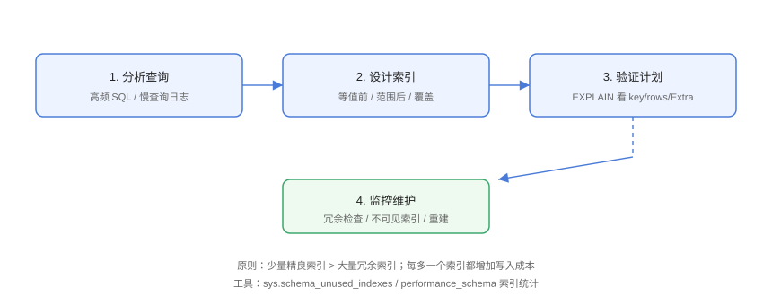

# 索引设计方法论

索引设计不是「见列就建」，而是**从查询出发、按成本权衡、用验证收尾**的系统工程。本页给出可落地的设计流程、选择性与冗余检查方法，以及 8.0+ 的运维工具。

## 设计流程



```text
收集慢查询 → 分析查询形态 → 设计索引 → EXPLAIN 验证 → 监控维护
```

## 1. 收集查询

```sql
-- Design/01-collect.sql
-- 开启慢查询日志
SET GLOBAL slow_query_log = ON;
SET GLOBAL long_query_time = 1;

-- 查看慢查询
SELECT * FROM mysql.slow_log ORDER BY start_time DESC LIMIT 20;

-- 或 performance_schema 统计 TOP SQL
SELECT
    DIGEST_TEXT,
    COUNT_STAR,
    ROUND(SUM_TIMER_WAIT / 1000000000, 2) AS total_sec
FROM performance_schema.events_statements_summary_by_digest
ORDER BY SUM_TIMER_WAIT DESC
LIMIT 20;
```

## 2. 分析查询形态

每个查询拆解：

| 维度 | 问题 |
| --- | --- |
| WHERE 等值 | 哪些列是 `=` 条件？ |
| WHERE 范围 | 哪些列是 `<`/`>`/`BETWEEN`？ |
| ORDER BY | 排序列与方向？ |
| GROUP BY | 分组列？ |
| SELECT 列 | 能否覆盖？ |
| JOIN 列 | 连接条件列？ |

示例：

```sql
-- 形态：WHERE user_id = ? AND status = ? ORDER BY created_at DESC
-- 设计：KEY idx (user_id, status, created_at DESC)
```

## 3. 设计索引

```sql
-- Design/02-design.sql
-- 等值列在前（user_id, status）
-- 排序列在后（created_at）
CREATE INDEX idx_orders_opt ON orders (user_id, status, created_at DESC);

-- 高频返回列补进索引实现覆盖
CREATE INDEX idx_orders_cover ON orders (user_id, status, amount);
```

### 选择性评估

```sql
-- 选择性 = DISTINCT / 总数，越高越好（接近 1）
SELECT
    COUNT(DISTINCT user_id) / COUNT(*) AS user_sel,
    COUNT(DISTINCT status)  / COUNT(*) AS status_sel
FROM orders;
```

| 选择性 | 结论 |
| --- | --- |
| > 0.1 | 高，适合做索引前缀 |
| 0.01 ~ 0.1 | 中，按查询频率决定 |
| < 0.01 | 低（如性别），单列索引意义小 |

## 4. 验证计划

```sql
-- Design/03-verify.sql
EXPLAIN SELECT id, user_id, status, amount
FROM orders
WHERE user_id = 1 AND status = 'paid'
ORDER BY created_at DESC;

-- 检查点：
--   key 用了新索引
--   rows 远小于全表
--   Extra 无 filesort / Using temporary
--   需要覆盖时 Extra 含 Using index
```

## 5. 监控与维护

### 未使用索引

```sql
-- Design/04-maintain.sql
-- 从未被使用的索引
SELECT * FROM sys.schema_unused_indexes;
```

### 冗余索引

```sql
-- 冗余示例：idx_a 是 idx_ab 的最左前缀
SHOW INDEX FROM orders;
-- 用工具（pt-duplicate-key-checker）或人工识别
```

### 不可见索引（安全删除）

```sql
-- Design/05-invisible.sql
-- 先设为不可见，观察一段时间确认无查询依赖，再删除
ALTER TABLE orders ALTER INDEX idx_old INVISIBLE;

-- 需要时恢复
ALTER TABLE orders ALTER INDEX idx_old VISIBLE;

-- 删除
DROP INDEX idx_old ON orders;
```

::: tip 不可见索引的价值
MySQL 8.0+ 的不可见索引让「删索引」变成可回退操作：先隐藏观察 1~2 周，确认无性能回退再真正删除。
:::

## 索引数量与成本

```text
每增加一个索引：
  - 写入：INSERT/UPDATE/DELETE 都要维护索引树
  - 存储：每个索引一棵 B+ 树
  - 优化器：候选索引越多，规划越复杂

经验参考：
  单表 5~10 个索引为常见区间
  超过 15 个索引要审查冗余与使用率
```

## 设计检查清单

::: tip 索引设计清单
1. 是否基于真实慢查询/TOP SQL 设计，而非拍脑袋？
2. 等值列是否排在范围列之前？
3. ORDER BY / GROUP BY 是否与索引顺序一致？
4. 高频列表查询是否用覆盖索引免回表？
5. JOIN 两表关联列类型/字符集是否一致？
6. 是否有与现有索引最左前缀重复的冗余索引？
7. 是否用 EXPLAIN 验证过全部相关查询？
8. 删除索引前是否用 INVISIBLE 观察？
9. 索引数量是否失控（>15 个需审查）？
10. 大表建索引是否用在线方式（ALGORITHM=INPLACE）？
:::

## 易错点与最佳实践

::: danger 常见坑
1. **为所有 WHERE 列单独建索引**：应合并为联合索引。
2. **只加索引不验证**：未 EXPLAIN 的索引可能是「心理安慰」。
3. **上线高峰建索引**：大表 DDL 有锁/IO 开销，用 `ALGORITHM=INPLACE, LOCK=NONE` 或工具（pt-osc/gh-ost）。
4. **索引永不清理**：冗余索引长期拖累写入。
5. **忽略 Join 关联列一致性**：类型/字符集不一致导致无法用索引。
:::

::: tip 最佳实践
- 索引设计入代码评审：新增查询必须附 EXPLAIN；
- 定期（每月）跑 `schema_unused_indexes` 清理；
- 大表索引变更走在线 DDL 或 gh-ost，避免锁表事故。
:::

## 验证方式

按流程对一张真实业务表走一遍：收集 TOP SQL → 设计联合索引 → `EXPLAIN` 前后对比（rows/耗时）→ 用 `schema_unused_indexes` 找出可清理索引 → 用 INVISIBLE 安全下线。产出「该表的索引设计说明」文档。

## 参考资料

- [MySQL 官方：索引优化](https://dev.mysql.com/doc/refman/8.4/en/optimization-indexes.html)
- [MySQL 官方：不可见索引](https://dev.mysql.com/doc/refman/8.4/en/invisible-indexes.html)
- [MySQL sys schema](https://dev.mysql.com/doc/refman/8.4/en/sys-schema.html)
