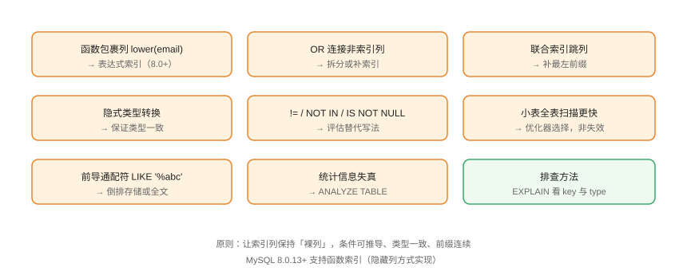

# 索引失效场景全集

「建了索引但没走」是 MySQL 优化的高频困惑。本页整理**最全的失效/不生效场景**，逐个给出原因与解法，并说明「哪些其实是优化器的正确选择」。

## 失效场景总览



## 1. 函数包裹索引列

```sql
-- IndexFailure/01-function.sql
-- ❌ 失效：对列套函数，索引无法比较
SELECT * FROM users WHERE lower(email) = 'a@b.com';

-- ✅ 方案一：函数索引（MySQL 8.0.13+，隐藏列实现）
CREATE INDEX idx_users_lower_email ON users ((lower(email)));
SELECT * FROM users WHERE lower(email) = 'a@b.com';

-- ✅ 方案二：冗余列（应用写入时存小写）
ALTER TABLE users ADD email_lower VARCHAR(255)
    GENERATED ALWAYS AS (lower(email)) STORED;
CREATE INDEX idx_users_email_lower ON users (email_lower);
```

## 2. 隐式类型转换

```sql
-- IndexFailure/02-cast.sql
-- ❌ 失效：字符串列与数值比较，列被隐式 CAST
SELECT * FROM users WHERE phone = 13800138000;

-- ✅ 保证类型一致
SELECT * FROM users WHERE phone = '13800138000';
```

::: danger 类型转换的方向
MySQL 会按规则把**列**转成参数类型；`varchar 列 = 数值` 会对列做 CAST，索引失效。反过来 `数值列 = 字符串` 只转换字符串，通常不影响索引。
:::

## 3. 前导通配符

```sql
-- IndexFailure/03-like.sql
-- ❌ 失效：前导通配符无法定位起点
SELECT * FROM users WHERE username LIKE '%alice%';

-- ✅ 后缀通配可用（前缀匹配）
SELECT * FROM users WHERE username LIKE 'alice%';

-- 全文搜索（8.0 InnoDB FULLTEXT）
SELECT * FROM articles
WHERE MATCH(title, body) AGAINST('mysql' IN NATURAL LANGUAGE MODE);
```

## 4. OR 连接非索引列

```sql
-- IndexFailure/04-or.sql
-- ❌ 失效：OR 两侧无法合并为索引访问
SELECT * FROM orders WHERE user_id = 1 OR status = 'paid';

-- ✅ 方案一：为 status 建索引（或联合索引覆盖两侧）
-- ✅ 方案二：拆成 UNION ALL
SELECT * FROM orders WHERE user_id = 1
UNION ALL
SELECT * FROM orders WHERE status = 'paid';
```

## 5. 不等值条件

```sql
-- IndexFailure/05-not-eq.sql
-- ❌ 常见失效：!= / <> / NOT IN / IS NOT NULL
SELECT * FROM orders WHERE status != 'deleted';
SELECT * FROM orders WHERE id NOT IN (1, 2, 3);

-- ✅ 视数据分布：大量命中时优化器本就会全表扫描
-- ✅ 特殊场景可用：NOT IN → LEFT JOIN 排除
SELECT o.*
FROM orders o
LEFT JOIN blacklist b ON b.id = o.id
WHERE b.id IS NULL;
```

## 6. 联合索引跳列

```sql
-- IndexFailure/06-skip.sql
-- 索引 (user_id, status, created_at)
-- ❌ 跳过首列
SELECT * FROM orders WHERE status = 'paid';
-- ❌ 范围列后接列
SELECT * FROM orders
WHERE user_id = 1 AND created_at > '2026-08-01' AND status = 'paid';
```

详见 [联合索引与最左前缀](../CompositeIndex/index.md)。

## 7. 统计信息失真

```sql
-- IndexFailure/07-stats.sql
-- 数据大变化后优化器用了错误计划
ANALYZE TABLE orders;

-- 查看统计信息
SHOW INDEX FROM orders;
-- Cardinality 应接近实际区分度
```

## 8. 优化器的「正确选择」

不是所有全表扫描都是问题：

```sql
-- 小表：全表扫描可能更快
-- 索引选择性低：gender 列 90% 是 'M'，索引收益低
SELECT * FROM users WHERE gender = 'M';
```

判断标准：`EXPLAIN` 中 `rows` 是否远小于表行数、`type` 是否为 `ref`/`range`/`index`。**优化器算出来的最优计划就是正确的**，不要为了「走索引」而走索引。

## 快速排查流程

```text
1. EXPLAIN 看 key 是否为 NULL
2. 看 WHERE 列：是否被函数/运算包裹？
3. 看类型：列与参数类型是否一致？
4. 看联合索引：是否满足最左前缀？
5. 看 OR / != / LIKE：是否命中失效模式？
6. 看统计信息：Cardinality 是否合理？
7. 看 rows：全表扫描是否真的是最优解？
```

## 易错点与最佳实践

::: danger 常见坑
1. **对列做运算**：`WHERE id + 1 = 2` 与 `WHERE id = 1` 不等价，后者才走索引。
2. **字符集不一致导致失效**：两表关联列 collation 不同，JOIN 无法用索引。
3. **NULL 判断**：`IS NULL` 在部分场景可用索引，`IS NOT NULL` 通常不行（看数据分布）。
4. **表达式索引不会自动优化旧查询**：`lower(email)` 查询要匹配表达式索引的写法。
5. **索引下推 ≠ 索引使用**：`Using index condition` 说明 ICP 生效，但可能仍有大量回表。
:::

::: tip 最佳实践
- 规则记忆：**裸列、同类型、前缀连续**；
- 用 `EXPLAIN FORMAT=TREE`（8.0.16+）看更直观的执行树；
- 每个失效案例都要写进团队 SQL 规范，靠人肉记忆不可靠。
:::

## 验证方式

```sql
EXPLAIN SELECT * FROM users WHERE lower(email) = 'a@b.com';
-- 建函数索引后再 EXPLAIN，key 应显示新索引名
```

对每个场景构造表与数据，前后对比 `EXPLAIN` 的 `key`/`rows`/`Extra`，确认修复生效。

## 参考资料

- [MySQL 官方：索引使用优化](https://dev.mysql.com/doc/refman/8.4/en/index-btree-hash.html)
- [MySQL 官方：函数索引](https://dev.mysql.com/doc/refman/8.4/en/create-index.html)
- [MySQL 官方：EXPLAIN 输出格式](https://dev.mysql.com/doc/refman/8.4/en/explain-output.html)
