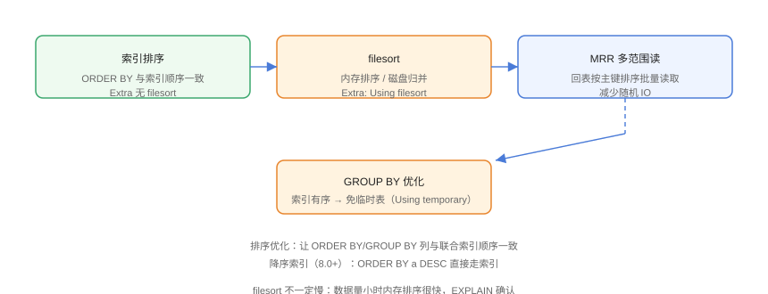

# 排序与分组优化

`ORDER BY` 与 `GROUP BY` 是除 WHERE 之外最常触发性能问题的操作。核心思路：**让索引天然有序**，避免 filesort 与临时表；回表不可免时，用 MRR 优化随机读。

## 排序方式



| 方式 | 条件 | 特点 |
| --- | --- | --- |
| 索引排序 | ORDER BY 与索引顺序一致 | 免排序，Extra 无 filesort |
| filesort（内存） | sort_buffer_size 内 | 快，但仍是额外步骤 |
| filesort（磁盘） | 数据超过 sort_buffer | 归并排序，慢 |

## 索引排序

```sql
-- SortGroup/01-index-sort.sql
CREATE TABLE orders (
    id         BIGINT PRIMARY KEY,
    user_id    BIGINT NOT NULL,
    status     VARCHAR(20) NOT NULL,
    created_at DATETIME NOT NULL,
    KEY idx_user_status_time (user_id, status, created_at)
);

-- ✅ 排序贴合索引：WHERE 等值 + ORDER BY 后续列
SELECT id, user_id, status, created_at
FROM orders
WHERE user_id = 1 AND status = 'paid'
ORDER BY created_at;
-- Extra: 无 filesort

-- ❌ 排序不贴合：中间跳列或方向不一致
SELECT id, user_id, status, created_at
FROM orders
WHERE user_id = 1
ORDER BY created_at;      -- 跳 status → filesort
```

### 方向一致性

```sql
-- 索引默认 ASC
-- ✅ ORDER BY created_at ASC 可用
-- ✅ ORDER BY created_at DESC 也可反向扫描（8.0 前）
-- ❌ ORDER BY status ASC, created_at DESC 混排 → filesort

-- 8.0 降序索引：让混排/降序直接走索引
CREATE INDEX idx_user_status_desc ON orders (user_id, status ASC, created_at DESC);
```

::: tip 降序索引
MySQL 8.0+ 支持索引定义中的 `DESC`，`ORDER BY a DESC` 可直接按索引方向扫描，避免反向扫描的性能损失。
:::

## filesort 优化

```sql
-- SortGroup/02-filesort.sql
-- 查看排序缓冲区
SHOW VARIABLES LIKE 'sort_buffer_size';
-- 默认 256KB，大排序可适度调大（按需，勿全局过量）

-- filesort 出现在临时表/磁盘时：
EXPLAIN SELECT * FROM orders ORDER BY created_at DESC;
-- Extra: Using filesort（无 WHERE，全表排序）
```

优化手段：

1. **让排序走索引**（最有效）；
2. **只 SELECT 必要列**：filesort 默认排序「行指针 + 排序列」，`SELECT *` 可能触发「二次回表」；
3. **限制排序行数**：分页 `LIMIT` 让排序提前终止；
4. **加大 sort_buffer_size**：磁盘归并转内存排序（配合监控）。

## GROUP BY 优化

```sql
-- SortGroup/03-group.sql
-- ❌ 无索引：临时表 + filesort
EXPLAIN SELECT status, COUNT(*)
FROM orders GROUP BY status;
-- Extra: Using temporary; Using filesort

-- ✅ 索引有序：免临时表
CREATE INDEX idx_status ON orders (status);
EXPLAIN SELECT status, COUNT(*) FROM orders GROUP BY status;
-- Extra: Using index（无 temporary）
```

::: danger Using temporary 的代价
`GROUP BY` 触发临时表时，数据写入磁盘临时表会严重拖慢查询。让分组列走在索引前缀，或用索引覆盖（`Using index`）直接免临时表。
:::

## MRR：多范围读取

MRR（Multi-Range Read）优化二级索引回表：把需要回表的主键**排序后批量读取**，把随机 IO 变为顺序 IO。

```sql
-- SortGroup/04-mrr.sql
-- 开启（默认）
SET optimizer_switch = 'mrr=on, mrr_cost_based=on';

EXPLAIN SELECT * FROM orders
WHERE user_id BETWEEN 1 AND 100;
-- Extra: Using index condition; Using MRR（8.0 部分版本显示）
```

适用：**范围/多值二级索引 + 大量回表**；单值等值查询 MRR 收益有限。

## 分页排序的深坑

```sql
-- SortGroup/05-pagination.sql
-- ❌ 大偏移量深分页：先排序 1000000 行再丢弃
SELECT * FROM orders ORDER BY id LIMIT 1000000, 20;

-- ✅ 优化一：游标分页（记住上一页最后 id）
SELECT * FROM orders
WHERE id > 1000000
ORDER BY id
LIMIT 20;

-- ✅ 优化二：延迟关联（先小范围排序，再回表）
SELECT o.*
FROM orders o
JOIN (SELECT id FROM orders
      ORDER BY created_at DESC
      LIMIT 1000000, 20) t ON t.id = o.id
ORDER BY o.created_at DESC;
```

## 易错点与最佳实践

::: danger 常见坑
1. **SELECT * 配 filesort**：二次回表放大成本，只取必要列。
2. **排序列与索引列「看起来像」但不一致**：如 `ORDER BY created_at` 但索引是 `(user_id, created_at)` 且 WHERE 缺 user_id。
3. **GROUP BY 非索引列**：临时表 + filesort 双开销。
4. **深分页**：LIMIT 偏移大时排序代价失控，用游标/延迟关联。
5. **把 sort_buffer_size 无脑调大**：连接并发数 × buffer，内存可能爆。
:::

::: tip 最佳实践
- 联合索引按「WHERE 等值 → ORDER BY → GROUP BY」设计列序；
- 用 `EXPLAIN` 检查 Extra 中的 `filesort`/`Using temporary`，出现就要警惕；
- 高频排序 + 回表场景组合「覆盖索引 + MRR」。
:::

## 验证方式

```sql
EXPLAIN SELECT id, user_id, status, created_at
FROM orders
WHERE user_id = 1 AND status = 'paid'
ORDER BY created_at;
-- Extra 无 filesort → 索引排序生效
```

对比加索引前后的 `EXPLAIN ANALYZE` actual time，确认排序由 filesort 变为索引扫描。

## 参考资料

- [MySQL 官方：ORDER BY 优化](https://dev.mysql.com/doc/refman/8.4/en/order-by-optimization.html)
- [MySQL 官方：GROUP BY 优化](https://dev.mysql.com/doc/refman/8.4/en/group-by-optimization.html)
- [MySQL 官方：MRR](https://dev.mysql.com/doc/refman/8.4/en/mrr-optimization.html)
