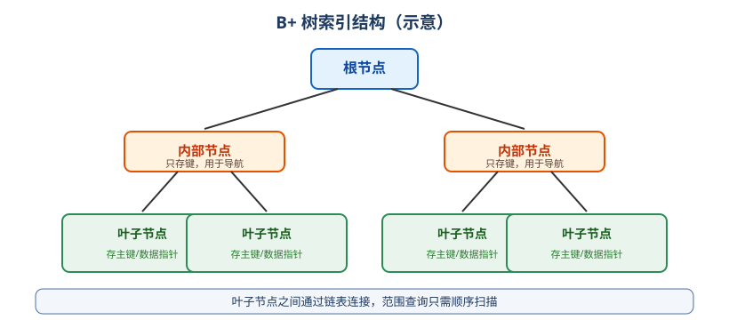

# 索引与性能优化

## 为什么需要索引

索引类似书的目录：没有索引时，查询要**全表扫描**；有索引时，通过 B+ 树快速定位数据。

## B+ 树索引原理



- 非叶子节点只存键值，用于导航；叶子节点存数据（聚簇索引）或主键值（二级索引）。
- 树高通常 3~4 层，千万级数据也只需要几次磁盘 IO。
- **主键索引 = 聚簇索引**：叶子节点直接存整行数据。
- **二级索引**：叶子节点存主键值，查询时先找主键再回表。

## 索引类型

| 类型 | 说明 |
| --- | --- |
| PRIMARY KEY | 主键索引，聚簇索引 |
| UNIQUE KEY | 唯一索引 |
| KEY / INDEX | 普通索引 |
| FULLTEXT | 全文索引 |
| 联合索引 | 多列索引，遵循最左前缀 |
| 覆盖索引 | 查询列全部在索引中，免回表 |

## 创建与删除索引

```sql
CREATE INDEX idx_email ON user (email);
CREATE UNIQUE INDEX uk_username ON user (username);
CREATE INDEX idx_status_age ON user (status, age);

ALTER TABLE user ADD INDEX idx_created_at (created_at);

DROP INDEX idx_email ON user;
```

::: tip
联合索引列顺序很重要：`(status, age)` 能命中 `status` 或 `status + age`，但不能单独命中 `age`。
:::

## EXPLAIN 分析执行计划

```sql
EXPLAIN SELECT * FROM user WHERE email = 'zs@example.com';
```

关键列：

| 列 | 含义 |
| --- | --- |
| `type` | 访问类型：ALL（全表）、index、range、ref、eq_ref、const（由差到好） |
| `key` | 实际使用的索引 |
| `rows` | 预估扫描行数 |
| `Extra` | `Using index`（覆盖索引）、`Using filesort`（文件排序）、`Using temporary`（临时表） |

::: danger 注意
`type = ALL` 且 `rows` 很大，基本就是缺索引；`Using filesort` 提示 ORDER BY 没走索引。
:::

## 索引失效场景

1. 对索引列使用函数或运算：

```sql
-- 失效：对 created_at 使用函数
SELECT * FROM user WHERE YEAR(created_at) = 2026;

-- 正确：范围查询
SELECT * FROM user WHERE created_at >= '2026-01-01' AND created_at < '2027-01-01';
```

2. 隐式类型转换：字符串列和数字比较。
3. `LIKE '%xxx'`：前导通配符。
4. 联合索引不满足最左前缀。
5. `OR` 连接的列只有部分有索引。
6. `NOT IN`、`!=` 可能使索引失效（取决于优化器）。

## 慢查询日志

```ini [my.cnf]
slow_query_log = 1
slow_query_log_file = /var/log/mysql/slow.log
long_query_time = 1
```

查看与解析：

```sql
SHOW VARIABLES LIKE 'slow_query_log';
```

```shell
mysqldumpslow -s at /var/log/mysql/slow.log
```

## 优化建议

1. 为 `WHERE`、`JOIN`、`ORDER BY`、`GROUP BY` 涉及的列建索引。
2. 联合索引把选择性高、等值查询的列放前面。
3. 避免 `SELECT *`，尽量使用覆盖索引。
4. 深分页用键集分页代替 `LIMIT 大偏移量`。
5. 大表定期归档，控制单表数据量；必要时分库分表。
6. 定期 `ANALYZE TABLE` 更新统计信息，让优化器选对索引。

## 验证方式

优化前后分别执行 `EXPLAIN` 对比：

```sql
EXPLAIN SELECT * FROM user WHERE email = 'zs@example.com';
```

预期：优化前 `type=ALL`，加索引后 `type=ref`，`rows` 明显下降。

## 相关专题

- [PostgreSQL 索引](../PostgreSQL/Index/index.md)：多类型索引与覆盖索引的对比
- [SQL 优化](../../SQLOptimization/index.md)：系统化的优化方法论
- [执行计划](../../SQLOptimization/ExplainPlan/index.md)：EXPLAIN 字段与访问类型详解
- [索引原理与失效场景](../../SQLOptimization/IndexPrinciple/index.md)：最左前缀、覆盖索引与十大失效场景
