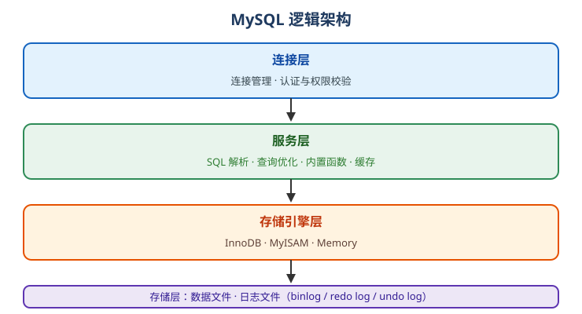

# MySQL 概述

MySQL 是目前应用最广的开源**关系型数据库管理系统（RDBMS）**之一，使用 SQL 语言操作数据，是 Web 应用和企业业务系统的经典选择。

## MySQL 是什么

MySQL 是 Oracle 公司维护的开源数据库，具有以下特点：

- 关系型数据库：数据以「库 → 表 → 行/列」组织，表和表之间可以建立关系。
- SQL 支持：DDL、DML、DQL、DCL、TCL 全覆盖。
- 事务安全：默认存储引擎 InnoDB 支持 ACID 事务和外键。
- 生态成熟：主从复制、读写分离、分库分表、云数据库等方案完善。
- 默认端口：`3306`。

## 版本与维护现状（2026 年）

| 版本 | 类型 | 说明 |
| --- | --- | --- |
| MySQL 8.0 | 已 EOL | 2026 年 4 月停止维护，最后版本为 8.0.46 |
| MySQL 8.4 | LTS | 2024 年 4 月发布，支持到 2031 年，**生产环境推荐** |
| MySQL 9.0 ~ 9.6 | Innovation | 每半年一个创新版本，快速迭代 |
| MySQL 9.7 | LTS | 2026 年 4 月发布，8.4 之后的首个 LTS |

::: danger 注意
MySQL 8.0 已于 2026 年 4 月停止公开安全更新，继续使用存在安全风险，生产环境应尽快升级到 **8.4 LTS** 或 **9.7 LTS**。
:::

## 适用场景

- Web 应用：LNMP / LEMP 经典组合（Linux + Nginx + MySQL + PHP）
- 电商、CMS、SaaS 等业务系统
- 中小数据量、高一致性的 OLTP（在线事务处理）场景
- 需要事务、外键、复杂查询的通用业务

## 与同类数据库对比

| 数据库 | 特点 | 典型场景 |
| --- | --- | --- |
| MySQL | 开源生态好、上手快、资料多 | Web 应用、业务系统 |
| PostgreSQL | 功能更强、扩展丰富、标准更规范 | 复杂查询、地理数据 |
| Oracle | 企业级能力、价格昂贵 | 金融、大型企业 |
| SQLite | 单文件、嵌入式 | 本地工具、小应用 |

## MySQL 逻辑架构

从客户端发起查询到返回结果，数据依次经过四层：

1. **连接层**：管理连接、认证与权限校验。
2. **服务层**：SQL 解析、查询优化、内置函数、缓存。
3. **存储引擎层**：InnoDB、MyISAM、Memory 等引擎，负责读写数据。
4. **存储层**：磁盘上的数据文件、日志文件。

## 学习路径

1. 安装与配置（选 LTS 版本、字符集 utf8mb4）
2. 核心概念（库表、SQL 分类、存储引擎、数据类型）
3. DDL / DML / DQL（建表、增删改、查询）
4. 事务与隔离级别
5. 索引与性能优化
6. 备份恢复、主从复制、高可用

## 相关链接

- MySQL 官方文档：https://dev.mysql.com/doc/
- MySQL 下载页：https://dev.mysql.com/downloads/
- Docker 镜像：https://hub.docker.com/_/mysql
