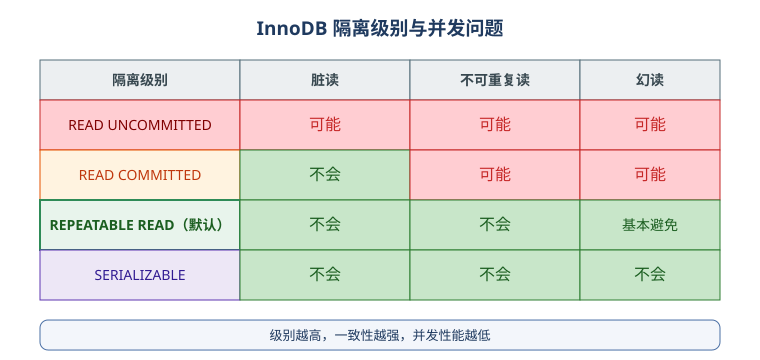

# 事务与隔离级别

## 什么是事务

事务（Transaction）是一组**要么全部成功、要么全部回滚**的数据库操作。典型场景是转账：扣款和入账必须同时成功或同时失败。

## ACID 特性

| 特性 | 含义 |
| --- | --- |
| A 原子性 | 事务中的操作要么全部提交，要么全部回滚 |
| C 一致性 | 事务前后数据约束都满足（金额守恒等） |
| I 隔离性 | 并发事务之间互相隔离 |
| D 持久性 | 事务提交后，修改永久保存 |

## 事务控制

```sql
START TRANSACTION;

UPDATE account SET balance = balance - 100 WHERE id = 1;
UPDATE account SET balance = balance + 100 WHERE id = 2;

COMMIT;   -- 提交
```

出错回滚：

```sql
START TRANSACTION;

UPDATE account SET balance = balance - 100 WHERE id = 1;
SAVEPOINT sp1;
UPDATE account SET balance = balance + 100 WHERE id = 2;

-- 发现问题，回滚到保存点
ROLLBACK TO sp1;
COMMIT;
```

::: danger 注意
1. 事务未提交前，其他会话默认看不到修改（取决于隔离级别）。
2. 连接断开且未 `COMMIT` 时，事务会自动回滚。
3. 事务里不要执行慢查询、远程调用，长事务会占住锁并拖垮数据库。
:::

## 隔离级别



| 隔离级别 | 脏读 | 不可重复读 | 幻读 |
| --- | --- | --- | --- |
| READ UNCOMMITTED | 可能 | 可能 | 可能 |
| READ COMMITTED | 不会 | 可能 | 可能 |
| REPEATABLE READ（默认） | 不会 | 不会 | InnoDB 下基本避免 |
| SERIALIZABLE | 不会 | 不会 | 不会 |

三种并发问题：

- **脏读**：读到其他事务未提交的数据。
- **不可重复读**：同一事务中两次查询同一行，结果不同（行被其他事务修改）。
- **幻读**：同一事务中两次范围查询，行数不同（其他事务插入/删除了行）。

查看与设置：

```sql
SELECT @@transaction_isolation;

SET SESSION TRANSACTION ISOLATION LEVEL READ COMMITTED;
SET GLOBAL TRANSACTION ISOLATION LEVEL REPEATABLE READ;
```

::: tip
MySQL 默认 `REPEATABLE READ`；在 InnoDB 下通过 MVCC 和间隙锁，已经能避免绝大多数幻读问题。读多写少的系统可以保持默认，不必盲目调到 SERIALIZABLE（性能损失大）。
:::

## MVCC：多版本并发控制

- InnoDB 通过 undo log 保存行的多个版本，实现**快照读**。
- 普通 `SELECT` 是快照读，不加锁、不阻塞。
- `SELECT ... FOR UPDATE`、`SELECT ... LOCK IN SHARE MODE` 是**当前读**，会加锁。

```sql
-- 当前读，排他锁
SELECT * FROM account WHERE id = 1 FOR UPDATE;

-- 当前读，共享锁
SELECT * FROM account WHERE id = 1 LOCK IN SHARE MODE;
```

## 锁

| 锁类型 | 说明 |
| --- | --- |
| 共享锁（S） | 可读不可写，多个 S 锁兼容 |
| 排他锁（X） | 读写互斥 |
| 行锁 | InnoDB 默认粒度，锁的是索引记录 |
| 表锁 | MyISAM 默认；也可显式 `LOCK TABLES` |
| 间隙锁 | 锁住范围，用于解决幻读 |
| 意向锁 | 表级意向锁，配合行锁快速判断 |

## 死锁

死锁示例：事务 A 锁了行 1 等行 2，事务 B 锁了行 2 等行 1。

```text
ERROR 1213 (40001): Deadlock found when trying to get lock
```

InnoDB 会自动检测死锁，并回滚其中**一个事务**，另一个继续执行。

避免死锁：

1. 多个事务按**相同的顺序**访问资源。
2. 保持事务短小，尽快提交。
3. 使用统一的索引路径访问数据。
4. 业务侧对 `1213` 错误做重试。

## 验证方式

开两个客户端会话，分别执行：

```sql
-- 会话 A
START TRANSACTION;
SELECT * FROM account WHERE id = 1 FOR UPDATE;

-- 会话 B（会阻塞，直到 A 提交或超时）
SELECT * FROM account WHERE id = 1 FOR UPDATE;
```

观察会话 B 的等待；A `COMMIT` 后 B 立即返回。超时时间由 `innodb_lock_wait_timeout` 控制（默认 50 秒）。
