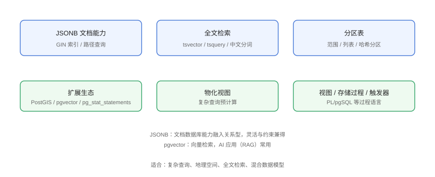

# 高级特性

PostgreSQL 的高级特性让它超越「传统关系型」：JSONB 文档能力、全文检索、分区表、物化视图与丰富扩展（PostGIS、pgvector）。本页逐个实战讲解。

## 特性地图



## JSONB：文档能力

```sql
-- Advanced/01-jsonb.sql
CREATE TABLE products (
    id      BIGINT GENERATED ALWAYS AS IDENTITY PRIMARY KEY,
    name    VARCHAR(100) NOT NULL,
    attrs   JSONB NOT NULL DEFAULT '{}'
);

INSERT INTO products (name, attrs) VALUES
    ('手机', '{"brand": "X", "ram": 8, "colors": ["黑", "白"]}'),
    ('笔记本', '{"brand": "Y", "ram": 16, "colors": ["灰"]}');

-- 路径查询
SELECT name, attrs->>'brand' AS brand, attrs->'ram' AS ram
FROM products
WHERE attrs @> '{"ram": 16}';

-- 更新 JSON 字段
UPDATE products
SET attrs = jsonb_set(attrs, '{ram}', '12')
WHERE name = '手机';
```

::: tip JSONB 要点
- `jsonb`（二进制、可索引、去重）优于 `json`（原样文本）；
- `@>`（包含）、`->`/`->>`（取值）与 GIN 索引配合；
- 适合「结构会变的半结构化字段」，固定字段仍用列。
:::

## 全文检索

```sql
-- Advanced/02-fulltext.sql
CREATE TABLE articles (
    id      BIGINT GENERATED ALWAYS AS IDENTITY PRIMARY KEY,
    title   TEXT NOT NULL,
    body    TEXT NOT NULL
);

-- 建立 tsvector 生成列 + GIN 索引
ALTER TABLE articles
ADD COLUMN search_vec tsvector
GENERATED ALWAYS AS (to_tsvector('simple', title || ' ' || body)) STORED;

CREATE INDEX articles_search_idx ON articles USING GIN (search_vec);

-- 查询
SELECT title
FROM articles
WHERE search_vec @@ to_tsquery('simple', '数据库 & 优化');
```

::: warning 中文分词
内置分词器对中文支持有限；生产中文搜索需扩展（如 zhparser、pg_jieba）或接 Elasticsearch。
:::

## 分区表

```sql
-- Advanced/03-partition.sql
CREATE TABLE orders (
    id          BIGINT GENERATED ALWAYS AS IDENTITY,
    user_id     BIGINT NOT NULL,
    amount      NUMERIC(10,2) NOT NULL,
    created_at  TIMESTAMPTZ NOT NULL
) PARTITION BY RANGE (created_at);

-- 按月建分区
CREATE TABLE orders_2026_07 PARTITION OF orders
    FOR VALUES FROM ('2026-07-01') TO ('2026-08-01');
CREATE TABLE orders_2026_08 PARTITION OF orders
    FOR VALUES FROM ('2026-08-01') TO ('2026-09-01');

-- 分区裁剪：只扫相关分区
EXPLAIN SELECT * FROM orders WHERE created_at >= '2026-08-01' AND created_at < '2026-09-01';
```

分区类型：`RANGE`（范围）、`LIST`（列表）、`HASH`（哈希）。

## 物化视图

```sql
-- Advanced/04-materialized.sql
-- 复杂报表预计算
CREATE MATERIALIZED VIEW monthly_stats AS
SELECT
    date_trunc('month', created_at) AS month,
    COUNT(*) AS orders,
    SUM(amount) AS total
FROM orders
GROUP BY 1;

-- 刷新（可加 CONCURRENTLY 避免阻塞查询，需唯一索引）
REFRESH MATERIALIZED VIEW CONCURRENTLY monthly_stats;

-- 查询
SELECT * FROM monthly_stats ORDER BY month DESC;
```

## 视图 / 存储过程 / 触发器

```sql
-- Advanced/05-procedure.sql
-- 视图
CREATE VIEW active_users AS
SELECT id, username, created_at FROM users WHERE status = 'active';

-- 存储过程（PL/pgSQL）
CREATE OR REPLACE FUNCTION create_user(p_username TEXT, p_email TEXT)
RETURNS BIGINT AS $$
DECLARE
    v_id BIGINT;
BEGIN
    INSERT INTO users (username, email) VALUES (p_username, p_email)
    RETURNING id INTO v_id;
    RETURN v_id;
END;
$$ LANGUAGE plpgsql;

SELECT create_user('carol', 'carol@example.com');

-- 触发器：更新 updated_at
CREATE OR REPLACE FUNCTION touch_updated_at()
RETURNS TRIGGER AS $$
BEGIN
    NEW.updated_at = now();
    RETURN NEW;
END;
$$ LANGUAGE plpgsql;

CREATE TRIGGER users_touch BEFORE UPDATE ON users
FOR EACH ROW EXECUTE FUNCTION touch_updated_at();
```

## 扩展生态

```sql
-- Advanced/06-extensions.sql
-- 统计插件（调优必备）
CREATE EXTENSION IF NOT EXISTS pg_stat_statements;

-- 地理空间
CREATE EXTENSION IF NOT EXISTS postgis;

-- AI 向量检索（RAG）
CREATE EXTENSION IF NOT EXISTS vector;

-- 模糊匹配
CREATE EXTENSION IF NOT EXISTS pg_trgm;
```

### pgvector 示例

```sql
-- Advanced/07-pgvector.sql
CREATE TABLE embeddings (
    id       BIGINT GENERATED ALWAYS AS IDENTITY PRIMARY KEY,
    content  TEXT,
    embedding vector(1536)
);

CREATE INDEX embeddings_idx ON embeddings
USING hnsw (embedding vector_cosine_ops);

-- 相似度检索
SELECT content, 1 - (embedding <=> $1::vector) AS similarity
FROM embeddings
ORDER BY embedding <=> $1::vector
LIMIT 5;
```

## 易错点与最佳实践

::: danger 常见坑
1. **JSONB 字段全表扫描**：查询 JSON 条件必须建 GIN 索引。
2. **分区表不建索引**：分区索引要建在每个分区（或通过父表 `CREATE INDEX ON ONLY` 管理）。
3. **物化视图不刷新**：数据过期，需定期 `REFRESH`（cron / pg_cron）。
4. **触发器滥用**：隐藏逻辑难排查，优先应用层事务。
5. **扩展版本与 PG 不匹配**：装扩展前核对兼容性。
:::

::: tip 最佳实践
- JSONB 用于「属性可变」的字段，核心业务字段坚持强类型列；
- 大表（千万级+）用分区 + 定期归档；
- pgvector 适合中小规模向量检索，超大规模（千万+）考虑专用向量库。
:::

## 验证方式

```sql
-- 逐节执行后验证
SELECT attrs->>'brand' FROM products WHERE attrs @> '{"ram": 16}';
EXPLAIN SELECT * FROM orders WHERE created_at >= '2026-08-01';
SELECT * FROM monthly_stats ORDER BY month DESC LIMIT 5;
```

预期：JSONB 查询返回品牌、分区查询走 `Seq Scan on orders_2026_08`（分区裁剪）、物化视图返回统计行。

## 参考资料

- [PostgreSQL JSON 类型](https://www.postgresql.org/docs/current/datatype-json.html)
- [PostgreSQL 全文检索](https://www.postgresql.org/docs/current/textsearch.html)
- [PostgreSQL 分区](https://www.postgresql.org/docs/current/ddl-partitioning.html)
- [pgvector GitHub](https://github.com/pgvector/pgvector)
