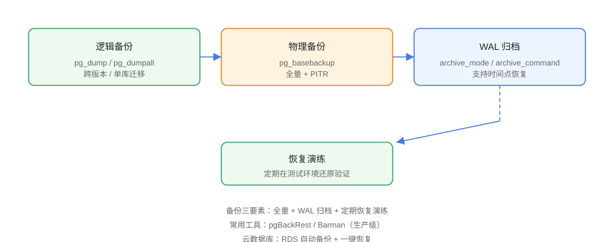

# 备份与恢复

备份与恢复是数据库运维的生命线。PostgreSQL 提供**逻辑备份**（pg_dump，单库/跨版本）与**物理备份**（pg_basebackup + WAL 归档，支持时间点恢复 PITR）。本页覆盖完整方案与恢复演练。

## 备份方案对比



| 维度 | 逻辑备份（pg_dump） | 物理备份（pg_basebackup） |
| --- | --- | --- |
| 粒度 | 单库/单表 | 整个集群 |
| 恢复 | 灵活（选择性） | 全量恢复 |
| PITR | 不支持 | 支持（WAL 归档） |
| 跨版本 | 支持 | 通常同版本 |
| 速度 | 慢（导出数据） | 快（文件级） |
| 适用 | 迁移、单库备份 | 生产全量 + PITR |

## 逻辑备份

```shell
# 单库备份（自定义格式，支持选择性恢复）
pg_dump -h localhost -U app_user -d appdb -Fc -f appdb.dump

# 压缩 SQL 格式
pg_dump -h localhost -U app_user -d appdb | gzip > appdb.sql.gz

# 只备份某个表
pg_dump -h localhost -U app_user -d appdb -t public.users -Fc -f users.dump

# 全集群备份（角色、数据库定义等）
pg_dumpall -h localhost -U postgres -f cluster.sql
```

### 恢复逻辑备份

```shell
# 先建库再恢复
createdb -h localhost -U postgres appdb_restore

# 自定义格式恢复
pg_restore -h localhost -U postgres -d appdb_restore appdb.dump

# SQL 格式恢复
psql -h localhost -U postgres -d appdb_restore < appdb.sql
```

## 物理备份 + PITR

### 1. 开启 WAL 归档

```conf
# postgresql.conf
wal_level = replica
archive_mode = on
archive_command = 'test ! -f /backup/wal/%f && cp %p /backup/wal/%f'
```

```shell
sudo systemctl restart postgresql
```

### 2. 基础备份

```shell
# 全量基础备份
pg_basebackup -h localhost -U postgres -D /backup/base \
  -Ft -z -P -X fetch
```

### 3. 时间点恢复

```shell
# 1. 用基础备份恢复数据目录
# 2. 在数据目录放 recovery.signal 并配置恢复目标
echo 'restore_command = '\''cp /backup/wal/%f %p'\''' >> postgresql.conf
echo 'recovery_target_time = '\''2026-08-30 10:30:00+08'\''' >> postgresql.conf
touch recovery.signal

# 3. 启动，PG 自动重放 WAL 到指定时间点
sudo systemctl start postgresql
```

::: danger PITR 的前提
时间点恢复必须满足：基础备份 + 从备份时间点到目标时间点的**全部 WAL 归档**。归档缺失则无法恢复，所以归档可用性要监控。
:::

## 生产级工具

### pgBackRest

```ini
# /etc/pgbackrest.conf
[global]
repo1-path=/var/lib/pgbackrest
repo1-retention-full=7

[main]
pg1-path=/var/lib/postgresql/18/main
```

```shell
pgbackrest backup --stanza=main --type=full
pgbackrest backup --stanza=main --type=incr
pgbackrest restore --stanza=main
pgbackrest info --stanza=main
```

### Barman

```shell
sudo apt install barman
barman backup main
barman recover main --target-time "2026-08-30 10:30:00" /restore/path
barman check main
```

## 备份策略模板

| 频率 | 内容 |
| --- | --- |
| 每天 | 增量/差异备份（pgBackRest incr） |
| 每周 | 全量备份（full） |
| 实时 | WAL 归档（archive_command） |
| 每月 | 恢复演练（验证备份可用） |
| 每年 | 全量异地带宽/长期归档 |

## 易错点与最佳实践

::: danger 常见坑
1. **只备份不演练**：备份损坏或恢复失败直到事故才发现，等于没有备份。
2. **归档目录与库同盘**：磁盘一起坏，备份失效，归档必须异地/异盘。
3. **pg_dump 期间数据一致性**：默认非一致性快照，大事务场景加 `--serializable-deferrable` 或锁表评估。
4. **恢复到错误实例**：恢复前确认目标集群、端口与数据目录。
5. **权限问题**：postgres 用户才能读写数据目录，备份目录权限要配好。
:::

::: tip 最佳实践
- 生产用 pgBackRest/Barman 管理全量 + 增量 + WAL 归档；
- 恢复演练自动化（每月 cron + 校验脚本）；
- 备份文件加密 + 异地存储（对象存储）；
- 云数据库（RDS）用平台自动备份 + 一键恢复。
:::

## 验证方式

```shell
# 1. 备份
pg_dump -h localhost -U app_user -d appdb -Fc -f /backup/appdb.dump

# 2. 删数据模拟事故
psql -U app_user -d appdb -c "DROP TABLE users;"

# 3. 恢复
pg_restore -U postgres -d appdb /backup/appdb.dump

# 4. 验证
psql -U app_user -d appdb -c "SELECT count(*) FROM users;"
```

预期：删除后通过备份完整恢复，`SELECT count(*)` 与备份前一致。

## 参考资料

- [PostgreSQL 备份文档](https://www.postgresql.org/docs/current/backup.html)
- [pg_dump 文档](https://www.postgresql.org/docs/current/app-pgdump.html)
- [pgBackRest 官方文档](https://pgbackrest.org/)
- [Barman 文档](https://docs.pgbarman.org/)
