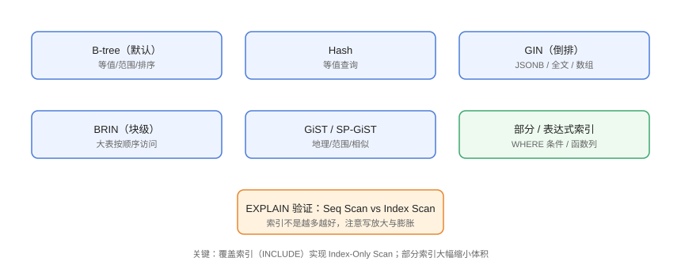

# 索引详解

索引是 PostgreSQL 查询加速的核心。PG 提供多种索引类型（B-tree、Hash、GIN、BRIN、GiST），配合部分索引、表达式索引与覆盖索引，几乎覆盖所有查询形态。本页讲透「何时用哪种」与「如何验证」。

## 索引类型



| 类型 | 适用 | 示例 |
| --- | --- | --- |
| B-tree（默认） | 等值、范围、排序 | `WHERE id = 1`、`BETWEEN`、`ORDER BY` |
| Hash | 等值（不支持范围/排序） | `WHERE email = 'a@b.com'` |
| GIN | 复合值成员查询 | JSONB、全文、数组 `@>` |
| BRIN | 大表顺序访问（节省空间） | 时间序列日志表 |
| GiST / SP-GiST | 空间/范围/相似 | PostGIS、`<->` 距离 |

## 创建索引

```sql
-- Index/01-create.sql
CREATE INDEX idx_users_username ON users (username);
CREATE INDEX idx_posts_user_id ON posts (user_id);

-- 唯一索引（约束底层也是索引）
CREATE UNIQUE INDEX idx_users_email ON users (email);

-- 复合索引（列顺序很重要：等值在前，范围在后）
CREATE INDEX idx_posts_user_created ON posts (user_id, created_at DESC);

-- 表达式索引
CREATE INDEX idx_users_lower_email ON users (lower(email));

-- 部分索引（只索引部分行，体积小）
CREATE INDEX idx_posts_active ON posts (id)
WHERE status = 'published';

-- 覆盖索引（Index-Only Scan）
CREATE INDEX idx_posts_cover ON posts (user_id) INCLUDE (title, created_at);
```

::: tip 复合索引列顺序
`(user_id, created_at)` 能加速「按用户查 + 排序」；反过来 `(created_at, user_id)` 则不能。原则：**等值条件列放前面，范围/排序列放后面**。
:::

## 用 EXPLAIN 验证

```sql
-- Index/02-explain.sql
EXPLAIN ANALYZE
SELECT * FROM posts WHERE user_id = 1 ORDER BY created_at DESC LIMIT 20;
```

输出解读：

```text
Limit  (cost=0.43..1.76 rows=20 width=...) (actual time=0.02..0.05 rows=20 loops=1)
  ->  Index Scan Backward using idx_posts_user_created on posts
      (cost=0.43..4.42 rows=50 width=...) (actual time=0.02..0.04 rows=20 loops=1)
        Index Cond: (user_id = 1)
```

| 计划节点 | 含义 |
| --- | --- |
| `Seq Scan` | 全表扫描（大表通常要优化） |
| `Index Scan` | 索引定位 + 回表 |
| `Index Only Scan` | 索引覆盖，不回表（最快） |
| `Bitmap Index Scan` | 位图扫描（多条件组合） |

## 索引使用原则

### 什么情况走不了索引

```sql
-- Index/03-bad-patterns.sql
-- 函数包裹列（除非建表达式索引）
SELECT * FROM users WHERE lower(email) = 'a@b.com';

-- 隐式类型转换
SELECT * FROM posts WHERE created_at::date = '2026-08-30';

-- 前导通配符
SELECT * FROM users WHERE username LIKE '%alice%';

-- 复合索引跳列
SELECT * FROM posts WHERE created_at > '2026-08-01';  -- 无 user_id 前缀
```

### 索引维护

```sql
-- 查看索引使用统计（需要 pg_stat_statements 或 pg_stat_user_indexes）
SELECT
    schemaname, relname, indexrelname,
    idx_scan, idx_tup_read
FROM pg_stat_user_indexes
ORDER BY idx_scan ASC
LIMIT 10;

-- 重建膨胀索引
REINDEX INDEX idx_posts_user_created;
```

::: danger 索引不是越多越好
每个索引都增加写入成本与存储：高频查询建索引，低频/未使用索引要清理（用 `pg_stat_user_indexes` 的 `idx_scan` 识别）。
:::

## 与 MySQL 的差异

| 维度 | PostgreSQL | MySQL |
| --- | --- | --- |
| 默认索引 | B-tree | B+Tree（InnoDB 聚簇） |
| 聚簇索引 | 无（堆表 + 独立索引） | InnoDB 主键聚簇 |
| 多类型索引 | GIN/BRIN/GiST/Hash | 有限（全文/空间） |
| 覆盖索引 | `INCLUDE` | 通过组合列模拟 |
| 索引失效 | 相对更少 | 隐式转换等较多 |

::: tip PG 的优势
PG 的优化器与多种索引让「函数/JSON 查询」也能走索引；MySQL 常见「索引失效」场景在 PG 中很多可用表达式索引化解。
:::

## 易错点与最佳实践

::: danger 常见坑
1. **小表也建一堆索引**：小表顺序扫描更快，索引是负担。
2. **只看 EXPLAIN 不看 ANALYZE**：`EXPLAIN ANALYZE` 才执行查询并给出真实耗时与行数。
3. **统计信息过期**：数据量大变后要 `ANALYZE`，否则优化器选错计划。
4. **复合索引顺序反了**：等值列必须在前面。
5. **忘记部分/覆盖索引**：高频查询用 INCLUDE 实现 Index-Only Scan。
:::

::: tip 最佳实践
- 先 `EXPLAIN ANALYZE` 定位瓶颈，再决定索引；
- 用 `pg_stat_user_indexes` 定期清理未使用索引；
- 大表建索引用 `CREATE INDEX CONCURRENTLY`（不阻塞读写）。
:::

## 验证方式

```sql
EXPLAIN ANALYZE SELECT * FROM posts WHERE user_id = 1 ORDER BY created_at DESC LIMIT 20;
```

预期：`Index Scan`/`Index Only Scan` 而非 `Seq Scan`；`actual time` 在毫秒级。删除索引后再跑一次对比耗时，确认索引收益。

## 参考资料

- [PostgreSQL 索引文档](https://www.postgresql.org/docs/current/indexes.html)
- [PostgreSQL 索引类型](https://www.postgresql.org/docs/current/indexes-types.html)
- [EXPLAIN 文档](https://www.postgresql.org/docs/current/sql-explain.html)
