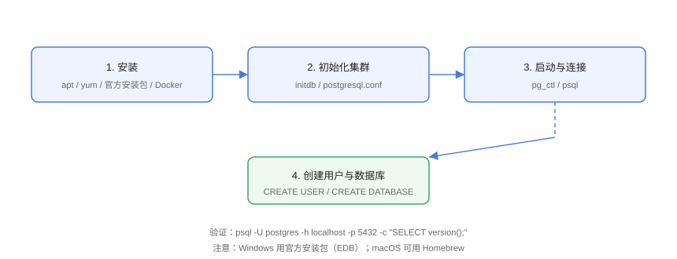

# 安装与配置

PostgreSQL 支持 Linux、Windows、macOS 与 Docker 部署。本页覆盖各平台安装、初始化、连接配置与常见配置项，完成后能用 `psql` 正常连接并创建库。

## 安装流程



## Linux（Ubuntu/Debian）

```shell
# 添加官方源并安装
sudo apt install postgresql-18

# 服务管理
sudo systemctl enable --now postgresql
sudo systemctl status postgresql
```

安装后默认创建 `postgres` 超级用户与 `main` 集群，数据目录在 `/var/lib/postgresql/18/main`。

## Docker 部署

```shell
# 启动容器（密码通过环境变量设置）
docker run -d \
  --name pg \
  -e POSTGRES_PASSWORD=mysecret \
  -e POSTGRES_DB=appdb \
  -p 5432:5432 \
  -v pgdata:/var/lib/postgresql/data \
  postgres:18

# 进入容器使用 psql
docker exec -it pg psql -U postgres
```

## Windows / macOS

| 平台 | 方式 |
| --- | --- |
| Windows | 官方 EDB 安装包（含 pgAdmin），一路默认即可 |
| macOS | `brew install postgresql@18`，`brew services start postgresql@18` |

## 首次连接

### Linux 本机

```shell
# 默认 peer 认证：切换到 postgres 系统用户
sudo -u postgres psql
```

### 设置密码并允许远程

```sql
-- 设置 postgres 用户密码
ALTER USER postgres WITH PASSWORD 'your_password';
```

```shell
# 修改监听地址（postgresql.conf）
listen_addresses = 'localhost, 192.168.1.10'
```

```text
# 修改认证方式（pg_hba.conf），按需放开
host    all             all             0.0.0.0/0          scram-sha-256
```

```shell
# 重启生效
sudo systemctl restart postgresql
```

::: danger 不要在生产放开 0.0.0.0/0
远程访问必须限定 IP 网段 + `scram-sha-256` 密码认证，禁止 `trust` 认证与任意 IP 放行。
:::

## 创建用户与数据库

```sql
-- 创建专用用户（不直接用 postgres）
CREATE USER app_user WITH PASSWORD 'app_password';

-- 创建数据库并指定属主
CREATE DATABASE appdb OWNER app_user;

-- 授权
GRANT ALL PRIVILEGES ON DATABASE appdb TO app_user;
```

```shell
# 连接测试
psql -h localhost -p 5432 -U app_user -d appdb
```

## 核心配置项

配置文件：`postgresql.conf`（Linux 在 `/etc/postgresql/18/main/`）。

| 参数 | 默认 | 说明 |
| --- | --- | --- |
| `listen_addresses` | localhost | 监听地址 |
| `port` | 5432 | 端口 |
| `shared_buffers` | 128MB | 共享缓冲区（建议内存 25%） |
| `work_mem` | 4MB | 单次排序/哈希内存 |
| `max_connections` | 100 | 最大连接数 |
| `wal_level` | replica | WAL 级别（replica 支持归档与复制） |
| `archive_mode` | off | WAL 归档开关 |
| `logging_collector` | off | 日志收集 |
| `log_min_duration_statement` | -1 | 慢查询阈值（毫秒） |

```shell
# 查看当前生效配置
SHOW shared_buffers;
SHOW max_connections;
```

## 连接工具

| 工具 | 用途 |
| --- | --- |
| `psql` | 命令行客户端 |
| pgAdmin | 图形化管理 |
| DBeaver / DataGrip | 通用数据库客户端 |
| `pg_isready` | 连接健康检查 |

```shell
# 健康检查
pg_isready -h localhost -p 5432
# 输出：localhost:5432 - accepting connections
```

## 易错点与最佳实践

::: danger 常见坑
1. **Linux 用 `psql` 报 peer 认证失败**：先 `sudo -u postgres psql`，再设置密码改用 md5/scram。
2. **改了 postgresql.conf 不重启**：`ALTER SYSTEM` 或手动修改后必须重启或 `SELECT pg_reload_conf()`（部分参数）。
3. **数据目录权限错误**：Docker 挂载目录权限不对导致启动失败，检查 `-v` 挂载属主。
4. **防火墙未放行**：云服务器需在安全组放行 5432。
5. **用 postgres 跑业务**：应用用专用低权限用户，最小权限原则。
:::

::: tip 最佳实践
- 生产连接走连接池（PgBouncer），限制直连数；
- `shared_buffers` 按机器内存调（约 25%），配合 `effective_cache_size`；
- 慢查询日志开启 `log_min_duration_statement = 1000`。
:::

## 验证方式

```shell
pg_isready -h localhost -p 5432
psql -h localhost -U app_user -d appdb -c "SELECT current_database(), current_user;"
```

预期输出：

```text
localhost:5432 - accepting connections
 current_database | current_user
------------------+--------------
 appdb            | app_user
```

## 参考资料

- [PostgreSQL 安装文档](https://www.postgresql.org/download/)
- [PostgreSQL 服务器配置](https://www.postgresql.org/docs/current/runtime-config.html)
- [pg_hba.conf 文档](https://www.postgresql.org/docs/current/auth-pg-hba-conf.html)
