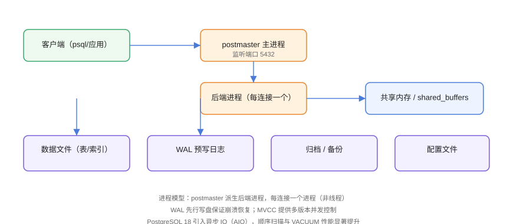

# PostgreSQL 概述

PostgreSQL 是一个**对象关系型**开源数据库，以功能全面、标准兼容、扩展性强著称，被誉为「世界上最先进的开源关系型数据库」。它支持完整 ACID、丰富数据类型、复杂查询与大量扩展（PostGIS、pgvector 等）。

## 架构概览



核心特点：

- **进程模型**：`postmaster` 主进程派生后端进程，每连接一个进程；
- **共享内存**：`shared_buffers` 缓存数据页；
- **WAL 预写日志**：先写日志再写数据，崩溃可恢复；
- **MVCC**：多版本并发控制，读写互不阻塞。

## 与 MySQL 的对比

| 维度 | PostgreSQL | MySQL |
| --- | --- | --- |
| 模型 | 对象关系型 | 关系型 |
| 标准兼容 | 更严格（SQL 标准） | 语法宽松、方言多 |
| 数据类型 | 丰富（JSONB/数组/范围/UUID） | 较基础 |
| 索引 | 多种（B-tree/Hash/GIN/BRIN/GiST） | B-tree 为主 + 全文 |
| 事务 | 强 ACID、隔离级别完整 | InnoDB 支持，默认不同 |
| 扩展 | 极强（PostGIS/pgvector） | 有但受限 |
| 生态 | 开源社区 + 商业支持 | 应用最广、云厂商支持多 |
| 适用 | 复杂查询、GIS、JSON、AI 向量 | Web 主流、读写均衡 |

::: tip 选型建议
- 复杂查询、报表、JSON 文档、GIS、AI 向量检索 → PostgreSQL；
- 团队最熟悉、生态依赖 MySQL、纯 Web CRUD → 可继续 MySQL；
- 两者都是优秀选择，**按团队与场景决定**，不要盲目迁移。
:::

## 版本演进

| 版本 | 发布时间 | 亮点 |
| --- | --- | --- |
| PostgreSQL 16 | 2023-09 | 逻辑复制增强、并行查询改进 |
| PostgreSQL 17 | 2024-09 | VACUUM 性能、增量排序、JSONB 优化 |
| PostgreSQL 18 | 2025-09 | **异步 IO（AIO）**、跳过扫描、统计信息跨版本迁移 |
| PostgreSQL 19 | 2026（Beta） | 开发中 |

当前稳定版：**18.6**（2026-08）；14 及以下版本即将/已停止维护，建议尽早升级。

## 核心概念

| 概念 | 说明 |
| --- | --- |
| 集群（Cluster） | 一组数据库实例，共享端口与数据目录 |
| 数据库（Database） | 集群内的独立数据库 |
| Schema | 数据库内的命名空间（默认 public） |
| 表（Table） | 数据存储单元 |
| 序列（Sequence） | 自增值生成器 |
| 视图 / 物化视图 | 查询封装 / 预计算结果 |
| 扩展（Extension） | 功能插件（PostGIS、pgvector） |

## 典型应用场景

1. 需要复杂 SQL（窗口函数、CTE、递归）的业务；
2. JSON 半结构化数据 + 关系数据混合；
3. 地理空间应用（PostGIS）；
4. AI 应用向量检索（pgvector）；
5. 金融、政务等对事务与合规要求高的系统。

## 易错点与最佳实践

::: danger 常见坑
1. **与 MySQL 语法混淆**：字符串拼接用 `||`、自增用 `IDENTITY`、`LIMIT` 语法不同，迁移时逐项核对。
2. **误用 varchar 存所有文本**：PostgreSQL 有 text 类型，无需限定长度。
3. **忘记 VACUUM**：高频更新产生死元组，表膨胀影响性能，依赖 autovacuum 也要监控。
4. **连接数设置过大**：每连接一个进程，内存占用高，用连接池（PgBouncer）。
5. **忽略备份演练**：功能再强，没验证过的备份等于没有。
:::

::: tip 最佳实践
- 新项目若没有强 MySQL 依赖，PostgreSQL 是更「面向未来」的选择；
- 生产开启 `pg_stat_statements` 与慢查询日志，为调优留数据；
- 大版本升级走 `pg_upgrade` + 完整备份验证。
:::

## 验证方式

```shell
psql --version
psql -U postgres -c "SELECT version();"
```

预期：输出版本号（18.x）与完整的版本信息字符串。

## 参考资料

- [PostgreSQL 官方文档](https://www.postgresql.org/docs/)
- [PostgreSQL 中文社区](http://www.postgres.cn/)
- [PostgreSQL 版本政策](https://www.postgresql.org/support/versioning/)
