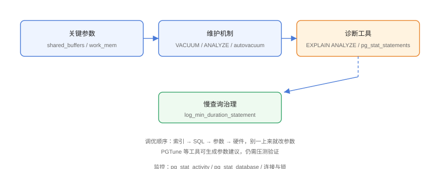

# 性能调优

PostgreSQL 性能调优遵循「**索引 → SQL → 参数 → 硬件**」的顺序。本页覆盖关键参数、VACUUM 机制、慢查询定位与诊断工具，避免「一上来就改参数」的常见误区。

## 调优路线



## 关键参数

```conf
# postgresql.conf（按机器内存调整）
shared_buffers = 4GB              # 建议内存 25%（如 16GB 机器设 4GB）
effective_cache_size = 12GB       # OS 缓存可用量（约内存 75%）
work_mem = 16MB                   # 单次排序/哈希内存
maintenance_work_mem = 1GB        # VACUUM/建索引内存
max_connections = 100             # 进程模型，勿贪多
wal_buffers = 64MB                # WAL 缓冲
checkpoint_timeout = 15min
max_wal_size = 4GB                # 触发检查点的 WAL 上限
```

::: tip 参数从哪里来
用 [PGTune](https://pgtune.leopard.in.ua/) 按「内存 + 磁盘 + 工作负载」生成建议，再压测验证；云数据库（RDS）参数组可直接改。
:::

## VACUUM 与表膨胀

PG 的 MVCC 依赖多版本：更新/删除产生**死元组**，由 VACUUM 清理。

```sql
-- 手动清理 + 分析
VACUUM (VERBOSE, ANALYZE) users;

-- 查看表膨胀与死元组
SELECT
    relname,
    n_dead_tup,
    n_live_tup,
    last_autovacuum
FROM pg_stat_user_tables
WHERE relname = 'users';
```

| 对象 | 说明 |
| --- | --- |
| `autovacuum` | 默认开启，自动触发 |
| `autovacuum_vacuum_scale_factor` | 触发阈值（默认 0.2，大表可调小） |
| `VACUUM FULL` | 重写表压缩空间（**锁表**，避免高峰期） |
| 膨胀影响 | 查询变慢、磁盘占用上升 |

::: danger VACUUM FULL 会锁表
`VACUUM FULL` 需要独占锁，大表会阻塞读写。生产用 pg_repack 在线重写，或错峰执行。
:::

## 慢查询定位

### 开启慢查询日志

```conf
# postgresql.conf
logging_collector = on
log_min_duration_statement = 1000      # 记录超过 1 秒的查询
log_statement = 'none'
```

```shell
sudo systemctl restart postgresql
# 日志在 /var/log/postgresql/ 或日志目录
```

### pg_stat_statements

```sql
CREATE EXTENSION IF NOT EXISTS pg_stat_statements;

-- 最耗时的查询 TOP10
SELECT
    calls,
    round(total_exec_time / 1000, 2) AS total_sec,
    round(mean_exec_time, 2) AS mean_ms,
    query
FROM pg_stat_statements
ORDER BY total_exec_time DESC
LIMIT 10;
```

### 实时会话监控

```sql
-- 当前运行中的查询与等待事件
SELECT pid, state, wait_event_type, wait_event,
       now() - query_start AS duration, left(query, 80) AS query
FROM pg_stat_activity
WHERE state = 'active'
ORDER BY duration DESC;
```

## 连接与锁

```sql
-- 锁等待排查
SELECT
    blocked.pid AS blocked_pid,
    blocking.pid AS blocking_pid,
    left(blocked.query, 50) AS blocked_query
FROM pg_stat_activity blocked
JOIN pg_stat_activity blocking
  ON blocking.pid = ANY(pg_blocking_pids(blocked.pid));
```

::: tip 连接池
PG 每连接一个进程，`max_connections=100` 时连接内存可达 GB 级。高并发应用用 **PgBouncer**（事务级连接池）或应用层连接池，同时控制 `max_connections` 防止打爆。
:::

## 查询计划诊断

```sql
-- 完整诊断
EXPLAIN (ANALYZE, BUFFERS, FORMAT JSON)
SELECT * FROM posts p
JOIN users u ON u.id = p.user_id
WHERE p.created_at > now() - interval '30 days';
```

关注点：

1. 是否有 `Seq Scan` 出现在大表上；
2. 预估行数与实际行数偏差（统计信息过期 → `ANALYZE`）；
3. 是否出现 `Nested Loop` 死循环式小步扫描；
4. 排序是否在磁盘（`work_mem` 不足，`Sort Method: external merge`）。

## 性能监控指标

| 指标 | 查看方式 |
| --- | --- |
| 缓存命中率 | `pg_stat_database.blks_hit / blks_read` |
| 死元组比例 | `pg_stat_user_tables.n_dead_tup` |
| 事务/秒 | `pg_stat_database.xact_commit + xact_rollback` |
| 连接数 | `pg_stat_activity` count |
| 锁等待 | `pg_locks` + `pg_stat_activity` |

```sql
-- 缓存命中率
SELECT
    datname,
    round(blks_hit::numeric / (blks_hit + blks_read) * 100, 2) AS hit_ratio
FROM pg_stat_database
WHERE datname NOT IN ('template0', 'template1');
```

## 易错点与最佳实践

::: danger 常见坑
1. **顺序颠倒**：先改参数不查 SQL，收效甚微且掩盖真问题。
2. **`work_mem` 设太大**：每个排序/哈希都可能分配，并发下内存爆掉。
3. **`max_connections` 拉满**：进程模型内存线性增长，用连接池替代。
4. **关闭 autovacuum**：表膨胀失控，性能雪崩。
5. **生产跑 `VACUUM FULL`**：锁表事故，用 pg_repack。
:::

::: tip 最佳实践
- 调优顺序：索引与 SQL 先行（收益 80%），参数其次，硬件最后；
- 监控系统（Prometheus + postgres_exporter）持续跟踪指标；
- 大版本升级后对比基准（PostgreSQL 18 起统计信息可跨版本保留）。
:::

## 验证方式

```sql
EXPLAIN (ANALYZE, BUFFERS) SELECT ...;   -- 慢查询前后对比
SELECT * FROM pg_stat_statements ORDER BY total_exec_time DESC LIMIT 5;
```

预期：优化后查询耗时下降、执行计划从 `Seq Scan` 变为 `Index Scan`、缓存命中率 > 99%。

## 参考资料

- [PostgreSQL 性能 FAQ](https://wiki.postgresql.org/wiki/Performance_FAQ)
- [PGTune](https://pgtune.leopard.in.ua/)
- [pg_stat_statements 文档](https://www.postgresql.org/docs/current/pgstatstatements.html)
- [postgres_exporter](https://github.com/prometheus-community/postgres_exporter)
