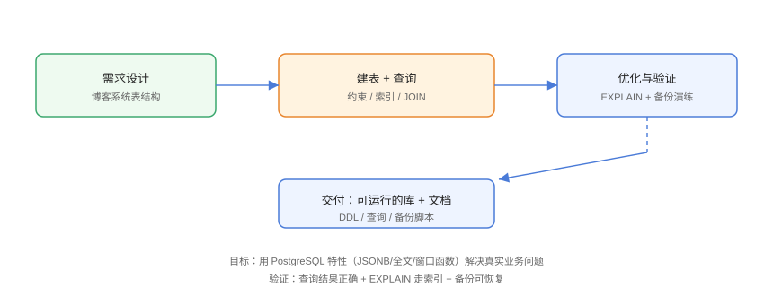

# 实战：博客系统数据库

用 PostgreSQL 实现一个博客系统数据库：用户、文章、评论、标签表，覆盖约束、索引、JSONB、全文检索、窗口函数与视图，最后做性能验证与备份。做完即掌握 PG 的核心实战技能。

## 需求与设计



数据模型：

```text
users  用户（用户名唯一、邮箱唯一）
posts  文章（作者外键、状态、JSONB 扩展属性、全文检索列）
comments 评论（文章外键、用户外键、父评论）
tags / post_tags 标签（多对多）
```

## 1. 建库建表

```sql
-- Practice/01-schema.sql
CREATE DATABASE blog OWNER app_user;
\c blog app_user

CREATE TABLE users (
    id          BIGINT GENERATED ALWAYS AS IDENTITY PRIMARY KEY,
    username    VARCHAR(50) NOT NULL UNIQUE,
    email       VARCHAR(255) NOT NULL UNIQUE,
    bio         TEXT,
    created_at  TIMESTAMPTZ NOT NULL DEFAULT now()
);

CREATE TABLE posts (
    id          BIGINT GENERATED ALWAYS AS IDENTITY PRIMARY KEY,
    user_id     BIGINT NOT NULL REFERENCES users(id) ON DELETE CASCADE,
    title       VARCHAR(200) NOT NULL,
    slug        VARCHAR(220) NOT NULL UNIQUE,
    content     TEXT NOT NULL,
    status      VARCHAR(20) NOT NULL DEFAULT 'draft'
                CHECK (status IN ('draft', 'published', 'archived')),
    meta        JSONB NOT NULL DEFAULT '{}',
    view_count  INT NOT NULL DEFAULT 0,
    created_at  TIMESTAMPTZ NOT NULL DEFAULT now(),
    updated_at  TIMESTAMPTZ NOT NULL DEFAULT now()
);

CREATE TABLE comments (
    id          BIGINT GENERATED ALWAYS AS IDENTITY PRIMARY KEY,
    post_id     BIGINT NOT NULL REFERENCES posts(id) ON DELETE CASCADE,
    user_id     BIGINT NOT NULL REFERENCES users(id) ON DELETE CASCADE,
    parent_id   BIGINT REFERENCES comments(id) ON DELETE CASCADE,
    content     TEXT NOT NULL,
    created_at  TIMESTAMPTZ NOT NULL DEFAULT now()
);

CREATE TABLE tags (
    id      BIGINT GENERATED ALWAYS AS IDENTITY PRIMARY KEY,
    name    VARCHAR(50) NOT NULL UNIQUE
);

CREATE TABLE post_tags (
    post_id BIGINT NOT NULL REFERENCES posts(id) ON DELETE CASCADE,
    tag_id  BIGINT NOT NULL REFERENCES tags(id) ON DELETE CASCADE,
    PRIMARY KEY (post_id, tag_id)
);
```

## 2. 索引设计

```sql
-- Practice/02-indexes.sql
-- 文章按作者 + 时间查询
CREATE INDEX idx_posts_user_created ON posts (user_id, created_at DESC);

-- 文章状态查询（部分索引）
CREATE INDEX idx_posts_published ON posts (created_at DESC)
WHERE status = 'published';

-- 评论按文章查询
CREATE INDEX idx_comments_post ON comments (post_id, created_at);

-- JSONB 属性查询
CREATE INDEX idx_posts_meta ON posts USING GIN (meta);

-- 全文检索
ALTER TABLE posts
ADD COLUMN search_vec tsvector
GENERATED ALWAYS AS (
    to_tsvector('simple', coalesce(title, '') || ' ' || coalesce(content, ''))
) STORED;

CREATE INDEX idx_posts_search ON posts USING GIN (search_vec);
```

## 3. 示例数据与查询

```sql
-- Practice/03-queries.sql
INSERT INTO users (username, email, bio) VALUES
    ('alice', 'alice@example.com', 'PostgreSQL 爱好者'),
    ('bob', 'bob@example.com', '全栈工程师');

INSERT INTO posts (user_id, title, slug, content, status, meta) VALUES
    (1, 'PostgreSQL 实战入门', 'pg-basics',
     '本文介绍 PostgreSQL 的核心概念与实战技巧。',
     'published', '{"featured": true, "reading_minutes": 8}'),
    (1, 'JSONB 使用指南', 'jsonb-guide',
     'JSONB 让关系型数据库也能灵活存储半结构化数据。',
     'published', '{"featured": false, "reading_minutes": 6}'),
    (2, 'VACUUM 原理', 'vacuum-internals',
     '理解 MVCC 与死元组清理机制。',
     'draft', '{}');

INSERT INTO comments (post_id, user_id, content) VALUES
    (1, 2, '非常实用，已收藏！'),
    (2, 1, '补充一个 GIN 索引的示例。');

-- 1. 已发布文章 + 作者 + 评论数（LEFT JOIN）
SELECT p.title, u.username, COUNT(c.id) AS comment_count
FROM posts p
JOIN users u ON u.id = p.user_id
LEFT JOIN comments c ON c.post_id = p.id
WHERE p.status = 'published'
GROUP BY p.id, u.username
ORDER BY p.created_at DESC;

-- 2. JSONB 条件查询
SELECT title FROM posts
WHERE meta @> '{"featured": true}';

-- 3. 全文检索
SELECT title, ts_rank(search_vec, query) AS rank
FROM posts, to_tsquery('simple', 'PostgreSQL & 实战') AS query
WHERE search_vec @@ query
ORDER BY rank DESC;

-- 4. 窗口函数：文章排行
SELECT
    title,
    view_count,
    ROW_NUMBER() OVER (ORDER BY view_count DESC) AS rank
FROM posts WHERE status = 'published';

-- 5. 递归：评论楼层展示（简化）
WITH RECURSIVE comment_tree AS (
    SELECT id, parent_id, content, 1 AS depth
    FROM comments WHERE parent_id IS NULL
    UNION ALL
    SELECT c.id, c.parent_id, c.content, t.depth + 1
    FROM comments c JOIN comment_tree t ON c.parent_id = t.id
)
SELECT * FROM comment_tree ORDER BY depth;
```

## 4. 视图与报表

```sql
-- Practice/04-view.sql
-- 文章月度统计视图
CREATE MATERIALIZED VIEW post_monthly_stats AS
SELECT
    date_trunc('month', created_at) AS month,
    COUNT(*) FILTER (WHERE status = 'published') AS published,
    SUM(view_count) AS total_views
FROM posts
GROUP BY 1;

REFRESH MATERIALIZED VIEW CONCURRENTLY post_monthly_stats;
```

## 5. 性能验证

```sql
-- Practice/05-explain.sql
EXPLAIN (ANALYZE, BUFFERS)
SELECT p.title, u.username, COUNT(c.id) AS comment_count
FROM posts p
JOIN users u ON u.id = p.user_id
LEFT JOIN comments c ON c.post_id = p.id
WHERE p.status = 'published'
GROUP BY p.id, u.username
ORDER BY p.created_at DESC;
```

确认执行计划使用 `idx_posts_published` 与 `idx_comments_post`，而非全表扫描。

## 6. 备份与恢复

```shell
# Practice/06-backup.sh
pg_dump -h localhost -U app_user -d blog -Fc -f /backup/blog.dump

# 模拟事故
psql -U app_user -d blog -c "DROP TABLE posts;"

# 恢复
pg_restore -h localhost -U app_user -d blog /backup/blog.dump

# 验证
psql -U app_user -d blog -c "SELECT count(*) FROM posts;"
```

## 易错点与最佳实践

::: danger 常见坑
1. **`slug` 唯一约束缺失**：重复 URL 导致路由冲突。
2. **评论删除策略**：父评论被删应级联删除子树或置为「已删除」占位。
3. **全文检索列没建 GIN 索引**：`@@` 查询全表扫描。
4. **统计视图不刷新**：报表数据过期。
5. **删除表顺序**：先删依赖表（post_tags/comments），避免外键冲突。
:::

::: tip 最佳实践
- 核心查询全部验证过执行计划（EXPLAIN ANALYZE）；
- JSONB 只放「不参与强约束」的扩展字段；
- 把 schema + 查询 + 备份脚本纳入版本管理。
:::

## 验证方式

依次执行 `01-schema.sql → 02-indexes.sql → 03-queries.sql`，预期：

1. 建表与索引无报错；
2. 查询 1 输出 2 篇已发布文章及评论数；
3. 查询 3 返回包含「PostgreSQL + 实战」的文章；
4. `EXPLAIN` 显示走索引；
5. 备份恢复后 `count(*)` 一致。

## 参考资料

- [PostgreSQL 教程](https://www.postgresql.org/docs/current/tutorial.html)
- [PostgreSQL 索引](https://www.postgresql.org/docs/current/indexes.html)
- [pg_dump 文档](https://www.postgresql.org/docs/current/app-pgdump.html)
