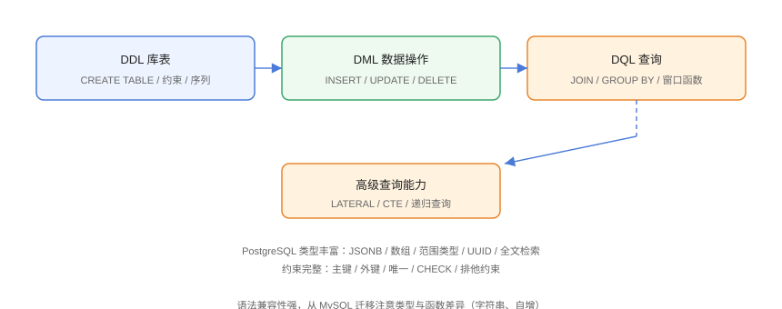

# SQL 基础

PostgreSQL 的 SQL 高度遵循标准，同时提供独特的数据类型与能力。本页覆盖库表操作（DDL）、数据操作（DML）、查询（DQL）与 PostgreSQL 类型系统，是后续高级特性的基础。

## SQL 全景



## DDL：建库建表

### 建表与约束

```sql
-- SqlBasic/01-ddl.sql
CREATE TABLE users (
    id          BIGINT GENERATED ALWAYS AS IDENTITY PRIMARY KEY,
    username    VARCHAR(50) NOT NULL UNIQUE,
    email       VARCHAR(255) NOT NULL,
    age         INT CHECK (age >= 0 AND age <= 150),
    status      VARCHAR(20) DEFAULT 'active',
    created_at  TIMESTAMPTZ NOT NULL DEFAULT now(),
    updated_at  TIMESTAMPTZ NOT NULL DEFAULT now()
);

-- 外键约束
CREATE TABLE posts (
    id          BIGINT GENERATED ALWAYS AS IDENTITY PRIMARY KEY,
    user_id     BIGINT NOT NULL REFERENCES users(id) ON DELETE CASCADE,
    title       VARCHAR(200) NOT NULL,
    content     TEXT,
    created_at  TIMESTAMPTZ NOT NULL DEFAULT now()
);
```

::: tip 自增主键的正确姿势
PostgreSQL 推荐 `GENERATED ALWAYS AS IDENTITY`（SQL 标准）；`SERIAL` 是历史写法，仍可用但不推荐。不要用 `AUTO_INCREMENT`（那是 MySQL 语法）。
:::

## DML：增删改

```sql
-- SqlBasic/02-dml.sql
-- 插入
INSERT INTO users (username, email, age) VALUES
    ('alice', 'alice@example.com', 25),
    ('bob', 'bob@example.com', 30);

-- 更新（RETURNING 返回受影响行）
UPDATE users SET age = 26, updated_at = now()
WHERE username = 'alice'
RETURNING id, username, age;

-- 删除
DELETE FROM users WHERE username = 'bob' RETURNING id;

-- 存在则更新，否则插入（ON CONFLICT）
INSERT INTO users (username, email, age)
VALUES ('alice', 'alice@example.com', 27)
ON CONFLICT (username)
DO UPDATE SET age = EXCLUDED.age, updated_at = now()
RETURNING id, age;
```

::: danger 忘写 WHERE 的 UPDATE/DELETE
不带 `WHERE` 会更新/删除全表。生产环境先 `SELECT` 确认范围，再执行写操作；数据库账号最小权限。
:::

## DQL：查询

### 基础查询与 JOIN

```sql
-- SqlBasic/03-join.sql
SELECT u.username, p.title, p.created_at
FROM users u
JOIN posts p ON p.user_id = u.id
WHERE u.status = 'active'
ORDER BY p.created_at DESC
LIMIT 10;

-- LEFT JOIN：包含没有发帖的用户
SELECT u.username, COUNT(p.id) AS post_count
FROM users u
LEFT JOIN posts p ON p.user_id = u.id
GROUP BY u.username
ORDER BY post_count DESC;
```

### 聚合与 HAVING

```sql
-- SqlBasic/04-aggregate.sql
SELECT status, COUNT(*) AS cnt, AVG(age) AS avg_age
FROM users
GROUP BY status
HAVING COUNT(*) >= 1
ORDER BY cnt DESC;
```

### 窗口函数

```sql
-- SqlBasic/05-window.sql
-- 每篇文章按作者分组排名
SELECT
    user_id,
    title,
    created_at,
    ROW_NUMBER() OVER (PARTITION BY user_id ORDER BY created_at DESC) AS rn
FROM posts;

-- 累计发帖数
SELECT
    username,
    created_at,
    COUNT(*) OVER (ORDER BY created_at) AS running_total
FROM posts;
```

### CTE 与递归查询

```sql
-- SqlBasic/06-cte.sql
-- 公共表表达式
WITH recent_posts AS (
    SELECT * FROM posts WHERE created_at > now() - interval '7 days'
)
SELECT username, COUNT(*)
FROM recent_posts p
JOIN users u ON u.id = p.user_id
GROUP BY username;

-- 递归：组织树
WITH RECURSIVE org_tree AS (
    SELECT id, name, parent_id FROM departments WHERE parent_id IS NULL
    UNION ALL
    SELECT d.id, d.name, d.parent_id
    FROM departments d
    JOIN org_tree t ON d.parent_id = t.id
)
SELECT * FROM org_tree;
```

## 类型系统

| 类型 | 说明 | 示例 |
| --- | --- | --- |
| `BIGINT` / `INT` | 整数 | `42` |
| `NUMERIC(p,s)` | 精确小数（金额用） | `NUMERIC(10,2)` |
| `VARCHAR(n)` / `TEXT` | 字符串（TEXT 无长度限制） | `'hello'` |
| `BOOLEAN` | 布尔 | `TRUE` / `FALSE` |
| `TIMESTAMPTZ` | 带时区时间（推荐） | `now()` |
| `DATE` / `TIME` | 日期 / 时间 | `'2026-08-30'` |
| `UUID` | 通用唯一标识 | `gen_random_uuid()` |
| `JSONB` | 二进制 JSON（可索引） | `'{"a":1}'::jsonb` |
| `ARRAY` | 数组 | `ARRAY[1,2,3]` |
| `INTERVAL` | 时间间隔 | `interval '7 days'` |

## 字符串与日期函数

```sql
-- SqlBasic/07-functions.sql
-- 字符串拼接用 ||
SELECT 'Hello' || ' ' || 'PostgreSQL';

-- 常用函数
SELECT
    upper('abc'),
    length('hello'),
    substring('hello' FROM 2 FOR 3),
    coalesce(NULL, '默认值'),
    date_trunc('day', now()),
    extract(year FROM now());
```

## 易错点与最佳实践

::: danger 常见坑
1. **字符串拼接用 `+`**：PostgreSQL 用 `||`，`+` 只用于数值。
2. **布尔用 0/1**：PG 用 `TRUE/FALSE`（或 `'t'/'f'`）。
3. **引号用反引号**：PG 标识符用双引号（`"users"`），反引号是 MySQL 语法。
4. **`LIMIT` 与 `TOP`**：PG 用 `LIMIT`，无 `TOP`。
5. **时间类型用错**：业务统一 `TIMESTAMPTZ`，避免时区混乱。
:::

::: tip 最佳实践
- 金额用 `NUMERIC`，不用浮点；
- 外键约束保证数据完整性，删父行策略明确（`CASCADE`/`SET NULL`）；
- 复杂查询先写清楚逻辑，再用窗口函数/CTE 优化可读性。
:::

## 验证方式

```shell
psql -U postgres -d appdb -f 01-ddl.sql
psql -U postgres -d appdb -f 03-join.sql
```

预期：建表成功、查询输出正确行数与排序；`ON CONFLICT` 重复插入时走更新分支而非报错。

## 参考资料

- [PostgreSQL SQL 语法](https://www.postgresql.org/docs/current/sql.html)
- [PostgreSQL 数据类型](https://www.postgresql.org/docs/current/datatype.html)
- [PostgreSQL 函数与操作符](https://www.postgresql.org/docs/current/functions.html)
