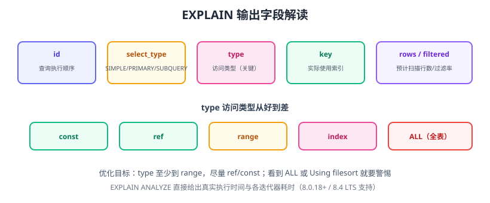

# 执行计划

执行计划（Execution Plan）是优化器为一条 SQL 选择的具体执行方案：先查哪张表、用什么索引、扫多少行、是否排序或建临时表。看懂执行计划是 SQL 优化的第一课。



## EXPLAIN 基础用法

```sql
EXPLAIN SELECT * FROM orders WHERE order_no = 'ORD-1001';
```

输出关键列：

| 列 | 含义 |
| --- | --- |
| `id` | 执行顺序（大 → 小，相同则从上到下） |
| `select_type` | SIMPLE / PRIMARY / SUBQUERY / DERIVED |
| `table` | 访问的表 |
| `type` | 访问类型（最重要） |
| `possible_keys` | 可能用到的索引 |
| `key` | 实际使用的索引 |
| `key_len` | 使用索引的长度（越长越精确） |
| `rows` | 预估扫描行数 |
| `filtered` | 过滤后剩余行百分比 |
| `Extra` | 附加信息（filesort、temporary、Using index） |

## type 访问类型（从好到差）

| type | 说明 | 优化目标 |
| --- | --- | --- |
| `system` | 表中只有一行 | 极限 |
| `const` | 主键/唯一索引等值查询 | 最佳 |
| `eq_ref` | JOIN 中被驱动表主键/唯一索引 | 最佳 |
| `ref` | 非唯一索引等值查询 | 优秀 |
| `range` | 索引范围查询（>、BETWEEN、IN） | 合格 |
| `index` | 全索引扫描 | 较差 |
| `ALL` | 全表扫描 | 必须避免 |

::: danger 红线
看到 `type=ALL`（全表扫描）或 `Using filesort`（文件排序），先问自己：**这条 SQL 能加索引吗？**
:::

## Extra 常见值

| Extra | 含义 | 处理 |
| --- | --- | --- |
| `Using index` | 覆盖索引，不回表 | 理想 |
| `Using where` | 存储引擎层之后过滤 | 正常 |
| `Using index condition` | 索引下推（ICP） | 好 |
| `Using filesort` | 文件排序 | 排序字段加索引 |
| `Using temporary` | 使用临时表 | 分组/去重优化 |
| `Using join buffer` | 连接缓冲区 | 被驱动表加索引 |
| `Impossible WHERE` | WHERE 恒假 | 检查逻辑 |

## EXPLAIN ANALYZE（实际执行）

```sql
EXPLAIN ANALYZE
SELECT * FROM orders o
JOIN order_items i ON i.order_id = o.id
WHERE o.user_id = 1001;
```

输出示例：

```text
-> Nested loop inner join  (actual time=0.8..12.5 rows=5 loops=1)
    -> Index lookup on o using idx_user (user_id=1001)
       (actual time=0.5..2.1 rows=5 loops=1)
    -> Index lookup on i using idx_order (order_id=o.id)
       (actual time=0.3..2.0 rows=1 loops=5)
```

`actual time` 是真实耗时，`loops` 是执行次数——比 EXPLAIN 的预估更可信。

## 执行计划示例：全表扫描 → 索引

```sql
-- 慢：全表扫描
EXPLAIN SELECT * FROM orders WHERE status = 'PAID';
-- type=ALL, rows=1000000

-- 优化：加索引
CREATE INDEX idx_status ON orders(status);

-- 快：range/ref
EXPLAIN SELECT * FROM orders WHERE status = 'PAID';
-- type=ref, rows=5000
```

## 关联子查询与派生表

```sql
-- 慢：相关子查询（每行执行一次）
EXPLAIN SELECT * FROM orders o
WHERE o.user_id IN (SELECT id FROM users WHERE level = 3);

-- 快：JOIN 改写
EXPLAIN SELECT o.* FROM orders o
JOIN users u ON u.id = o.user_id
WHERE u.level = 3;
```

MySQL 8.0+ 优化器会自动把部分 IN 子查询转为半连接，但 JOIN 写法通常更直观可控。

## 易错点与最佳实践

::: danger 常见错误
1. **只看 `key` 不看 `type`**：索引被用到但 type=index（全索引扫描）一样慢。
2. **忽略 `rows` 与 `filtered`**：rows 大但 filtered 低说明过滤条件没走好。
3. **小表上 EXPLAIN 没意义**：1 万行全表扫描也很快，看不出问题。
4. **忘记 `ANALYZE TABLE`**：统计信息过期，优化器选择错误索引。
5. **EXPLAIN 与线上数据量不一致**：在测试库看执行计划，生产数据量更大，计划可能不同。
:::

::: tip 最佳实践
1. 每条慢 SQL 先 `EXPLAIN`，再看 `EXPLAIN ANALYZE` 实测。
2. 关注三个核心字段：`type`、`key`、`rows`。
3. 优化后保存前后对比，写进优化记录。
4. 定期用 `ANALYZE TABLE` 保持统计信息新鲜。
:::

## 验证方式

1. 对一条慢查询执行 `EXPLAIN`，记录 type/key/rows。
2. 加索引后再执行，对比三列变化。
3. 用 `EXPLAIN ANALYZE` 实测优化前后耗时，确认提升幅度。

## 参考资料

- 执行计划实战：[MySQL 索引深入 · 慢查询优化案例](../MySQL/IndexDeepDive/CaseStudy/index.md)
- EXPLAIN 语句：https://dev.mysql.com/doc/refman/8.4/en/explain.html
- EXPLAIN 输出格式：https://dev.mysql.com/doc/refman/8.4/en/explain-output.html
- EXPLAIN ANALYZE：https://dev.mysql.com/doc/refman/8.4/en/explain.html#explain-analyze
- 使用 EXPLAIN 优化查询：https://dev.mysql.com/doc/refman/8.4/en/using-explain.html
