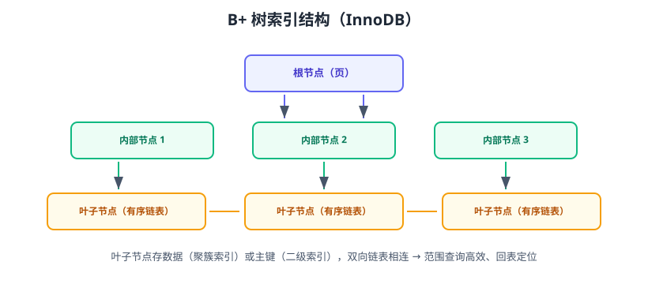

# 索引原理与失效场景

索引是数据库加速查询的核心机制：它让数据库不用全表扫描，而是像查字典一样快速定位。但索引不是越多越好、也不是建了就一定生效——**索引失效场景**是 SQL 优化最常见的考点。本页讲透 B+ 树原理、联合索引、覆盖索引与失效场景。



## 为什么用 B+ 树

InnoDB 的索引是 B+ 树：

| 特性 | 好处 |
| --- | --- |
| 多路平衡树，层高矮 | 千万级数据 3~4 层，几次 IO 定位 |
| 叶子节点存数据/主键 | 支持范围查询 |
| 叶子节点双向链表 | 排序与范围扫描高效 |
| 非叶子节点只存键值 | 单页可容纳大量键，树更矮 |

## 聚簇索引与二级索引

| 类型 | 存储内容 | 说明 |
| --- | --- | --- |
| 聚簇索引 | 整行数据 | 主键索引；无主键时用唯一键/隐藏 rowid |
| 二级索引 | 索引列 + 主键 | 查非索引列需**回表** |

```text
二级索引定位主键 → 回表查聚簇索引取整行
覆盖索引：要查的列都在二级索引里 → 不用回表
```

## 联合索引（最左前缀）

```sql
CREATE INDEX idx_user_status ON orders(user_id, status, created_at);
```

适用规则——**最左前缀**：

| 查询条件 | 是否走索引 | 说明 |
| --- | --- | --- |
| `WHERE user_id = 1` | ✅ | 第一列 |
| `WHERE user_id = 1 AND status = 'PAID'` | ✅ | 前两列 |
| `WHERE user_id = 1 AND status = 'PAID' AND created_at > ...` | ✅ | 全列 |
| `WHERE status = 'PAID'` | ❌ | 跳过了最左列 |
| `WHERE created_at > ... AND user_id = 1` | ✅（部分） | 优化器可调整顺序 |

::: tip 联合索引设计
1. 选择性高的列放前面。
2. 最常用的等值条件放前面，范围条件放后面。
3. 把高频查询的 WHERE + ORDER BY 列一起设计进一个索引。
:::

## 覆盖索引

```sql
-- 需要回表：SELECT * 查所有列
EXPLAIN SELECT * FROM orders WHERE user_id = 1;

-- 覆盖索引：只查索引内列，Extra=Using index，不回表
EXPLAIN SELECT id, user_id, status FROM orders WHERE user_id = 1;
```

覆盖索引可显著减少回表 IO，是高频查询的首选优化。

## 索引失效场景（重点）

::: danger 十大失效场景
1. **对索引列使用函数**：`WHERE DATE(created_at) = '2026-08-29'` → 失效；改写为 `created_at >= '2026-08-29 00:00:00' AND created_at < '2026-08-30'`。
2. **隐式类型转换**：`WHERE phone = 13800138000`（phone 是 varchar）→ 失效；保持类型一致。
3. **前模糊查询**：`LIKE '%keyword'` → 失效；`LIKE 'keyword%'` 有效。
4. **违反最左前缀**：跳过联合索引第一列。
5. **对索引列运算**：`WHERE price * 2 > 100` → 失效；改写 `price > 50`。
6. **OR 连接非索引列**：`WHERE a = 1 OR b = 2`（b 无索引）→ 可能全表；拆 UNION 或给 b 加索引。
7. **NOT IN / NOT LIKE**：一般不走索引；用 EXISTS 或改写。
8. **使用 `!=` / `<>`**：多数情况下失效；能改范围条件就改。
9. **索引列参与隐式排序/分组差异**：字符集、排序规则不一致（如 utf8mb4 与 utf8 关联）。
10. **优化器判断全表更快**：小表/低选择性（如 status 只有两种值），索引可能被放弃——这是“合理失效”。
:::

## 索引选择性与冗余检查

```sql
-- 查看某列的选择性
SELECT COUNT(DISTINCT user_id) / COUNT(*) AS selectivity FROM orders;
-- 接近 1 适合索引；很低（如状态列）单独索引价值低
```

```sql
-- 查询冗余索引
SELECT * FROM sys.schema_redundant_indexes;
```

::: danger 索引不是越多越好
1. 每个索引占用磁盘，写入/更新要同步维护。
2. 冗余索引（idx_a、idx_a_b）浪费空间且影响写入。
3. 低选择性列单独建索引可能没用（优化器会放弃）。
4. 长文本/varchar(500) 建索引用前缀索引：`CREATE INDEX idx_title ON articles(title(20))`。
:::

## 索引使用检查

```sql
-- 查看所有表的索引使用情况
SELECT * FROM sys.schema_unused_indexes;
```

长期未使用的索引应评估删除。

## 易错点与最佳实践

::: danger 常见错误
1. **给每条慢查询都加单列索引**：可能产生冗余；优先联合索引设计。
2. **忽略最左前缀**：建了联合索引却从第二列开始查。
3. **在索引列上用函数/类型转换**：建了索引也白搭。
4. **SELECT \* 让覆盖索引失效**：只取需要的列。
5. **索引设计不考虑写入**：写入频繁的表，索引过多会拖慢插入。
6. **忘记统计信息**：索引存在但优化器不用，先 `ANALYZE TABLE`。
:::

::: tip 最佳实践
1. 先看慢查询，再为高频条件设计联合索引。
2. 高选择性列前置、等值前置、范围后置。
3. 高频查询追求覆盖索引（Using index）。
4. 定期用 sys 视图检查冗余与未用索引。
5. 索引变更走评审：对比写入性能与查询收益。
:::

## 验证方式

1. 用 EXPLAIN 验证：加索引后 type 从 ALL 变为 ref/range。
2. 测试覆盖索引：`SELECT id, user_id, status` 出现 `Using index`。
3. 造一个失效场景（如函数包裹索引列），确认 type 变回 ALL，再用改写 SQL 验证恢复。

## 参考资料

- InnoDB 索引：https://dev.mysql.com/doc/refman/8.4/en/innodb-index-types.html
- 最左前缀：https://dev.mysql.com/doc/refman/8.4/en/multiple-column-indexes.html
- 索引失效排查（官方优化章节）：https://dev.mysql.com/doc/refman/8.4/en/optimization-indexes.html
- sys.schema_redundant_indexes：https://dev.mysql.com/doc/refman/8.4/en/sys-schema-redundant-indexes.html
