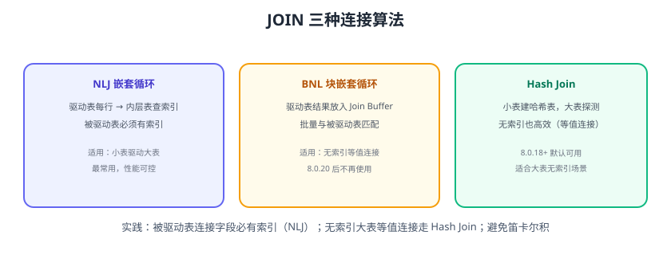

# JOIN 优化

多表 JOIN 是慢查询高发区：连接算法选择、驱动表顺序、连接字段索引都直接影响性能。本页讲透三种连接算法、驱动表优化与常见 JOIN 陷阱。



## 三种连接算法

| 算法 | 原理 | 适用 | 版本 |
| --- | --- | --- | --- |
| NLJ（嵌套循环） | 驱动表每行去被驱动表查索引 | 被驱动表连接字段有索引 | 一直有 |
| BNL（块嵌套） | 驱动表结果放 Join Buffer 批量匹配 | 无索引等值连接 | 8.0.20 前 |
| Hash Join | 小表建哈希表，大表探测 | 无索引等值连接，大表 | 8.0.18+ |

::: info 8.0.20 起 BNL 被移除
MySQL 8.0.18 引入 Hash Join，8.0.20 起不再使用 BNL。无索引等值连接由优化器自动选择 Hash Join。
:::

## 驱动表与连接顺序

NLJ 中**驱动表（外层）越小越好**：驱动表扫描行数 × 被驱动表每次查询代价。

```sql
-- 优化器默认选小表驱动大表
SELECT * FROM orders o
JOIN order_items i ON i.order_id = o.id
WHERE o.user_id = 1001;
```

优化器会基于统计信息决定连接顺序，一般不用人为指定；但以下情况要关注：

1. `STRAIGHT_JOIN` 强制顺序（谨慎使用）。
2. WHERE 过滤后驱动表变小，统计信息过旧会导致选错。

## JOIN 优化核心：被驱动表连接字段必须有索引

```sql
-- 慢：order_id 无索引，被驱动表每行全表扫描
SELECT * FROM orders o JOIN order_items i ON i.order_id = o.id;

-- 快：加索引
CREATE INDEX idx_order_items_order ON order_items(order_id);
```

验证：

```sql
EXPLAIN SELECT * FROM orders o JOIN order_items i ON i.order_id = o.id;
-- 被驱动表 i 应为 ref（索引查询），而不是 ALL
```

## 避免 SELECT * 与不必要的 JOIN

```sql
-- 只取需要的列
SELECT o.id, o.order_no, u.name
FROM orders o
JOIN users u ON u.id = o.user_id;
```

不需要的 JOIN 反而增加扫描与回表，能拆成两次查询就别 JOIN。

## 常见 JOIN 陷阱

::: danger 必查清单
1. **笛卡尔积**：忘记 ON 条件或 ON 条件错误，行数爆炸；`JOIN` 必须有正确连接条件。
2. **连接字段类型不一致**：`orders.user_id` 是 BIGINT、`users.id` 是 VARCHAR，索引失效 + 隐式转换；保持类型一致。
3. **连接字段字符集不一致**：utf8mb4 与 utf8 关联，索引失效；统一字符集。
4. **多表 JOIN 顺序失控**：超过 5 表 JOIN 的 SQL，先拆解或物化。
5. **GROUP BY + JOIN 一起**：先 JOIN 后分组，扫描量大；先子查询过滤再 JOIN。
6. **NULL 值语义**：`ON a.id = b.id` 不会匹配 NULL；业务上明确处理。
:::

## 子查询 vs JOIN

```sql
-- 子查询（可被优化为半连接）
SELECT * FROM orders WHERE user_id IN (SELECT id FROM users WHERE level = 3);

-- JOIN 改写（更直观）
SELECT o.* FROM orders o JOIN users u ON u.id = o.user_id WHERE u.level = 3;
```

MySQL 8.0+ 优化器对 IN 子查询会做半连接优化，两者性能接近；可读性优先。

## 易错点与最佳实践

::: danger 常见错误
1. **被驱动表不加索引**：NLJ 变全表嵌套，性能灾难。
2. **小表驱动原则被滥用**：优化器基于统计信息决策，`STRAIGHT_JOIN` 乱指定反而更慢。
3. **忽略统计信息**：`ANALYZE TABLE` 后连接顺序可能自动优化。
4. **三表以上不拆解**：一条 SQL JOIN 5 张表，排查与优化都困难。
5. **JOIN 后再 LIMIT**：先大结果集 JOIN 再取 20 行，浪费严重；先子查询过滤再 JOIN。
:::

::: tip 最佳实践
1. 被驱动表连接字段必有索引（联合索引按连接字段设计）。
2. 用 EXPLAIN 确认被驱动表访问类型为 ref/eq_ref，不是 ALL。
3. 复杂查询先过滤小结果集，再 JOIN。
4. 保持连接字段类型与字符集一致。
5. 超大数据量考虑冗余字段/汇总表，避免实时大 JOIN。
:::

## 验证方式

1. EXPLAIN 一个无索引 JOIN，确认被驱动表 type=ALL；加索引后变为 ref。
2. 对比 Hash Join（无索引等值）与加索引后的 NLJ 耗时。
3. 造一个类型不一致的连接，EXPLAIN 确认索引失效，再统一类型验证恢复。

## 参考资料

- MySQL 连接优化：https://dev.mysql.com/doc/refman/8.4/en/join-optimization.html
- Hash Join：https://dev.mysql.com/doc/refman/8.4/en/hash-joins.html
- 嵌套循环连接：https://dev.mysql.com/doc/refman/8.4/en/nested-loop-joins.html
- MySQL 优化 JOIN 顺序：https://dev.mysql.com/doc/refman/8.4/en/optimizing-joins.html
