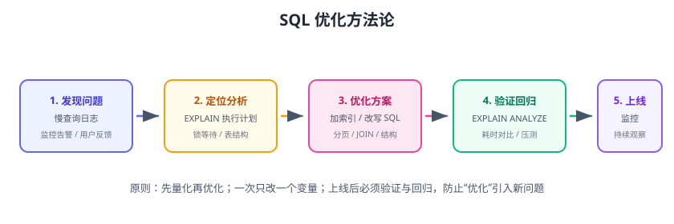

# SQL 优化概述

SQL 优化是通过分析查询执行方式、设计合理索引、改写低效 SQL，让数据库用更少的资源、更快的时间返回正确结果。优化的对象不只是“一条慢 SQL”，而是整个查询链路：表结构、索引、SQL 写法、事务与锁、服务器参数。



## 为什么要做 SQL 优化

| 现象 | 原因 | 代价 |
| --- | --- | --- |
| 页面打开要几秒 | 全表扫描 + 回表 | 用户体验差 |
| 数据库 CPU 100% | 大量慢查询重复扫描 | 拖垮整个应用 |
| 并发一高就超时 | 锁等待、索引缺失 | 业务不可用 |
| 报表跑 10 分钟 | 深分页/笛卡尔 JOIN | 等待成本高 |

优化的收益：**同样的硬件，吞吐翻倍、响应时间降到十分之一**。

## 优化方法论

```text
发现问题 → 定位分析 → 优化方案 → 验证回归 → 上线监控
```

### 1. 发现问题

- 慢查询日志（`long_query_time`）。
- 监控告警（QPS、CPU、锁等待）。
- 用户反馈（某个页面/接口慢）。

### 2. 定位分析

- `EXPLAIN` / `EXPLAIN ANALYZE` 看执行计划。
- 检查表结构、索引、统计信息。
- 确认是否锁等待、是否有并发争用。

### 3. 优化方案

- 加/改索引（最高性价比）。
- 改写 SQL（避免函数、隐式转换、深分页）。
- 调整表结构（冗余字段、拆分大表）。
- 必要时改业务（分批查询、缓存）。

### 4. 验证回归

- `EXPLAIN ANALYZE` 实测耗时。
- 生产压测对比优化前后。
- 回归：新索引不能拖慢写入，SQL 改写不能改变结果。

## 优化的核心：减少扫描与回表

```text
全表扫描 ALL（读整张表）→ 索引范围 range（读部分）→ 唯一索引 const/ref（读几行）
```

每个查询的目标：

1. **用上索引**：`type` 至少 `range`，避免 `ALL`。
2. **减少回表**：能用覆盖索引就不要回表。
3. **减少行数**：`rows` 越小越好，`filtered` 越高越好。
4. **减少临时表与排序**：避免 `Using filesort`、`Using temporary`。

## 优化优先级

```text
1. 索引设计（覆盖 80% 问题）
2. SQL 写法（函数、类型、深分页）
3. 表结构设计（字段、范式/反范式）
4. 事务与锁（减少锁持有时间）
5. 服务器参数（buffer、连接数，最后手段）
```

::: tip 先索引后参数
90% 的慢查询靠索引和 SQL 改写解决；调 `innodb_buffer_pool_size` 等参数是最后手段，掩盖问题而不是解决问题。
:::

## 环境与版本

::: info 版本说明（2026-08 核对）
本文以 **MySQL 8.4 LTS**（支持到 2032-04）为准；最新 LTS 为 **9.7.x**（2026-04 发布，支持到 2034-04）。8.0.x 已停止维护，建议升级到 8.4；`EXPLAIN ANALYZE`、Hash Join、窗口函数等能力在 8.0.18+/8.4 均可用。
:::

## 常用工具

| 工具 | 用途 |
| --- | --- |
| `EXPLAIN` | 查看执行计划（预估） |
| `EXPLAIN ANALYZE` | 实际执行并输出各步骤耗时 |
| `SHOW PROFILE` / `performance_schema` | 剖析执行各阶段 |
| `mysqldumpslow` / `pt-query-digest` | 慢查询聚合分析 |
| `sys.schema` 视图 | 索引使用情况、冗余索引检查 |
| `OPTIMIZE TABLE` / `ANALYZE TABLE` | 更新统计信息 |

## 易错点与最佳实践

::: danger 常见错误
1. **不看执行计划就加索引**：方向错了越优化越糟；先 EXPLAIN。
2. **一次优化多个变量**：同时改 SQL、加索引、调参数，出问题不知道是谁引起的。
3. **只优化一条 SQL 不看全局**：为一条查询加索引，导致写入变慢、其他查询走错索引。
4. **忽略验证**：上线前不压测，优化后反而更慢。
5. **在小数据量上判断性能**：1 万行全表扫描也很快，百万行才见分晓；用真实量级验证。
6. **凭感觉优化**：没有慢查询数据支撑，凭印象“优化”容易白做。
:::

::: tip 最佳实践
1. 建立慢查询监控：阈值 1 秒，每周 Review TOP SQL。
2. 新 SQL 上线前必须看执行计划。
3. 索引变更走评审 + 灰度 + 回滚方案。
4. 保留优化前后的 EXPLAIN 与耗时记录，形成案例库。
5. 大数据量先分区/归档，再谈 SQL 优化。
:::

## 验证方式

1. 找一个真实慢查询，按五步流程完整走一遍（发现→分析→优化→验证→监控）。
2. 记录优化前后：执行时间、扫描行数、`type` 访问类型。
3. 压测确认优化在并发下依然有效。

## 参考资料

- PostgreSQL 调优对照：[性能调优](../PostgreSQL/Performance/index.md)（EXPLAIN ANALYZE 与参数体系）
- MySQL 8.4 参考手册（优化）：https://dev.mysql.com/doc/refman/8.4/en/optimization.html
- EXPLAIN 使用：https://dev.mysql.com/doc/refman/8.4/en/using-explain.html
- MySQL 优化器：https://dev.mysql.com/doc/refman/8.4/en/optimizer-cost-model.html
- 《高性能 MySQL》（Baron Schwartz 等，书籍）
