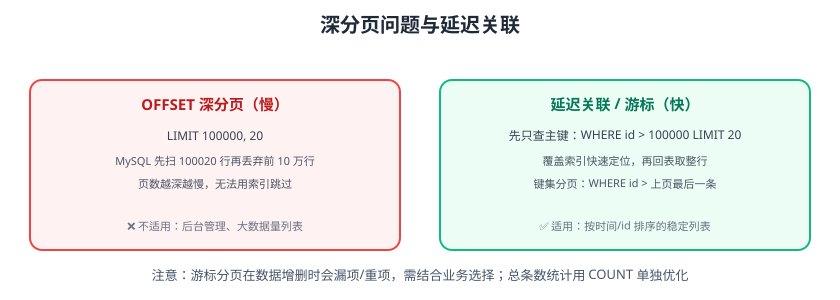

# 分页优化

分页是后台列表的标配，但 `LIMIT offset, size` 在数据量大了以后会越来越慢：MySQL 必须扫描并丢弃 offset 之前的所有行。本页给出深分页问题的原理、游标分页、延迟关联等优化方案。



## 深分页为什么慢

```sql
SELECT * FROM orders ORDER BY id DESC LIMIT 100000, 20;
```

执行过程：

```text
1. 按 id 倒序扫描，需要先读到第 100020 行
2. 取 20 行返回，丢弃前 100000 行
3. 页数越深，扫描越多；即使有索引也无法“跳过”
```

`LIMIT 0, 20` 与 `LIMIT 100000, 20` 的代价差几千倍，页数越深越明显。

## 方案一：游标分页（Keyset Pagination）

只适用于**稳定排序**（按 id/时间），通过上一页最后一条记录定位：

```sql
-- 第一页
SELECT * FROM orders ORDER BY id DESC LIMIT 20;

-- 第二页：id < 上一页最后一条的 id
SELECT * FROM orders
WHERE id < 100020
ORDER BY id DESC LIMIT 20;
```

索引直接定位到 `id < 100020`，无需扫描前 10 万行，**任何页数耗时恒定**。

优点：

1. 深度分页性能稳定（毫秒级）。
2. 数据变动时不会重复扫描。

缺点：

1. 不支持“跳页”（只能上一页/下一页）。
2. 数据增删时可能漏项或重项（新插入的数据会改变分页位置）。

::: tip 适用场景
适合“按时间倒序”的动态列表：订单列表、消息列表、日志列表。需要任意跳页的管理端可保留 OFFSET，但加上限保护。
:::

## 方案二：延迟关联（Deferred Join）

先只查主键，再关联回原表取整行：

```sql
-- 慢：直接取 100000 行再回表
SELECT * FROM orders
ORDER BY created_at DESC
LIMIT 100000, 20;

-- 快：先覆盖索引取 20 个主键，再回表
SELECT o.* FROM orders o
JOIN (
    SELECT id FROM orders
    ORDER BY created_at DESC
    LIMIT 100000, 20
) t ON t.id = o.id;
```

内层只查 `id`（覆盖索引，不回表），外层按 20 个主键精确回表，IO 大幅下降。

## 方案三：WHERE 条件过滤（业务辅助）

很多“分页”其实可以加上业务过滤减少扫描：

```sql
-- 只查最近 30 天订单（时间范围限制）
SELECT * FROM orders
WHERE created_at >= DATE_SUB(NOW(), INTERVAL 30 DAY)
ORDER BY id DESC
LIMIT 20;
```

## 方案四：总数统计优化

分页通常还要 COUNT 总条数：

```sql
-- 慢：COUNT(*) 全表扫描
SELECT COUNT(*) FROM orders WHERE status = 'PAID';
```

优化手段：

1. 业务上显示“共 N 页”，用缓存/近似值。
2. 单独维护计数表（写入时增减）。
3. 按状态分区/归档，只统计热数据。
4. 大数据量接受近似总数（如“约 10 万条”）。

## 方案对比

| 方案 | 深分页性能 | 跳页 | 适用 |
| --- | --- | --- | --- |
| OFFSET | 越深越慢 | ✅ | 小数据量、管理端 |
| 游标分页 | 恒定快 | ❌ | 动态列表（订单/日志） |
| 延迟关联 | 大幅提升 | ✅ | 必须跳页的大数据量 |
| 业务过滤 | 视条件 | ✅ | 天然有时间/状态范围 |

## 易错点与最佳实践

::: danger 常见错误
1. **游标分页用于跳页需求**：只能上下页，管理端要求跳页会失效。
2. **延迟关联内层 SELECT \***：内层必须只查 id，否则白优化。
3. **排序字段无索引**：`ORDER BY` 字段没索引 → filesort → 分页更慢。
4. **排序不唯一**：`ORDER BY created_at` 并列时游标定位不准；加 id 兜底 `ORDER BY created_at DESC, id DESC`。
5. **OFFSET 无上限**：允许 `page=100000` 直接打爆数据库；限制最大偏移或改游标。
6. **COUNT 与分页分开优化**：COUNT 也慢，但没人管。
:::

::: tip 最佳实践
1. 业务列表优先游标分页（id/时间倒序）。
2. 必须跳页的大表用延迟关联。
3. ORDER BY 字段建联合索引：`(status, created_at, id)`。
4. 限制最大页深（如 offset ≤ 10000），超限提示。
5. 总条数用缓存/近似值，别每次全表 COUNT。
:::

## 验证方式

1. 构造 100 万行测试表，对比 `LIMIT 100000, 20` 与游标分页耗时。
2. 用 EXPLAIN 确认延迟关联内层是 `Using index`（覆盖索引）。
3. 压测第 1 页与第 5000 页，确认游标方案耗时基本恒定。

## 参考资料

- MySQL LIMIT 优化：https://dev.mysql.com/doc/refman/8.4/en/limit-optimization.html
- 深分页优化实践（社区文章）
- 键集分页（Keyset Pagination）：https://use-the-index-luke.com/sql/partial-results/fetch-next-page
