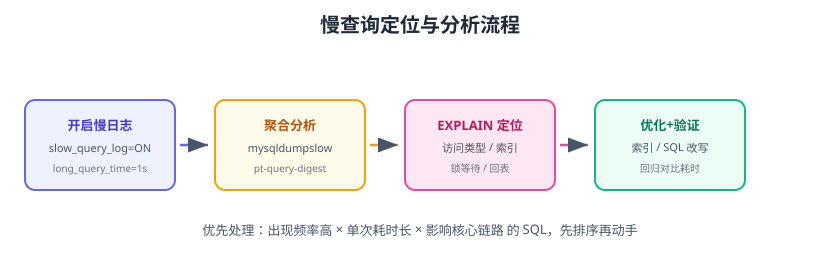

# 慢查询定位与分析

慢查询日志记录执行超过阈值的 SQL，是 SQL 优化的“体检报告”。本页覆盖：开启与配置慢日志、用 `mysqldumpslow` / `pt-query-digest` 聚合分析、结合 `EXPLAIN` 与锁信息定位根因。



## 开启慢查询日志

```sql
-- 动态开启（重启失效）
SET GLOBAL slow_query_log = 'ON';
SET GLOBAL long_query_time = 1;          -- 超过 1 秒记录（单位秒）
SET GLOBAL log_queries_not_using_indexes = 'ON';  -- 记录未用索引的查询

-- 查看状态
SHOW VARIABLES LIKE 'slow_query%';
SHOW VARIABLES LIKE 'long_query_time';
```

持久化到配置文件：

```ini [my.cnf]
[mysqld]
slow_query_log = 1
slow_query_log_file = /var/log/mysql/slow.log
long_query_time = 1
log_queries_not_using_indexes = 1
```

::: info 版本说明
`long_query_time` 支持小数（如 `0.5` 记录 500ms 以上查询）；8.4 LTS 支持设置全局与会话级别，会话级可临时调低排查。
:::

## 慢日志内容解读

```text
# Query_time: 2.350000  Lock_time: 0.000120  Rows_sent: 10  Rows_examined: 1024000
SET timestamp=1756483200;
SELECT * FROM orders WHERE status = 'PAID' ORDER BY created_at DESC LIMIT 10;
```

| 字段 | 含义 |
| --- | --- |
| `Query_time` | 总执行时间 |
| `Lock_time` | 锁等待时间 |
| `Rows_sent` | 返回行数 |
| `Rows_examined` | 扫描行数（**重点关注**） |

`Rows_examined` 远大于 `Rows_sent`（如 100 万 vs 10）说明扫描浪费严重。

## 聚合分析工具

### mysqldumpslow（MySQL 自带）

```shell
# 按平均耗时排序 TOP 10
mysqldumpslow -s at -t 10 /var/log/mysql/slow.log

# 按扫描行数排序
mysqldumpslow -s ar -t 10 /var/log/mysql/slow.log
```

### pt-query-digest（Percona Toolkit）

```shell
pt-query-digest /var/log/mysql/slow.log > slow_report.txt
```

报告重点：

```text
Profile（查询指纹聚合）
  Rank   Query ID   Response time   Calls   R/Call   V/M   Item
  1      0xABC...    68.5s (55%)    120     0.57s    0.10  SELECT orders
  2      0xDEF...    22.1s (18%)    300     0.07s    0.04  SELECT users
```

按 **总耗时占比** 优先处理：响应时间占比高的查询优化收益最大。

## 分析根因四步

```text
1. EXPLAIN：type/key/rows → 是否全表扫描、索引失效
2. 锁等待：Lock_time 大 → 查 information_schema.innodb_trx / performance_schema
3. 表与索引：表数据量、索引是否缺失/冗余、统计信息
4. 业务视角：是否必查这么多数据、能否缓存/分批
```

查看锁等待：

```sql
SELECT * FROM performance_schema.data_lock_waits\G
SELECT * FROM sys.innodb_lock_waits\G
```

## 慢查询告警与监控

生产环境建议：

1. 慢查询阈值 1 秒，写入日志。
2. 接入监控：mysqld_exporter 的 `mysql_slow_queries` 指标（见 [指标采集](../../../../Ops/Monitoring/MetricsCollect/index.md)）。
3. 慢日志接入日志平台，按指纹聚合。
4. 每日巡检 TOP 慢 SQL，建立治理台账。

## 易错点与最佳实践

::: danger 常见错误
1. **阈值设太小日志爆炸**：0.1s 在高峰期产生海量日志；按业务定 1s/2s。
2. **只收集不分析**：慢日志堆着不看，等于没开。
3. **只看 Query_time 不看 Rows_examined**：锁等待也要看 Lock_time。
4. **在生产直接重放慢 SQL**：先只读库/低峰期验证，避免加重负载。
5. **忽略未用索引日志**：`log_queries_not_using_indexes` 记录的问题查询也要看。
:::

::: tip 最佳实践
1. 慢日志与监控联动，慢查询数作为核心数据库指标。
2. 每周 Review：按响应时间占比排序，处理 TOP 5。
3. 每条慢 SQL 建立“发现→优化→验证”记录。
4. 大查询用 `EXPLAIN ANALYZE` 实测，别只看预估。
5. 归档历史数据，避免慢日志无限膨胀。
:::

## 验证方式

1. 开启慢日志后执行一条超过阈值的查询，确认日志生成。
2. 用 mysqldumpslow / pt-query-digest 聚合，确认能按耗时排序。
3. 对 TOP SQL 执行 EXPLAIN，找出全表扫描/索引失效并修复。
4. 修复后再次查询，确认不再出现在慢日志（或耗时低于阈值）。

## 参考资料

- 慢查询日志：https://dev.mysql.com/doc/refman/8.4/en/slow-query-log.html
- mysqldumpslow：https://dev.mysql.com/doc/refman/8.4/en/mysqldumpslow.html
- Percona Toolkit：https://www.percona.com/software/percona-toolkit
- performance_schema 锁等待：https://dev.mysql.com/doc/refman/8.4/en/performance-schema-data-locks.html
