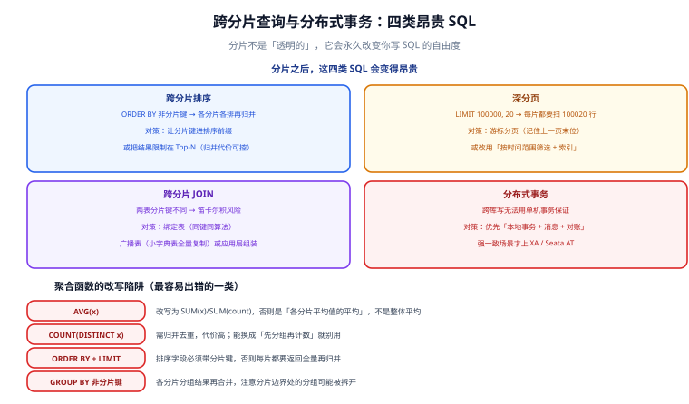

# 跨分片查询与分布式事务

分片之后，SQL 的可写范围会被永久收窄。这一页讲两类问题的应对：**跨分片查询**（怎么让昂贵的查询变便宜）与**跨分片写**（怎么在多个分片上保证一致）。

::: tip 一句话定位
跨分片问题的处理原则只有一条：**能设计掉的就不要用运行时方案解决**。绑定表、广播表、路由表这些「设计手段」的成本是零，而内存归并、分布式事务的成本会随分片数与流量线性上升。
:::

## 四类昂贵 SQL



| 类型 | 为什么贵 | 首选对策 |
| --- | --- | --- |
| **跨分片排序** | 各分片各自排序后要归并 | 让分片键进排序前缀 |
| **深分页** | 每个分片都要返回「偏移量 + 页大小」条 | 游标分页 |
| **跨分片 JOIN** | 两表分片键不同 → 归并或笛卡尔积 | 绑定表 / 广播表 / 应用层组装 |
| **跨分片写** | 无法用单机事务 | 本地消息表 + 对账 |

## 归并排序：代价从哪来

假设 16 个分片，执行 `SELECT * FROM t_order ORDER BY created_at DESC LIMIT 20`：

```text
每个分片执行的 SQL：
  SELECT * FROM t_order_N ORDER BY created_at DESC LIMIT 20   （16 次）

中间件的归并：
  拿到 16 × 20 = 320 条，做一次多路归并，取前 20 条
```

这个代价是 **16 次查询 + 320 条数据排序**，与单库的「1 次查询 + 索引有序取 20 条」完全不是一个量级。

### 缓解方式：让分片键进排序前缀

```sql
-- 差：纯按时间排序，必须归并
SELECT * FROM t_order ORDER BY created_at DESC LIMIT 20;

-- 好：带上分片键，只需查 1 个分片
SELECT * FROM t_order WHERE user_id = 123 ORDER BY created_at DESC LIMIT 20;
```

如果业务确实需要「全局最新 20 单」（如运营大屏），正确做法是**不在分片集群上做**，而是：

1. 从分片集群增量同步到一张**单独的汇总表**（可按时间分区的单表），在这张表上查。
2. 或走离线数仓 / 搜索引擎（[Elasticsearch](../../../NoRelational/Elasticsearch/index.md) 处理这类「全局检索 + 排序」是它的强项）。

::: tip 「把查询路由到合适的存储」比「让分片支持所有查询」便宜得多
分片集群适合**高并发的点查与局部范围查**（按用户、按租户）。全局聚合、全局排序、模糊检索这些「分析型」需求，交给**读副本、数仓或搜索引擎**。

这是架构分层，不是妥协。硬要在分片集群上做全部分析查询，会得到一个「什么都能做但什么都慢」的系统。
:::

## 深分页：两种解法

### 问题原理

```sql
-- 用户请求第 5000 页，每页 20 条
SELECT * FROM t_order WHERE status = 1 ORDER BY created_at DESC LIMIT 20 OFFSET 100000;
```

中间件会把它改写成（每个分片）：

```sql
SELECT * FROM t_order_N WHERE status = 1 ORDER BY created_at DESC LIMIT 100020 OFFSET 0;
```

**16 个分片各返回 10 万条 = 160 万条数据要跨网络传到中间件**，再排序取第 100001~100020 条。

### 解法一：游标分页（推荐）

不用 `OFFSET`，而是用「上一页最后一条的排序键」作为起点：

```sql
-- 第一页
SELECT id, order_no, created_at
FROM t_order
WHERE user_id = 123
ORDER BY created_at DESC, id DESC
LIMIT 20;

-- 后续页：把上一页最后一条的 (created_at, id) 传进来
SELECT id, order_no, created_at
FROM t_order
WHERE user_id = 123
  AND (created_at, id) < ('2026-09-20 10:00:00', 10086)   -- 复合游标，避免同一时刻多条漏读
ORDER BY created_at DESC, id DESC
LIMIT 20;
```

**为什么用复合游标**：只按 `created_at` 比较时，同一毫秒内的多条记录可能被跳过或重复。加上主键 `id` 作为第二排序键，游标才是严格唯一的。

::: danger `OFFSET` 分页在分片场景下是性能陷阱
`LIMIT 20 OFFSET 100000` 在单库上就已经不快，在分片上是**乘以分片数**的代价。

**改造原则**：
- 前端改用「加载更多 / 无限滚动」，天然适合游标分页。
- 必须支持跳页时（如后台表格），限制最大可跳页数（如前 100 页），并给用户「请缩小时间范围」的提示。
- 导出类需求（要全量）改走异步导出任务，不要用分页接口硬拉。
:::

### 解法二：时间范围强制裁剪

如果业务能接受「按时间筛选」，用时间范围把数据量降下来：

```sql
-- 强制要求带上时间范围（应用层校验，缺参数直接拒绝）
SELECT * FROM t_order
WHERE user_id = 123
  AND created_at >= '2026-09-01' AND created_at < '2026-10-01'
ORDER BY created_at DESC
LIMIT 20 OFFSET 40;
```

## 跨分片 JOIN 的五种解法

| 解法 | 原理 | 成本 | 适用 |
| --- | --- | --- | --- |
| **绑定表** | 两表同分片键同算法 → JOIN 落在同一分片 | 零（只是配置） | 关联表经常一起查（订单 + 订单明细） |
| **广播表** | 小表在每个分片各存一份 → 本地 JOIN | 存储冗余（表要小） | 字典表、配置表 |
| **ER 分片** | 子表跟随父表的分片键 | 零 | 有明确父子关系（订单 → 明细） |
| **内存归并** | 中间件把两表数据都拉回来做 JOIN | 高，有 OOM 风险 | 小结果集（两边都 < 万行） |
| **应用层组装** | 分两次查，在代码里拼装 | 中（多一次往返） | 无法用上面几种时的兜底 |

### 应用层组装的标准写法

```java
// 场景：按订单查商品信息，但商品表没分片（单库小表）
public List<OrderVO> listOrdersWithProduct(long userId) {
    // ① 查订单（走分片，单播）
    List<Order> orders = orderMapper.listByUser(userId);

    // ② 收集商品 ID 并去重
    Set<Long> productIds = orders.stream().map(Order::getProductId).collect(Collectors.toSet());
    if (productIds.isEmpty()) return List.of();

    // ③ 一次批量查商品（商品表未分片，或作为广播表）
    Map<Long, Product> productMap = productMapper.listByIds(productIds).stream()
        .collect(Collectors.toMap(Product::getId, Function.identity()));

    // ④ 内存拼装
    return orders.stream().map(o -> {
        Product p = productMap.get(o.getProductId());
        return new OrderVO(o, p);
    }).collect(Collectors.toList());
}
```

::: danger 应用层组装的三个陷阱
1. **N+1 查询**。上面第 ③ 步如果写成 `for (order : orders) productMapper.getById(order.getProductId())`，就退化成 N 次查询。**必须是批量 `IN`**。
2. **`IN` 列表过长**。商品 ID 有 5000 个时，`IN (5000 个值)` 会超长或走全表扫描。**正确做法**：分批（每批 500~1000 个）并合并结果。
3. **Java 侧排序与分页**。如果分页发生在拼装之后，等于把全部数据都拉到了应用内存。**正确做法**：分页必须在数据库侧完成，拼装只负责补字段。
:::

## 聚合函数的改写

| 原写法 | 分片后的问题 | 正确写法 |
| --- | --- | --- |
| `AVG(x)` | 各分片平均值的平均 ≠ 整体平均 | `SUM(x) / SUM(cnt)`，需自行归并 |
| `COUNT(DISTINCT x)` | 各分片去重后还要全局去重 | 尽量改为「先分组再计数」，或接受更高代价 |
| `MAX(x)` / `MIN(x)` | 可安全归并 | 无需改写 |
| `SUM(x)` | 可安全归并 | 无需改写 |
| `GROUP BY 非分片键` | 分片边界处的同一分组会被拆开 | 中间件会二次聚合，但结果集要小 |

**`AVG` 为什么错**（这是最容易出错的一处）：

```text
分片 0：3 条记录，平均 10
分片 1：97 条记录，平均 100

错误算法：中间件把两个平均值再平均 → (10 + 100) / 2 = 55
正确结果：(3×10 + 97×100) / (3 + 97) = 97.3
```

::: warning 「平均值」在分片场景下必须显式改写成加权平均
ShardingSphere 等中间件对 `AVG` 会做一定的改写处理（把 `AVG(x)` 改成 `SUM(x)` 与 `COUNT(x)` 两个聚合再回算），但**这个改写依赖中间件的版本与版本对函数的识别能力**。

**保守做法**：在报表类 SQL 里显式写成 `SUM(x)` 与 `COUNT(x)`，在应用层做除法。这样结果与中间件的行为无关，永远正确。
:::

## 分布式事务

跨分片写无法用单机事务保证，需要在三种方案中选择。

### 方案对照

| 方案 | 一致性 | 性能 | 侵入性 | 适用 |
| --- | --- | --- | --- | --- |
| **本地消息表 + 重试 + 对账** | 最终一致（秒级） | 高 | 低（业务自己写） | **绝大多数业务场景** |
| **Saga / TCC**（Seata 等框架） | 最终一致 | 中 | 高（要写补偿逻辑） | 长流程、跨服务、明确需要补偿 |
| **XA / 2PC** | 强一致 | **低**（锁持有时间长） | 低 | 跨库但要求强一致的少量场景 |

### 首选：本地消息表

```sql
-- 在业务库里，与业务表同事务写入消息表
CREATE TABLE t_local_message (
  id           BIGINT       NOT NULL AUTO_INCREMENT,
  msg_key      VARCHAR(64)  NOT NULL,       -- 幂等键，唯一索引
  payload      VARCHAR(2000) NOT NULL,
  status       TINYINT      NOT NULL DEFAULT 0,  -- 0 待发送 1 已发送 2 已确认
  retry_count  INT          NOT NULL DEFAULT 0,
  next_retry_at DATETIME    NOT NULL,
  created_at   DATETIME     NOT NULL,
  PRIMARY KEY (id),
  UNIQUE KEY uk_msg_key (msg_key)
) ENGINE = InnoDB;
```

```java
// 核心：业务写入与消息写入在同一个本地事务里，保证「要么都成、要么都不成」
@Transactional
public void createOrder(OrderCreateCmd cmd) {
    orderMapper.insert(cmd.toOrder());              // ① 业务写入（分片 1）
    localMessageMapper.insert(LocalMessage.of(      // ② 消息写入（同库同事务）
        cmd.orderNo(),
        StockDeductPayload.of(cmd.skuId(), cmd.qty())
    ));
    // 事务提交后，由定时任务把消息投递给库存服务（分片 2）
}
```

```java
// 投递任务：扫描待发送消息，投递成功则标记状态
@Scheduled(fixedDelay = 1000)
public void deliver() {
    List<LocalMessage> batch = localMessageMapper.lockPending(200);
    for (LocalMessage msg : batch) {
        try {
            stockClient.deduct(msg.getPayload());   // 下游需幂等（按 msgKey）
            localMessageMapper.markSent(msg.getId());
        } catch (Exception e) {
            localMessageMapper.backoff(msg.getId()); // 指数退避重试
        }
    }
}
```

::: danger 消息表方案的三条必备纪律
1. **下游必须幂等**。消息会被重复投递（这是「至少一次」语义的必然结果）。幂等键就是 `msg_key`，下游用自己的去重表或唯一索引兜住。
2. **必须对账**。定时任务每天比对「订单数」与「扣减流水数」；差异非 0 即告警。**对账不是补救措施，而是常规机制**——它把「极少发生的永久不一致」变成「可发现、可修复」。
3. **重试必须有上限与告警**。无限重试会掩盖问题。`retry_count` 超过阈值（如 15 次）时转为人工介入队列并告警。
:::

### 什么时候才需要 XA

只有在「**跨库写必须原子生效、且业务无法接受秒级延迟**」时才考虑 XA。典型场景很少：银行账务的跨库转账、强一致的库存与账务联动。

XA 的代价是**锁在事务提交前一直持有**，并发量大时会出现大量锁等待。使用时要注意：

```sql
-- 查看当前被 XA 事务持有的锁等待
SELECT * FROM performance_schema.data_lock_waits;

-- 查看处于 PREPARED 状态的 XA 事务（长时间不提交就是异常）
XA RECOVER;
```

::: warning 未提交的 XA 事务会长期占锁
应用崩溃时可能留下 `PREPARED` 状态的 XA 事务，它持有的锁不会自动释放，会阻塞其他写入。

**运维要求**：监控 `XA RECOVER` 的结果，为空才是正常；出现长期未决的事务时人工介入（提交或回滚）。**这也是 XA 不适合大面积推广的现实原因。**
:::

### 决策依据

```text
能改成分片键内完成的写吗？          → 能：改设计（最优）
        ↓ 不能
能接受最终一致（秒级~分钟级）吗？    → 能：本地消息表 + 对账（首选）
        ↓ 不能
涉及跨服务的长流程吗？              → 是：Saga / TCC
        ↓ 否
跨库写必须强一致吗？                → 是：XA（谨慎，评估锁竞争）
```

::: tip 更根本的思路：**避免跨分片写**
最好的分布式事务方案，是**让事务永远不需要跨分片**。

设计上的做法：把「必须一起原子提交的数据」放在同一个分片键下。例如订单与订单明细都用 `user_id` 分片（绑定表），它们的写入天然在同一个分片，用本地事务即可。

**先改设计，再选框架**。多数项目里，跨分片写之所以存在，是因为设计时没把「一起提交的数据」放在一起。
:::

## 实战：把一个跨分片查询改造成单分片

**原始需求**：运营要查「某渠道最近 100 单」。原 SQL 在分片集群上执行：

```sql
-- 问题：channel_id 不是分片键 → 广播 16 个分片
SELECT o.order_no, o.amount, u.nickname
FROM t_order o JOIN t_user u ON o.user_id = u.id
WHERE o.channel_id = 8
ORDER BY o.created_at DESC
LIMIT 100;
```

**问题分析**：

1. `channel_id` 不是分片键 → 16 个分片全查（广播）。
2. `t_order` 与 `t_user` 都是按 `user_id` 分片 → 是绑定表，JOIN 本身不额外跨片。
3. 但整体仍是「16 次查询 + 归并排序」。

**改造方案**：这是一个**分析型查询**（运营视角、全局排序、低频率），不适合放在分片集群上。改为：

```sql
-- 方案：从分片集群增量同步到「运营只读表」，在只读表上查
CREATE TABLE t_order_ops (
  order_no   VARCHAR(32)   NOT NULL,
  user_id    BIGINT        NOT NULL,
  channel_id INT           NOT NULL,
  amount     DECIMAL(12,2) NOT NULL,
  created_at DATETIME      NOT NULL,
  PRIMARY KEY (order_no),
  KEY idx_channel_created (channel_id, created_at)
) ENGINE = InnoDB
PARTITION BY RANGE (TO_DAYS(created_at)) (
  PARTITION p202609 VALUES LESS THAN (TO_DAYS('2026-10-01')),
  PARTITION p202610 VALUES LESS THAN (TO_DAYS('2026-11-01')),
  PARTITION pmax    VALUES LESS THAN MAXVALUE
);
```

```sql
-- 改造后的查询：单表 + 分区裁剪 + 覆盖索引
SELECT order_no, amount, created_at
FROM t_order_ops
WHERE channel_id = 8
  AND created_at >= '2026-09-01'          -- 带时间范围才能做分区裁剪
ORDER BY created_at DESC
LIMIT 100;
```

**数据同步**：用 CDC 工具（Canal / Debezium / Flink CDC）订阅分片集群的 binlog，增量写入 `t_order_ops`。这类「异构数据同步」是独立的能力，与分片本身解耦——分片只负责把数据存下，同步链路负责把它送到适合查询的地方。

**改造前后对照**：

| 项 | 改造前 | 改造后 |
| --- | --- | --- |
| 查询分片数 | 16（广播） | 1（单表 + 分区裁剪） |
| 是否需要归并排序 | 需要（16 路） | 不需要（索引有序） |
| 对分片集群的影响 | 每次查询打满所有分片 | 零（查只读表） |
| 数据实时性 | 实时 | 秒级延迟（取决于同步链路） |

**验证方式**：

1. 在改造前后分别打开 SQL 日志，数 `Actual SQL` 条数（应从 16 降到 1）。
2. 用 `EXPLAIN` 确认改造后的查询命中了 `idx_channel_created`，且 `partitions` 列只显示相关分区。
3. 压测对比：改造前的 P99 应随并发上升而快速恶化（因为打满分片），改造后应平稳。

## 易错点

::: danger 八个高频问题
1. **在分片集群上做全局排序** → 广播 + 归并，代价随分片数线性上升。
2. **用 `OFFSET` 做深分页** → 每分片返回「偏移量 + 页大小」条。
3. **只按 `created_at` 做游标** → 同一毫秒的多条记录会漏读或重复。**要用复合游标**。
4. **应用层 JOIN 写成 N+1** → 批量 `IN` 一次查完。
5. **`AVG` 直接归并** → 得到「平均值的平均」。
6. **下游不幂等** → 消息重投造成重复扣减。
7. **不做对账** → 不一致永远发现不了。
8. **滥用 XA** → 锁竞争严重，还可能留下 `PREPARED` 事务阻塞写入。
:::

## 参考资料

- [Apache ShardingSphere · 分布式事务](https://shardingsphere.apache.org/document/current/cn/features/transaction/)（本地事务 / XA / BASE 三种类型的官方说明）
- [Apache ShardingSphere · 读写分离](https://shardingsphere.apache.org/document/current/cn/features/readwrite-splitting/)
- [Microservices · 分布式事务](../../../../Backend/Microservices/DistributedTransaction/index.md)（2PC / TCC / Saga / 本地消息表的原理与实现）
- [MySQL 官方文档 · XA 事务](https://dev.mysql.com/doc/refman/8.4/en/xa.html)（`XA RECOVER` 等命令）
- [Elasticsearch 专题](../../../NoRelational/Elasticsearch/index.md)（把「全局检索与排序」交给搜索引擎）
