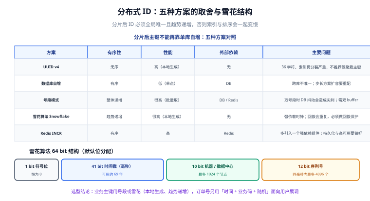

# 分布式 ID 生成

分片之后，主键不能再依赖单库自增——每张分片表自己的 `AUTO_INCREMENT` 会各自从 1 开始，必然冲突。这一页对比五种分布式 ID 方案，并给出雪花算法的完整实现与时钟回拨处理。

::: tip 一句话定位
分布式 ID 只有两个硬指标：**全局唯一**和**趋势递增**。后者常被忽略，但它直接决定索引页分裂的频率——用无序 ID 做聚簇主键，会让写入性能明显下降。
:::

## 为什么不能再用自增主键

```sql
-- 分片前：单库单表，自增主键天然唯一
INSERT INTO t_order (...) VALUES (...);  -- id = 10001, 10002, ...

-- 分片后：每个分片各自自增 → ID 冲突
-- ds_0.t_order_0 的 id 从 1 开始
-- ds_0.t_order_1 的 id 也从 1 开始
-- 同一个用户的两条订单可能都是 id = 1
```

三条路：

1. **给自增设置不同步长**：`ds_0` 用 `AUTO_INCREMENT_INCREMENT = 2, OFFSET = 1`，`ds_1` 用 `2, 2`。可行但扩容要重配，且所有分片共享一个全局序列，无助于写入分散。
2. **改用分布式 ID**（本页重点）。
3. **用业务字段做主键**（如订单号）。但业务字段会变、长度大、且不适合做聚簇索引。

**结论**：技术主键（`id`）用分布式 ID，业务主键（`order_no`）另外设计并加唯一索引。两者分离，各司其职。

## 五种方案对照



| 方案 | 有序性 | 性能 | 外部依赖 | 主要问题 |
| --- | --- | --- | --- | --- |
| **UUID v4** | 完全无序 | 高（本地生成，无网络） | 无 | 36 字符、索引页分裂严重，**不适合做聚簇主键** |
| **数据库自增 + 步长** | 有序 | 低（每次写库） | DB | 跨库唯一靠配置；扩容要调整步长 |
| **号段模式（Segment）** | 整体递增 | 很高（批量取号，一次取 1000 个） | DB / Redis | 取号段时 DB 抖动会造成 ID 尖刺；需双 buffer |
| **雪花算法（Snowflake）** | 趋势递增 | 很高（纯本地计算） | 无 | **强依赖时钟**；回拨会导致重复 |
| **Redis INCR** | 有序 | 高 | Redis | 引入一个强依赖组件；持久化与高可用要做好 |

### 为什么 UUID 不适合做聚簇主键

InnoDB 的主键索引就是数据本身（聚簇索引），数据按主键顺序物理存储。

- **有序主键**（如自增）：新数据总是追加到最后一页，顺序写入，索引页分裂频率低。
- **无序主键**（如 UUID）：插入位置随机分布在整个索引里，**每次插入都可能触发一个页的分裂与数据搬移**，同时写入的页分散导致 Buffer Pool 命中率下降。

实测规律：在写入密集的表上，把 `BIGINT AUTO_INCREMENT` 换成 `CHAR(36) UUID`，**写入吞吐通常下降数倍**，且表文件明显膨胀（页分裂留下的碎片）。

::: warning UUID v7 是值得关注的替代
UUID v7 把时间戳放在高位，因此**趋势递增**，同时保留 128 位随机的唯一性。它解决了 v4 无序导致的索引问题。

但要注意：① 长度仍是 16 字节二进制（写成字符串 36 字符），比 `BIGINT` 的 8 字节大一倍，索引占用明显更大；② 高位时间戳会**暴露创建时间**，若这是敏感信息需评估。

**结论**：主键优先 `BIGINT`（雪花或号段），UUID v7 适合作为「对外暴露、不可枚举」的标识（如分享链接的 ID）。
:::

## 雪花算法（Snowflake）

```
 1 bit  符号位（恒为 0，保证正数）
41 bit  时间戳（毫秒，相对某个起始纪元的偏移量）
10 bit  机器 / 数据中心标识（最多 1024 个节点）
12 bit  同一毫秒内的序列号（最多 4096 个）
────────────────────────────────────────────
64 bit  合计，正好一个 BIGINT

41 位时间戳的容量：2^41 毫秒 ≈ 69.7 年
单节点峰值吞吐：4096 个 ID / 毫秒 = 约 409.6 万 / 秒
```

### Java 实现（含时钟回拨保护）

```java [SnowflakeIdGenerator.java]
public final class SnowflakeIdGenerator {
    /** 起始纪元（本项目上线时间），可自定义；一旦确定不可更改，否则会重复 */
    private static final long EPOCH = 1_700_000_000_000L;

    private static final long WORKER_ID_BITS = 10L;
    private static final long SEQUENCE_BITS = 12L;
    private static final long MAX_WORKER_ID = ~(-1L << WORKER_ID_BITS);   // 1023
    private static final long MAX_SEQUENCE = ~(-1L << SEQUENCE_BITS);     // 4095

    private static final long WORKER_ID_SHIFT = SEQUENCE_BITS;                          // 12
    private static final long TIMESTAMP_SHIFT = SEQUENCE_BITS + WORKER_ID_BITS;         // 22

    /** 允许的最大时钟回拨容忍值（毫秒）。超过它就直接抛异常而不是生成可能重复的 ID */
    private static final long MAX_BACKWARD_MS = 5;

    private final long workerId;
    private long lastTimestamp = -1L;
    private long sequence = 0L;

    public SnowflakeIdGenerator(long workerId) {
        if (workerId < 0 || workerId > MAX_WORKER_ID) {
            throw new IllegalArgumentException("workerId 必须在 0~" + MAX_WORKER_ID + " 之间");
        }
        this.workerId = workerId;
    }

    public synchronized long nextId() {
        long timestamp = System.currentTimeMillis();

        // ---- 时钟回拨：最常见的坑 ----
        if (timestamp < lastTimestamp) {
            long offset = lastTimestamp - timestamp;
            if (offset <= MAX_BACKWARD_MS) {
                // 小幅回拨：短暂等待时钟追上，避免同毫秒内生成重复 ID
                try {
                    Thread.sleep(offset + 1);
                } catch (InterruptedException e) {
                    Thread.currentThread().interrupt();
                    throw new IllegalStateException("等待时钟回拨恢复被中断", e);
                }
                timestamp = System.currentTimeMillis();
                if (timestamp < lastTimestamp) {
                    throw new IllegalStateException("时钟回拨未恢复，拒绝生成 ID");
                }
            } else {
                // 大幅回拨：直接失败，让上游告警。宁可不可用，也不要产生重复 ID
                throw new IllegalStateException(
                    "检测到时钟回拨 " + offset + "ms，超出容忍值 " + MAX_BACKWARD_MS + "ms，拒绝生成 ID");
            }
        }

        if (timestamp == lastTimestamp) {
            // 同一毫秒内自增序列号
            sequence = (sequence + 1) & MAX_SEQUENCE;
            if (sequence == 0) {
                // 该毫秒的 4096 个序列号用尽：自旋等到下一毫秒
                timestamp = waitNextMillis(lastTimestamp);
            }
        } else {
            // 新的毫秒，序列号归零
            sequence = 0L;
        }

        lastTimestamp = timestamp;

        return ((timestamp - EPOCH) << TIMESTAMP_SHIFT)
             | (workerId << WORKER_ID_SHIFT)
             | sequence;
    }

    private long waitNextMillis(long lastTs) {
        long ts = System.currentTimeMillis();
        while (ts <= lastTs) {
            ts = System.currentTimeMillis();
        }
        return ts;
    }
}
```

```java
// 使用
SnowflakeIdGenerator gen = new SnowflakeIdGenerator(workerIdFromConfig());
long id = gen.nextId();
// 1000 万个 ID 约需 2.5 秒（单节点，远高于业务需求）
```

### 时钟回拨的三种处理方式

| 处理方式 | 行为 | 适用 |
| --- | --- | --- |
| **短暂等待**（本文实现） | 回拨 ≤ 阈值时等待时钟追上 | 一般场景（NTP 小幅校时很常见） |
| **直接失败 + 告警** | 回拨超过阈值即抛异常 | 默认选择，安全优先 |
| **保留历史时间戳** | 记住每秒的最后一毫秒与最大序列号，回拨时复用历史时间戳 | 需要高可用、不能失败的场景（实现复杂） |

::: danger NTP 校时是最常见的回拨来源
服务器通过 NTP 同步时间时，如果发现本地时间快了，会**向后调整**——这正是「时钟回拨」。

**运维层面的两道防线**：
1. **NTP 配置用 `-x`（slew 模式）**，让时间调整以「渐进微调」方式进行，而不是「跳变」。这样回拨幅度通常在毫秒级，落在等待阈值内。
2. **禁止手动 `date -s` 改时间**，或在改之前先停服务。

**应用层面的兜底**：workerId 唯一 + 回拨抛异常并告警。**宁可短暂不可用，也不要产生重复 ID**——重复 ID 意味着数据被静默覆盖，比服务不可用严重得多。
:::

## 号段模式（Segment）

**思路**：不在每次需要 ID 时访问数据库，而是一次性**批取一个号段**，在内存里分配：

```sql
-- 发号表：一行代表一个业务线的号段
CREATE TABLE t_id_segment (
  biz_tag     VARCHAR(64) NOT NULL,   -- 业务标识，如 'order'、'user'
  max_id      BIGINT      NOT NULL,   -- 当前已被分配到的最大 ID
  step        INT         NOT NULL,   -- 每次批取的长度
  updated_at  DATETIME    NOT NULL,
  PRIMARY KEY (biz_tag)
) ENGINE = InnoDB;

INSERT INTO t_id_segment (biz_tag, max_id, step, updated_at)
VALUES ('order', 0, 1000, NOW());
```

```sql
-- 取号段：原子地把 max_id 推进 step，并返回新号段
UPDATE t_id_segment SET max_id = max_id + step, updated_at = NOW() WHERE biz_tag = 'order';
SELECT max_id, step FROM t_id_segment WHERE biz_tag = 'order';
```

**双 buffer 设计**（避免号段用尽时的尖刺）：

```text
当前号段剩余 10% 时，异步预取下一个号段放入「备用槽」。
当前号段用尽 → 立即切换到备用槽 → 再异步预取下一个。

效果：ID 的分配几乎不会因为数据库抖动而阻塞。
```

::: danger 号段模式的两个坑
1. **号段用完才去取 = 每次取号都阻塞**。如果取号段的那一刻数据库抖动（主从切换、锁等待），整条业务链会卡住。**正确做法**：如上所述，提前预取（双 buffer）。
2. **多实例 + 单行发号表 = 单点写热点**。所有实例都去 `UPDATE` 同一行，会把这一行变成瓶颈。**缓解**：每个实例使用独立的 `biz_tag` 行（如 `order_inst1`、`order_inst2`），或按业务线拆行。
:::

## 实战：一个可用的号段发号器

```java [SegmentIdGenerator.java]
/**
 * 号段发号器：双 buffer + 异步预取。
 * 目标是「ID 分配永不阻塞」，代价是「重启会浪费一段 ID」（可接受）。
 */
public class SegmentIdGenerator {
    private final String bizTag;
    private final int defaultStep;
    private final JdbcTemplate jdbc;
    private final ExecutorService prefetchPool = Executors.newSingleThreadExecutor(r -> {
        Thread t = new Thread(r, "segment-prefetch");
        t.setDaemon(true);
        return t;
    });

    /** 当前号段 [cursor, currentMax] */
    private volatile long cursor;
    private volatile long currentMax;
    /** 备用号段 */
    private volatile long nextCursor = -1;
    private volatile long nextMax = -1;
    private volatile boolean prefetching = false;

    public SegmentIdGenerator(String bizTag, int defaultStep, JdbcTemplate jdbc) {
        this.bizTag = bizTag;
        this.defaultStep = defaultStep;
        this.jdbc = jdbc;
        loadSegment();  // 启动时立即取一个号段
    }

    public synchronized long nextId() {
        if (cursor > currentMax) {
            if (nextMax > 0) {
                // 切换到预取的备用号段
                cursor = nextCursor;
                currentMax = nextMax;
                nextCursor = nextMax = -1;
                triggerPrefetch();
            } else {
                // 没有备用号段：同步取（期望很少走到这里）
                loadSegment();
            }
        }
        long id = cursor++;

        // 提前触发预取：剩余不足 20% 时
        if (currentMax - cursor < defaultStep * 0.2) {
            triggerPrefetch();
        }
        return id;
    }

    private void triggerPrefetch() {
        if (prefetching || nextMax > 0) return;
        prefetching = true;
        prefetchPool.submit(() -> {
            try {
                long[] seg = fetchFromDb();
                nextCursor = seg[0];
                nextMax = seg[1];
            } catch (Exception e) {
                // 预取失败不致命：当前号段还能用，下次同步取时重试
                System.err.println("[id] 预取号段失败：" + e.getMessage());
            } finally {
                prefetching = false;
            }
        });
    }

    private void loadSegment() {
        long[] seg = fetchFromDb();
        cursor = seg[0];
        currentMax = seg[1];
    }

    /** 原子地推进 max_id 并返回新号段 [新起始, 新结束] */
    private long[] fetchFromDb() {
        jdbc.update("UPDATE t_id_segment SET max_id = max_id + step, updated_at = NOW() WHERE biz_tag = ?", bizTag);
        Long maxId = jdbc.queryForObject("SELECT max_id FROM t_id_segment WHERE biz_tag = ?", Long.class, bizTag);
        Integer step = jdbc.queryForObject("SELECT step FROM t_id_segment WHERE biz_tag = ?", Integer.class, bizTag);
        long end = maxId;
        long start = end - step + 1;
        return new long[] { start, end };
    }
}
```

**验证方式**（并发唯一性）：

```java
@Test
void 并发分配不应产生重复或乱序() throws Exception {
    SegmentIdGenerator gen = new SegmentIdGenerator("order_test", 100, jdbc);

    int threads = 16;
    int perThread = 10_000;
    ConcurrentSkipListSet<Long> ids = new ConcurrentSkipListSet<>();
    ExecutorService pool = Executors.newFixedThreadPool(threads);

    CountDownLatch latch = new CountDownLatch(threads);
    for (int i = 0; i < threads; i++) {
        pool.submit(() -> {
            for (int j = 0; j < perThread; j++) {
                ids.add(gen.nextId());
            }
            latch.countDown();
        });
    }
    latch.await(30, TimeUnit.SECONDS);
    pool.shutdown();

    // ① 唯一性：总数应等于分配次数（无重复、无丢失）
    assertEquals(threads * perThread, ids.size());
    // ② 单调性：去重有序集合的首尾应与实际分配区间一致
    assertEquals(threads * perThread, ids.last() - ids.first() + 1);
}
```

## 业务主键与「可展示 ID」

技术主键（`id`）不该直接展示给用户。原因有三：

1. **可枚举**：用户看到 `id = 10001`，很自然会试 `10002`，可能看到别人的订单。
2. **暴露业务量**：连续 ID 意味着「今天的第 5000 单」这类信息被外人推出。
3. **不可读**：客服和用户沟通时只能说「订单号 10001」，没有辨识度。

**做法**：另建业务编号 `order_no`，用「时间 + 业务码 + 随机/序列」组合：

```java
/**
 * 生成可展示的订单号：前缀 + 日期 + 业务码 + 分片随机段。
 * 特点：可读、不连续、长度固定。
 */
public static String orderNo(LocalDateTime time, int bizCode, long seq) {
    String date = time.format(DateTimeFormatter.ofPattern("yyyyMMdd"));
    // 3 位业务码（如 100 = 普通订单、200 = 预售）
    String biz = String.valueOf(bizCode);
    // 6 位随机段：由雪花 ID 的低位或安全随机数生成，避免被枚举
    String random = String.format("%06d", ThreadLocalRandom.current().nextInt(1_000_000));
    // 4 位当日序列：用 Redis INCR('order:seq:' + date) 得到，保证同日不重复
    String daily = String.format("%04d", seq % 10000);
    return "SO" + date + biz + random + daily;
    // 示例：SO20260925103684270123
}
```

| 段 | 作用 |
| --- | --- |
| `SO` | 单据类型前缀（订单 = Sales Order），便于人工识别 |
| `yyyyMMdd` | 日期，便于人工定位与按日期分库 |
| 业务码 | 区分订单类型，便于分流处理 |
| 6 位随机段 | **防枚举**，这是关键 |
| 4 位当日序列 | 提供同日内的可读顺序 |

## 易错点

::: danger 七个高频问题
1. **雪花算法用了默认位分配却部署超过 1024 个节点** → workerId 溢出，产生重复 ID。**正确做法**：按实际节点数重新分配位宽（如 12 位机器 + 10 位序列）。
2. **workerId 硬编码在多台机器上** → 必须从配置 / 环境变量 / 注册中心下发，并校验唯一性。
3. **`EPOCH` 起始纪元被改** → 会与历史 ID 重复。**它是常量，一旦上线不可更改**。
4. **没处理时钟回拨** → 回拨期间的 ID 与之前重复，数据被静默覆盖。这是最严重的一类事故。
5. **号段取太短** → 频繁访问数据库；取太长（如 100 万）→ 重启浪费一大段，且 ID 跳变明显。
6. **用 UUID 做聚簇主键** → 写入性能下降数倍、表碎片严重。
7. **把技术主键当业务单号展示** → 可枚举、暴露业务量。
:::

::: tip 三条落地建议
- **一个项目只用一种分布式 ID 方案**。技术主键统一走雪花或号段，不要混用（混用会让「ID 的大小意味着什么」变得无法解释）。
- **把 ID 生成器做成可观测的**：暴露「每秒生成数」「时钟回拨次数」「号段切换次数」三个指标。回拨次数不为 0 时应当告警。
- **测试要包含时钟场景**。用可注入的 `Clock` 替代 `System.currentTimeMillis()`，才能写出「回拨 1ms 应正常、回拨 100ms 应抛异常」这类用例。
:::

## 参考资料

- [Twitter Snowflake 算法原始说明](https://github.com/twitter-archive/snowflake/tree/snowflake-2010)（位分配与设计动机）
- [Apache ShardingSphere · 分布式主键](https://shardingsphere.apache.org/document/current/cn/features/sharding/concept/key-generator/)（`SNOWFLAKE` / `UUID` 等内置生成器的配置方式）
- [RFC 9562 · UUID v7](https://www.rfc-editor.org/rfc/rfc9562)（时间有序 UUID 的规范）
- [MySQL 官方文档 · InnoDB 索引](https://dev.mysql.com/doc/refman/8.4/en/innodb-index-types.html)（聚簇索引与页分裂）
- [项目交付 · 数据建模与迁移](../../../../Others/ProjectDelivery/DataModel/index.md)（主键策略与命名规范的通用约定）
