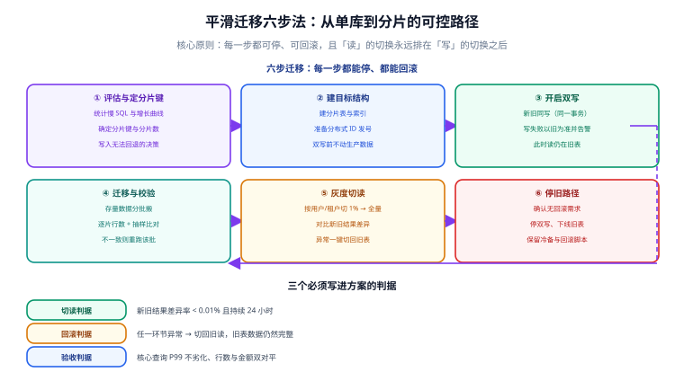

# 平滑迁移：从单库到分片

分片设计的难点不在「新数据怎么写」，而在「已经存在的几千万行数据怎么搬过去，并且过程中服务不能停、数据不能丢」。这一页给出一套可以停下来、可以回退的六步迁移法。

::: info 与相邻页面的分工
[项目交付 · 数据建模与迁移](../../../../Others/ProjectDelivery/DataModel/index.md) 讲的是**通用迁移方法**（改字段、加索引这类 schema 变更的「加→双写→回填→切读→观察→清理」）。

本页讲的是**分片场景下的数据搬迁**：结构变了、数据要重新分布、读写路径都要改。后者的风险与复杂度都更高，所以需要更严格的步骤与判据。
:::

::: tip 一句话定位
迁移的核心原则只有一条：**每一步都能停、都能回滚，且「读」的切换永远排在「写」的切换之后。**

读错了可以切回来（改个开关），写错了就是数据不一致（要修数据）。所以顺序不能反。
:::

## 六步迁移法



| 步骤 | 关键动作 | 可停点 | 回滚方式 |
| --- | --- | --- | --- |
| ① 评估与定分片键 | 统计慢 SQL、定分片键与分片数 | 任意时刻可停（未动生产） | 无需回滚 |
| ② 建目标结构 | 建分片表、索引、发号器 | 任意时刻可停 | 删表 |
| ③ 开启双写 | 新旧同写（同一事务） | **可长期停在这一步** | 关开关，回到单写 |
| ④ 迁移与校验 | 存量分批搬 + 逐批校验 | 每批都是停点 | 修该批数据后重跑 |
| ⑤ 灰度切读 | 按用户/租户 1% → 全量 | 每个灰度档位都是停点 | 切回旧读 |
| ⑥ 停旧路径 | 停双写、下线旧表 | 观察期后才执行 | 保留冷备与回滚脚本 |

::: danger 顺序不可调换的三条铁律
1. **先双写、再搬数据**。顺序反了，搬迁期间的新写入会丢（因为数据已经在搬的时候产生了变化）。
2. **先切读、再停双写**。切读之后旧表仍在写入（因为双写还开着），所以随时可以切回来。停双写之后就没有退路了。
3. **观察期不能省**。切读后至少观察 24 小时（含一个业务高峰），确认无异常再停双写。
:::

## 第 1 步：评估与确定分片键

在动任何生产数据之前，先产出一份**评估报告**，包含四个数字与一个决策：

```sql
-- ① 数据总量与增长趋势
SELECT
  TABLE_ROWS AS total_rows,
  ROUND(DATA_LENGTH / 1024 / 1024 / 1024, 2) AS data_gb,
  ROUND(INDEX_LENGTH / 1024 / 1024 / 1024, 2) AS index_gb
FROM information_schema.tables
WHERE TABLE_SCHEMA = 'order_db' AND TABLE_NAME = 't_order';

-- ② 月度增长（用于推算分片数）
SELECT DATE_FORMAT(created_at, '%Y-%m') AS month, COUNT(*) AS rows_cnt
FROM t_order
GROUP BY month
ORDER BY month DESC
LIMIT 12;

-- ③ 分片键候选的基数与分布（越均匀越好）
SELECT
  COUNT(DISTINCT user_id)                              AS distinct_users,
  COUNT(*)                                             AS total_rows,
  ROUND(COUNT(DISTINCT user_id) / COUNT(*), 4)         AS cardinality_ratio
FROM t_order;

-- ④ 冷热数据分布（决定是否需要先归档）
SELECT
  SUM(created_at >= DATE_SUB(NOW(), INTERVAL 3 MONTH))  AS hot_rows,
  SUM(created_at <  DATE_SUB(NOW(), INTERVAL 12 MONTH)) AS cold_rows,
  COUNT(*)                                              AS all_rows
FROM t_order;
```

**决策输出**（写进迁移方案文档）：

```text
分片键：user_id
  理由：Q1「按用户查订单列表」占查询量的 80%，用 user_id 可单片直达
  基数：4800 万用户 / 4200 万订单，比值 1.14（高度离散）
  可变更性：user_id 不变（订单归属不迁移）

分片数：16（2 库 × 8 表）
  依据：当前 4200 万行，单分片目标 ≤ 1000 万行 → 下限 4
        按 2 年增长（+4800 万行）后需 9 个 → 取 16（2 的幂 + 余量）

兜底：按订单号查走 t_order_route 映射表；运营类查询走只读副本
```

**验证方式**：报告里的每个数字都要有对应的 SQL 与执行日期。**没有数字的「感觉够用」不作数**。

## 第 2 步：建目标结构

```sql
-- 在每个数据源上建分片表（示例：ds_0 / ds_1 各 8 张）
-- 用脚本批量生成与执行，避免手写 16 次
CREATE TABLE t_order_0 (
  id          BIGINT       NOT NULL,          -- 雪花 ID，不再用 AUTO_INCREMENT
  order_no    VARCHAR(32)  NOT NULL,
  user_id     BIGINT       NOT NULL,
  channel_id  INT          NOT NULL,
  amount      DECIMAL(12,2) NOT NULL,
  status      TINYINT      NOT NULL,
  remark      VARCHAR(500) DEFAULT NULL,
  created_at  DATETIME     NOT NULL,
  updated_at  DATETIME     NOT NULL,
  PRIMARY KEY (id),
  UNIQUE KEY uk_order_no (order_no),
  KEY idx_user_created (user_id, created_at)
) ENGINE = InnoDB DEFAULT CHARSET = utf8mb4;
-- t_order_1 ... t_order_7 结构与索引完全一致
```

::: danger 分片表的三个「必须完全一致」
1. **表结构必须一致**。任何一张表少一列，都会在特定分片上报错——而这种错误只在数据落到那个分片时才暴露。
2. **索引必须一致**。否则同一 SQL 在不同分片上的执行计划不同，性能表现不稳定，难以定位。
3. **字符集与排序规则必须一致**。否则 JOIN 或比较时可能出现隐式转换，导致索引失效。

**验证方式**：写一个巡检脚本，比对所有分片表的 `SHOW CREATE TABLE` 输出（去掉表名后缀后应完全相同）。

```shell
# 批量导出并比对结构（去掉表名后缀后应无差异）
for i in $(seq 0 7); do
  mysql -h ds0 -e "SHOW CREATE TABLE t_order_$i\G" | sed "s/t_order_$i/t_order_X/" >> /tmp/schema_ds0.txt
done
sort -u /tmp/schema_ds0.txt | wc -l   # 期望：与总行数对比，只有 1 份不同的结构
```
:::

**同时准备好分布式 ID 发号器**（见 [分布式 ID 生成](../IDGeneration/index.md)），因为新表的 `id` 不再自增。

## 第 3 步：开启双写

**目标**：新数据同时写旧表与分片表，保证两边一致。

### 三种实现方式

| 方式 | 实现位置 | 优点 | 缺点 |
| --- | --- | --- | --- |
| **应用层双写** | 业务代码 | 完全可控，可加开关与校验 | 侵入业务代码 |
| **数据库触发器** | 数据库 | 对应用透明 | 影响写入性能，难维护，出问题难排查 |
| **CDC 订阅 binlog** | 独立进程 | 对应用零侵入 | 有延迟（毫秒~秒级），不适合强一致要求 |

::: tip 推荐：应用层双写 + 开关
```java
// 用配置开关控制，便于随时关闭
@Value("${migration.dual-write.enabled:false}")
private boolean dualWriteEnabled;

@Transactional
public void createOrder(OrderCreateCmd cmd) {
    Order order = cmd.toOrder();

    // ① 始终写旧表（以旧为准，保证回滚时数据完整）
    legacyOrderMapper.insert(order);

    // ② 双写新分片表
    if (dualWriteEnabled) {
        try {
            shardedOrderMapper.insert(order);
        } catch (Exception e) {
            // 新写失败不回滚业务：记录异常 + 计数，由补偿任务重试
            dualWriteFailureRecorder.record(order, e);
            log.error("[migration] 双写新表失败 orderNo={}", order.getOrderNo(), e);
        }
    }
}
```

**为什么新写失败不回滚业务**：回滚会让用户下单失败（业务受影响），而不回滚只是「新表暂时少一条」（可以由补偿任务补齐）。**迁移期间的原则是「业务优先，数据靠补偿追平」。**
:::

::: danger 双写的三个必现问题
1. **两边不在同一事务里**。如果两个数据源用不同的 `DataSource`，`@Transactional` 只对主数据源生效，新表写入失败不会回滚旧表。**正确做法**：接受这一点，改用「失败记录 + 补偿任务」兜底，而不是试图上 XA。
2. **ID 生成不一致**。旧表用 `AUTO_INCREMENT`、新表用雪花 ID，两边 `id` 不同 → 后续对账困难。**正确做法**：双写时把旧表拿到的自增 ID 也写进新表的某个字段（如 `legacy_id`），保留映射关系。
3. **开关状态不可观测**。没人知道现在双写开着还是关着。**正确做法**：把开关状态暴露到监控面板与健康检查接口上。
:::

## 第 4 步：迁移存量数据

### 分批策略

```text
不要一次性 SELECT * FROM t_order 然后逐条 INSERT（会 OOM，也会长事务锁表）。

正确做法：按主键（或时间）切批，每批 1000~5000 行，每批一个事务。
```

```java [DataMigrator.java]
public class DataMigrator {
    private static final int BATCH_SIZE = 2000;
    private static final int MAX_BATCHES = 50; // 单次运行上限，避免长时间占用资源

    public void migrate(long startId, Consumer<Long> progress) {
        long cursor = startId;
        for (int i = 0; i < MAX_BATCHES; i++) {
            // ① 从旧表读一批（用主键游标，走聚簇索引）
            List<Order> batch = legacyOrderMapper.selectByCursor(cursor, BATCH_SIZE);
            if (batch.isEmpty()) {
                System.out.println("迁移完成，最后 cursor = " + cursor);
                break;
            }

            // ② 按分片键分组（保证同一分片的记录在同一个事务里提交）
            Map<Long, List<Order>> grouped = batch.stream()
                .collect(Collectors.groupingBy(o -> shardingKeyOf(o)));

            // ③ 分组写入（每组一个事务）
            grouped.forEach((shardKey, rows) -> shardedOrderMapper.batchInsert(shardKey, rows));

            // ④ 推进游标
            cursor = batch.get(batch.size() - 1).getId();
            progress.accept(cursor);

            // ⑤ 主动让出资源，避免长时间打满数据库
            sleepQuietly(50);
        }
    }
}
```

### 逐批校验：三种校验方式

```sql
-- ① 行数校验（每批迁移后立即执行）
SELECT
  (SELECT COUNT(*) FROM order_db.t_order WHERE id BETWEEN ? AND ?) AS legacy_cnt,
  (SELECT SUM(cnt) FROM (
     SELECT COUNT(*) AS cnt FROM ds0.t_order_0 WHERE id BETWEEN ? AND ? UNION ALL
     SELECT COUNT(*) FROM ds0.t_order_1 WHERE id BETWEEN ? AND ? UNION ALL
     -- ... 全部 16 张表
  ) t) AS sharded_cnt;
-- 期望：两者相等。不等则本批回滚重跑。

-- ② 金额校验（防「行数对但内容错」）
SELECT SUM(amount) FROM order_db.t_order WHERE id BETWEEN ? AND ?;
-- 与分片表的 SUM(amount) 逐批比对，差值必须为 0

-- ③ 抽样校验（防「同条数但错位」）
-- 随机抽 20 条，逐字段比对
SELECT * FROM order_db.t_order WHERE id IN (?, ?, ...);
```

::: danger 只校验行数是不够的
行数相等但内容错位的场景真实存在：比如搬运时字段顺序写错、或 `user_id` 与 `order_no` 互换——行数完全一致，但数据全错。

**必须校验的三层**：
1. 行数（能发现漏搬、重搬）
2. 金额等可加总字段（能发现内容错误）
3. 随机抽样逐字段比对（能发现字段错位、精度丢失）

**建议**：把这三层做成脚本，每批自动跑；任一层不通过就停下，修好再继续。
:::

## 第 5 步：灰度切读

### 切流策略

```java
/**
 * 按用户 ID 灰度切读：1% → 5% → 20% → 50% → 100%。
 * 用「用户 ID 的哈希取模」而不是「随机数」，保证同一用户始终读同一侧
 * （否则同一用户刷新两次可能看到不同结果，会让用户以为数据丢了）。
 */
public class ReadRouter {
    @Value("${migration.read.percent:0}")
    private int percent; // 0~100

    public List<Order> listOrders(long userId) {
        if (shouldReadNew(userId)) {
            return shardedOrderMapper.listByUser(userId);
        }
        return legacyOrderMapper.listByUser(userId);
    }

    private boolean shouldReadNew(long userId) {
        if (percent <= 0) return false;
        if (percent >= 100) return true;
        // 用 user_id 的稳定哈希取模，保证同一用户路由结果稳定
        return Math.floorMod(Long.hashCode(userId), 100) < percent;
    }
}
```

### 切读期间的关键动作：双读比对

```java
/**
 * 在切到新读之前，先做一段「双读比对」：
 * 同时查新旧两侧，比对结果，但不改变对外返回值（仍以旧为准）。
 */
public List<Order> listOrdersWithCompare(long userId) {
    List<Order> legacy = legacyOrderMapper.listByUser(userId);
    try {
        List<Order> sharded = shardedOrderMapper.listByUser(userId);
        if (!isSame(legacy, sharded)) {
            diffReporter.report(userId, legacy, sharded); // 上报差异，不抛异常
        }
    } catch (Exception e) {
        diffReporter.reportError(userId, e);
    }
    return legacy; // 对外始终返回旧侧结果
}
```

::: danger 切读判据必须量化，不能靠「看起来没问题」
**切读判据（缺一不可）**：

1. 双读比对**差异率 < 0.01%**（且差异原因可解释：如双写失败未补的少量记录）；
2. 差异率**连续 24 小时**稳定（含一个业务高峰）；
3. 新读路径的 **P99 延迟不高于旧路径**；
4. 新读路径的**错误率为 0**（有错误说明分片配置或数据有问题）。

任一条不满足，就停在该灰度档位继续修，**不要靠提高灰度比例来「压过去」**。
:::

## 第 6 步：停旧路径

切读到 100% 并稳定运行 24 小时后，才执行收尾：

```text
① 关闭双写开关（注意：这是不可逆的一步）
② 监控观察 24 小时，确认无业务异常
③ 旧表转为只读，保留 7~30 天（按合规要求）
④ 旧表改名为 t_order_deprecated_20260925（保留可查，但应用不再依赖）
⑤ 确认无任何代码/报表引用后，归档到冷备存储
⑥ 释放旧表的磁盘空间
```

::: warning 旧表不要急着删除
**三个常见的「删了才想起来要」**：
1. 报表系统还在查旧表（改报表的排期往往比预期长）；
2. 数据稽核需要对比历史数据；
3. 迁移期间产生的双写失败记录需要人工修复，需要对照旧表。

**建议**：至少保留 30 天，且删除前先确认「最近 7 天对旧表的查询次数为 0」。
:::

## 时间与资源估算

以 4200 万行、单批 2000 行、每批含 50ms 让出间隔为例：

```text
批次数 = 4200 万 / 2000 = 21000 批
单批耗时 ≈ 读取 + 写入 + 校验 ≈ 120 ms（视硬件而定）
每批间隔 50 ms

总耗时 ≈ 21000 × (120 + 50) ms ≈ 3570 秒 ≈ 1 小时

若加上每批的三层校验（行数 + 金额 + 抽样）：
总耗时 ≈ 1.5 ~ 2.5 小时（视校验脚本复杂度）

建议：在业务低峰期启动，单次运行上限设为 50 批，分多次跑完，
      避免长时间占用数据库资源影响线上。
```

::: tip 迁移任务要可中断、可续跑
把「当前游标」持久化（写到一张 `t_migration_progress` 表或 Redis），任务可以随时中断并从上次的位置继续。这样：

- 出现异常时可以立即停下，不影响线上；
- 夜间跑不完时白天可以暂停，晚上继续；
- 不需要「一次必须跑完」的压力。
:::

## 实战：完整迁移的检查清单

```text
【准备阶段】
□ 评估报告已产出（4 个数字 + 分片键决策）
□ 分片表结构与索引完全一致（巡检脚本通过）
□ 分布式 ID 发号器已验证（并发唯一性测试通过）
□ 迁移脚本支持断点续跑（游标持久化）
□ 校验脚本三层齐备（行数 + 金额 + 抽样）
□ 回滚方案已写明并演练过

【双写阶段】
□ 双写开关已上线，默认关闭
□ 双写失败记录 + 补偿任务已就绪
□ 双写开关状态已暴露到监控
□ 双写运行 24 小时，失败率为 0

【迁移阶段】
□ 存量数据分批判量完成
□ 每批三层校验通过
□ 全量校验通过（总数 + 总额一致）
□ 抽样 100 条逐字段比对一致

【切读阶段】
□ 双读比对运行 24 小时，差异率 < 0.01%
□ 灰度 1% → 5% → 20% → 50% → 100%，每档观察足够时间
□ 新读路径 P99 不劣于旧路径
□ 新读路径错误率为 0

【收尾阶段】
□ 100% 切读后观察 24 小时
□ 关闭双写
□ 旧表转只读并改名
□ 确认无引用后归档
□ 迁移方案文档归档（含遇到的所有问题与决策）
```

**验收方式**：最终用一条 SQL 同时统计新旧两侧的行数与金额，必须完全相等。

```sql
-- 全量一致性终检（在应用侧聚合各分片结果）
-- 旧表：
SELECT COUNT(*) AS cnt, SUM(amount) AS total FROM order_db.t_order;
-- 分片表（对 16 张表分别执行后相加）：
SELECT COUNT(*) AS cnt, SUM(amount) AS total FROM ds0.t_order_0;
-- ... 逐表累加

-- 期望：cnt 与 total 完全相等，且 total 精确到分
```

## 易错点

::: danger 十个高频问题
1. **先搬数据后开双写** → 搬迁期间的新写入丢失。
2. **停双写早于切读** → 失去回退能力。
3. **分片表结构/索引不一致** → 特定分片才报错，定位困难。
4. **只校验行数** → 内容错位无法发现。
5. **长事务分批不当**（如 `DELETE ... LIMIT` 无索引）→ 锁表。
6. **灰度用随机数而不是哈希** → 同一用户刷新看到不同结果。
7. **切读判据只有「看起来正常」** → 差异率未量化，问题被掩盖。
8. **双写失败静默忽略** → 新表永久缺数据，切读后才暴露。
9. **旧表过早删除** → 报表/稽核/补偿任务全部失效。
10. **迁移脚本不支持续跑** → 中断后只能从头再跑，耗时且风险高。
:::

## 参考资料

- [Apache ShardingSphere · 弹性伸缩](https://shardingsphere.apache.org/document/current/cn/features/scaling/)（官方的在线扩容方案与迁移工具）
- [MySQL 官方文档 · 复制与 binlog](https://dev.mysql.com/doc/refman/8.4/en/replication.html)（CDC 订阅的底层依据）
- [项目交付 · 数据建模与迁移](../../../../Others/ProjectDelivery/DataModel/index.md)（通用迁移六步法，本页是其在分片场景下的具体化）
- [ShardingSphere · DistSQL](https://shardingsphere.apache.org/document/current/cn/user-manual/shardingsphere-proxy/distsql/)（切规则的方式）
- [MySQL 官方文档 · 分批删除大表数据](https://dev.mysql.com/doc/refman/8.4/en/delete.html)（批量操作的锁与事务约束）
