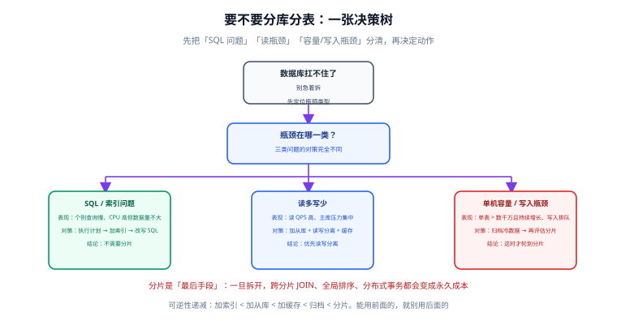

# 分库分表概述与决策

这一页只回答一个问题：**该不该拆**。这是整个分片工程里最重要、也最不可逆的一个决策——如果这一步判错了，后面所有的技术选型都会白做。

::: tip 一句话定位
分片解决的是「**单机存不下、写不进**」，而不是「查询慢」。把查询慢当成数据量问题去分片，结果通常是：慢 SQL 依然慢，还额外多出一堆跨分片查询的麻烦。
:::

## 先排除 90% 不该拆的场景



遇到「数据库扛不住」，先把瓶颈归到下面三类之一：

| 瓶颈类型 | 典型表现 | 正确的第一动作 | 需要分片吗 |
| --- | --- | --- | --- |
| **SQL / 索引问题** | 个别查询慢、CPU 高但数据量不大（百万级以内） | 看执行计划、补索引、改写 SQL | **不需要** |
| **读多写少** | 读 QPS 高，主库压力集中在查询 | 加从库 + 读写分离 + 缓存 | **不需要** |
| **单机容量 / 写入瓶颈** | 单表数千万且持续增长、写入排队、磁盘告警 | 先归档冷数据，再评估分片 | **这时才需要** |

::: danger 三个最常见的误判
1. **把「慢查询」当成「数据量大」**。100 万行的表上一条全表扫描会慢，是因为没有索引，不是因为表大。**验证方法**：给该查询加上合适的索引，如果响应时间从秒级降到毫秒级，那问题就在索引。
2. **把「CPU 高」当成「写入压力大」**。慢 SQL 同样会把 CPU 打满。**验证方法**：看 `SHOW PROCESSLIST` 或慢日志，确认耗时集中在哪些语句上。
3. **把「磁盘快满」当成「必须分片」**。历史数据的访问频率往往极低。**验证方法**：统计最近 3 个月的数据占比——低于 5% 时，先做归档。

**先做体检，再谈方案。** 体检要看的四个数字：数据总量与增长率、读写 QPS 与峰值、慢 SQL 清单、磁盘使用曲线。
:::

## 「单表多大算大」

常听到「单表不超过 2000 万行」，这个数字不是随口定的，它来自 InnoDB 的 B+ 树结构：

```text
InnoDB 索引页大小           16 KB
非叶子节点每条记录          主键(8B, bigint) + 页指针(6B) ≈ 14 B
每页可容纳的指针数          16 KB / 14 B ≈ 1170

三层 B+ 树的容量：
  第 1 层（根）        1 个页
  第 2 层              1170 个页
  第 3 层（叶子）      1170 × 1170 ≈ 137 万 个页

若每行 1 KB，一个叶子页约存 16 行：
  137 万 × 16 ≈ 2190 万行
```

所以「约 2000 万行」是**三层 B+ 树在行宽 1KB 时的容量**。它意味着：

- 数据量在这个量级内，**任意一行的查询最多读 3 次磁盘**（3 次 IO），延迟稳定。
- 超过之后树变成四层，**每次查询固定多一次 IO**，且 Buffer Pool 命中率开始下降。

::: warning 这个数字要按自己的行宽换算
- 行宽 200 B（窄表，如日志、明细）→ 单页可存 80 行 → 容量上限约 **1 亿行**。
- 行宽 4 KB（宽表，含大字段）→ 单页存 4 行 → 容量上限约 **500 万行**。

**正确做法**：用 `SELECT AVG_ROW_LENGTH FROM information_schema.tables WHERE table_name = 'xxx'` 拿到实际行宽，再按上面的方法换算，而不是记住「2000 万」这个数字到处套。
:::

## 四种拆分方向

很多人把「分库分表」当成一件事，其实它是四个动作的组合：

| 方向 | 拆什么 | 解决什么 | 代价 |
| --- | --- | --- | --- |
| **垂直分库** | 按业务域拆到不同库（用户库、订单库、商品库） | 单库连接数与容量压力 | 跨库 JOIN 消失，需服务层组装 |
| **垂直分表** | 按冷热字段拆（常用列在前，大字段在后） | 单行过长导致的 IO 浪费 | 需要额外一次关联查询 |
| **水平分表** | 同结构按行拆（`t_order_0` … `t_order_3`） | 单表行数过多 | SQL 能力受损，需中间件 |
| **水平分库** | 按行拆到不同数据源 | 容量 + 写入双重瓶颈 | 需要分布式 ID 与分布式事务 |

::: tip 实践中的组合方式
**垂直分库（业务边界） + 水平分表（单表行数）** 是最常见的组合。水平分库只在「写入真的扛不住」时才启用——因为它会把复杂度再抬高一个档次（分布式事务从「可选」变成「必须」）。

**顺序**：先垂直（按业务天然切开、边界清晰），再水平（按行拆分、需要设计分片键）。
:::

## 拆开之后，永久失去什么

这是决策时最需要想清楚的部分——**有些能力拆开后几乎不可能恢复**：

| 失去的能力 | 具体影响 | 缓解手段 |
| --- | --- | --- |
| **跨分片 JOIN** | `order JOIN user` 若两表分片键不同，就要跨库 | 绑定表（同键同算法）、广播表、应用层组装 |
| **全局排序** | `ORDER BY 非分片键` 需各分片排序后归并 | 让分片键进排序前缀，或限制 Top-N |
| **全局唯一约束** | 数据库无法跨库保证唯一 | 依赖分布式 ID 或外部唯一性校验 |
| **单机事务** | 跨库写无法用本地事务 | 本地消息表、Saga、XA（成本更高） |
| **聚合函数** | `AVG` 不能简单归并 | 改写为 `SUM / COUNT` 再计算 |
| **深分页** | `LIMIT 100000, 20` 每片都要扫 | 游标分页、按时间范围裁剪 |
| **DDL 变更** | 改表结构要遍历所有分片 | 中间件批量执行 + 灰度和回滚方案 |
| **数据迁移** | 分片数一旦确定，扩容要搬数据 | 一致性哈希、虚拟桶、双倍扩容 |

::: danger 「以后再说」是最贵的选项
分片键与分片数一旦上线，**修改它们等于重做一次完整迁移**。所以：

1. **分片数宁多勿少**（如按 2 的幂选 8/16/32，便于未来双倍扩容），因为「分片数过多」只是管理复杂度上升，「分片数不足」则要搬数据。
2. **分片键宁可选稳定字段**（用户 ID、租户 ID），不要选可能变化的字段（状态、归属部门）。
:::

## 先试试这些替代方案

在决定分片之前，以下手段都要评估过：

| 方案 | 适用条件 | 成本 | 上限 |
| --- | --- | --- | --- |
| **加索引 / 改写 SQL** | 慢查询是索引问题 | 极低 | 解决查询慢 |
| **加从库 + 读写分离** | 读多写少 | 低 | 读能力可水平扩展 |
| **加缓存** | 热点数据集中 | 中（需处理一致性） | 读能力大幅提升 |
| **归档冷数据** | 历史数据访问频率低 | 低 | 显著降低单表行数 |
| **MySQL 分区表** | 按时间范围查询为主 | 低 | 单机内分而治之 |
| **换存储引擎**（如 ClickHouse 做分析） | 分析型负载与交易负载要分离 | 中 | 分析能力质变 |
| **NewSQL / 分布式数据库** | 团队有能力运维且有预算 | 高 | 原生分片、对应用透明 |

### 关于 MySQL 分区表

分区表（`PARTITION BY RANGE`）是**成本最低的「分而治之」**：对应用完全透明，能按时间做区间的裁剪与快速删除。

```sql
-- 按月份分区：查询带上时间条件时能自动裁剪分区
CREATE TABLE t_api_log (
  id BIGINT NOT NULL,
  created_at DATETIME NOT NULL,
  latency_ms INT NOT NULL,
  PRIMARY KEY (id, created_at)   -- 分区键必须是主键的一部分
) ENGINE = InnoDB
PARTITION BY RANGE (TO_DAYS(created_at)) (
  PARTITION p202608 VALUES LESS THAN (TO_DAYS('2026-09-01')),
  PARTITION p202609 VALUES LESS THAN (TO_DAYS('2026-10-01')),
  PARTITION p202610 VALUES LESS THAN (TO_DAYS('2026-11-01')),
  PARTITION pmax    VALUES LESS THAN MAXVALUE
);

-- 删除历史分区是「秒级」操作，远快于 DELETE
ALTER TABLE t_api_log DROP PARTITION p202608;
```

::: warning 分区表的四条限制
1. **分区键必须包含在每个唯一索引里**（包括主键），否则无法建表。这会限制主键设计。
2. **它不解决写入瓶颈**。所有分区仍在同一台机器上，写入能力不变。
3. **查询必须带分区键才能裁剪**。不带分区键的查询会扫描所有分区，可能比不分区更慢。
4. **分区数不宜过多**（经验上单表几十个分区较合适）。分区数过多会拖慢元数据操作与 DDL。
:::

## 实战：一次容量评估

假设表结构如下，需要判断是否该分片。

```sql
-- 现状：单表订单表
CREATE TABLE t_order (
  id           BIGINT      NOT NULL AUTO_INCREMENT,
  order_no     VARCHAR(32) NOT NULL,
  user_id      BIGINT      NOT NULL,
  amount       DECIMAL(12,2) NOT NULL,
  status       TINYINT     NOT NULL,
  remark       VARCHAR(500) DEFAULT NULL,   -- 大字段
  created_at   DATETIME    NOT NULL,
  PRIMARY KEY (id),
  UNIQUE KEY uk_order_no (order_no),
  KEY idx_user_created (user_id, created_at)
) ENGINE = InnoDB;
```

**第一步：取实际容量与行宽**

```sql
SELECT
  TABLE_ROWS,
  ROUND(DATA_LENGTH / 1024 / 1024, 1) AS data_mb,
  ROUND(INDEX_LENGTH / 1024 / 1024, 1) AS index_mb,
  AVG_ROW_LENGTH
FROM information_schema.tables
WHERE TABLE_SCHEMA = DATABASE() AND TABLE_NAME = 't_order';
```

假设输出：`TABLE_ROWS = 42000000`、`AVG_ROW_LENGTH = 320`。

**第二步：算层数与容量**

```text
行宽 320 B → 每叶子页约 16384 / 320 ≈ 51 行
三层 B+ 树容量 ≈ 1170 × 1170 × 51 ≈ 6976 万行
```

结论：**当前 4200 万行，仍在三层树范围内**——纯查询延迟不会因为「树变四层」而恶化。

**第三步：看是否真的到了瓶颈**

```sql
-- 写入是否排队：看 InnoDB 的行锁等待与刷盘压力
SHOW GLOBAL STATUS LIKE 'Innodb_row_lock_waits';
SHOW GLOBAL STATUS LIKE 'Innodb_data_fsyncs';

-- 单表同步的从库延迟（写压力大的典型信号）
SHOW SLAVE STATUS\G   -- 关注 Seconds_Behind_Master

-- 冷热数据分布：决定归档能否解决问题
SELECT
  DATE_FORMAT(created_at, '%Y-%m') AS month,
  COUNT(*) AS rows_cnt
FROM t_order
WHERE created_at >= '2026-01-01'
GROUP BY month
ORDER BY month;
```

**第四步：按顺序决策**

| 如果发现 | 采取动作 |
| --- | --- |
| 慢查询集中在少数 SQL | 加索引 / 改写 SQL，**不分片** |
| 冷数据（1 年前）占比 > 80%，且几乎不查 | **归档到历史库**，再观察 |
| 查询以「按用户查订单」为主，且写入压力大 | **水平分表**，以 `user_id` 为分片键 |
| 归档后单表仍持续增长且写入排队 | **垂直分库 + 水平分表** |

**验证方式**：归档后重跑上面的容量查询，确认单表行数下降；再持续观察两周的写入延迟与从库延迟曲线，确认是否反弹。**只有确认「归档 + 索引 + 从库」三招都无效后，才进入分片设计**（下一页）。

## 易错点

::: danger 五条决策期最容易犯的错
1. **先选中间件再定分片键**。顺序反了——分片键是业务决策，中间件只是执行工具。
2. **分片数取「当前够用的最小值」**。如按 `用户数 / 500 万` 算出 3 个分片。**建议**：取 2 的幂且留出 2~4 倍余量。
3. **把可能变更的字段做分片键**（状态、部门、归属关系）。一旦变更就要跨分片搬数据。
4. **没有回滚方案就开工**。迁移必须能「退回单库」，见 [平滑迁移](Migration/index.md)。
5. **忽略「小表」**。分片后跨库 JOIN 消失，字典表、配置表要有明确的处理方式（广播表或缓存）。
:::

## 参考资料

- [Apache ShardingSphere 官方文档](https://shardingsphere.apache.org/document/current/cn/overview/)（含核心概念与路线图）
- [MySQL 官方文档 · 分区](https://dev.mysql.com/doc/refman/8.4/en/partitioning.html)（分区表能力与限制）
- [MySQL 官方文档 · INFORMATION_SCHEMA TABLES](https://dev.mysql.com/doc/refman/8.4/en/information-schema-tables-table.html)（容量评估取数字段说明）
- [MySQL 官方文档 · InnoDB 索引结构](https://dev.mysql.com/doc/refman/8.4/en/innodb-index-types.html)（B+ 树与页结构）
- [项目交付 · 数据建模与迁移](../../../../Others/ProjectDelivery/DataModel/index.md)（迁移的通用方法论）
