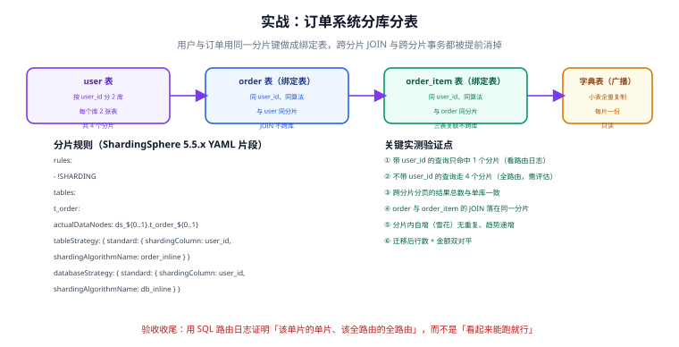

# 实战：订单系统分库分表

这一页把前面各页的内容合成一个可落地的方案：一个 4200 万行的订单表，拆成 **2 库 × 8 表 = 16 个分片**，用 `user_id` 做分片键，配套路由表、绑定表与本地消息表，并把「怎么验证它真的对了」写清楚。

::: info 适用前提
- JDK 17 及以上（本文按 ShardingSphere 5.5.x 的运行时基线）
- Docker（用于本地起两个 MySQL 实例）
- Spring Boot + MyBatis-Plus 的应用骨架

本页聚焦**分片本身的完整实现**，Spring Boot 与 MyBatis 的通用用法不展开。
:::

## 需求与约束

| 项 | 值 |
| --- | --- |
| 数据量 | 存量 4200 万行，月增约 200 万行 |
| 核心查询 | Q1 按用户查订单列表（80%）、Q2 按订单号查详情（15%）、Q3 运营按渠道查（5%） |
| 写入压力 | 峰值约 3000 TPS，单库写入已出现排队 |
| 硬约束 | 不能在业务代码里显式写分片表名（如 `t_order_3`） |

## 分片设计



### 决策过程

| 候选分片键 | Q1（80%） | Q2（15%） | Q3（5%） | 结论 |
| --- | --- | --- | --- | --- |
| `order_id` | 广播 | 单播 | 广播 | ✗ 最高频查询变广播 |
| `created_at` | 广播 | 广播 | 多播 | ✗ 且有尾部写热点 |
| **`user_id`** | **单播** | 广播 | 广播 | ✅ 采用 + 两条兜底 |

**兜底措施**：

1. **Q2（按订单号查）** → 建路由表 `t_order_route`（订单号 → user_id），先路由再单播。
2. **Q3（运营按渠道查）** → 不打分片集群，走只读副本 / 数仓（见 [跨分片查询](CrossShard/index.md) 的实战章节）。

### 分片参数

```text
分片键：user_id
分片数：16（2 个库 × 每库 8 张表）
算法：取模
  库路由：user_id % 2                （偶数 → ds0，奇数 → ds1）
  表路由：(user_id % 16) >> 1        （0~7）
绑定表：t_order, t_order_item（同分片键、同算法）
广播表：t_dict_channel（渠道字典，行数 < 100）
```

**自检**：用脚本枚举 `user_id` 从 1 到 1000，确认 16 个 `(ds, table)` 组合都出现且分布均匀。

```python [check_routing.py]
from collections import Counter

def route(user_id):
    ds = user_id % 2
    table = (user_id % 16) >> 1
    return f"ds{ds}.t_order_{table}"

counter = Counter(route(uid) for uid in range(1, 1001))
print("命中的组合数:", len(counter))
print("最少命中:", min(counter.values()), "最多命中:", max(counter.values()))
for name, cnt in sorted(counter.items()):
    print(f"  {name:<20} {cnt}")
```

**期望输出**：命中 16 个组合，每个约 62~63 次。出现组合数少于 16 或极不均衡，说明表达式有误。

::: danger `>> 1` 这一步不能省
如果表路由直接写成 `user_id % 8`，那么 `user_id = 1` 与 `user_id = 9` 会同时命中 `ds1.t_order_1`：

```text
user_id = 1：ds = 1 % 2 = 1 → ds1；table = 1 % 8 = 1 → t_order_1
user_id = 9：ds = 9 % 2 = 1 → ds1；table = 9 % 8 = 1 → t_order_1   ← 与上面同表，但这是正常的
```

实际上真正的错误是**分片覆盖不全或分布不均**。用 `(user_id % 16) >> 1` 的写法，保证 `user_id % 16` 的 16 个取值被「一半决定库、另一半决定表」完整覆盖，`user_id = 1` 与 `user_id = 9` 会落到**不同**的表：

```text
user_id = 1：ds = 1 → ds1；table = (1 % 16) >> 1 = 0 → t_order_0
user_id = 9：ds = 1 → ds1；table = (9 % 16) >> 1 = 4 → t_order_4
```

**验证方法**：上面的枚举脚本能直接看出问题。这是上线前最值得花十分钟做的一件事。
:::

## 第 1 步：本地起两个 MySQL

```yaml [docker-compose.yml]
services:
  mysql-ds0:
    image: mysql:8.4
    container_name: mysql-ds0
    ports:
      - "33060:3306"
    environment:
      MYSQL_ROOT_PASSWORD: root123
      MYSQL_DATABASE: order_db_0
    command: --character-set-server=utf8mb4 --collation-server=utf8mb4_0900_ai_ci
    healthcheck:
      # 注意：必须带密码，mysqladmin ping 在认证失败时也可能返回 0
      test: ["CMD", "mysqladmin", "ping", "-h", "127.0.0.1", "-uroot", "-proot123", "--connect-timeout=2"]
      interval: 5s
      timeout: 3s
      retries: 20
      start_period: 30s
  mysql-ds1:
    image: mysql:8.4
    container_name: mysql-ds1
    ports:
      - "33061:3306"
    environment:
      MYSQL_ROOT_PASSWORD: root123
      MYSQL_DATABASE: order_db_1
    command: --character-set-server=utf8mb4 --collation-server=utf8mb4_0900_ai_ci
    healthcheck:
      test: ["CMD", "mysqladmin", "ping", "-h", "127.0.0.1", "-uroot", "-proot123", "--connect-timeout=2"]
      interval: 5s
      timeout: 3s
      retries: 20
      start_period: 30s
```

```shell
docker compose up -d
docker compose ps          # 期望两个服务都显示 healthy
```

## 第 2 步：建表脚本

用脚本批量生成 16 张分片表，避免手写 16 遍（手写最容易出现「某一张表少一个索引」）。

```sql [init_ds0.sql]
-- 在 order_db_0 上执行
CREATE TABLE IF NOT EXISTS t_order_0 (
  id          BIGINT        NOT NULL COMMENT '雪花 ID',
  order_no    VARCHAR(32)   NOT NULL COMMENT '业务订单号',
  user_id     BIGINT        NOT NULL COMMENT '分片键',
  channel_id  INT           NOT NULL,
  sku_id      BIGINT        NOT NULL,
  quantity    INT           NOT NULL DEFAULT 1,
  amount      DECIMAL(12,2) NOT NULL,
  status      TINYINT       NOT NULL DEFAULT 0 COMMENT '0待支付 1已支付 2已发货 3已完成 4已取消',
  created_at  DATETIME      NOT NULL,
  updated_at  DATETIME      NOT NULL,
  PRIMARY KEY (id),
  UNIQUE KEY uk_order_no (order_no),
  KEY idx_user_created (user_id, created_at)
) ENGINE = InnoDB DEFAULT CHARSET = utf8mb4 COLLATE = utf8mb4_0900_ai_ci;
```

```shell
# 用一条命令生成 8 张表并在两个库上执行
for db in order_db_0 order_db_1; do
  port=$([ "$db" = "order_db_0" ] && echo 33060 || echo 33061)
  for i in $(seq 0 7); do
    sed "s/t_order_0/t_order_$i/g" init_ds0.sql | mysql -h127.0.0.1 -P$port -uroot -proot123 $db
  done
done

# 验证：每个库应有 8 张结构一致的表
mysql -h127.0.0.1 -P33060 -uroot -proot123 order_db_0 -e "SHOW TABLES;"
```

路由表与消息表建在**主库**（不参与分片）：

```sql [init_common.sql]
-- 订单号 → user_id 的映射表（用于 Q2 的路由）
CREATE TABLE IF NOT EXISTS t_order_route (
  order_no   VARCHAR(32) NOT NULL,
  user_id    BIGINT      NOT NULL,
  created_at DATETIME    NOT NULL,
  PRIMARY KEY (order_no),
  KEY idx_user_id (user_id)
) ENGINE = InnoDB DEFAULT CHARSET = utf8mb4;

-- 本地消息表（跨分片一致性的载体）
CREATE TABLE IF NOT EXISTS t_local_message (
  id            BIGINT       NOT NULL AUTO_INCREMENT,
  msg_key       VARCHAR(64)  NOT NULL,
  biz_type      VARCHAR(32)  NOT NULL,
  payload       VARCHAR(2000) NOT NULL,
  status        TINYINT      NOT NULL DEFAULT 0 COMMENT '0待发送 1已发送 2已确认 3人工介入',
  retry_count   INT          NOT NULL DEFAULT 0,
  next_retry_at DATETIME     NOT NULL,
  created_at    DATETIME     NOT NULL,
  PRIMARY KEY (id),
  UNIQUE KEY uk_msg_key (msg_key),
  KEY idx_status_retry (status, next_retry_at)
) ENGINE = InnoDB DEFAULT CHARSET = utf8mb4;
```

## 第 3 步：ShardingSphere 配置

```yaml [application.yml]
spring:
  shardingsphere:
    datasource:
      names: ds0,ds1
      ds0:
        driver-class-name: com.mysql.cj.jdbc.Driver
        jdbc-url: jdbc:mysql://127.0.0.1:33060/order_db_0?useSSL=false&serverTimezone=Asia/Shanghai
        username: root
        password: root123
        type: com.zaxxer.hikari.HikariDataSource
        hikari:
          # 关键：按分片数控制连接池，避免总连接数爆掉
          maximum-pool-size: 10
          minimum-idle: 2
      ds1:
        driver-class-name: com.mysql.cj.jdbc.Driver
        jdbc-url: jdbc:mysql://127.0.0.1:33061/order_db_1?useSSL=false&serverTimezone=Asia/Shanghai
        username: root
        password: root123
        type: com.zaxxer.hikari.HikariDataSource
        hikari:
          maximum-pool-size: 10
          minimum-idle: 2

    rules:
      sharding:
        # 绑定表：t_order 与 t_order_item 同分片键、同算法，JOIN 不跨片
        binding-tables:
          - t_order,t_order_item
        # 广播表：小字典表在每个数据源保留全量
        broadcast-tables:
          - t_dict_channel
        tables:
          t_order:
            actual-data-nodes: ds$->{0..1}.t_order_$->{0..7}
            database-strategy:
              standard:
                sharding-column: user_id
                sharding-algorithm-name: db-inline
            table-strategy:
              standard:
                sharding-column: user_id
                sharding-algorithm-name: table-inline
          t_order_item:
            actual-data-nodes: ds$->{0..1}.t_order_item_$->{0..7}
            database-strategy:
              standard:
                sharding-column: user_id
                sharding-algorithm-name: db-inline
            table-strategy:
              standard:
                sharding-column: user_id
                sharding-algorithm-name: table-inline
        sharding-algorithms:
          db-inline:
            type: INLINE
            props:
              algorithm-expression: ds$->{user_id % 2}
          table-inline:
            type: INLINE
            props:
              algorithm-expression: t_order_$->{(user_id % 16) >> 1}

    # 本地开发打开，用于验证路由；生产必须关闭
    props:
      sql-show: true
```

::: danger 三个必须核对的点
1. **`sharding-column` 与实体字段的映射**。Java 实体里是 `userId`，数据库列是 `user_id`。MyBatis-Plus 通常配置了驼峰转换，但 ShardingSphere 的 `sharding-column` **要写数据库列名**（`user_id`）。写错的表现是「所有查询都变广播」。
2. **`binding-tables` 的两张表必须同分片键同算法**。少配一个表，JOIN 就会跨片。
3. **连接池总连接数**。2 库 × 10 连接 = 20，加上路由表所在库，总量可控。分片数增多时要不就是减少每池大小，要不就是分层部署。
:::

## 第 4 步：核心代码

### 订单创建（含分片写 + 本地消息表）

```java [OrderService.java]
@Service
@RequiredArgsConstructor
public class OrderService {

    private final OrderMapper orderMapper;
    private final OrderItemMapper orderItemMapper;
    private final OrderRouteMapper routeMapper;
    private final LocalMessageMapper messageMapper;
    private final SnowflakeIdGenerator idGenerator;

    /**
     * 创建订单。
     * 关键点：① 主键用雪花 ID；② 订单与明细用同一 user_id → 同分片 → 本地事务；
     *        ③ 库存扣减通过本地消息表异步触发，避免跨分片写。
     */
    @Transactional(rollbackFor = Exception.class)
    public String createOrder(CreateOrderCmd cmd) {
        long orderId = idGenerator.nextId();
        String orderNo = OrderNoGenerator.generate(cmd.getUserId(), orderId);
        LocalDateTime now = LocalDateTime.now();

        // ① 写订单（路由到 user_id 对应的分片）
        Order order = Order.builder()
            .id(orderId)
            .orderNo(orderNo)
            .userId(cmd.getUserId())
            .channelId(cmd.getChannelId())
            .skuId(cmd.getSkuId())
            .quantity(cmd.getQuantity())
            .amount(cmd.getAmount())
            .status(OrderStatus.PENDING_PAY)
            .createdAt(now)
            .updatedAt(now)
            .build();
        orderMapper.insert(order);

        // ② 写订单明细（绑定表：与订单同分片，同一个本地事务）
        orderItemMapper.insert(OrderItem.builder()
            .id(idGenerator.nextId())
            .orderId(orderId)
            .userId(cmd.getUserId())     // 绑定表要求带分片键
            .skuId(cmd.getSkuId())
            .quantity(cmd.getQuantity())
            .build());

        // ③ 写路由表（用于「按订单号查」的路由，在主库，同一事务）
        routeMapper.insert(new OrderRoute(orderNo, cmd.getUserId(), now));

        // ④ 写本地消息（库存扣减），与业务同事务
        messageMapper.insert(LocalMessage.builder()
            .msgKey("STOCK_DEDUCT:" + orderNo)
            .bizType("STOCK_DEDUCT")
            .payload(JsonUtils.toJson(Map.of("skuId", cmd.getSkuId(), "qty", cmd.getQuantity(), "orderNo", orderNo)))
            .status(MessageStatus.PENDING)
            .nextRetryAt(now)
            .createdAt(now)
            .build());

        return orderNo;
    }
}
```

::: danger 三个容易写错的地方
1. **明细表漏写 `userId`**。绑定表要求关联的两张表都带分片键，明细表少了 `user_id` 就无法路由到同一分片，JOIN 会跨片。
2. **路由表与业务表不在同一事务**。路由表在主库（不分片），业务表在分片库——它们天然不在一个事务里。**处理方式**：接受这个不一致，但要有补偿任务「扫描订单与路由表的差集」并补齐；或者把路由表也放到分片键对应的库里（用 `user_id` 分片，作为绑定表）。
3. **消息的 `msgKey` 不唯一**。`msgKey` 必须能唯一标识一次业务动作（这里用 `orderNo`），它是下游幂等的依据。
:::

### 两类查询

```java [OrderQueryService.java]
@Service
@RequiredArgsConstructor
public class OrderQueryService {

    private final OrderMapper orderMapper;
    private final OrderRouteMapper routeMapper;

    /** Q1：按用户查订单列表 → 单播路由，只命中 1 个分片 */
    public List<Order> listByUser(long userId, int page, int size) {
        return orderMapper.selectPage(
            new Page<>(page, size),
            Wrappers.<Order>lambdaQuery()
                .eq(Order::getUserId, userId)                  // 分片键必须带上
                .orderByDesc(Order::getCreatedAt)
        ).getRecords();
    }

    /** Q2：按订单号查详情 → 先查路由表拿到 user_id，再单播 */
    public Order getByOrderNo(String orderNo) {
        OrderRoute route = routeMapper.selectById(orderNo);
        if (route == null) return null;
        // 用 user_id 作为附加条件，让 ShardingSphere 能定位到单个分片
        return orderMapper.selectOne(
            Wrappers.<Order>lambdaQuery()
                .eq(Order::getOrderNo, orderNo)
                .eq(Order::getUserId, route.getUserId())       // 关键：这一步把广播变成单播
        );
    }
}
```

::: danger 不带分片键的查询是「能跑但很贵」
```sql
-- 只按订单号查（不带 user_id）→ 广播 16 个分片
SELECT * FROM t_order WHERE order_no = 'SO20260925001';

-- 带上 user_id → 单播 1 个分片
SELECT * FROM t_order WHERE order_no = 'SO20260925001' AND user_id = 123;
```

两条 SQL 都能返回正确结果，但代价差 16 倍。**这也是为什么 `getByOrderNo` 必须先查路由表**——多一次查询换来 16 倍的性能差是值得的。
:::

## 第 5 步：验证路由与一致性

### 路由验证（最关键的一步）

```sql
-- ① 单播：应只出现 1 条 Actual SQL
SELECT * FROM t_order WHERE user_id = 123 ORDER BY created_at DESC LIMIT 10;

-- ② 多播：应出现 2 条（user_id % 2 命中的两个库）
SELECT * FROM t_order WHERE user_id IN (123, 124) LIMIT 10;

-- ③ 广播：应出现 16 条 —— 这条在生产上应当被禁止
SELECT COUNT(*) FROM t_order;
```

从日志里数 `Actual SQL` 的条数：

```text
Logic SQL: SELECT * FROM t_order WHERE user_id = 123 ORDER BY created_at DESC LIMIT 10
Actual SQL: ds1 ::: SELECT * FROM t_order_3 WHERE user_id = 123 ORDER BY created_at DESC LIMIT 10
```

**验证方式**：① 应为 1 条、② 应为 2 条、③ 应为 16 条。**如果 ① 出现了 16 条**，按下列顺序排查：

1. 实体字段名与 `sharding-column` 是否对应（`userId` vs `user_id`）；
2. WHERE 条件里分片键是否被函数包裹（`user_id + 0 = ?`）；
3. SQL 是否被 MyBatis-Plus 的插件改写成了子查询；
4. `actual-data-nodes` 的表达式是否与 `sharding-algorithms` 匹配。

### 数据一致性验证

```sql
-- 在 16 张分片表上分别执行，累加比对
SELECT
  (SELECT COUNT(*) FROM t_order_0)
+ (SELECT COUNT(*) FROM t_order_1)
+ (SELECT COUNT(*) FROM t_order_2)
+ (SELECT COUNT(*) FROM t_order_3)
+ (SELECT COUNT(*) FROM t_order_4)
+ (SELECT COUNT(*) FROM t_order_5)
+ (SELECT COUNT(*) FROM t_order_6)
+ (SELECT COUNT(*) FROM t_order_7) AS ds0_rows;

-- 金额校验（防「行数对但内容错」）
SELECT SUM(amount) FROM t_order_0 UNION ALL
SELECT SUM(amount) FROM t_order_1;
-- ... 累加后与路由表的总额比对
```

### 并发写入验证

```java [OrderConcurrencyTest.java]
@SpringBootTest
class OrderConcurrencyTest {

    @Autowired private OrderService orderService;

    @Test
    @DisplayName("16 个并发线程各写 100 单，应无重复主键、无重复订单号")
    void concurrentCreateOrder() throws Exception {
        int threads = 16, perThread = 100;
        Set<String> orderNos = ConcurrentHashMap.newKeySet();
        AtomicInteger failures = new AtomicInteger();

        ExecutorService pool = Executors.newFixedThreadPool(threads);
        CountDownLatch start = new CountDownLatch(1);
        CountDownLatch done = new CountDownLatch(threads);

        for (int i = 0; i < threads; i++) {
            final long userId = 10000L + i;   // 每个线程固定一个 user_id → 落在固定分片
            pool.submit(() -> {
                try {
                    start.await();
                    for (int j = 0; j < perThread; j++) {
                        String no = orderService.createOrder(CreateOrderCmd.of(userId, 8L, 1, new BigDecimal("99.00")));
                        orderNos.add(no);
                    }
                } catch (Exception e) {
                    failures.incrementAndGet();
                } finally {
                    done.countDown();
                }
            });
        }
        start.countDown();
        assertTrue(done.await(60, TimeUnit.SECONDS));
        pool.shutdown();

        assertEquals(0, failures.get(), "不应有写入失败");
        assertEquals(threads * perThread, orderNos.size(), "订单号必须唯一（无重复、无丢失）");
    }
}
```

::: tip 并发测试的关键设计
**每个线程用固定的 `user_id`**，而不是随机。理由：这样每个线程固定打到一个分片，能验证「多分片并发写入」的正确性；而随机 `user_id` 可能让所有请求堆到少数分片，测不出跨分片的并发行为。
:::

## 验收清单

```text
【配置正确性】
□ 枚举 1000 个 user_id，16 个分片组合全覆盖且分布均匀
□ 16 张分片表的 SHOW CREATE TABLE 去掉表名后完全一致
□ 带分片键的查询只命中 1 个分片（日志中 Actual SQL = 1 条）
□ 绑定表 JOIN 只命中 1 个分片
□ 广播表在每个数据源都有全量数据

【功能正确性】
□ 创建订单后，能在「按用户查」与「按订单号查」两条路径都查到
□ 订单明细与订单落在同一分片（JOIN 不跨片）
□ 路由表与订单表记录一一对应（无孤儿路由、无缺失路由）
□ 本地消息表在订单创建后立即有一条待发送记录

【性能与容量】
□ 单播查询 P99 < 50 ms
□ 并发 16 线程写入无失败、无重复
□ 连接池总连接数不超过数据库 max_connections 的 70%
□ 广播查询已被应用层拦截（不带分片键的查询走只读副本）

【可运维性】
□ sql-show 在生产环境已关闭
□ 分片失败、路由表不一致有监控告警
□ 有一个脚本能统计全部分片的行数与金额（用于对账）
```

## 常见问题

::: danger 六个必现问题
1. **查询突然变慢，日志里 Actual SQL 变成 16 条** → 分片键没被识别。检查字段名映射与是否被函数包裹。
2. **跨分片 JOIN 报错或极慢** → `binding-tables` 没配，或明细表漏了 `user_id`。
3. **主键冲突** → 分片表还在用 `AUTO_INCREMENT`，或雪花算法的 workerId 重复。
4. **连接数不够**（`Too many connections`）→ 分片数 × 池大小超过数据库上限。
5. **启动后表不存在** → `actual-data-nodes` 表达式与实际的表名不匹配（如配了 `t_order_$->{0..7}` 但只建了 4 张表）。
6. **同一个用户的两条订单落到不同分片** → 分片算法里的哈希函数不一致（应用侧与中间件侧用了不同算法）。
:::

## 参考资料

- [Apache ShardingSphere · 数据分片](https://shardingsphere.apache.org/document/current/cn/features/sharding/)（配置项与算法官方说明）
- [ShardingSphere-JDBC 使用手册](https://shardingsphere.apache.org/document/current/cn/user-manual/shardingsphere-jdbc/)
- [MySQL 官方文档 · Docker 镜像](https://hub.docker.com/_/mysql)（`mysql:8.4` 的环境变量与初始化）
- [Docker Compose · healthcheck](https://docs.docker.com/compose/compose-file/05-services/#healthcheck)（`start_period` 与依赖启动顺序）
- [MyBatis-Plus 官方文档](https://baomidou.com/)（分页插件与条件构造器）
