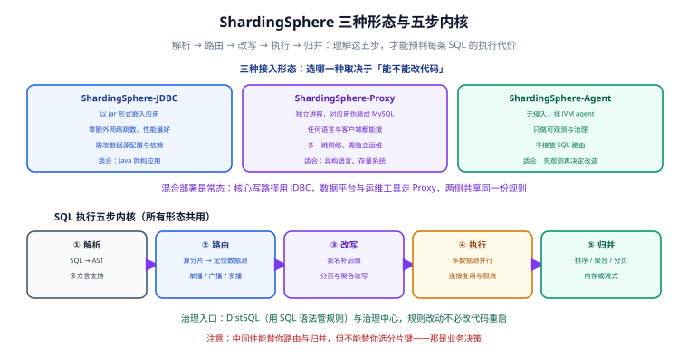

# ShardingSphere 主线

Apache ShardingSphere 是分片落地的主流选择：它把「解析 → 路由 → 改写 → 执行 → 归并」这五步封装起来，让应用层面对的还是普通 SQL。这一页讲清它的三种形态、五步内核、Spring Boot 集成与治理方式。

::: tip 一句话定位
ShardingSphere 是一套**数据库中间件**，它解决的是「怎么把一条 SQL 正确拆分到多个库表并归并结果」。它**不会替你决定分片键**——那是业务决策（见 [拆分策略与分片键设计](../Strategy/index.md)）。
:::

## 版本现状（2026-09 核对）

| 项 | 状态 |
| --- | --- |
| 最新发布版 | **5.5.3**（2026-02-28） |
| 开发中 | 5.5.4 |
| 已停止维护 | 5.4 及更早 |
| 运行时基线 | 支持 OpenJDK 26；支持 GraalVM CE on JDK 25 |

::: danger 必须澄清的一个高频误解：路线图篇章 ≠ 版本号
官网首页的时间线写着 `5.x → 6.x → 7.x → 8.x`，很容易让人以为「已经有 6.x / 7.x 可以用了」。实际上：

| 篇章 | 含义 | 是否已发布为版本号 |
| --- | --- | --- |
| 5.x（2021） | To Pluggable：可插拔微内核 | ✅ 是当前发布线（5.5.x） |
| 6.x | To Cloud：Helm / Operator 上云 | ❌ 计划，未作为 release 号发布 |
| 7.x | To Ecosystem：Database Plus 生态与 DistSQL 标准 | ❌ 计划 |
| 8.x | Planning | ❌ 规划中 |

它是**项目路线图的阶段划分**，不是发行版本。选型时请以官方 `Latest Releases` 页面上的版本号为准。
:::

## 三种接入形态



| 形态 | 部署方式 | 优点 | 代价 | 适合 |
| --- | --- | --- | --- | --- |
| **ShardingSphere-JDBC** | 以 jar 包嵌入应用 | 零额外网络跳数，性能最好；无独立运维 | 需改应用依赖与数据源配置；仅支持 Java | Java 同构应用（**首选**） |
| **ShardingSphere-Proxy** | 独立进程，对应用伪装成 MySQL/PostgreSQL | 任何语言与客户端都能接；运维可独立发布 | 多一跳网络；需独立部署与监控 | 异构语言栈、存量系统无法改代码 |
| **ShardingSphere-Agent** | 以 JVM agent 方式挂载 | 无侵入；只做可观测与治理 | **不接管 SQL 路由** | 改造前的观测与评估阶段 |

::: tip 混合部署是常态，不是例外
实践中常见的组合：

- **核心写路径用 JDBC**（性能敏感、可以改代码）。
- **数据平台、运维工具、异构服务用 Proxy**（不想改代码）。
- **两侧共享同一份分片规则**（通过治理中心下发，避免规则不一致导致数据写错分片）。

**关键风险**：规则不一致会导致「A 走 JDBC 把数据写进分片 3，B 走 Proxy 却去分片 5 找它」。所以规则必须由**单一来源**管理（配置中心或治理中心），不能各写一份。
:::

## 五步内核

不管用哪种形态，一条 SQL 都会经过这五步。理解它才能预判「这条 SQL 贵不贵」。

### ① 解析（Parse）

把 SQL 文本解析成 AST（抽象语法树）。ShardingSphere 支持多方言（MySQL / PostgreSQL / Oracle / SQL Server / openGauss / Doris / Hive / MariaDB 等）。

**关键点**：方言解析器决定了「哪些 SQL 语法被支持」。使用了某方言的冷门语法时报错，多半是解析层不支持。

### ② 路由（Route）

计算这条 SQL 应该打到哪些数据源与表。结果分三类：

| 路由结果 | 触发 | 代价 |
| --- | --- | --- |
| 单播 | WHERE 带分片键等值条件 | 1 个分片 |
| 多播 | 分片键 `IN (...)` 或范围 | N 个分片 |
| 广播 | 不带分片键 | **全部**分片 |

### ③ 改写（Rewrite）

SQL 文本层面的必要修正：

```sql
-- 原始 SQL（逻辑表名）
SELECT * FROM t_order WHERE user_id = 123 LIMIT 10 OFFSET 50;

-- 改写后（实际表名 + 分页修正）
-- 实际 SQL：打到 ds_1.t_order_3
SELECT * FROM t_order_3 WHERE user_id = 123 LIMIT 60 OFFSET 0;
```

**分页改写的原理**：`LIMIT 10 OFFSET 50` 在单分片上要改成 `LIMIT 60 OFFSET 0`（取前 60 条），归并时再由中间件截取第 51~60 条。

::: danger 深分页为什么危险
以 `LIMIT 20 OFFSET 100000` 为例：中间件会把每个分片的 SQL 改写成 `LIMIT 100020 OFFSET 0`，也就是**每个分片都要返回 10 万条**给中间件做归并。

10 个分片 × 10 万条 = 100 万条数据要跨网络传输到中间件，再排序取 20 条。

**正确做法**：改用**游标分页**（记住上一页最后一条的排序键，用 `WHERE created_at < ?` 缩小范围），或强制用户先按时间范围筛选。
:::

### ④ 执行（Execute）

并行向多个数据源发起查询，管理连接池与并发度。这一步的耗时往往取决于最慢的那个分片（长尾效应）。

### ⑤ 归并（Merge）

把多个结果集合并成一个。四种归并：

| 归并类型 | 处理 | 注意 |
| --- | --- | --- |
| **遍历归并** | 顺序拼接 | 最简单，无排序需求时使用 |
| **排序归并** | 多路归并排序 | 内存占用取决于每个分片返回的量 |
| **聚合归并** | `COUNT` / `SUM` / `MAX` / `MIN` 可安全归并 | `AVG` 必须改写为 `SUM/COUNT` |
| **分页归并** | 内存中偏移截取 | 深分页时是主要开销来源 |

## 快速上手：Spring Boot 集成

### 依赖

```xml [pom.xml]
<!-- 版本以官方「ShardingSphere-JDBC 使用手册」为准；小版本间 artifactId 有过调整 -->
<dependency>
  <groupId>org.apache.shardingsphere</groupId>
  <artifactId>shardingsphere-jdbc-core-spring-boot-starter</artifactId>
  <version>5.5.3</version>
</dependency>
```

::: warning 坐标一定要核对
ShardingSphere 的 artifactId 在小版本之间发生过调整（例如 5.5.x 曾做过模块归并与重命名）。

**核对方法**（任选其一）：
1. 打开 [Maven Central](https://central.sonatype.com/)，搜索 `org.apache.shardingsphere`，查看该版本下实际存在的 artifactId。
2. 用 Maven 直接试拉：

```shell
mvn dependency:get -Dartifact=org.apache.shardingsphere:shardingsphere-jdbc-core-spring-boot-starter:5.5.3
```

3. 对照官方文档「ShardingSphere-JDBC」章节给出的坐标示例。

**不要直接照抄博客里的坐标**——这类错误会在编译期暴露，但排查起来很浪费时间。
:::

### 数据源与分片规则

```yaml [application.yml]
spring:
  shardingsphere:
    # ---- 物理数据源 ----
    datasource:
      names: ds0,ds1
      ds0:
        driver-class-name: com.mysql.cj.jdbc.Driver
        jdbc-url: jdbc:mysql://127.0.0.1:3306/order_db_0?useSSL=false&serverTimezone=Asia/Shanghai
        username: app
        password: ${DB_PASSWORD:}
        type: com.zaxxer.hikari.HikariDataSource
      ds1:
        driver-class-name: com.mysql.cj.jdbc.Driver
        jdbc-url: jdbc:mysql://127.0.0.1:3306/order_db_1?useSSL=false&serverTimezone=Asia/Shanghai
        username: app
        password: ${DB_PASSWORD:}
        type: com.zaxxer.hikari.HikariDataSource

    # ---- 分片规则 ----
    rules:
      sharding:
        # 绑定表：同分片键的表，JOIN 不跨片
        binding-tables:
          - t_order,t_order_item
        # 广播表：每个数据源一份全量
        broadcast-tables:
          - t_dict_channel
        tables:
          t_order:
            actual-data-nodes: ds$->{0..1}.t_order_$->{0..7}
            database-strategy:
              standard:
                sharding-column: user_id
                sharding-algorithm-name: db-inline
            table-strategy:
              standard:
                sharding-column: user_id
                sharding-algorithm-name: table-inline
          t_order_item:
            actual-data-nodes: ds$->{0..1}.t_order_item_$->{0..7}
            database-strategy:
              standard:
                sharding-column: user_id
                sharding-algorithm-name: db-inline
            table-strategy:
              standard:
                sharding-column: user_id
                sharding-algorithm-name: table-inline
        sharding-algorithms:
          db-inline:
            type: INLINE
            props:
              algorithm-expression: ds$->{user_id % 2}
          table-inline:
            type: INLINE
            props:
              algorithm-expression: t_order_$->{(user_id % 16) >> 1}

    # ---- 打开 SQL 日志：验证路由的必备手段 ----
    props:
      sql-show: true
```

::: danger `sql-show: true` 不要带到生产
它会打印每条 SQL 的实际执行语句，日志量很大，且**可能包含敏感数据**（参数被拼接进日志）。

**正确做法**：本地与预发打开用于验证路由；生产环境关闭，或改为只记录「实际 SQL 条数」这类聚合指标。
:::

### 验证路由

```sql
-- ① 单播：应只出现 1 条 Actual SQL
SELECT * FROM t_order WHERE user_id = 123 ORDER BY created_at DESC LIMIT 10;

-- ② 多播：应出现 2 条（user_id % 2 命中的两个库）
SELECT * FROM t_order WHERE user_id IN (123, 124) LIMIT 10;

-- ③ 广播：应出现 16 条（全部数据源与表）——线上应当避免
SELECT COUNT(*) FROM t_order;
```

日志中会打印类似：

```text
Logic SQL: SELECT * FROM t_order WHERE user_id = 123 ORDER BY created_at DESC LIMIT 10
Actual SQL: ds1 ::: SELECT * FROM t_order_3 WHERE user_id = 123 ORDER BY created_at DESC LIMIT 10
```

**验证方式**：数 `Actual SQL` 的条数。第 ① 条应为 1、第 ② 条应为 2、第 ③ 条应为 16。如果 ① 出现了 16 条，说明分片键没被识别（常见原因是字段名拼写与 `sharding-column` 不一致，或用了函数包裹：`WHERE user_id + 0 = 123` 会导致无法路由）。

## 读写分离

分片与读写分离可以同时配置，规则叠加生效：

```yaml [application.yml（片段）]
spring:
  shardingsphere:
    rules:
      readwrite-splitting:
        data-sources:
          readwrite_ds:
            type: Static
            props:
              write-data-source-name: ds0
              read-data-source-names: ds0_slave0,ds0_slave1
            load-balancer-name: round-robin
        load-balancers:
          round-robin:
            type: ROUND_ROBIN
```

::: danger 读写分离最常见的「刚写完读不到」
主库写入后立刻去从库读，因主从复制延迟而读不到最新数据。这不是 ShardingSphere 的 bug，而是复制模型的固有特性。

三种处理方式：

1. **强制走主库**：对「写后立即读」的场景显式指定主库（ShardingSphere 提供 `HintManager` 强制路由）。
2. **延迟容忍**：业务上接受「几毫秒后才可见」（如列表页）。
3. **写入后返回**：写接口直接返回写入结果，不再查一次库。

**禁止**的做法是「加个 `Thread.sleep` 等复制」——这会让延迟变成必然。
:::

## 治理：DistSQL

ShardingSphere 提供 **DistSQL（Distributed SQL）**，用类 SQL 语法管理分片规则，改规则不需要改代码与重启：

```sql
-- 查看当前分片规则
SHOW SHARDING TABLE RULES;

-- 新增一个分片算法
CREATE SHARDING ALGORITHM table_inline (
  TYPE(NAME='INLINE', PROPERTIES('algorithm-expression'='t_order_${user_id % 16}'))
);

-- 动态调整分片数（谨慎：会涉及数据迁移）
ALTER SHARDING TABLE RULE t_order (
  DATANODES('ds_${0..3}.t_order_${0..15}'),
  DATABASE_STRATEGY(TYPE='standard', SHARDING_COLUMN='user_id', SHARDING_ALGORITHM='db_inline'),
  TABLE_STRATEGY(TYPE='standard', SHARDING_COLUMN='user_id', SHARDING_ALGORITHM='table_inline')
);
```

::: warning DistSQL 改规则 ≠ 改完就安全
`ALTER SHARDING TABLE RULE` 只改**路由规则**，不会自动搬迁已有数据。把分片数从 16 改成 64 之后，老数据仍在原分片，只有新写入会按新规则落位——**结果是查询时找不到老数据**。

**正确顺序**：① 先按 [平滑迁移](../Migration/index.md) 把数据搬到新分片布局；② 校验行数与抽样一致；③ 再切规则。**顺序反了会造成生产事故。**
:::

## 其他核心能力

ShardingSphere 不止分片，以下能力常与分片一起用：

| 能力 | 用途 | 与本专题的关系 |
| --- | --- | --- |
| **数据加密** | 敏感字段透明加解密（如手机号、身份证） | 加密列通常是分片键之外的非查询字段，二者不冲突 |
| **数据脱敏** | 查询结果脱敏（如只显示手机号后四位） | 常与加密配合，用于后台与客服场景 |
| **影子库压测** | 压测流量路由到影子库，不污染生产数据 | 分片上线前的压测必备 |
| **读写分离** | 读走从库 | 见上文 |
| **弹性伸缩** | 与迁移工具配合做在线扩容 | 见 [平滑迁移](../Migration/index.md) |

## 与其他方案对比

| 方案 | 形态 | 优点 | 缺点 |
| --- | --- | --- | --- |
| **ShardingSphere-JDBC** | 客户端 | 性能好、无额外运维 | 限于 Java 系 |
| **ShardingSphere-Proxy** | 代理 | 语言无关、可独立发布 | 多一跳、需独立运维 |
| **MyCat** | 代理 | 早期流行、文档较多 | 社区活跃度与版本节奏弱于 ShardingSphere |
| **手写客户端分片** | 应用内 | 完全可控、无学习成本 | 归并、分页、事务都要自己写，长期维护成本极高 |
| **原生分片数据库**（TiDB / OceanBase 等） | 数据库 | 对应用透明、无中间件 | 运维复杂度与成本更高 |
| **MySQL 分区表** | 单机 | 零成本、语法透明 | 不解决写入瓶颈 |

::: tip 选型建议
- **Java 技术栈** → ShardingSphere-JDBC。
- **多语言技术栈** → ShardingSphere-Proxy。
- **不想维护中间件、且有预算** → 考虑原生分布式数据库。
- **只是想让查询变快** → 不要用这些，去加索引（见 [概述与决策](../Overview/index.md)）。
:::

## 易错点

::: danger 八个高频问题
1. **未配 `binding-tables`** → 明明同分片键的 JOIN 也跨片，性能骤降。
2. **`algorithm-expression` 里的库表分配不完整** → 出现「某些数据无处分片」或「分片重叠」。**验证方法**：枚举分片键值，确认每个值都能算出一个合法且唯一的分片。
3. **`sharding-column` 与实体字段名不一致**（Java 驼峰 vs 数据库下划线）→ 分片键识别失败，全部变广播。常见坑是 `user_id` 写成 `userId`。
4. **在分片键上套函数**（`WHERE DATE(created_at) = ?`、`WHERE user_id + 0 = ?`）→ 无法路由，退化为广播。
5. **`sql-show` 带到生产** → 日志爆炸 + 敏感数据泄漏。
6. **DistSQL 改规则后没搬数据** → 老数据查不到。
7. **应用与 Proxy 规则不一致** → 数据写进错误分片，且**现象极隐蔽**（写入成功、查询不到）。
8. **连接池按分片数线性放大** → 16 分片 × 20 连接 = 320 个连接，可能超过数据库 `max_connections`。**正确做法**：控制每分片连接池大小，或做多实例分层。
:::

## 参考资料

- [Apache ShardingSphere 官方文档](https://shardingsphere.apache.org/document/current/cn/overview/)
- [ShardingSphere · 最新版本下载](https://shardingsphere.apache.org/document/current/cn/downloads/)（核对当前发布版本号）
- [ShardingSphere-JDBC 使用手册](https://shardingsphere.apache.org/document/current/cn/user-manual/shardingsphere-jdbc/)（依赖坐标与配置示例）
- [ShardingSphere · 数据分片](https://shardingsphere.apache.org/document/current/cn/features/sharding/)（核心概念与分片算法）
- [ShardingSphere · DistSQL](https://shardingsphere.apache.org/document/current/cn/user-manual/shardingsphere-proxy/distsql/)（动态治理语法）
- [ShardingSphere · 读写分离](https://shardingsphere.apache.org/document/current/cn/features/readwrite-splitting/)（配置与强制主库路由）
