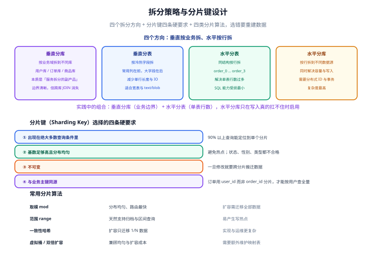

# 拆分策略与分片键设计

分片键（Sharding Key）是分库分表里**唯一一个几乎无法事后修改**的决策。这一页讲怎么选它、怎么配算法、以及拆开之后 SQL 会失去哪些能力。

::: tip 一句话定位
分片键选对了，后续所有查询都能「一片直达」；选错了，每条查询都要广播到全部分片——那样的分片比不分片更慢。
:::

## 分片键的四条硬要求



| 要求 | 判定方法 | 反面例子 |
| --- | --- | --- |
| **① 出现在绝大多数查询条件里** | 统计慢 SQL 的 WHERE 子句，看哪个字段出现频率最高 | 用 `order_id` 分片，但业务 90% 的查询是按 `user_id` 查订单列表 |
| **② 基数高、分布均匀** | `SELECT COUNT(DISTINCT col) / COUNT(*)`，越接近 1 越好 | 用 `status`（只有 5 个值）分片 → 5 个分片里必然有一个承担 60% 流量 |
| **③ 不可变** | 业务上是否可能修改 | 用 `owner_dept` 分片，员工调部门就要搬数据 |
| **④ 与主要访问路径同源** | 最常用的查询能否落在单个分片 | 见下 |

### 关于「与业务主键同源」

这是最容易被忽略、但影响最大的一条。

订单系统里有两个天然候选：`order_id`（订单号）与 `user_id`（下单用户）。

| 分片键 | 按订单号查 | 按用户查订单列表 | 结论 |
| --- | --- | --- | --- |
| `order_id` | 单片直达 | **广播全部分片**（因为不知道这个用户的订单在哪个分片） | ✗ |
| `user_id` | **广播全部分片**（因为不知道这个订单属于哪个用户） | 单片直达 | 需要额外方案 |

看起来都不完美。但**业务上「用户查看自己的订单列表」是最频繁的操作**（每次打开个人中心都会触发），而「按订单号查详情」通常是从列表点进去、或走客服后台（低频）。所以：

**结论：用 `user_id` 做分片键**。为「按订单号查询」单独建一张映射表（`order_no → user_id`，全局唯一索引），先查映射再路由：

```sql
-- 辅助路由表：把「订单号」映射到分片键，代价是一次额外查询
CREATE TABLE t_order_route (
  order_no VARCHAR(32) NOT NULL,
  user_id  BIGINT      NOT NULL,
  PRIMARY KEY (order_no)
) ENGINE = InnoDB;

-- 查询流程：先路由，再直达单片
-- 1) SELECT user_id FROM t_order_route WHERE order_no = 'SO20260925001';
-- 2) 用拿到的 user_id 计算分片，只查这一个分片
```

::: tip 这类「路由表」是分片工程的常用手法
当存在两个高频查询维度时，选一个做分片键，另一个用**轻量映射表**兜住。映射表本身很小（只有两列），可以放在独立的小库或缓存里，不参与分片。

代价是多一次查询，收益是「避免广播」。**广播的代价远大于一次额外查询**——广播是 N 倍放大，额外查询是 +1。
:::

## 分片算法

四种主流算法，先看它们的本质差异：

### 1. 取模（Modulo）

```text
分片序号 = hash(分片键) % 分片数
```

**优点**：分布最均匀，路由计算最快（O(1)），无需额外元数据。
**缺点**：**扩容成本最高**。分片数从 4 改成 8 时，几乎所有数据都要重新分布。

```sql
-- 取模分片的表名规则（4 个分片）
-- 具体表名 = t_order_ + (user_id % 4)
```

::: danger 取模的两个坑
1. **负数取模**。某些语言（如 C、Java 的 `%`）中 `-5 % 4 = -1`，会导致分片序号为负。**正确写法**：`((hash % n) + n) % n`，或用 `Math.floorMod`（Java）/ 位运算（当 n 是 2 的幂时 `hash & (n - 1)`）。
2. **哈希函数要稳定**。Java 的 `String.hashCode()`、MySQL 的 `CRC32()`、JS 的字符串哈希结果都不同。**分片计算必须在所有客户端保持一致**，否则同一行数据会被路由到不同分片。**建议**：统一使用一种明确的算法（如 `CRC32` 或 `MurmurHash`），写进规范。
:::

### 2. 范围（Range）

```text
分片序号 = 按分片键的区间归属（如 user_id 0~1000 万 → 分片 0）
```

**优点**：天然支持区间查询与归档；扩容时只需追加新分片（老数据不动）。
**缺点**：**容易产生写热点**。如果按自增 ID 或时间范围分片，新数据会**全部落在最后一个分片上**。

::: danger 范围分片的「尾部热点」是必现问题
按 `created_at` 按月分片，本月的数据全部写入最新分片——那一个分片承担 100% 的写压力，其他分片闲着。

**缓解方案**：
- 用「范围 + 哈希」组合：先按范围定位到「月」，再在月内按 `user_id` 哈希二次分片。
- 或者用范围分片但**保证分片键不是时序自增字段**（如按 `user_id` 范围，用户是均匀分布的）。
:::

### 3. 一致性哈希（Consistent Hashing）

把分片和分片键都映射到同一个哈希环（0 ~ 2³²）上，每个键顺时针找到的第一个节点就是它的归属。

**优点**：扩容时**只迁移约 1/N 的数据**（新增一个节点，只有该节点逆时针区间上的数据需要搬迁）。
**缺点**：需要引入「虚拟节点」解决数据倾斜；实现与排查都更复杂。

```text
不加虚拟节点：3 个节点的哈希环区间可能极不均匀 → 某个节点承担 60%
加 200 个虚拟节点/物理节点：区间分布趋于均匀，但节点与区间的映射关系需要维护
```

### 4. 虚拟桶 / 双倍扩容（Virtual Bucket）

**思路**：分片数固定（如 1024 个逻辑桶）且永不改变，物理库表数可以在这个基础上做「映射」调整。

```text
逻辑桶：0 ~ 1023（永远不变）
初始部署：桶 0~511 → db0，桶 512~1023 → db1
扩容到 4 库：桶 0~255 → db0，256~511 → db1，512~767 → db2，768~1023 → db3

每次扩容只需搬「一个逻辑桶对应的物理数据」，映射关系存在配置里。
```

这是云原生分布式数据库常用的思路（也是「双倍扩容」名字的由来：每次容量翻倍）。

### 四种算法对照

| 算法 | 分布均匀性 | 扩容成本 | 实现复杂度 | 适用 |
| --- | --- | --- | --- | --- |
| 取模 | 最好 | **最高**（几乎全搬） | 最低 | 数据量可预期、短期内不会扩容 |
| 范围 | 中（易热点） | 最低（只追加） | 低 | 按时间/ID 区间查询为主，且分片键非时序 |
| 一致性哈希 | 中（需虚拟节点） | 低（1/N） | 中 | 节点数会动态变化 |
| 虚拟桶 | 好 | 低（按桶搬） | 中 | 预期会多次扩容、希望扩容过程可控 |

::: tip 实践中的默认选择
**取模**是绝大多数项目的起点（简单、均匀、可控）。只要**分片数一次给足**（按当前需求的 2~4 倍取值，且取 2 的幂），取模的扩容缺点在很长一段时间内都不会暴露。

直接上一致性哈希或虚拟桶，通常是「已经计划好要多次扩容」的场景才值得。
:::

## 分片数怎么定

三个原则：

1. **取 2 的幂**（4 / 8 / 16 / 32 / 64）。理由：① 位运算能替代取模（`hash & (n-1)`），路由更快；② 双倍扩容时映射关系简单（`n → 2n`）。
2. **留出 2~4 倍余量**。按「当前数据量 ÷ 单分片目标容量」算出下限，再乘 2~4。
3. **单分片容量控制在「3 层 B+ 树」范围内**（见 [概述与决策](../Overview/index.md) 的换算方法），留出增长空间。

```text
算例：
  当前数据 4000 万行、月增 200 万行
  单分片目标 ≤ 1000 万行（留足余量）
  下限 = 4000 万 / 1000 万 = 4 个分片
  考虑 2 年增长（+4800 万行）后需 8~9 个分片
  取 2 的幂且留余量 → 16 个分片（约 2 年内的 2 倍余量）
```

::: warning 分片数过多也有代价
- 每个分片一个数据源连接池，连接数 = 分片数 × 池大小。32 个分片 × 20 连接 = 640 个连接，可能把数据库的 `max_connections` 撑爆。
- 广播查询的代价与分片数成正比。
- 运维操作（DDL、备份）要遍历所有分片，耗时线性增长。

**建议**：单实例分片数控制在 **16~64** 之间。超过之后应考虑「多实例 + 每实例若干分片」的分层结构。
:::

## 广播表与绑定表

### 广播表（Broadcast Table）

**所有分片上都有一份完整副本的小表**，通常是不常变的字典表、配置表。

```yaml
# ShardingSphere 配置：字典表在每个数据源上都保留全量
rules:
  - !BROADCAST
    tables:
      - t_dict_region
      - t_dict_channel
```

**适合**：行数少（万级以内）、读多写少、需要与业务表 JOIN 的表。
**不适合**：会频繁写入的表（每个分片都要写，一致性与性能都是问题）。

### 绑定表（Binding Table）

**分片键与分片算法完全相同的多张表**，它们的同一分片键值落在同一个分片里，因此 JOIN 不会跨库。

```yaml
# t_order 与 t_order_item 都按 user_id 分片 → 做成绑定表
rules:
  - !SHARDING
    bindingTables:
      - t_order, t_order_item
```

**效果**：`SELECT * FROM t_order o JOIN t_order_item i ON o.order_id = i.order_id WHERE o.user_id = 123` 会被路由到**单个分片**执行，而不是「各分片各查一半再归并」。

::: danger 绑定表的成立条件很严格
必须**同时满足**：① 分片键相同（都是 `user_id`）；② 分片算法相同（都是取模且分片数一致）；③ 关联字段是分片键本身。

如果 `t_order_item` 按 `order_id` 分片、`t_order` 按 `user_id` 分片，**它们不是绑定表**，JOIN 会跨分片。

**设计建议**：一开始就把「会经常 JOIN 的表」设计成同分片键，这是分片设计里最省的优化。
:::

## 路由类型：一条 SQL 会打到几个分片

分片中间件在「路由」这一步会把 SQL 分成三类：

| 路由类型 | 触发条件 | 代价 |
| --- | --- | --- |
| **单播（Unicast）** | WHERE 里带分片键的等值条件 | 1 个分片，最优 |
| **多播（Multicast）** | 分片键是 `IN (v1, v2)` 或范围 | 命中分片数个，尚可接受 |
| **广播（Broadcast）** | WHERE 里**完全不带分片键** | 全部分片，代价最大 |

::: danger 「不带分片键」是分片后的头号性能杀手
```sql
-- 单播：只查 1 片
SELECT * FROM t_order WHERE user_id = 123 ORDER BY created_at DESC LIMIT 10;

-- 广播：查全部 16 片，然后归并排序取前 10
SELECT * FROM t_order ORDER BY created_at DESC LIMIT 10;
```

第二条在单库上可能只要 20 ms，分片后变成「16 次查询 + 归并」，可能超过 200 ms，**还随分片数线性恶化**。

**正确做法**：运营/后台类查询要么强制带分片键，要么走**独立的只读副本或离线数仓**，不要直接打到分片集群上。
:::

## 分片后 SQL 的「能写 / 不能写」

| SQL 能力 | 分片后 | 说明 |
| --- | --- | --- |
| 带分片键的单条查询/更新 | ✅ 完全可用 | 单播路由 |
| 分片键 `IN` 查询 | ✅ 可用 | 多播路由，注意分片数上限 |
| 跨分片 `ORDER BY` + `LIMIT` | ⚠️ 可用但昂贵 | 各分片排序后归并 |
| 跨分片 `JOIN` | ⚠️ 仅绑定表/广播表可用 | 否则需要应用层组装 |
| 跨分片 `COUNT` / `SUM` | ✅ 可归并 | 正确性没问题 |
| 跨分片 `AVG` | ⚠️ 需改写 | 直接用会导致「平均值的平均值」错误 |
| 跨分片 `GROUP BY` 非分片键 | ⚠️ 可行但结果集大 | 分片边界处的分组可能被拆开 |
| 跨分片 `COUNT(DISTINCT x)` | ⚠️ 昂贵 | 需全量归并去重 |
| 跨分片分布式事务 | ⚠️ 需额外方案 | 见 [跨分片查询与分布式事务](../CrossShard/index.md) |
| 跨分片 `UNIQUE` 约束 | ❌ 不支持 | 由分布式 ID 或外部校验替代 |
| 跨分片外键 | ❌ 不支持 | 由应用层保证 |

## 实战：为订单系统设计分片键

**需求**：订单表 4200 万行并将持续增长，核心查询有三类。

| 查询 | 频率 | 条件 |
| --- | --- | --- |
| Q1：用户查看自己的订单列表 | 极高（80%） | `WHERE user_id = ? ORDER BY created_at DESC LIMIT 20` |
| Q2：按订单号查详情 | 中（15%） | `WHERE order_no = ?` |
| Q3：运营查某渠道某天的订单 | 低（5%） | `WHERE channel_id = ? AND created_at BETWEEN ? AND ?` |

**候选方案对比**：

| 方案 | Q1 | Q2 | Q3 | 结论 |
| --- | --- | --- | --- | --- |
| 以 `order_id` 分片 | 广播 ✗ | 单播 | 广播 ✗ | 否决（最高频的 Q1 变广播） |
| 以 `user_id` 分片 | **单播 ✓** | 广播 ✗ | 广播 ✗ | **采用 + 补路由表 + Q3 走数仓** |
| 以 `created_at` 分片 | 广播 ✗ | 广播 ✗ | 多播（按天） | 否决（Q1 变广播，且有尾部热点） |

**最终设计**：

```yaml
# 分片规则
分片键：user_id
分片数：16（2 的幂，按 2 年增长留 2 倍余量）
算法：取模（hash(user_id) % 16）
```

**三条兜底措施**：

1. **Q2（按订单号查）**：建 `t_order_route` 映射表（`order_no → user_id`，全局唯一），先查映射再单播路由。
2. **Q3（运营按渠道查）**：不打分片集群，改由**离线数仓或只读副本**承载（运营查询对实时性要求低、对全量性要求高，两者与分片目标相反）。
3. **绑定表**：`t_order_item` 也用 `user_id` 分片，与 `t_order` 组成绑定表，明细 JOIN 不跨片。

```yaml
# ShardingSphere 5.5.x 对应配置
rules:
  - !SHARDING
    tables:
      t_order:
        actualDataNodes: ds_${0..1}.t_order_${0..7}   # 2 库 × 8 表 = 16 分片
        databaseStrategy:
          standard:
            shardingColumn: user_id
            shardingAlgorithmName: db_inline
        tableStrategy:
          standard:
            shardingColumn: user_id
            shardingAlgorithmName: table_inline
    bindingTables:
      - t_order, t_order_item
    broadcastTables:
      - t_dict_channel
      - t_dict_region
    shardingAlgorithms:
      db_inline:
        type: INLINE
        props:
          algorithm-expression: ds_${user_id % 2}
      table_inline:
        type: INLINE
        props:
          algorithm-expression: t_order_${(user_id % 16) >> 1}
```

::: danger 配置里最容易出错的一处
`ds_${user_id % 2}` 与 `t_order_${(user_id % 16) >> 1}` 必须**共同构成一个完整的 16 分片划分**，不能有重叠或遗漏。

上例的逻辑：先用 `user_id % 2` 决定库（偶数 → ds_0，奇数 → ds_1）；再用 `(user_id % 16) >> 1` 得到 0~7 的表号。

**验证方法**：写一个脚本枚举 `user_id` 从 1 到 1000，打印每个 ID 命中的 `(ds, table)`，确认 16 个组合都出现且分布均匀（每组约 62~63 次）。这一步能在上线前拦住绝大多数配置错误。
:::

**验收方式**：

```sql
-- ① 带分片键：应只命中 1 个分片（看路由日志）
SELECT * FROM t_order WHERE user_id = 123 ORDER BY created_at DESC LIMIT 20;

-- ② 不带分片键：会命中 16 个分片（应当避免出现在线上）
SELECT COUNT(*) FROM t_order;

-- ③ 绑定表 JOIN：应只命中 1 个分片
SELECT o.order_no, i.product_id
FROM t_order o JOIN t_order_item i ON o.order_id = i.order_id
WHERE o.user_id = 123;
```

**验证方式**：打开 ShardingSphere 的 SQL 日志（`spring.shardingsphere.props.sql-show: true`），确认上述三条 SQL 的 `Actual SQL` 条数分别是 1、16、1。

## 参考资料

- [Apache ShardingSphere · 数据分片](https://shardingsphere.apache.org/document/current/cn/features/sharding/)（分片算法与配置项官方说明）
- [Apache ShardingSphere · 核心概念](https://shardingsphere.apache.org/document/current/cn/features/sharding/concept/sharding/)（分片键、分片算法、绑定表、广播表定义）
- [Apache ShardingSphere · DistSQL](https://shardingsphere.apache.org/document/current/cn/user-manual/shardingsphere-proxy/distsql/)（用 SQL 语法管理分片规则）
- [MySQL 官方文档 · 索引与选择性](https://dev.mysql.com/doc/refman/8.4/en/mysql-indexes.html)（分片键基数判断的依据）
