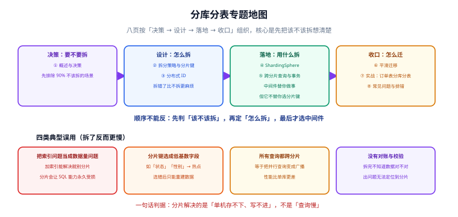

# 分库分表

分库分表（Sharding）是把**一个库/一张表的数据分散到多个库/表中**，从而突破单机容量与写入上限的技术。本专题面向遇到「单表过亿、写入排队」的后端与 DBA，从「该不该拆」讲到「怎么拆得可控、怎么迁得不丢数据」。

::: danger 先读这一句再往下看
**分片是最后手段，不是优化手段。** 一旦拆开，跨分片 JOIN、全局排序、分布式事务、唯一约束都会变成永久成本。

按「可逆性」排序：加索引 → 加从库 → 加缓存 → 归档冷数据 → **最后才是分片**。前面几招能解决问题时，不要用最后一招。
:::

::: info 本专题的定位
- **本专题**：数据**水平扩展**——单机存不下、写不进时怎么办。
- [MySQL 索引深入](../MySQL/IndexDeepDive/index.md) 与 [SQL 优化](../SQLOptimization/index.md)：**单机内的查询优化**，与分片是分层关系，先做这一层。
- [数据建模](../../DataModeling/index.md)：拆之前先把模型建对；分片键的选择本质上是一次建模决策。
- [分布式事务](../../../Backend/Microservices/DistributedTransaction/index.md)：分片之后的跨库一致性问题，本专题只讲「分片场景下怎么用」，原理在那一边。
- [电商系统设计](../../../Backend/Ecommerce/index.md)：订单与库存是最典型的分片落地场景。
- [项目交付 · 数据建模与迁移](../../../Others/ProjectDelivery/DataModel/index.md)：迁移的通用六步法，本专题的迁移页是它在分片场景下的具体化。
:::

## 目录

- [分库分表概述与决策](Overview/index.md)
- [拆分策略与分片键设计](Strategy/index.md)
- [分布式 ID 生成](IDGeneration/index.md)
- [ShardingSphere 主线](ShardingSphere/index.md)
- [跨分片查询与分布式事务](CrossShard/index.md)
- [平滑迁移：从单库到分片](Migration/index.md)
- [实战：订单系统分库分表](Practice/index.md)
- [常见问题与排错](FAQ/index.md)

## 专题地图

## 版本现状（2026-09 核对）

| 项 | 状态 | 说明 |
| --- | --- | --- |
| Apache ShardingSphere | **5.5.3**（2026-02-28）为最新发布版 | 5.5.4 处于开发中；5.4 及更早版本已停止维护 |
| 官方路线图篇章 | 6.x「To Cloud」、7.x「To Ecosystem」、8.x 规划中 | **这是路线图的篇章编号，不是已发布的版本号**，容易与 release 号混淆 |

::: warning 一个高频误解
在官网首页会看到 `5.x → 6.x → 7.x → 8.x` 的时间线，很容易误以为「已经有 6.x 可以用」。

实际上那是**项目路线图的阶段划分**（5.x 可插拔微内核、6.x 上云、7.x 生态、8.x 规划中），而**发布的 release 版本号仍是 5.5.x**。

选型时以 `Latest Releases` 页面的版本号为准。
:::

## 相关专题

- [MySQL 索引深入](../MySQL/IndexDeepDive/index.md)：分片之前先把单机索引做对；分片并不能弥补缺失的索引
- [SQL 优化](../SQLOptimization/index.md)：分片后 SQL 的可写范围会收窄，优化手段也随之改变
- [数据建模](../../DataModeling/index.md)：分片键是一次不可逆的建模决策，建模页讲共通的命名与主键规范
- [MongoDB](../../NoRelational/MongoDB/index.md)：文档型数据库原生支持分片，可作为「托管分片」的对照方案
- [Redis 进阶 · Cluster 分片集群](../../NoRelational/Redis/Advanced/Cluster/index.md)：同属分片思想，但缓存侧的取舍与数据库侧不同（可丢、可重建）
