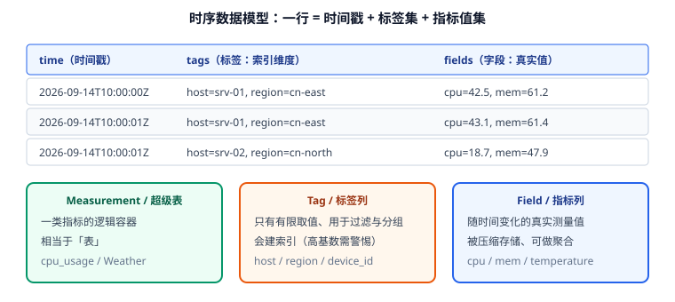

# 数据模型

时序库的性能问题，**八成出在数据模型上**，而不是参数配置。本文讲清时间戳、标签、字段三类列的设计规则，以及最致命的"标签基数"陷阱。



## 一行数据的三个部分

| 部分 | 作用 | 是否索引 | 是否能聚合 | 取值特点 |
| --- | --- | --- | --- | --- |
| 时间戳（time） | 主索引，决定数据落在哪个分区 | 是（主要索引） | 可做窗口分组 | 单调递增（近实时） |
| 标签（tag / label） | 描述"这是谁的数据"，用于过滤与分组 | 是 | ❌ 不能聚合 | **有限可枚举** |
| 字段（field / 数据列） | 真正的测量值 | 否 | ✅ 可聚合 | 连续、高基数 |

对照到具体产品：

| 概念 | InfluxDB | TDengine | Prometheus |
| --- | --- | --- | --- |
| 逻辑容器 | measurement / 表 | 超级表（STable） | metric 名 |
| 实例 | series（标签组合） | 子表 | series（标签组合） |
| 标签 | tag | 标签列（TAG） | label |
| 指标 | field | 数据列 | —— |

## 标签设计：四条规则

标签（tag）是**索引维度**，设计好坏直接决定查询性能与内存占用。

### 规则 1：标签必须是"低基数 + 可枚举"

基数（cardinality）= 标签不同取值的数量。

| 标签 | 基数 | 是否合格 |
| --- | --- | --- |
| `host=srv-01..srv-200` | 200 | ✅ |
| `region=cn-east/cn-north` | 2~10 | ✅ |
| `device_type=gateway/sensor/plc` | 10 | ✅ |
| `user_id=...` | 百万~千万 | ❌ 灾难 |
| `order_id`、`trace_id`、`url`（带参数） | 近乎无限 | ❌ 灾难 |
| `ip`（公网 IP 全集） | 数万~数十万 | ⚠️ 谨慎 |

::: danger 高基数标签是最常见的事故
时序库为**每个标签组合维护一个 series**（索引条目）。把 `user_id` 当标签，100 万用户 × 10 个指标 = 1000 万个 series，后果：

1. 内存索引直接吃满，进程 OOM 或反复重启；
2. 写入时要为每个新 series 分配元数据，吞吐断崖式下跌；
3. 查询规划阶段要枚举大量 series，`WHERE` 越精确反而越慢。

**正确做法**：高基数字段要么放进字段（field）只做数值存储，要么作为「日志/明细」存到搜索引擎或对象存储，要么在写入前先聚合（例如按分钟聚合掉用户维度）。
:::

### 规则 2：标签值不要包含时间或随机数

`request_id=abc123`、`path=/order/20260914/8848` 这类值每次都不一样，等价于无穷基数。若确实需要，先做**路径模板化**（`/order/{id}`）。

### 规则 3：标签数量要克制

一般控制在 5 个以内。每个标签都会进入每条数据的元数据与索引；标签越宽（字符串越长），索引越大。

### 规则 4：需要"分组统计"的维度才做标签

判断标准：**业务上会不会 `GROUP BY` 它？会不会用它做过滤？** 会 → 标签；只是随行记录的信息 → 字段或干脆不存。

## 字段设计：三条规则

1. **字段名稳定**：字段是"列"，新增字段可以，改名等于改 schema，代价高。
2. **类型要统一**：同一字段在 InfluxDB 中类型由首次写入决定；后续写入类型不符会被拒绝（这是常见"写不进去"的原因）。
3. **不要用字段存字符串**：时序库的字段适合数值与布尔；字符串会显著降低压缩率与聚合能力。

## 时间戳设计

| 要点 | 说明 |
| --- | --- |
| 精度选择 | 秒级够用就别用纳秒：精度越高占用越大（TDengine 建库时 `PRECISION`，InfluxDB 写入时指定 `precision`） |
| 时区 | **统一存 UTC**，展示层按用户时区转换，避免跨时区聚合错乱 |
| 允许乱序 | 设备断网补传会产生乱序数据，写入端要限流+去重；部分引擎对乱序窗口有容忍上限 |
| 未来时间 | 设备时钟不准会上报未来时间戳，可能污染"最新值"查询，务必做**时钟校验** |

::: warning 时间戳单位写错是最隐蔽的 Bug
把秒级时间戳按毫秒解析，数据会落到 1970 年或 55000 年。写入接口一定要在文档里写清 `precision`，并在采集端统一格式化。
:::

## 两个实例对比：同一个业务两种建模

需求：采集 1000 台服务器、每 5 秒上报 CPU/内存/磁盘/网络四项指标，支持按机房、按主机分组看趋势。

### InfluxDB 建模

```text
measurement: host_metrics
  tags:   host, region, role
  fields: cpu_usage, mem_usage, disk_used_pct, net_in_bytes, net_out_bytes
  time:   写入时刻（秒级精度足够）

series 数量 ≈ 1000 host × 3 region × 5 role 的组合数（实际 ≈ 1000）
写入速率 = 1000 台 ÷ 5 秒 × 1 行 = 200 行/秒（每行含 5 个字段）
```

### TDengine 建模

```sql
-- 建模：一个主机一张子表；机房、角色作为标签
CREATE DATABASE metrics
  PRECISION 'ms'
  KEEP 365d
  DURATION 10d
  BUFFER 256
  WAL_LEVEL 1;

CREATE STABLE host_metrics (
  ts           TIMESTAMP,
  cpu_usage    FLOAT,
  mem_usage    FLOAT,
  disk_used    DOUBLE,
  net_in_bytes BIGINT,
  net_out_bytes BIGINT
) TAGS (
  region NCHAR(16),
  role   NCHAR(16)
);
-- 每台主机一行创建子表（通常由采集端自动建表）
CREATE TABLE host_metrics_srv01 USING host_metrics TAGS ('cn-east', 'web');
```

TDengine 的"一设备一子表"让写入天然按设备分片，**没有并发写同一张表的锁竞争**；标签存在子表元数据中，不占每条数据空间——这是它在 IoT 场景吞吐高的核心原因。

::: tip 两种模型的取舍
- InfluxDB 的 measurement 是**逻辑表**，标签放在行内元数据里，写入路径简单、生态工具多。
- TDengine 的超级表/子表把"设备维度"物化成独立存储单元，写入与查询都更贴近 IoT 场景，但子表数量极大时（千万级）要关注元数据管理。
:::

## 常见建模错误对照

| 错误 | 后果 | 正确做法 |
| --- | --- | --- |
| `user_id` 作标签 | series 爆炸、OOM | 写入前聚合，或存明细日志库 |
| 一指标一 measurement（cpu、mem 各自一张表） | 查询要多次往返 / join，难对齐时间 | 同一采集时刻的指标放同一行（同一 measurement） |
| 一行一个指标（长表） | 行数 ×N，压缩差 | 用宽表：一行多字段 |
| 把设备 IP 当标签 | 基数高、DHCP 会变 | 用 `device_id` 或 `host` 名 |
| 混用秒/毫秒时间戳 | 数据落到错误时间 | 采集端统一精度并校验 |
| 更新时间戳去 UPDATE 历史值 | 时序库更新代价极高 | 追加修正记录，查询取最新 |

## 验证方式

建模后先验证"基数是否可控"，再上线：

```shell
# InfluxDB：查看 series 基数（3.x 用 SQL 查系统表，2.x 用 /api/v2/query 统计）
# 2.x 示例：统计某 bucket 的 series 数量
influx query 'import "influxdata/influxdb/schema"
schema.measurementTagValues(bucket: "metrics", measurement: "host_metrics", tag: "host")' | wc -l
# 预期：数量应约等于主机数（如 1000），若达到数十万说明标签设计有问题
```

```sql
-- TDengine：查看子表数量与标签基数
SHOW STABLES;
SELECT COUNT(*) FROM information_schema.ins_tables WHERE stable_name = 'host_metrics';
-- 预期：子表数量 ≈ 设备数量；若远超设备数，说明采集端重复建表（常见于设备名含时间戳）
SHOW TABLE TAGS FROM host_metrics;
```

```sql
-- 建库后校验分区与保留参数
SHOW DATABASES;
-- 检查 KEEP（保留天数）、DURATION（单文件时长）、PRECISION 是否符合预期
```

收尾确认：series/子表数量与设备数同量级、时间戳精度统一、保留策略已设置且磁盘预算可算（公式见[存储与保留策略](../Storage/index.md)）。

## 参考资料

- InfluxDB 官方文档：[Data model](https://docs.influxdata.com/influxdb3/core/reference/glossary/)
- TDengine 官方文档：[数据模型](https://docs.tdengine.com/tdengine-reference/sql-manual/)
- Prometheus 官方文档：[Data model](https://prometheus.io/docs/concepts/data_model/)
- 延伸阅读：[查询与降采样](../Query/index.md) / [常见问题](../FAQ/index.md)
